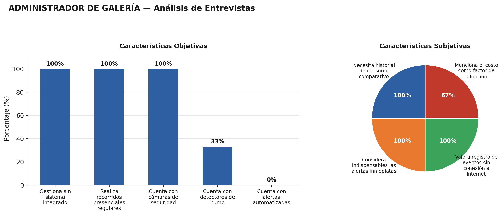
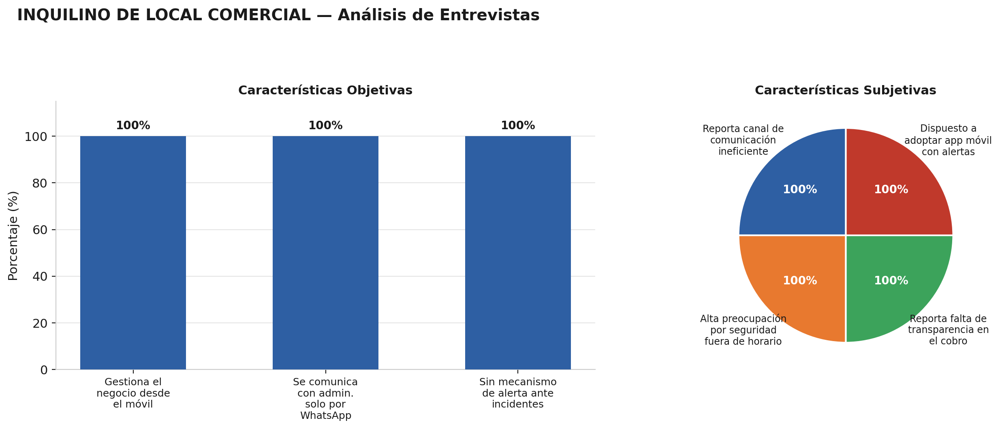
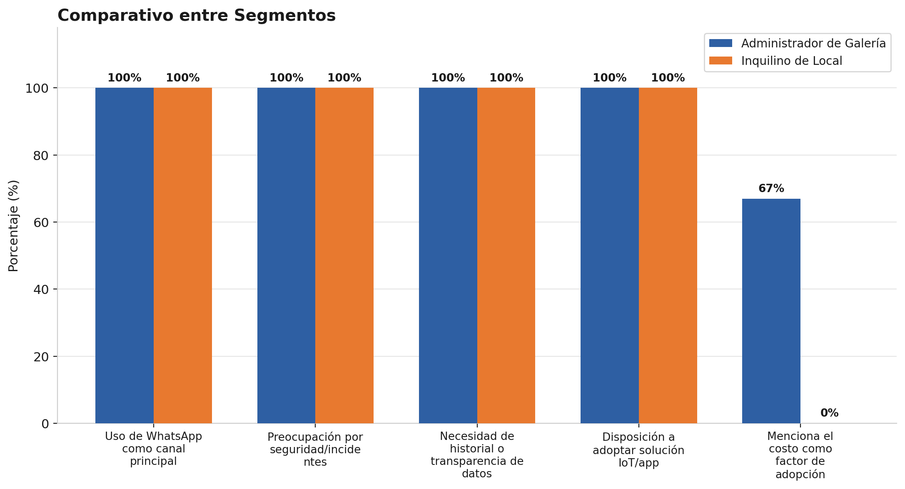

## 2.2. Entrevistas

Para que StorePulse pase de ser una idea a una solución útil, necesitamos salir de la oficina y validar nuestras hipótesis con las personas que viven el día a día de la operación de una galería comercial. La recolección de información mediante entrevistas directas nos permite entender no solo qué funciones necesitan los administradores e inquilinos, sino cómo perciben el riesgo de seguridad, la detección de incendios y el cobro de servicios, y qué problemas reales enfrentan con las soluciones que usan hoy.

En esta sección, dejamos de lado las suposiciones para escuchar la voz de los administradores de galería y los inquilinos de local, asegurando que nuestra propuesta tecnológica sea intuitiva y genere un impacto real en la seguridad de su patrimonio y en la transparencia de su operación diaria.

### 2.2.1.  Diseño de entrevistas

**Objetivos**

Recoger información sobre las necesidades, expectativas, dificultades y posibles preocupaciones de los administradores de galerías comerciales respecto a la gestión de la seguridad, la detección de incidentes y el control del consumo de servicios básicos como agua y energía.

Asimismo, recoger información sobre las necesidades, expectativas, dificultades y preocupaciones de los inquilinos y comerciantes minoristas respecto a la seguridad de la mercadería almacenada en sus puestos, la transparencia y equidad en el cobro y prorrateo de los servicios básicos, y la viabilidad de utilizar herramientas móviles para la gestión y comunicación con la administración de la galería.

### Preguntas - Administrador de Galería Comercial

##### Datos básicos

* ¿Cuál es su nombre, edad y función dentro de la galería?
* ¿Cuál es su distrito de residencia?
* ¿Cuál es su estado civil? ¿Tiene familia a cargo?
* ¿Cuántos locales aproximadamente tiene la galería que administra?
* ¿Cuáles son sus principales responsabilidades dentro de la administración de la galería?

##### Perfil personal

* ¿Cómo describiría su estilo de trabajo o personalidad? (por ejemplo: organizado, detallista, práctico, orientado a resultados)
* ¿Qué habilidades considera clave para desempeñarse bien como administrador de una galería?
* ¿A través de qué redes sociales o medios digitales se informa habitualmente?
* ¿Qué marcas, aplicaciones o referentes influyen en sus decisiones al elegir herramientas o servicios tecnológicos para la galería?

##### Gestión actual

* ¿Cómo realiza actualmente el control y supervisión de los locales y áreas comunes?
* ¿Con qué frecuencia realiza recorridos o inspecciones presenciales?
* ¿Qué herramientas utiliza actualmente para registrar y consultar información de la galería?
* ¿Qué actividades de la administración considera que le toman más tiempo o esfuerzo?

##### Seguridad e incidentes

* ¿Cómo se detecta actualmente un intento de ingreso no autorizado o una intrusión en la galería?
* ¿Qué sucede cuando ocurre un incidente de seguridad fuera del horario de atención?
* ¿Cómo se registra y verifica actualmente un incidente de seguridad?
* ¿Cómo se detecta actualmente la presencia de humo o un posible incendio?
* ¿Qué dificultades ha tenido para recibir o comunicar rápidamente una alerta ante este tipo de situaciones?

##### Consumo y facturación

* ¿Cómo se mide actualmente el consumo de agua y energía de cada local?
* ¿Cómo se calcula actualmente el monto que corresponde pagar a cada inquilino por estos servicios?
* ¿Qué problemas o reclamos suelen presentarse respecto al cobro de los servicios?
* Cuando un inquilino cuestiona un cobro, ¿cómo verifica actualmente que el monto sea correcto?
* ¿Qué información le sería útil consultar para comparar el consumo actual con períodos anteriores?

##### Información y necesidades

* ¿Qué información considera más importante tener disponible para conocer el estado general de la galería?
* ¿Qué tipo de alertas considera que deberían comunicarse inmediatamente al administrador?
* ¿Qué información le gustaría poder consultar desde una computadora o teléfono para facilitar su trabajo?
* Si pudiera automatizar una actividad de la administración, ¿cuál elegiría y por qué?

##### Sobre una solución tecnológica

* ¿Qué características debería tener una plataforma para que realmente facilite la administración de la galería?
* ¿Qué tan importante sería para usted contar con información histórica sobre incidentes y consumo de servicios?
* ¿Qué importancia tendría que el sistema continúe registrando eventos aunque temporalmente se pierda la conexión a Internet?
* ¿Qué preocupaciones tendría antes de implementar sensores y una plataforma IoT en la galería? (Ej. costo, instalación, mantenimiento, conectividad o facilidad de uso)

##### Cierre

* ¿Consideraría utilizar una solución tecnológica que ayude a automatizar la seguridad y el control de los servicios de la galería?
* ¿Estaría dispuesto/a a participar en futuras pruebas o evaluaciones de una solución como esta?

### Preguntas - Inquilino de Local Comercial

##### Datos básicos

* ¿Cuál es su nombre, edad y qué tipo de productos comercializa en su local?
* ¿Cuál es su distrito de residencia?
* ¿Cuál es su estado civil? ¿Tiene familia a cargo?
* ¿Cuánto tiempo lleva alquilando y operando en esta galería comercial?
* ¿Cuenta con personal de apoyo o atiende y gestiona el puesto de manera directa?

##### Perfil personal

* ¿Cómo describiría su forma de ser o su estilo al llevar el negocio? (por ejemplo: sociable, cauteloso, práctico, confiado)
* ¿Qué habilidades considera que le han sido más útiles para manejar su local?
* ¿Qué redes sociales usa con más frecuencia, tanto para su vida personal como para su negocio?
* ¿Hay alguna marca, influencer o referente que siga y que influya en las herramientas o aplicaciones que decide usar?

##### Gestión y operación del local

* ¿Qué aplicaciones o herramientas en su teléfono móvil utiliza habitualmente para el día a día de su negocio?
* ¿Cómo se comunica o coordina habitualmente con la administración de la galería ante cualquier consulta, aviso o reclamo?
* ¿Qué dificultades encuentra en los canales de comunicación actuales con la administración de la galería?

##### Seguridad e incidentes

* ¿Cómo protege actualmente la mercadería física que queda almacenada dentro de su puesto fuera del horario de atención?
* ¿Qué sucede o cómo se entera actualmente si ocurre un incidente de seguridad (intrusión, robo o emergencia) fuera del horario comercial?
* ¿Qué mecanismos tiene a su disposición para verificar el estado de su local o recibir una alerta oportuna ante una situación de riesgo (como conato de incendio o robo)?
* ¿Qué tan protegido considera que se encuentra el capital invertido en su mercadería durante las noches o fines de semana?

##### Control de servicios y prorrateo

* ¿Cómo se le informa y cómo se calcula el cobro mensual por los servicios básicos (energía eléctrica, agua) y mantenimiento de la galería?
* ¿Ha experimentado dificultades, sobrecostos o desacuerdos respecto al monto que se le cobra por el prorrateo de los servicios compartidos?
* ¿A través de qué medio realiza actualmente el pago de estos conceptos a la administración y qué inconvenientes se le presentan?

##### Sobre una solución tecnológica móvil

* ¿Qué tan conveniente le resultaría recibir notificaciones y alertas en tiempo real en su teléfono móvil sobre la seguridad de su puesto?
* ¿Qué facilidades esperaría tener si pudiera consultar el desglose exacto de sus consumos y reportar incidentes directamente desde su celular?
* ¿Estaría dispuesto/a a adoptar una aplicación móvil para la interacción y gestión con la galería?

##### Cierre

* Si pudiera cambiar una sola cosa sobre la forma en que se gestiona o cuida esta galería comercial, ¿cuál sería?
* ¿Estaría dispuesto/a a participar en futuras pruebas o evaluaciones de una solución orientada a inquilinos?

### 2.2.2. Registro de entrevistas

*Segmento Objetivo - Administrador de Galería Comercial*

<table border="1" cellpadding="8" cellspacing="0" style="width: 100%; border-collapse: collapse;">
  <tr><th colspan="2" style="text-align: left;">Entrevista #1</th></tr>
  <tr><td>Nombre</td><td>Alvaro</td></tr>
  <tr><td>Apellidos</td><td>Lazarte</td></tr>
  <tr><td>Edad</td><td>27 años</td></tr>
  <tr><td>Distrito</td><td>Lima Metropolitana</td></tr>
  <tr><td>Rol</td><td>Administrador de Galería Comercial</td></tr>
  <tr><td>Evidencia</td><td></td></tr>
  <tr><td>Link</td><td><a href="https://upcedupe-my.sharepoint.com/:v:/g/personal/u201819674_upc_edu_pe/IQD2IUQzW940SqF8zslQtCXwAVFXcn9tmG5Z0lOhCq2vePs?nav=eyJyZWZlcnJhbEluZm8iOnsicmVmZXJyYWxBcHAiOiJPbmVEcml2ZUZvckJ1c2luZXNzIiwicmVmZXJyYWxBcHBQbGF0Zm9ybSI6IldlYiIsInJlZmVycmFsTW9kZSI6InZpZXciLCJyZWZlcnJhbFZpZXciOiJNeUZpbGVzTGlua0NvcHkifX0&e=CPAeQ0">Ver grabación</a></td></tr>
  <tr><td>Timing donde inicia la entrevista</td><td>00:00 min</td></tr>
  <tr><td>Duración de la entrevista</td><td>09:54 min</td></tr>
  <tr><td>Resumen</td><td>En la entrevista, el administrador de la galería, Alvaro Lazarte, de 27 años, comenta que gestiona una galería con aproximadamente 120 locales y que sus principales responsabilidades son controlar pagos, servicios, mantenimiento, seguridad y atención a los comerciantes. Actualmente, realiza recorridos presenciales y utiliza Excel, documentos físicos y WhatsApp, lo que dificulta centralizar la información y genera mayor esfuerzo en el control de pagos, consumos e incidentes. En cuanto a la seguridad, cuenta con cámaras y personal de vigilancia, pero reconoce que las alertas no siempre llegan rápidamente, especialmente fuera del horario de atención, y que la detección de humo o incendios aún no está completamente automatizada. Respecto al consumo de agua y energía, considera necesario contar con un historial por local que permita comparar períodos y detectar consumos anormales. Asimismo, señala que sería importante recibir alertas inmediatas sobre incendios, humo, intrusiones, cortes de energía y consumos fuera de lo normal. Sobre una solución tecnológica, considera fundamental que sea sencilla, centralice la información, permita consultar pagos, consumos e incidentes desde un solo sistema y genere alertas en tiempo real, incluso cuando exista una pérdida temporal de conexión. Finalmente, estaría dispuesto a utilizar una solución IoT y participar en futuras pruebas, siempre que sea confiable, tenga un costo razonable y reduzca efectivamente el trabajo manual de la administración.</td></tr>
</table>

<table border="1" cellpadding="8" cellspacing="0" style="width: 100%; border-collapse: collapse;">
  <tr><th colspan="2" style="text-align: left;">Entrevista #2</th></tr>
  <tr><td>Nombre</td><td>Luis Angel</td></tr>
  <tr><td>Apellidos</td><td>Becerra</td></tr>
  <tr><td>Edad</td><td>26 años</td></tr>
  <tr><td>Distrito</td><td>Lima Metropolitana</td></tr>
  <tr><td>Rol</td><td>Administrador de Galería Comercial</td></tr>
  <tr><td>Evidencia</td><td></td></tr>
  <tr><td>Link</td><td><a href="https://upcedupe-my.sharepoint.com/:v:/g/personal/u201819674_upc_edu_pe/IQBGt4GXwqT6TIRXFLC_JI8mAfeE6Hn4prXAyI6mOYcAOsE?nav=eyJyZWZlcnJhbEluZm8iOnsicmVmZXJyYWxBcHAiOiJPbmVEcml2ZUZvckJ1c2luZXNzIiwicmVmZXJyYWxBcHBQbGF0Zm9ybSI6IldlYiIsInJlZmVycmFsTW9kZSI6InZpZXciLCJyZWZlcnJhbFZpZXciOiJNeUZpbGVzTGlua0NvcHkifX0&e=wrk1u1">Ver grabación</a></td></tr>
  <tr><td>Timing donde inicia la entrevista</td><td>00:00 min</td></tr>
  <tr><td>Duración de la entrevista</td><td>09:10 min</td></tr>
  <tr><td>Resumen</td><td>En la entrevista, el administrador de la galería, Luis Ángel Becerra, de 26 años, comenta que gestiona una galería de aproximadamente 50 locales y que sus principales responsabilidades son supervisar los espacios, coordinar el mantenimiento, controlar los pagos de servicios y atender incidentes. Actualmente, realiza recorridos diarios y utiliza Excel, documentos físicos y WhatsApp, por lo que considera que el control de consumos, pagos, supervisión e incidentes requiere bastante tiempo. En cuanto a la seguridad, utiliza cámaras y comunicación del personal, pero señala que las alertas no siempre llegan inmediatamente cuando no se encuentra físicamente en la galería. Respecto al consumo de agua y energía, considera importante contar con registros históricos, variaciones porcentuales y comparaciones mensuales para verificar reclamos y detectar anomalías. Asimismo, considera necesarias alertas inmediatas ante intrusiones, incendios, fugas de agua, cortes de energía y otras situaciones anormales. Sobre una solución tecnológica, señala que debería ser fácil de utilizar, accesible desde celular y computadora, mostrar información en tiempo real, generar alertas y conservar un historial, incluso ante pérdidas temporales de conexión. Finalmente, estaría dispuesto a implementar una solución IoT y participar en futuras pruebas, ya que considera que podría reducir el trabajo manual, mejorar el control y permitir una respuesta más rápida ante incidentes.</td></tr>
</table>

<table border="1" cellpadding="8" cellspacing="0" style="width: 100%; border-collapse: collapse;">
  <tr><th colspan="2" style="text-align: left;">Entrevista #3</th></tr>
  <tr><td>Nombre</td><td>Victor</td></tr>
  <tr><td>Apellidos</td><td>Ccopa</td></tr>
  <tr><td>Edad</td><td>27 años</td></tr>
  <tr><td>Distrito</td><td>Lima Metropolitana</td></tr>
  <tr><td>Rol</td><td>Administrador de Galería Comercial</td></tr>
  <tr><td>Evidencia</td><td></td></tr>
  <tr><td>Link</td><td><a href="https://upcedupe-my.sharepoint.com/:v:/g/personal/u201819674_upc_edu_pe/IQCG2zGc5CVYQ6EH0-nMb_AyAcD0rKaES2FbN7MOMU7dQeY?nav=eyJyZWZlcnJhbEluZm8iOnsicmVmZXJyYWxBcHAiOiJPbmVEcml2ZUZvckJ1c2luZXNzIiwicmVmZXJyYWxBcHBQbGF0Zm9ybSI6IldlYiIsInJlZmVycmFsTW9kZSI6InZpZXciLCJyZWZlcnJhbFZpZXciOiJNeUZpbGVzTGlua0NvcHkifX0&e=WRgIVt">Ver grabación</a></td></tr>
  <tr><td>Timing donde inicia la entrevista</td><td>00:00 min</td></tr>
  <tr><td>Duración de la entrevista</td><td>07:47 min</td></tr>
  <tr><td>Resumen</td><td>En la entrevista, el administrador de la galería, Víctor Ccopa, de 27 años, comenta que gestiona una galería de 5 locales y que sus principales responsabilidades son coordinar con los inquilinos, supervisar las áreas comunes, controlar los servicios, coordinar mantenimientos y atender incidentes. Actualmente, realiza inspecciones diarias y utiliza Excel y WhatsApp, siendo el seguimiento de pagos, consumos y reparaciones algunas de las actividades que más tiempo le demandan. En cuanto a la seguridad, cuenta con cámaras, vigilancia y detectores de humo, pero señala que existe dificultad para recibir alertas de manera inmediata cuando ocurre un incidente. Respecto al consumo de agua y energía, considera importante disponer de un historial mensual y gráficos que permitan identificar aumentos inusuales y verificar los reclamos de los inquilinos. Asimismo, considera necesarias alertas inmediatas ante incendios, humo, intrusiones, cortes de energía y consumos anormales. Sobre una solución tecnológica, considera importante que sea sencilla, accesible desde el celular y capaz de mostrar rápidamente alertas, consumos, cámaras e información de cada local, además de continuar registrando eventos ante una pérdida de conexión a Internet. Finalmente, estaría dispuesto a utilizar una solución IoT y participar en futuras pruebas, siempre que sea fácil de aprender y contribuya a mejorar el control y reducir las tareas manuales.</td></tr>
</table>

*Segmento Objetivo - Inquilino de Local Comercial*

<table border="1" cellpadding="8" cellspacing="0" style="width: 100%; border-collapse: collapse;">
  <tr><th colspan="2" style="text-align: left;">Entrevista #4</th></tr>
  <tr><td>Nombre</td><td>Cristina</td></tr>
  <tr><td>Apellidos</td><td>Muñoz</td></tr>
  <tr><td>Edad</td><td>24 años</td></tr>
  <tr><td>Distrito</td><td>Lima Metropolitana</td></tr>
  <tr><td>Rol</td><td>Inquilina y comerciante minorista</td></tr>
  <tr><td>Evidencia</td><td></td></tr>
  <tr><td>Link</td><td><a href="https://upcedupe-my.sharepoint.com/:v:/g/personal/u20191b935_upc_edu_pe/IQCMTxDKy25dS6cnhVy1XjHdAeq5B9Q-uCyk5h0td1VrJK8?nav=eyJyZWZlcnJhbEluZm8iOnsicmVmZXJyYWxBcHAiOiJTdHJlYW1XZWJBcHAiLCJyZWZlcnJhbFZpZXciOiJTaGFyZURpYWxvZy1MaW5rIiwicmVmZXJyYWxBcHBQbGF0Zm9ybSI6IldlYiIsInJlZmVycmFsTW9kZSI6InZpZXcifX0%3D&e=QQ8A8L">Ver grabación</a></td></tr>
  <tr><td>Timing donde inicia la entrevista</td><td>00:00 min</td></tr>
  <tr><td>Duración de la entrevista</td><td>09:12 min</td></tr>
  <tr><td>Resumen</td><td>En la entrevista, la inquilina y comerciante minorista, Cristina Muñoz, de 24 años, comenta que opera un stand de confección y venta de ropa juvenil femenina en el segundo piso de una galería comercial en Gamarra desde hace año y medio, atendiéndolo directamente de lunes a sábado. Manifiesta que su teléfono inteligente es su principal herramienta de trabajo (usando WhatsApp Business, Yape, Plin y banca móvil para ventas y pagos), ya que no utiliza computadora en el puesto. Respecto a la comunicación con la administración, señala que es ineficiente y manual, requiriendo hacer filas en la oficina del sótano o lidiar con mensajes ignorados en WhatsApp, lo que interrumpe la atención de su negocio. En cuanto a la seguridad, expresa una gran preocupación e intranquilidad nocturna, dado que todo su capital de trabajo está invertido en la mercadería física almacenada dentro del stand y no cuenta con ningún mecanismo de monitoreo ni alertas tempranas ante robos, aperturas no autorizadas o conatos de incendio. Respecto a los servicios, denuncia falta de transparencia y sobrecostos en el cobro de la luz derivado de un prorrateo grupal arbitrario que no refleja su bajo consumo real frente a puestos con maquinaria pesada, además de la incomodidad de tener que pagar físicamente con vouchers impresos. Finalmente, valora de manera sumamente positiva una solución móvil que le brinde alertas de seguridad en tiempo real en su celular, desglose transparente de sus cobros y facilidades de pago digital, manifestando total disposición a adoptarla y participar en futuras pruebas.</td></tr>
</table>

<table border="1" cellpadding="8" cellspacing="0" style="width: 100%; border-collapse: collapse;">
  <tr><th colspan="2" style="text-align: left;">Entrevista #5</th></tr>
  <tr><td>Nombre</td><td>Josué</td></tr>
  <tr><td>Apellidos</td><td>Arrunategui</td></tr>
  <tr><td>Edad</td><td>25 años</td></tr>
  <tr><td>Distrito</td><td>Lima Metropolitana</td></tr>
  <tr><td>Rol</td><td>Inquilino y comerciante</td></tr>
  <tr><td>Evidencia</td><td></td></tr>
  <tr><td>Link</td><td><a href="https://upcedupe-my.sharepoint.com/personal/u202113612_upc_edu_pe/_layouts/15/stream.aspx?id=%2Fpersonal%2Fu202113612_upc_edu_pe%2FDocuments%2FRecordings%2Fvideo1415865242%2Emp4&nav=eyJyZWZlcnJhbEluZm8iOnsicmVmZXJyYWxBcHAiOiJPbmVEcml2ZUZvckJ1c2luZXNzIiwicmVmZXJyYWxBcHBQbGF0Zm9ybSI6IldlYiIsInJlZmVycmFsTW9kZSI6InZpZXciLCJyZWZlcnJhbFZpZXciOiJNeUZpbGVzTGlua0NvcHkifX0&ga=1&referrer=StreamWebApp%2EWeb&referrerScenario=AddressBarCopied%2Eview%2E8cc7e885-a479-4bc4-814f-3e65bd7ce79f">Ver grabación</a></td></tr>
  <tr><td>Timing donde inicia la entrevista</td><td>00:00 min</td></tr>
  <tr><td>Duración de la entrevista</td><td>05:54 min</td></tr>
  <tr><td>Resumen</td><td>Josué gestiona las ventas cotidianas y la coordinación con clientes y proveedores apoyándose principalmente en la aplicación WhatsApp. Para las transacciones bancarias y cobros utiliza aplicaciones financieras de transferencias (Yape, Plin, Banca Móvil) y terminales POS para cobro con tarjeta. La comunicación con la administración de la galería se realiza de manera exclusiva a través de WhatsApp. Sin embargo, señala como principal dificultad la demora en las respuestas, la incertidumbre sobre la identidad exacta del interlocutor y la pérdida de avisos o reclamos importantes entre el flujo de mensajes de los grupos multitudinarios sin un registro formal.  Al finalizar la jornada laboral, asegura su local cerrando con candado y resguardando los productos de mayor valor comercial en un espacio específico. Si bien la galería cuenta con cámaras de vigilancia y personal de seguridad privado, considera que su negocio está medianamente protegido. Su principal preocupación radica en la imposibilidad de verificar en tiempo real el estado de su local fuera del horario de atención cuando la galería permanece cerrada. Además, ante un eventual incidente de seguridad, no cuenta con un sistema de alertas automáticas directas, dependiendo únicamente de avisos o llamadas telefónicas manuales por parte de la administración a posteriori.  El cobro mensual de los servicios básicos es notificado directamente por la administración, y los pagos son efectuados por el inquilino vía Yape o transferencia bancaria. El punto de dolor crítico expresado por el entrevistado surge cuando el monto del recibo se incrementa de un mes a otro, ya que la administración no ofrece un desglose transparente que explique el motivo del alza ni qué porcentaje del cobro corresponde exactamente al consumo propio versus las áreas comunes de la galería.</td></tr>
</table>

### 2.2.3. Análisis de entrevistas

Tras la recolección de las entrevistas, se procesó la información separando las características objetivas (comportamientos y herramientas verificables) de las subjetivas (percepciones y necesidades expresadas por los entrevistados), con sustento estadístico por segmento.

**Segmento Objetivo - Administrador de Galería Comercial**

El análisis evidencia que la gestión de las galerías aún depende de métodos no integrados: el 100% de los administradores gestiona su galería mediante Excel, WhatsApp y, en algunos casos, documentos físicos, sin un sistema centralizado. El 100% realiza recorridos o inspecciones presenciales de forma regular, y aunque el 100% cuenta con cámaras de seguridad, solo el 33% dispone de detectores de humo y ninguno (0%) cuenta con un sistema de alertas automatizado ante incidentes.

A nivel subjetivo, el 100% considera indispensable contar con un historial de consumo con comparación por períodos y con alertas inmediatas ante eventos críticos, y el 100% valora que el sistema continúe registrando eventos incluso ante una pérdida temporal de conectividad. El 67% menciona explícitamente el costo de implementación como un factor determinante para decidir adoptar la solución.

**Segmento Objetivo - Inquilino de Local Comercial**

El 100% de las entrevistadas gestiona su negocio exclusivamente desde el teléfono móvil, sin uso de computadora en el punto de venta, y el 100% se comunica con la administración de la galería únicamente por WhatsApp, canal que el 100% califica como ineficiente (demoras, mensajes ignorados o necesidad de acudir presencialmente).

A nivel subjetivo, el 100% expresa alta preocupación por la seguridad de su mercadería fuera del horario de atención, al no contar con ningún mecanismo de alerta ante intrusión o incendio. Asimismo, el 100% reporta falta de transparencia en el cobro por prorrateo de servicios, y el 100% se muestra dispuesto a adoptar una aplicación móvil que ofrezca alertas en tiempo real y visibilidad clara de su consumo.

**Análisis Comparativo**

Al contrastar ambos segmentos se identifican coincidencias que validan la necesidad de una solución integrada: el 100% de ambos usa WhatsApp como canal principal de comunicación, el 100% de ambos expresa preocupación por la seguridad o los incidentes, el 100% de ambos requiere mayor historial o transparencia sobre los datos que les conciernen, y el 100% de ambos está dispuesto a adoptar una solución digital.

La diferencia más relevante aparece en el costo: el 67% de los administradores lo menciona como factor de decisión, frente al 0% de los inquilinos, quienes no participan en la decisión de compra y por tanto no lo perciben como una barrera. Esto confirma el rol de cada segmento definido en el Capítulo I: el administrador es el decisor de compra sensible al costo, mientras que el inquilino es el usuario beneficiario cuya adopción depende de una decisión que no controla.

**Conclusiones y relación con la definición de arquetipos**

A partir de este análisis se sustentan los dos User Persona que se elaborarán:

- **Administrador de Galería Comercial** — perfil orientado al control operativo: depende de herramientas manuales (100%), no cuenta con alertas automatizadas (0%) y condiciona su adopción al costo (67%), lo que exige que la solución priorice la reducción de trabajo manual y una propuesta de precio accesible.
- **Inquilino de Local Comercial** — perfil orientado a la tranquilidad y la transparencia: opera 100% desde el móvil, no tiene forma de verificar la seguridad de su local a distancia (100%) ni el detalle real de lo que se le cobra (100%), lo que exige que la solución priorice notificaciones móviles inmediatas y visualización clara del consumo.
