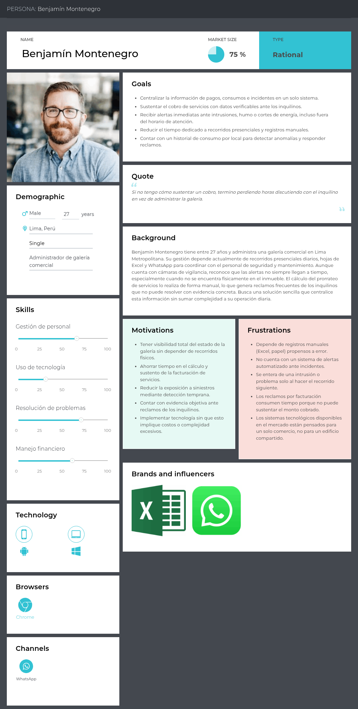
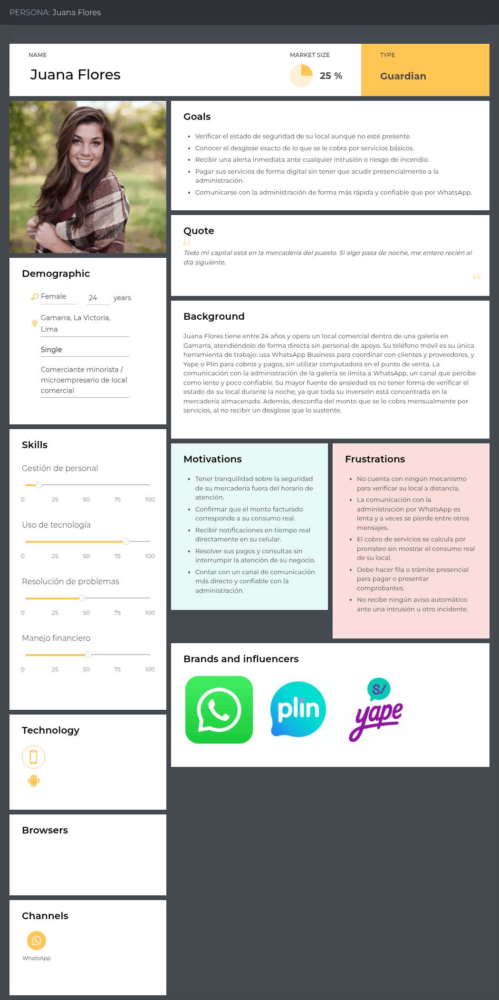
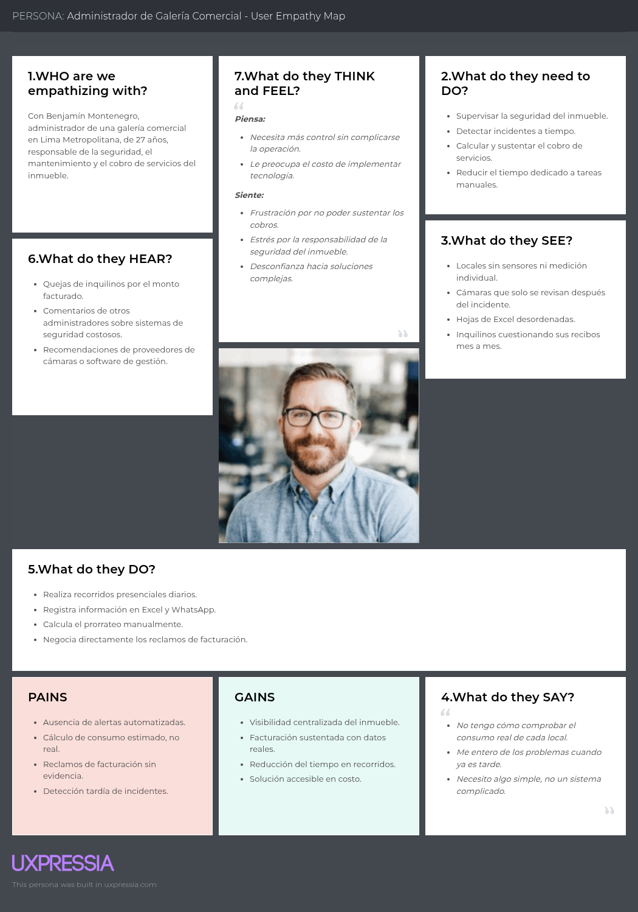

## 2.3. Needfinding

En esta sección se presentan los artefactos resultantes del proceso de Needfinding, elaborados a partir del análisis de las entrevistas realizadas a administradores de galería e inquilinos de local comercial, así como del análisis competitivo. Se incluyen herramientas como User Personas, User Task Matrix, User Journey Mapping y Empathy Mapping, las cuales permiten comprender en profundidad las necesidades, motivaciones, frustraciones y comportamientos de los usuarios objetivo.

A través de estos artefactos, se busca representar de manera clara cómo los administradores gestionan actualmente la seguridad y el consumo de servicios del inmueble, y cómo los inquilinos experimentan la falta de visibilidad sobre su propio local, evidenciando el uso de procesos manuales, la ausencia de alertas automatizadas y la opacidad en la facturación de servicios básicos.

### 2.3.1. User Personas

En esta sección se presentan los dos User Persona que representan a los segmentos objetivo del proyecto.

Ambos perfiles se construyeron a partir del análisis de las entrevistas realizadas y del análisis competitivo, integrando tanto las características objetivas (herramientas y procesos que usan hoy) como las subjetivas (percepciones, necesidades y disposición hacia una solución digital) identificadas en ambos segmentos. 

**Segmento Objetivo - Administrador de Galería Comercial**

El User Persona **Benjamín Montenegro** representa a los administradores de galerías comerciales de Lima Metropolitana, responsables de la rentabilidad, el mantenimiento y la seguridad del inmueble. Benjamín cuenta con experiencia administrando galerías de distinto tamaño y, aunque ha dependido de recorridos presenciales, Excel y WhatsApp para el control de la galería, estos métodos le han generado dificultades para sustentar los cobros de servicios y para detectar incidentes a tiempo. Su principal motivación es centralizar la información del inmueble y reducir el tiempo dedicado a tareas manuales. Busca una solución tecnológica accesible, sencilla de implementar, que le permita recibir alertas inmediatas y facturar con datos verificables, sin sumar complejidad operativa a su día a día.

La información mostrada en el User Persona evidencia que valora herramientas simples, capaces de centralizar la información sin requerir configuración especializada, ya que busca reducir el trabajo manual sin afectar su capacidad de respuesta ante incidentes. 

En ese sentido, este perfil sintetiza claramente la oportunidad de diseñar una solución que sustituya la supervisión presencial por información medida y verificable, alineada con el 100% de los administradores entrevistados que dependen hoy de registros manuales y el 0% que cuenta con alertas automatizadas.

**Segmento Objetivo - Inquilino de Local Comercial**

El User Persona **Juana Flores** representa a los inquilinos de local comercial dentro de galerías de alta densidad como Gamarra. Con su negocio operado de forma directa, **Juana** gestiona la totalidad de su actividad comercial desde el teléfono móvil, utilizando WhatsApp, Yape y Plin para ventas y pagos, sin depender de una computadora en el punto de venta. Esto hace que la seguridad de su mercadería y la transparencia del cobro de servicios sean aspectos críticos en su operación diaria, actualmente atendidos de forma insuficiente por la administración de la galería.

La información mostrada en el User Persona permite identificar a un microempresario que enfrenta incertidumbre constante sobre la seguridad de su local fuera del horario de atención y desconfianza hacia el monto que se le factura por servicios compartidos. 

Su perfil evidencia una dependencia total del dispositivo móvil, lo que afecta directamente el tipo de solución que puede adoptar: cualquier funcionalidad dirigida a este segmento debe estar disponible 100% desde el celular. Asimismo, se observa que valora soluciones que le brinden tranquilidad inmediata y transparencia, siempre que no interrumpan la atención de su negocio. En ese sentido, este perfil refleja la necesidad de una aplicación móvil con alertas en tiempo real y visualización clara del consumo, sustentada en que el 100% de los inquilinos entrevistados reporta ambas necesidades sin excepción.

### 2.3.2. User Task Matrix

Se presenta el User Task Matrix, que reúne las tareas que ambos User Persona, administrador de galería e inquilino de local comercial, realizan para lograr sus objetivos.

Estas tareas comprenden actividades que los usuarios llevan a cabo en su día a día, independientemente de la existencia de StorePulse.

<table>
  <thead>
    <tr>
      <th rowspan="2">Tarea</th>
      <th colspan="2">Benjamín Montenegro</th>
      <th colspan="2">Juana Flores</th>
    </tr>
    <tr>
      <th>Frecuencia</th>
      <th>Importancia</th>
      <th>Frecuencia</th>
      <th>Importancia</th>
    </tr>
  </thead>
  <tbody>
    <tr>
      <td>Supervisar la seguridad del local/inmueble</td>
      <td>Often</td>
      <td>High</td>
      <td>Often</td>
      <td>High</td>
    </tr>
    <tr>
      <td>Verificar el consumo de servicios básicos</td>
      <td>Often</td>
      <td>High</td>
      <td>Sometimes</td>
      <td>High</td>
    </tr>
    <tr>
      <td>Comunicarse con la contraparte (administración/inquilino)</td>
      <td>Often</td>
      <td>Medium</td>
      <td>Sometimes</td>
      <td>Medium</td>
    </tr>
    <tr>
      <td>Calcular o revisar el monto facturado por servicios</td>
      <td>Often</td>
      <td>High</td>
      <td>Sometimes</td>
      <td>High</td>
    </tr>
    <tr>
      <td>Atender o presentar reclamos por facturación</td>
      <td>Sometimes</td>
      <td>High</td>
      <td>Sometimes</td>
      <td>Medium</td>
    </tr>
    <tr>
      <td>Registrar o reportar incidentes de seguridad</td>
      <td>Sometimes</td>
      <td>High</td>
      <td>Rarely</td>
      <td>High</td>
    </tr>
    <tr>
      <td>Proteger la mercadería/activos fuera de horario</td>
      <td>N/A</td>
      <td>N/A</td>
      <td>Often</td>
      <td>High</td>
    </tr>
    <tr>
      <td>Coordinar con personal de seguridad y mantenimiento</td>
      <td>Often</td>
      <td>Medium</td>
      <td>N/A</td>
      <td>N/A</td>
    </tr>
    <tr>
      <td>Atender clientes y proveedores en el día a día</td>
      <td>N/A</td>
      <td>N/A</td>
      <td>Often</td>
      <td>High</td>
    </tr>
    <tr>
      <td>Buscar herramientas para mejorar la gestión</td>
      <td>Rarely</td>
      <td>Medium</td>
      <td>Rarely</td>
      <td>Medium</td>
    </tr>
  </tbody>
</table>

**Análisis:**

- Ambos segmentos comparten la supervisión de seguridad y la revisión del monto facturado como tareas frecuentes y de alta importancia, aunque con enfoques distintos: el administrador la ejecuta a nivel de todo el inmueble, mientras que el inquilino la ejecuta únicamente sobre su propio local.
- La verificación del consumo y la revisión del monto facturado también son tareas de alta importancia para ambos perfiles, aunque presentan distinta frecuencia. Esto evidencia la relevancia que tiene el control y seguimiento de los servicios básicos para ambos segmentos.
- La comunicación entre ambas partes y la atención de reclamos por facturación aparecen en ambos perfiles, lo que evidencia una necesidad compartida de contar con información clara y canales de comunicación más eficientes.
- Por otro lado, “proteger la mercadería/activos fuera de horario” es una tarea exclusiva del inquilino y de alta importancia, mientras que “coordinar con personal de seguridad y mantenimiento” es exclusiva del administrador. Esta diferencia confirma que, aunque ambos comparten necesidades relacionadas con la seguridad y el control de información, sus tareas cotidianas son complementarias y no idénticas, lo que justifica ofrecer vistas diferenciadas por rol dentro de StorePulse.

### 2.3.3. User Journey Mapping

### 2.3.4. Empathy Mapping

**Segmento Objetivo - Administrador de Galería Comercial**

