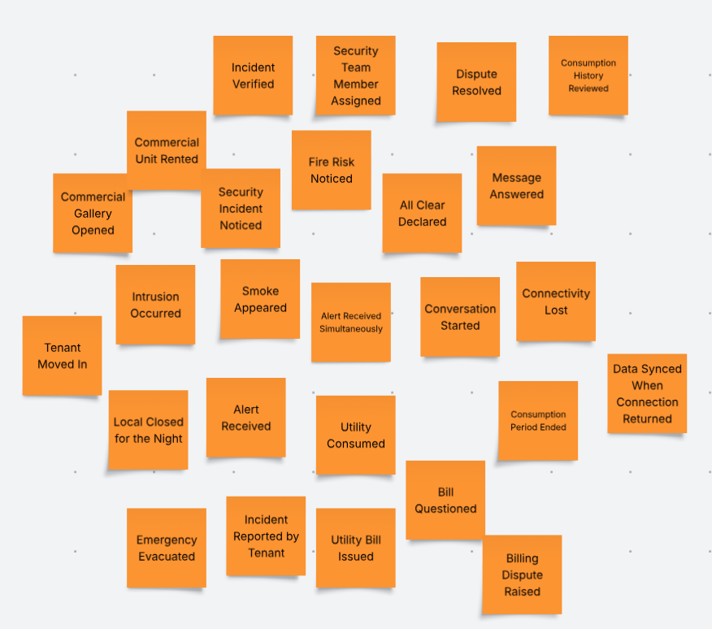
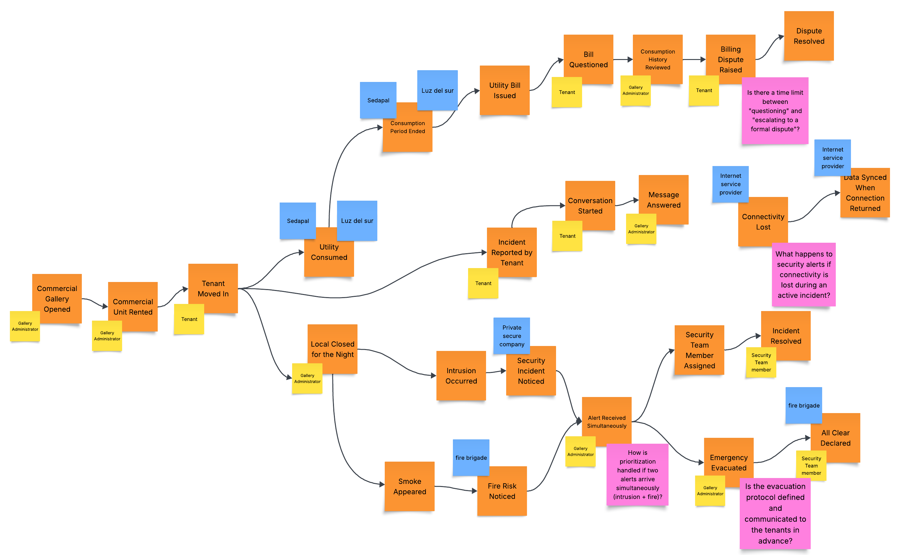
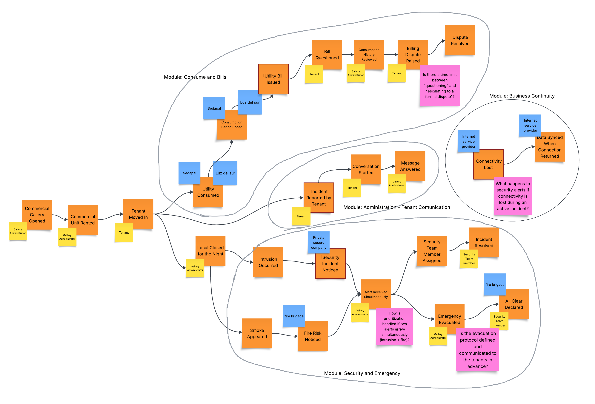

## 2.4. Big Picture EventStorming

En esta sección, el equipo presenta el desarrollo del **Big Picture EventStorming**, 
una dinámica colaborativa realizada para entender a profundidad el dominio de negocio de 
StorePulse. A diferencia de un análisis funcional o técnico, esta sesión buscó que el equipo 
construyera una comprensión compartida de cómo ocurren las cosas en una galería comercial, 
plasmando los eventos de dominio más significativos, los actores y sistemas externos reales 
del negocio, y sus relaciones causales a lo largo de una línea de tiempo, sin considerar 
todavía los componentes de la solución (dispositivos, servicios, aplicaciones) que eventualmente 
los soportarán.

* **Etapa 1: Open & Explore**

En esta etapa el equipo hizo una lluvia de ideas con el objetivo de capturar todos los hechos relevantes posibles 
que ocurren en el negocio de manera que fueron capturadas en *Domain Events* con notas de color naranja. 

Como se observa esta representación del brainstorming muestra todos los procesos por los que atraviesa el negocio,
desde que se aperturan los locales, tomando en cuenta eventos como el inicio del humo en el local, eventos de ingreso 
de un intruso, las alertas que se emiten hasta el registro y pago de las facturas. Esta etapa el equipo se centró en 
identificar los eventos sin tener en cuenta el orden de los mismos. 

* **Etapa 2: Explore (Ordenamiento y Narrativa)**

En esta etapa el equipo se centró en el ordenamiento cronológico de izquierda a derecha de los eventos,
esta vez con la incorporación de los actores, sistemas externos y los puntos de dolor o hotspots. 

Muestra la línea de tiempo de eventos de dominio desde la apertura de la galería hasta los hilos paralelos de seguridad,
incendio, facturación y comunicación con el inquilino, con actores (amarillo), sistemas externos (azul) y 
hotspots (rosado) identificados durante la sesión de narración.

* **Etapa 3: Close**

El equipo realizó una síntesis convergente de la línea de tiempo elaborada en la Etapa 2. Se identificaron los eventos
clave de cambio de estado (Pivotal Events) y se agruparon las 26 secuencias de eventos en 4 Bounded Contexts candidatos.

**Safety and Emergencies:** Teniendo como Evento pivote a Security Incident Noticed porque marca la transición de una 
detección externa (la empresa de vigilancia) a una responsabilidad interna: a partir de aquí, VanguardTech/Gallery 
Administrator debe actuar. Cambia el "dueño" del proceso de un tercero externo a la organización. 
**Consumption and Billing:** Teniendo como Evento pivote a Incident Reported by Tenant porque traslada la iniciativa 
del proceso del Tenant hacia el Gallery Administrator: el inquilino reporta, pero desde ahí la responsabilidad de 
resolución pasa a la administración. 
**Management-Tenant Communication:** Teniendo como Evento pivote a Utility Bill Issued porque es el punto donde el 
proceso deja de ser gestionado por el sistema externo (Sedapal/Luz del Sur) y pasa a ser interacción directa 
con el Tenant  
**Business Continuity:** Teniendo como Evento pivote a Connectivity Lost porque interrumpe 
la capacidad de respuesta de otros módulos como el de seguridad, por lo que genera un gran impacto en el proceso de negocio. 

