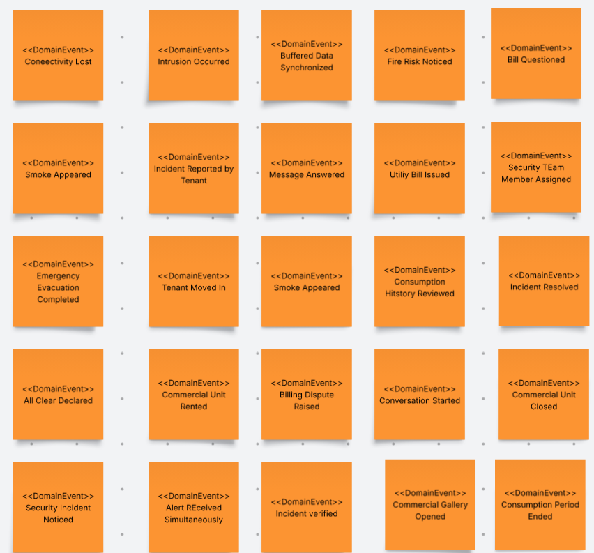
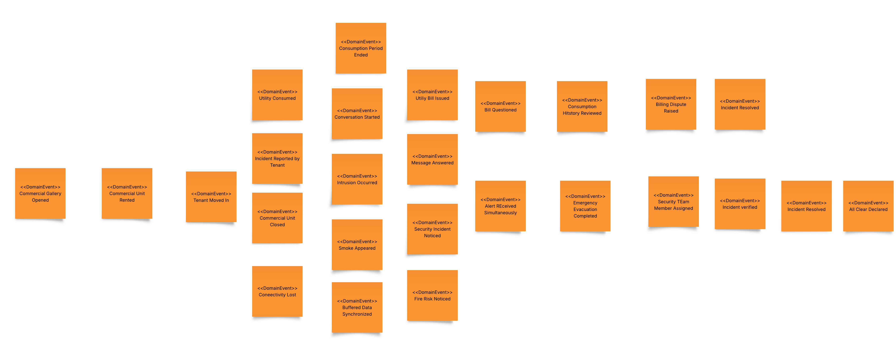
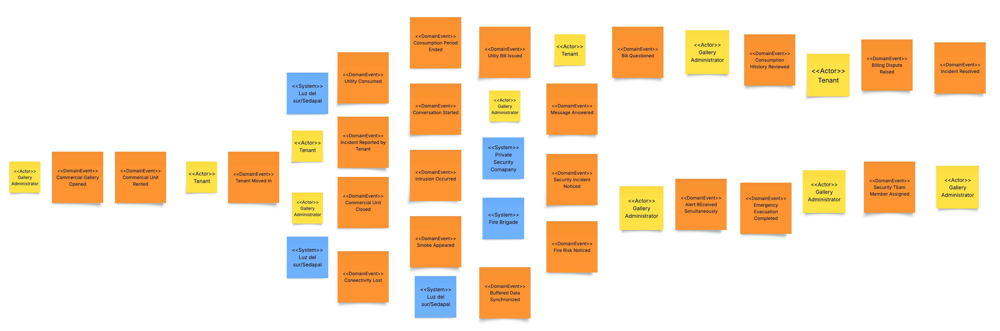

## 2.4. Big Picture EventStorming

En esta sección, el equipo presenta el desarrollo del **Big Picture EventStorming**, 
una dinámica colaborativa realizada para entender a profundidad el dominio de negocio de 
StorePulse. A diferencia de un análisis funcional o técnico, esta sesión buscó que el equipo 
construyera una comprensión compartida de cómo ocurren las cosas en una galería comercial, 
plasmando los eventos de dominio más significativos, los actores y sistemas externos reales 
del negocio, y sus relaciones causales a lo largo de una línea de tiempo, sin considerar 
todavía los componentes de la solución (dispositivos, servicios, aplicaciones) que eventualmente 
los soportarán.

* **Paso 1: Unstructured Exploration (Brainstorming)**

En esta etapa inicial, el equipo realizó una lluvia de ideas divergente para capturar todos los hechos relevantes 
posibles que ocurren en el negocio, sin preocuparse por el orden. Estos hechos fueron documentados como Domain Events 
(notas naranjas), asegurando que todos estuvieran redactados estrictamente en tiempo pasado como hechos consumados. 
Se mapearon desde acciones operativas hasta incidentes físicos imprevistos (ej. "Intrusion Occurred", "Utility Bill 
Issued"), abarcando toda la realidad de la galería comercial.. 

Como se observa esta representación del brainstorming muestra todos los procesos por los que atraviesa el negocio,
desde que se aperturan los locales, tomando en cuenta eventos como el inicio del humo en el local, eventos de ingreso 
de un intruso, las alertas que se emiten hasta el registro y pago de las facturas. Esta etapa el equipo se centró en 
identificar los eventos sin tener en cuenta el orden de los mismos. 

* **Paso 2: Línea de tiempo ordenada**

Posteriormente, el equipo se centró en organizar los eventos de dominio descubiertos en el paso anterior a lo largo de 
una línea de tiempo implícita de izquierda a derecha. Se descartó por completo el uso de flechas de flujo continuo, ya 
que en el EventStorming la secuencia y relación causal quedan establecidas estrictamente por la posición espacial en el
lienzo. Los hilos de procesos que ocurren en paralelo o de forma asíncrona (como la facturación, las incidencias de 
seguridad, el control de incendios y la continuidad del negocio frente a caídas de red) se ubicaron verticalmente uno 
debajo de otro, avanzando simultáneamente hacia la derecha. 

* **Paso 3: Explicit Walkthrough (Narrativa)**

Con la línea de tiempo consolidada, se procedió a realizar una narración explícita del proceso de negocio a través de
todo el landscape de la galería. Durante este recorrido, el equipo identificó y agregó al tablero los Actores (notas
amarillas, ej. Gallery Administrator, Tenant, Security Team Member) que inician o participan en procesos clave.
Asimismo, se incluyeron los Sistemas Externos (notas azules, ej. Sedapal / Luz del Sur, Private Security Company,
Internet Service Provider) que proveen información o interactúan con el dominio de la galería pero que operan fuera del
control del software propuesto.

