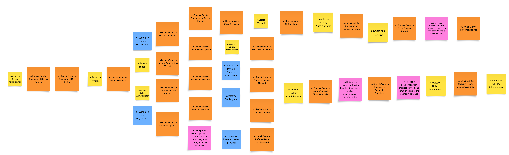
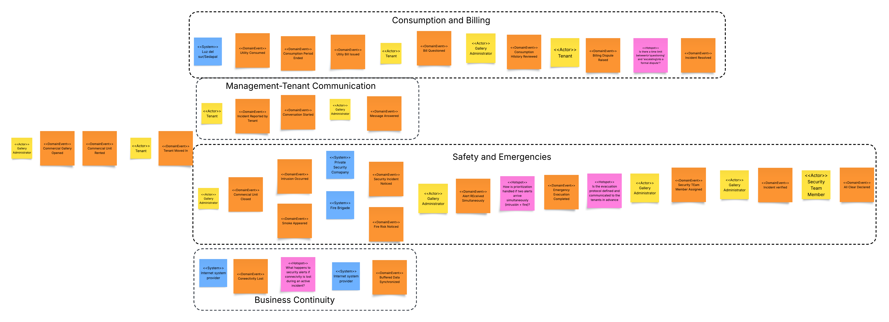

## 2.4. Big Picture EventStorming

En esta sección, el equipo presenta el desarrollo del **Big Picture EventStorming**, 
una dinámica colaborativa realizada para entender a profundidad el dominio de negocio de 
StorePulse. A diferencia de un análisis funcional o técnico, esta sesión buscó que el equipo 
construyera una comprensión compartida de cómo ocurren las cosas en una galería comercial, 
plasmando los eventos de dominio más significativos, los actores y sistemas externos reales 
del negocio, y sus relaciones causales a lo largo de una línea de tiempo, sin considerar 
todavía los componentes de la solución (dispositivos, servicios, aplicaciones) que eventualmente 
los soportarán.

* **Paso 1: Unstructured Exploration (Brainstorming)**

En esta etapa inicial, el equipo realizó una lluvia de ideas divergente para capturar todos los hechos relevantes 
posibles que ocurren en el negocio, sin preocuparse por el orden. Estos hechos fueron documentados como Domain Events 
(notas naranjas), asegurando que todos estuvieran redactados estrictamente en tiempo pasado como hechos consumados. 
Se mapearon desde acciones operativas hasta incidentes físicos imprevistos (ej. "Intrusion Occurred", "Utility Bill 
Issued"), abarcando toda la realidad de la galería comercial.. 

Como se observa esta representación del brainstorming muestra todos los procesos por los que atraviesa el negocio,
desde que se aperturan los locales, tomando en cuenta eventos como el inicio del humo en el local, eventos de ingreso 
de un intruso, las alertas que se emiten hasta el registro y pago de las facturas. Esta etapa el equipo se centró en 
identificar los eventos sin tener en cuenta el orden de los mismos. 

* **Paso 2: Línea de tiempo ordenada**

Posteriormente, el equipo se centró en organizar los eventos de dominio descubiertos en el paso anterior a lo largo de 
una línea de tiempo implícita de izquierda a derecha. Se descartó por completo el uso de flechas de flujo continuo, ya 
que en el EventStorming la secuencia y relación causal quedan establecidas estrictamente por la posición espacial en el
lienzo. Los hilos de procesos que ocurren en paralelo o de forma asíncrona (como la facturación, las incidencias de 
seguridad, el control de incendios y la continuidad del negocio frente a caídas de red) se ubicaron verticalmente uno 
debajo de otro, avanzando simultáneamente hacia la derecha. 

* **Paso 3: Explicit Walkthrough (Narrativa)**

Con la línea de tiempo consolidada, se procedió a realizar una narración explícita del proceso de negocio a través de
todo el landscape de la galería. Durante este recorrido, el equipo identificó y agregó al tablero los Actores (notas
amarillas, ej. Gallery Administrator, Tenant, Security Team Member) que inician o participan en procesos clave.
Asimismo, se incluyeron los Sistemas Externos (notas azules, ej. Sedapal / Luz del Sur, Private Security Company,
Internet Service Provider) que proveen información o interactúan con el dominio de la galería pero que operan fuera del
control del software propuesto.

* **Paso 4: Problems and Opportunities (Hotspots)**

Durante la validación de la narrativa de negocio, el equipo detuvo el recorrido exhaustivo cada vez que se identificaron
puntos de fricción, preguntas sin resolver, vulnerabilidades operativas o cuellos de botella en la gestión tradicional
de las galerías comerciales. Estos hallazgos críticos se documentaron como Hotspots (notas rosadas) agregadas a la 
línea de tiempo.

La identificación de estos puntos evidencia el pensamiento innovador del equipo para detectar necesidades ocultas, 
transformando deficiencias operativas en oportunidades directas de valor para StorePulse. Los conflictos detectados y 
las oportunidades de solución fueron:

    - Fricción en la conciliación: Se identificó la duda sobre si existe un límite de tiempo entre que un inquilino 
    cuestiona un recibo y escala a una disputa formal. Oportunidad: StorePulse automatizará estos plazos y utilizará la 
    data inmutable de los sensores (historial de consumo) para resolver disputas de forma objetiva y rápida. 
    - Riesgo en gestión de crisis múltiples: Existe un vacío sobre cómo se priorizan las alertas si dos eventos 
    críticos ocurren simultáneamente (ej. incendio e intrusión detectados al mismo tiempo). Oportunidad: Implementar 
    en la plataforma un motor de reglas que priorice automáticamente el riesgo de vida (incendio) sobre el riesgo de 
    propiedad (intrusión).
    - Incertidumbre en protocolos de seguridad: Falta de certeza sobre si el protocolo de evacuación está definido y 
    comunicado previamente a los inquilinos. Oportunidad: Digitalizar e integrar los planes de evacuación 
    directamente en la app del inquilino, disparándolos automáticamente ante una alerta verificada.
    - Vulnerabilidad de infraestructura técnica: Se detectó la grave interrogante sobre qué sucede con las alertas de 
    seguridad si se pierde la conectividad a internet durante un incidente activo. Oportunidad: Diseñar una 
    arquitectura resiliente con Edge Computing y sincronización diferida (buffers locales) para garantizar la 
    continuidad del negocio sin pérdida de datos vitales.

* **Paso 5: Pivotal Events & Boundaries (Contextos y Límites de Negocio)**

Finalmente, el equipo realizó una síntesis convergente de la línea de tiempo completa. Se identificaron los eventos 
clave de cambio de estado (Pivotal Events) y, utilizándolos como fronteras naturales, se agruparon las 
secuencias de eventos en 4 grandes Bounded Contexts candidatos de negocio:

    - Safety and Emergencies: Su evento pivote es Security Incident Noticed, porque marca la transición crítica de una 
    detección externa (la empresa de vigilancia) a una responsabilidad interna directa, donde el Gallery Administrator 
    o el sistema deben actuar obligatoriamente.
    - Consumption and Billing: Su evento pivote es Billing Dispute Raised, porque traslada la iniciativa del proceso 
    operativo desde el Tenant hacia el Gallery Administrator para la resolución formal del problema.
    - Management-Tenant Communication: Su evento pivote principal es Utility Bill Issued, marcando el punto exacto donde 
    el proceso deja de ser gestionado por un sistema externo (Sedapal / Luz del Sur) y pasa a requerir una interacción 
    y notificación directa con el Tenant.
    - Business Continuity: Su evento pivote es Connectivity Lost, un evento técnico pero con profundo impacto de 
    negocio, ya que interrumpe la capacidad de respuesta en tiempo real de todos los demás módulos de la galería comercial.

