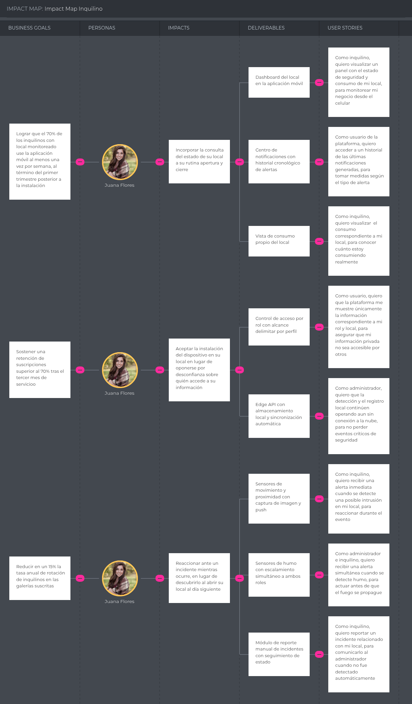

## 3.2. Impact Mapping

En esta sección se presenta el Impact Mapping, cuya finalidad es alinear los objetivos de negocio de StorePulse, formulados bajo el criterio SMART (Specific, Measurable, Attainable, Relevant y Timely), con las necesidades y comportamientos esperados de cada uno de los User Personas identificados en el Capítulo II. A través de esta actividad se identifica cómo los actores clave, el Administrador de Galería Comercial y el Inquilino de Local Comercial, deben cambiar su comportamiento (Impacts) para contribuir al logro de las metas; qué funcionalidades o artefactos se construirán (Deliverables) para provocar esos cambios; y cómo se traducen estos en historias concretas (Stories) para el equipo de desarrollo.

Los Business Goals que estructuran ambos mapas se derivan de los Business Outcome Assumptions declarados durante el proceso de Lean UX (sección 1.2.2.2), lo que asegura la trazabilidad entre las creencias iniciales del equipo y la planificación del producto. Los artefactos fueron elaborados en UXPressia, tomando como base las fichas de User Persona construidas previamente en la misma herramienta. Al cierre de cada mapa se indican los identificadores de las Stories correspondientes, según la tabla de la sección 3.1.

### Administrador de Galería Comercial

El Impact Mapping asociado a Benjamín Montenegro representa la alineación estratégica entre los objetivos comerciales y operativos de StorePulse, las necesidades reales del responsable del inmueble y los entregables funcionales que permitirán generar valor medible. Este mapa permite visualizar cómo cada iniciativa tecnológica responde directamente a los retos operativos del administrador, asegurando que el desarrollo de la plataforma no se enfoque en funcionalidades aisladas, sino en resultados concretos que impulsen la adopción, la reducción del trabajo manual y la transparencia en la gestión del inmueble.

En primer lugar, se establece como objetivo comercial alcanzar una conversión del 30 % de las galerías que reciben una demostración hacia una suscripción activa, durante los primeros seis meses de operación. Para lograrlo, se identifica que Benjamín necesita comprender que la solución fue concebida para un inmueble de propiedad compartida y no para un comercio autónomo, antes de comprometer una inversión sobre la infraestructura del edificio. En respuesta a ello, el producto contempla como entregables una Landing Page estática con contenido y llamadas a la acción diferenciados por segmento, donde se explique el propósito de la solución, su funcionamiento y los planes disponibles; y un módulo de suscripción con planes escalonados según la cantidad de locales monitoreados, que permita activar el servicio y consultar su vigencia. Estas funcionalidades buscan convertir el interés inicial en suscripciones efectivas.

Como segundo eje estratégico, se plantea reducir en un 30 % las disputas por cobros de servicios entre administradores e inquilinos durante los primeros seis meses de uso de la plataforma. Desde la perspectiva del usuario, Benjamín necesita dejar de calcular un prorrateo estimado en hojas de cálculo y comenzar a emitir facturas sustentadas en consumo real medido por local. Para ello, la solución propone medidores inteligentes de energía y agua instalados en cada local, junto con un motor de cálculo que determina el consumo del periodo y genera el desglose correspondiente, consultable tanto por la administración como por el inquilino. Estas
capacidades permiten que cada cobro quede respaldado por mediciones verificables por ambas partes, eliminando la principal fuente de fricción identificada en las entrevistas.

Finalmente, el tercer objetivo consiste en reducir en un 50 % el tiempo de resolución de los reclamos por facturación. En este contexto, Benjamín requiere responder un reclamo mostrando el histórico del local en lugar de negociar sin datos que sustenten su posición. Para atender esta necesidad se plantea un panel de consumo con histórico por periodo y comparación contra la línea base histórica, que permite detectar consumos anómalos y contrastar registros; complementado por un módulo de atención de reclamos que vincula cada solicitud de revisión con el desglose de consumo del local correspondiente. Estas funcionalidades transforman una
negociación sin evidencia en una verificación documentada.

_Stories asociadas a este mapa: VS-01 a VS-06, US-28, US-30, US-31, US-32, US-33, US-38, US-44, US-45, TS-19 a TS-23, TS-27, TS-28 y MS-06._

### Inquilino de Local Comercial

El Impact Mapping asociado a Juana Flores representa la alineación estratégica entre los objetivos de adopción y permanencia de StorePulse y las necesidades reales de los comerciantes que ocupan los locales de la galería. Este mapa visualiza de manera estructurada cómo el comportamiento de la usuaria beneficiaria impacta directamente en el éxito de la plataforma, y detalla qué entregables de software son necesarios para facilitar dicho comportamiento, garantizando que el esfuerzo de desarrollo esté justificado por el valor que aporta.

En cuanto al primer eje estratégico, orientado a la adopción cotidiana de la plataforma, se busca lograr que el 70 % de los inquilinos con local monitoreado utilice la aplicación móvil al menos una vez por semana, al término del primer trimestre posterior a la instalación. Para alcanzar esta meta, Juana debe incorporar la consulta del estado de su local a su rutina de apertura y cierre, en lugar de depender de avisos informales de la administración. El producto despliega como entregables un dashboard del local en la aplicación móvil, con el estado de seguridad y el consumo del periodo; un centro de notificaciones con historial cronológico de alertas por tipo y local, que evita que los avisos se pierdan entre mensajes; y la visualización del consumo propio junto con el desglose que sustenta su cobro. Estas funcionalidades convierten una herramienta de consulta ocasional en parte de la operación diaria del negocio.

Respecto al segundo eje, vinculado a la permanencia de la suscripción, la plataforma busca sostener una retención superior al 70 % tras el tercer mes de servicio. Este objetivo depende de que Juana acepte la instalación del dispositivo en su local en lugar de oponerse por  desconfianza sobre quién accede a la información de su actividad interna. El núcleo de esta solución reside en el control de acceso por rol, que limita al inquilino a la información de su propio local y otorga al administrador únicamente la vista consolidada del inmueble. Se complementa con la continuidad operativa del Edge API, que mantiene la detección y el registro
de eventos aun cuando se interrumpa la conexión con la nube, y sincroniza la información pendiente al restablecerse, sosteniendo la confianza en el servicio durante las interrupciones de red frecuentes en galerías comerciales.

Finalmente, el tercer objetivo consiste en reducir en un 15 % la tasa anual de rotación de inquilinos en las galerías suscritas. El enfoque se dirige a que Juana reaccione ante un incidente mientras ocurre, en lugar de descubrir un robo al abrir su local al día siguiente. La plataforma integra sensores de movimiento y activación por proximidad que generan una alerta inmediata con la imagen capturada del evento; sensores de humo con escalamiento simultáneo al inquilino y al administrador, que permiten actuar antes de que el fuego alcance los locales contiguos; y un módulo de reporte manual de incidentes con seguimiento de estado,
que reemplaza el canal informal por un registro documentado. Al reducir la pérdida patrimonial y la sensación de desprotección, estas funcionalidades atacan directamente una de las causas de abandono del local.

_Stories asociadas a este mapa: US-05, US-20, US-22, US-25, US-29, US-31, US-36, US-41, US-42, US-43, US-49, US-51, TS-01, TS-02, TS-15 a TS-18, TS-25, TS-26, TS-30, MS-04, MS-05, MS-07 y MS-08._

### Análisis de los resultados esperados

Ambos mapas evidencian que los objetivos de negocio de StorePulse solo se alcanzan mediante la contribución conjunta de los dos segmentos, pero con roles claramente diferenciados. El administrador concentra los objetivos vinculados a la decisión de compra, la facturación sustentada y la resolución de reclamos, mientras que la inquilina concentra los objetivos de adopción, permanencia y reducción de la rotación.

Esta distribución confirma la asimetría identificada en el Capítulo I y validada en las entrevistas del Capítulo II: el administrador decide y asume el costo de la suscripción, pero la continuidad del servicio depende de que la inquilina adopte la plataforma y acepte la instalación del dispositivo. Por esa razón, el control de acceso por rol aparece asociado a la retención de la suscripción y no únicamente a la seguridad de la información, ya que sin la confianza de la inquilina el dispositivo no llega a instalarse y el objetivo comercial no se concreta.

Asimismo, se observa que un mismo conjunto de entregables contribuye a más de un objetivo. Los medidores inteligentes sustentan tanto la reducción de disputas del administrador como la transparencia que motiva el uso semanal de la aplicación por parte de la inquilina, lo que justifica su prioridad dentro del Product Backlog presentado en la sección siguiente.