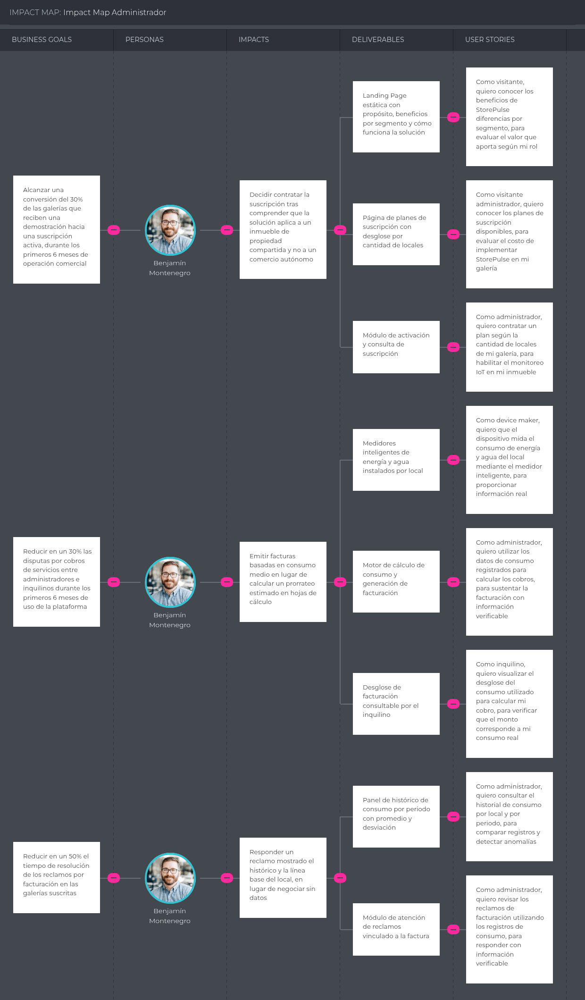

## 3.2. Impact Mapping

En esta sección se presenta el Impact Mapping, cuya finalidad es alinear los objetivos de negocio de StorePulse, formulados bajo el criterio SMART (Specific, Measurable, Attainable, Relevant y Timely), con las necesidades y comportamientos esperados de cada uno de los User Personas identificados en el Capítulo II. A través de esta actividad se identifica cómo los actores clave, el Administrador de Galería Comercial y el Inquilino de Local Comercial, deben cambiar su comportamiento (Impacts) para contribuir al logro de las metas; qué funcionalidades o artefactos se construirán (Deliverables) para provocar esos cambios; y cómo se traducen estos en historias concretas (Stories) para el equipo de desarrollo.

Los Business Goals que estructuran ambos mapas se derivan de los Business Outcome Assumptions declarados durante el proceso de Lean UX (sección 1.2.2.2), lo que asegura la trazabilidad entre las creencias iniciales del equipo y la planificación del producto. Los artefactos fueron elaborados en UXPressia, tomando como base las fichas de User Persona construidas previamente en la misma herramienta. Al cierre de cada mapa se indican los identificadores de las Stories correspondientes, según la tabla de la sección 3.1.

### Administrador de Galería Comercial

El Impact Mapping asociado a Benjamín Montenegro representa la alineación estratégica entre los objetivos comerciales y operativos de StorePulse, las necesidades reales del responsable del inmueble y los entregables funcionales que permitirán generar valor medible. Este mapa permite visualizar cómo cada iniciativa tecnológica responde directamente a los retos operativos del administrador, asegurando que el desarrollo de la plataforma no se enfoque en funcionalidades aisladas, sino en resultados concretos que impulsen la adopción, la reducción del trabajo manual y la transparencia en la gestión del inmueble.

En primer lugar, se establece como objetivo comercial alcanzar una conversión del 30 % de las galerías que reciben una demostración hacia una suscripción activa, durante los primeros seis meses de operación. Para lograrlo, se identifica que Benjamín necesita comprender que la solución fue concebida para un inmueble de propiedad compartida y no para un comercio autónomo, antes de comprometer una inversión sobre la infraestructura del edificio. En respuesta a ello, el producto contempla como entregables una Landing Page estática con contenido y llamadas a la acción diferenciados por segmento, donde se explique el propósito de la solución, su funcionamiento y los planes disponibles; y un módulo de suscripción con planes escalonados según la cantidad de locales monitoreados, que permita activar el servicio y consultar su vigencia. Estas funcionalidades buscan convertir el interés inicial en suscripciones efectivas.

Como segundo eje estratégico, se plantea reducir en un 30 % las disputas por cobros de servicios entre administradores e inquilinos durante los primeros seis meses de uso de la plataforma. Desde la perspectiva del usuario, Benjamín necesita dejar de calcular un prorrateo estimado en hojas de cálculo y comenzar a emitir facturas sustentadas en consumo real medido por local. Para ello, la solución propone medidores inteligentes de energía y agua instalados en cada local, junto con un motor de cálculo que determina el consumo del periodo y genera el desglose correspondiente, consultable tanto por la administración como por el inquilino. Estas
capacidades permiten que cada cobro quede respaldado por mediciones verificables por ambas partes, eliminando la principal fuente de fricción identificada en las entrevistas.

Finalmente, el tercer objetivo consiste en reducir en un 50 % el tiempo de resolución de los reclamos por facturación. En este contexto, Benjamín requiere responder un reclamo mostrando el histórico del local en lugar de negociar sin datos que sustenten su posición. Para atender esta necesidad se plantea un panel de consumo con histórico por periodo y comparación contra la línea base histórica, que permite detectar consumos anómalos y contrastar registros; complementado por un módulo de atención de reclamos que vincula cada solicitud de revisión con el desglose de consumo del local correspondiente. Estas funcionalidades transforman una
negociación sin evidencia en una verificación documentada.

_Stories asociadas a este mapa: VS-01 a VS-06, US-28, US-30, US-31, US-32, US-33, US-38, US-44, US-45, TS-19 a TS-23, TS-27, TS-28 y MS-06._