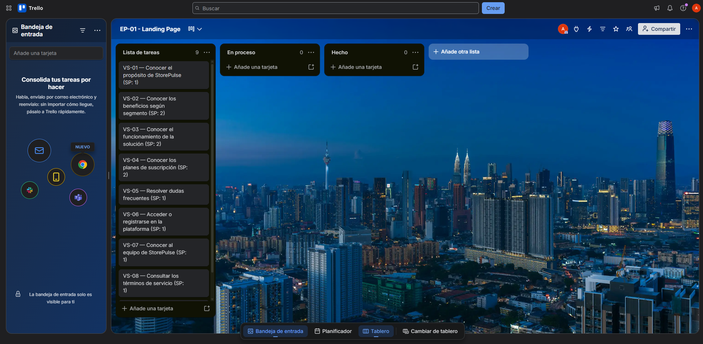

# 3.3. Product Backlog

El Product Backlog de StorePulse reúne las User Stories (US), Visitor Stories (VS), Technical Stories (TS), Maker Stories (MS) y Spike Stories (SP) definidas para el desarrollo de la solución. Estas historias se encuentran priorizadas de acuerdo con el valor que aportan al producto, considerando inicialmente el Landing Page como primer entregable del proyecto y, posteriormente, la configuración del inmueble (galería y locales), la validación técnica de los sensores mediante Spike Stories, el registro y monitoreo de dispositivos IoT, la detección de eventos de seguridad y emergencias, y la medición y transparencia del consumo de servicios básicos. Las funcionalidades complementarias, como el centro de notificaciones, la gestión de perfil, las suscripciones y la gestión de acceso e identidad, se incorporan posteriormente según su relevancia para el proyecto. Para estimar el esfuerzo de cada historia se utilizan Story Points de 1, 2 y 3.

| # Orden | Story ID | Título                                                | Descripción                                                                                                                                                                                                                       | Story Points |
|:--------|:---------|:------------------------------------------------------|:----------------------------------------------------------------------------------------------------------------------------------------------------------------------------------------------------------------------------------|:-------------|
| 1       | VS-01    | Conocer el propósito de StorePulse                    | Como visitante, quiero conocer el propósito de StorePulse, para entender qué problema de mi galería puede solucionar.                                                                                                             | 1            |
| 2       | VS-02    | Conocer los beneficios según segmento                 | Como visitante, quiero conocer los beneficios de StorePulse diferenciados por segmento, para evaluar el valor que aporta según mi rol.                                                                                            | 2            |
| 3       | VS-03    | Conocer el funcionamiento de la solución              | Como visitante, quiero conocer cómo funciona StorePulse, para comprender cómo se relacionan el monitoreo, las alertas y el consumo.                                                                                               | 2            |
| 4       | VS-04    | Conocer los planes de suscripción                     | Como visitante administrador, quiero conocer los planes de suscripción disponibles, para evaluar el costo de implementar StorePulse en mi galería.                                                                                | 2            |
| 5       | VS-05    | Resolver dudas frecuentes                             | Como visitante, quiero acceder a una sección de preguntas frecuentes, para resolver dudas antes de decidir registrarme.                                                                                                           | 1            |
| 6       | VS-06    | Acceder o registrarse en la plataforma                | Como visitante, quiero acceder al registro o inicio de sesión desde el sitio web, para comenzar a usar StorePulse.                                                                                                                | 1            |
| 7       | VS-07    | Conocer al equipo de StorePulse                       | Como visitante, quiero conocer al equipo detrás de StorePulse, para conocer quiénes desarrollan y respaldan la solución.                                                                                                          | 1            |
| 8       | VS-08    | Consultar los términos de servicio                    | Como visitante, quiero consultar los términos de servicio de StorePulse, para conocer las condiciones de uso antes de registrarme.                                                                                                | 1            |
| 9       | VS-09    | Consultar la política de privacidad                   | Como visitante, quiero consultar la política de privacidad de StorePulse, para conocer cómo se recopilan y protegen mis datos.                                                                                                    | 1            |
| 10      | US-08    | Registro de la galería comercial                      | Como administrador, quiero registrar los datos de mi galería comercial, para habilitar la gestión del inmueble en la plataforma.                                                                                                  | 2            |
| 11      | US-09    | Registrar local de la galería                         | Como administrador, quiero registrar un local dentro de mi galería, para incorporarlo a la gestión del inmueble.                                                                                                                  | 2            |
| 12      | US-10    | Editar local de la galería                            | Como administrador, quiero editar la información de un local, para mantener actualizados los datos del inmueble.                                                                                                                  | 2            |
| 13      | US-11    | Eliminar local de la galería                          | Como administrador, quiero eliminar un local que ya no forma parte de la galería, para mantener actualizada la estructura del inmueble.                                                                                           | 2            |
| 14      | US-12    | Invitar o asignar inquilino a un local                | Como administrador, quiero invitar a un inquilino a vincularse a su local, para que pueda acceder a la información de su propio espacio.                                                                                          | 2            |
| 15      | US-13    | Consultar información del inmueble                    | Como administrador, quiero visualizar la información consolidada de mi galería, locales, inquilinos y dispositivos, para tener una vista general de la operación.                                                                 | 1            |
| 16      | TS-05    | Registro de galerías                                  | Como backend developer, quiero gestionar el registro de galerías comerciales, para crear correctamente el inmueble dentro del sistema.                                                                                            | 2            |
| 17      | TS-06    | Consulta de galerías                                  | Como backend developer, quiero permitir la consulta de galerías comerciales, para proporcionar la información del inmueble a los usuarios autorizados.                                                                            | 1            |
| 18      | TS-07    | Registro de locales                                   | Como backend developer, quiero gestionar el registro de locales dentro de una galería, para mantener correctamente la estructura del inmueble.                                                                                    | 2            |
| 19      | TS-08    | Edición de locales                                    | Como backend developer, quiero permitir la actualización de los datos de un local, para mantener actualizada la información del inmueble.                                                                                         | 2            |
| 20      | TS-09    | Baja lógica de locales                                | Como backend developer, quiero gestionar la baja lógica de locales, para conservar su trazabilidad sin mantenerlos como activos.                                                                                                  | 2            |
| 21      | TS-10    | Vinculación de inquilino a local                      | Como backend developer, quiero gestionar la invitación y vinculación de un inquilino a su local, para asociar correctamente el acceso por rol.                                                                                    | 2            |
| 22      | SP-01    | Viabilidad de detección de intrusión                  | Como equipo de desarrollo, queremos investigar qué tecnología de sensado permite detectar una intrusión en un local comercial, para determinar su viabilidad y precisión antes de implementar el dispositivo.                     | 2            |
| 23      | SP-02    | Viabilidad de detección de humo                       | Como equipo de desarrollo, queremos investigar qué sensor permite detectar humo de forma confiable en fase temprana, para definir los parámetros de la detección de emergencias.                                                  | 2            |
| 24      | SP-03    | Método de medición del consumo eléctrico              | Como equipo de desarrollo, queremos investigar qué mecanismo permite medir el consumo eléctrico de cada local de forma segura y precisa, para determinar la tecnología de medidor a utilizar.                                     | 2            |
| 25      | SP-04    | Comunicación IoT                                      | Como equipo de desarrollo, queremos investigar qué protocolo de comunicación es más adecuado para transmitir la telemetría, para elegir una alternativa compatible con la conectividad de una galería comercial.                  | 2            |
| 26      | SP-05    | Estrategia offline y sincronización                   | Como equipo de desarrollo, queremos investigar cómo conservar y sincronizar las mediciones cuando el dispositivo pierde conectividad, para definir una estrategia que reduzca la pérdida de datos.                                | 3            |
| 27      | SP-06    | Seguridad de la comunicación IoT                      | Como equipo de desarrollo, queremos investigar mecanismos de autenticación entre dispositivos y backend, para evitar el envío de telemetría desde dispositivos no autorizados.                                                    | 2            |
| 28      | SP-07    | Precisión de sensores en condiciones reales           | Como equipo de desarrollo, queremos investigar la precisión de los sensores seleccionados en condiciones similares a una galería comercial, para determinar si las mediciones son suficientes para las necesidades de StorePulse. | 2            |
| 29      | US-14    | Registrar dispositivo IoT                             | Como administrador, quiero registrar un dispositivo IoT y asociarlo a un local, para habilitar su monitoreo dentro de la plataforma.                                                                                              | 2            |
| 30      | US-15    | Visualizar estado de dispositivos                     | Como administrador, quiero visualizar el estado de los dispositivos IoT de mi galería, para identificar cuáles están operativos.                                                                                                  | 2            |
| 31      | US-16    | Desactivar dispositivo                                | Como administrador, quiero desactivar un dispositivo en mantenimiento, para suspender temporalmente su monitoreo sin perder su historial.                                                                                         | 2            |
| 32      | US-17    | Reactivar dispositivo                                 | Como administrador, quiero reactivar un dispositivo que se encontraba inactivo, para restablecer su monitoreo.                                                                                                                    | 2            |
| 33      | US-18    | Recibir alerta de falla de dispositivo                | Como administrador, quiero ser notificado cuando un dispositivo presente una falla técnica, para gestionar su reparación o reemplazo.                                                                                             | 2            |
| 34      | TS-11    | Registro de dispositivos                              | Como backend developer, quiero gestionar el registro de dispositivos IoT, para vincularlos correctamente con su local.                                                                                                            | 2            |
| 35      | TS-12    | Consulta de dispositivos                              | Como backend developer, quiero permitir la consulta de dispositivos IoT registrados, para conocer su asociación y estado actual.                                                                                                  | 1            |
| 36      | TS-13    | Gestión de estado de dispositivos                     | Como backend developer, quiero gestionar el ciclo de estados de un dispositivo, para reflejar su condición operativa real.                                                                                                        | 2            |
| 37      | TS-14    | Recepción de métricas de salud del dispositivo        | Como backend developer, quiero recibir y almacenar métricas de voltaje, CPU y temperatura del microcontrolador, para diagnosticar fallas técnicas remotamente.                                                                    | 2            |
| 38      | MS-01    | Identificación única del dispositivo                  | Como device maker, quiero que cada dispositivo tenga un identificador único de hardware, para asociar correctamente sus mediciones con el local correspondiente.                                                                  | 2            |
| 39      | MS-02    | Autenticación del dispositivo                         | Como device maker, quiero que el dispositivo se autentique con una API Key antes de enviar telemetría, para evitar que dispositivos no registrados envíen información.                                                            | 2            |
| 40      | MS-03    | Registro de logs y métricas locales                   | Como device maker, quiero que el dispositivo registre logs estructurados y métricas de funcionamiento, para diagnosticar fallos incluso sin conectividad.                                                                         | 2            |
| 41      | US-19    | Visualizar estado de seguridad de la galería          | Como administrador, quiero visualizar el estado de seguridad consolidado de la galería, para conocer si existen incidentes activos.                                                                                               | 2            |
| 42      | US-20    | Recibir alerta de intrusión del local                 | Como inquilino, quiero recibir una alerta inmediata cuando se detecte una posible intrusión en mi local, para reaccionar rápidamente y proteger mi negocio.                                                                       | 3            |
| 43      | US-21    | Recibir alerta de intrusión de la galería             | Como administrador, quiero recibir una alerta inmediata cuando se detecte una posible intrusión en cualquier local o área común, para supervisar la seguridad de la galería.                                                      | 3            |
| 44      | US-22    | Recibir alerta de humo                                | Como administrador e inquilino, quiero recibir una alerta simultánea cuando se detecte humo, para actuar antes de que el fuego se propague.                                                                                       | 2            |
| 45      | US-23    | Consultar historial de incidentes de la galería       | Como administrador, quiero consultar el historial de incidentes de seguridad del inmueble, para realizar seguimiento de los eventos registrados.                                                                                  | 1            |
| 46      | US-24    | Consultar historial de incidentes del local           | Como inquilino, quiero consultar el historial de incidentes de mi local, para realizar seguimiento de los eventos de seguridad ocurridos.                                                                                         | 1            |
| 47      | US-25    | Reportar un incidente manualmente                     | Como inquilino, quiero reportar un incidente relacionado con mi local, para comunicarlo a la administración cuando no fue detectado automáticamente.                                                                              | 2            |
| 48      | US-26    | Consultar detalle de un incidente de la galería       | Como administrador, quiero consultar el detalle de un incidente específico, para conocer su tipo, ubicación y evidencia visual.                                                                                                   | 1            |
| 49      | US-27    | Consultar detalle de un incidente del local           | Como inquilino, quiero consultar el detalle de un incidente ocurrido en mi local, para conocer qué ocurrió y revisar la evidencia disponible.                                                                                     | 1            |
| 50      | TS-15    | Recepción de eventos de seguridad                     | Como backend developer, quiero recibir eventos de seguridad provenientes de los dispositivos IoT, para registrar y procesar los incidentes detectados.                                                                            | 2            |
| 51      | TS-16    | Gestión del estado de incidentes                      | Como backend developer, quiero gestionar el ciclo de estado de un incidente, para reflejar su seguimiento.                                                                                                                        | 2            |
| 52      | TS-17    | Escalamiento simultáneo de alertas                    | Como backend developer, quiero escalar una alerta de humo simultáneamente al inquilino y al administrador, para reducir el tiempo de respuesta ante una emergencia.                                                               | 3            |
| 53      | TS-18    | Almacenamiento de evidencia visual                    | Como backend developer, quiero almacenar la imagen capturada asociada a un evento de intrusión, para permitir su consulta posterior desde el historial.                                                                           | 2            |
| 54      | MS-04    | Detección de intrusión                                | Como device maker, quiero que el dispositivo detecte movimiento y activación por proximidad, para generar un evento de posible intrusión.                                                                                         | 2            |
| 55      | MS-05    | Detección de humo                                     | Como device maker, quiero que el dispositivo detecte presencia de humo en fase temprana, para generar un evento de posible emergencia.                                                                                            | 2            |
| 56      | US-28    | Visualizar consumo de servicios de la galería         | Como administrador, quiero visualizar el consumo consolidado de agua y energía de la galería, para dar seguimiento a los registros.                                                                                               | 2            |
| 57      | US-29    | Visualizar consumo del local                          | Como inquilino, quiero visualizar el consumo correspondiente a mi local, para conocer cuánto estoy consumiendo realmente.                                                                                                         | 1            |
| 58      | US-30    | Consultar historial de consumo                        | Como administrador, quiero consultar el historial de consumo por local y por periodo, para comparar registros y detectar anomalías.                                                                                               | 2            |
| 59      | US-31    | Consultar desglose del consumo                        | Como inquilino, quiero visualizar el desglose del consumo utilizado para calcular mi cobro, para verificar que el monto corresponde a mi consumo real.                                                                            | 2            |
| 60      | US-32    | Generar información para facturación                  | Como administrador, quiero utilizar los datos de consumo registrados para calcular los cobros, para sustentar la facturación con información verificable.                                                                         | 3            |
| 61      | US-33    | Consultar factura                                     | Como inquilino, quiero consultar el detalle de mi factura de servicios, para conocer los conceptos que componen el monto a pagar.                                                                                                 | 1            |
| 62      | US-55    | Descarga e historial de facturas                      | Como inquilino/administrador, quiero consultar el historial de facturas y descargar los comprobantes en PDF, para mantener un registro contable ordenado.                                                                         | 3            |
| 63      | TS-19    | Recepción de métricas de consumo                      | Como backend developer, quiero recibir y validar las mediciones de consumo enviadas por los dispositivos IoT, para almacenar información confiable.                                                                               | 2            |
| 64      | TS-20    | Cálculo de consumo por local                          | Como backend developer, quiero calcular el consumo correspondiente a cada local a partir de las mediciones, para generar información utilizable en la facturación.                                                                | 2            |
| 65      | TS-21    | Generación del desglose de facturación                | Como backend developer, quiero generar el desglose del cobro utilizando los datos de consumo registrados, para proporcionar información verificable.                                                                              | 3            |
| 66      | TS-22    | Comparación con línea base histórica                  | Como backend developer, quiero calcular la desviación del consumo actual respecto del promedio histórico, para identificar anomalías de consumo.                                                                                  | 3            |
| 67      | TS-32    | Consulta paginada y generación de PDF de facturas     | Como backend developer, quiero exponer el historial de facturas con filtros/paginación y generar el comprobante en PDF, para permitir su auditoría y respaldo.                                                                    | 3            |
| 68      | MS-06    | Medición de consumo de servicios                      | Como device maker, quiero que el dispositivo mida el consumo de energía y agua del local mediante el medidor inteligente, para proporcionar información real del consumo.                                                         | 2            |
| 69      | US-34    | Recibir comunicación de la administración             | Como inquilino, quiero recibir comunicaciones de la administración relacionadas con incidentes o servicios, para mantenerme informado.                                                                                            | 1            |
| 70      | US-35    | Notificar un incidente al inquilino afectado          | Como administrador, quiero notificar directamente a los inquilinos afectados por un incidente, para informarles oportunamente.                                                                                                    | 2            |
| 71      | US-36    | Consultar estado de un reporte propio                 | Como inquilino, quiero consultar el estado de un incidente que reporté, para conocer si la administración ya lo está atendiendo.                                                                                                  | 1            |
| 72      | US-37    | Presentar reclamo de facturación                      | Como inquilino, quiero presentar un reclamo sobre mi facturación, para solicitar una revisión cuando encuentre una discrepancia.                                                                                                  | 2            |
| 73      | US-38    | Atender reclamos de facturación                       | Como administrador, quiero revisar los reclamos de facturación utilizando los registros de consumo, para responder con información verificable.                                                                                   | 2            |
| 74      | TS-23    | Gestión de reportes y reclamos                        | Como backend developer, quiero implementar el registro, notificación y seguimiento de reportes y reclamos, para permitir que la administración gestione su atención.                                                              | 2            |
| 75      | US-39    | Identificar pérdida de conectividad de un dispositivo | Como administrador, quiero saber cuándo un dispositivo pierde conectividad con la nube, para identificar posibles interrupciones en el monitoreo.                                                                                 | 2            |
| 76      | US-40    | Visualizar estado de conectividad de dispositivos     | Como administrador, quiero visualizar el estado de conexión de todos mis dispositivos, para conocer cuáles están operativos.                                                                                                      | 1            |
| 77      | US-41    | Continuidad de detección sin conexión                 | Como administrador, quiero que la detección y el registro local continúen operando aun sin conexión a la nube, para no perder eventos críticos de seguridad.                                                                      | 3            |
| 78      | US-42    | Sincronización automática al recuperar conexión       | Como administrador, quiero que los datos almacenados localmente se sincronicen automáticamente al recuperar la conexión, para no perder información.                                                                              | 3            |
| 79      | US-43    | Consultar historial offline desde la app              | Como administrador o inquilino, quiero consultar mi historial de eventos y consumo aunque pierda temporalmente la conexión a Internet, para no perder acceso a información crítica.                                               | 2            |
| 80      | TS-24    | Monitoreo de conectividad de dispositivos             | Como backend developer, quiero registrar el estado de conectividad de los dispositivos IoT, para detectar interrupciones en la comunicación.                                                                                      | 2            |
| 81      | TS-25    | Almacenamiento temporal en el Edge API                | Como backend developer, quiero permitir el almacenamiento temporal de mediciones y eventos en la base de datos local del Edge API, para evitar la pérdida de información ante caídas de red.                                      | 3            |
| 82      | TS-26    | Sincronización de datos pendientes                    | Como backend developer, quiero sincronizar las mediciones almacenadas localmente cuando se recupere la conexión, para mantener actualizada la información central.                                                                | 3            |
| 83      | MS-07    | Persistencia local ante caída de red                  | Como device maker, quiero que cada registro generado por el dispositivo se almacene localmente de forma duradera, para garantizar la trazabilidad incluso ante caídas de red.                                                     | 2            |
| 84      | MS-08    | Reintento de envío de telemetría                      | Como device maker, quiero que el dispositivo reintente el envío de información cuando falle la comunicación, para reducir la pérdida de telemetría.                                                                               | 2            |
| 85      | MS-09    | Inicialización automática del almacenamiento          | Como device maker, quiero que el servicio edge prepare su almacenamiento local en la primera solicitud, para comenzar a operar sin configuración manual.                                                                          | 1            |
| 86      | US-49    | Centro de notificaciones                              | Como usuario de la plataforma, quiero acceder a un historial de las últimas notificaciones generadas por el sistema, para tomar medidas según el tipo de alerta recibida.                                                         | 1            |
| 87      | US-50    | Visualizar dashboard consolidado                      | Como administrador, quiero visualizar un dashboard con métricas clave de seguridad y consumo de mi galería, para tomar decisiones operativas informadas.                                                                          | 2            |
| 88      | US-51    | Visualizar dashboard del local                        | Como inquilino, quiero visualizar un panel con el estado de seguridad y consumo de mi local, para monitorear mi negocio desde el celular.                                                                                         | 2            |
| 89      | TS-30    | Generación de alertas centralizadas                   | Como backend developer, quiero consolidar la generación de notificaciones a partir de eventos de seguridad, conectividad y consumo, para centralizar su gestión y entrega.                                                        | 2            |
| 90      | TS-31    | Consulta de métricas del dashboard                    | Como backend developer, quiero exponer un endpoint que consolide las métricas clave de seguridad, consumo y dispositivos, para alimentar el dashboard de forma eficiente.                                                         | 2            |
| 91      | US-06    | Visualizar perfil de usuario                          | Como usuario de la plataforma, quiero visualizar la información de mi perfil, para verificar los datos asociados a mi cuenta.                                                                                                     | 1            |
| 92      | US-07    | Editar perfil de usuario                              | Como usuario de la plataforma, quiero editar la información de mi perfil, para mantener mis datos de contacto actualizados.                                                                                                       | 2            |
| 93      | TS-04    | Gestión de perfil de usuario                          | Como backend developer, quiero centralizar la consulta y actualización del perfil de usuario, para mantener la información asociada a su cuenta disponible y actualizada.                                                         | 2            |
| 94      | US-44    | Activar suscripción                                   | Como administrador, quiero contratar un plan de suscripción según la cantidad de locales de mi galería, para habilitar el monitoreo IoT en mi inmueble.                                                                           | 2            |
| 95      | US-45    | Visualizar estado de la suscripción                   | Como administrador, quiero visualizar el estado de mi suscripción, para conocer su vigencia, beneficios y fecha de renovación.                                                                                                    | 1            |
| 96      | US-46    | Cancelar renovación automática                        | Como administrador, quiero desactivar la renovación automática de mi plan, para evitar cobros futuros cuando decida dejar de usar el servicio.                                                                                    | 2            |
| 97      | US-47    | Reactivar renovación automática                       | Como administrador, quiero reactivar la renovación automática de mi plan, para mantener la continuidad del servicio al finalizar el ciclo actual.                                                                                 | 1            |
| 98      | US-48    | Renovación automática de suscripción                  | Como administrador, quiero que el sistema renueve automáticamente mi plan, para asegurar que el monitoreo de mis locales no se interrumpa.                                                                                        | 2            |
| 99      | TS-27    | Procesamiento de pago mediante integración externa    | Como backend developer, quiero procesar los pagos mediante integración con un proveedor externo, para validar la transacción antes de activar la suscripción.                                                                     | 2            |
| 100     | TS-28    | Gestión del estado de suscripción                     | Como backend developer, quiero habilitar la consulta de vigencia de la suscripción por galería, para garantizar que el sistema restrinja funcionalidades si expira.                                                               | 1            |
| 101     | TS-29    | Renovación y facturación recurrente                   | Como backend developer, quiero automatizar el cobro de renovación en la fecha de expiración, para mantener la continuidad del servicio sin intervención manual.                                                                   | 3            |
| 102     | US-01    | Registro de usuario                                   | Como visitante, quiero registrarme indicando mis datos y mi rol, para acceder a las funcionalidades de la plataforma.                                                                                                             | 2            |
| 103     | US-02    | Inicio de sesión                                      | Como usuario, quiero iniciar sesión en StorePulse, para acceder de forma segura a la información de mi galería o local.                                                                                                           | 2            |
| 104     | US-03    | Recuperación de contraseña                            | Como usuario, quiero recuperar mi contraseña mediante un código enviado a mi correo, para recuperar el acceso a mi cuenta.                                                                                                        | 2            |
| 105     | US-04    | Cierre de sesión                                      | Como usuario, quiero cerrar mi sesión en el dispositivo que esté usando, para evitar accesos indebidos a mi cuenta.                                                                                                               | 1            |
| 106     | US-05    | Control de acceso por rol                             | Como usuario, quiero que la plataforma me muestre únicamente la información correspondiente a mi rol y local, para asegurar que mi información privada no sea accesible por otros.                                                | 2            |
| 107     | TS-01    | Autenticación de usuarios                             | Como backend developer, quiero autenticar a los usuarios de forma segura, para permitir el acceso al sistema.                                                                                                                     | 2            |
| 108     | TS-02    | Registro de usuarios                                  | Como backend developer, quiero gestionar el registro de usuarios de forma segura, para permitir la creación de cuentas según su rol.                                                                                              | 2            |
| 109     | TS-03    | Recuperación de contraseña vía correo                 | Como backend developer, quiero gestionar la recuperación de contraseña mediante un token temporal, para permitir a los usuarios restablecer su acceso.                                                                            | 2            |

**Evidencia del Product Backlog:**

**Enlace público al Product Backlog:** [https://trello.com/w/vanguardtech](https://trello.com/w/vanguardtech)