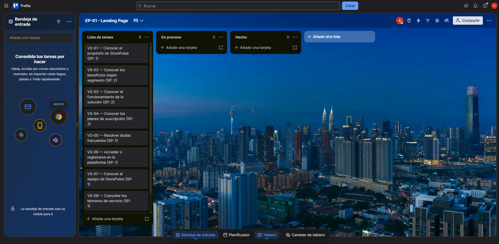

## 3.3. Product Backlog

El Product Backlog de StorePulse reúne las 123 Stories definidas en la sección 3.1: User Stories (US), Visitor Stories
(VS), Technical Stories (TS), Maker Stories (MS) y Spike Stories (SP). El orden lo determina el valor para el negocio,
medido por su contribución a los Business Goals del Impact Mapping (sección 3.2), y no la secuencia de los Epics.

Para priorizar se aplicaron los siguientes criterios:

* **El Landing Page se considera desde el primer Sprint.** Sus Stories encabezan el backlog, comenzando por las que
  sostienen el objetivo de conversión (propósito, beneficios por segmento, planes y solicitud de demostración).
* **Cada funcionalidad se ordena como un corte vertical.** La User Story se ubica junto a las Technical Stories y Maker
  Stories que la hacen posible, y cada Spike se ubica inmediatamente antes del bloque cuya incertidumbre resuelve, en
  lugar de agrupar todas las investigaciones al inicio.
* **Primero la propuesta de valor central.** La detección de intrusión (HS-01), la detección de humo (HS-02) y la
  medición del consumo con facturación verificable (HS-03 y HS-04) preceden a las funcionalidades de soporte. Antes de
  ellas solo se incluye el alta mínima de la galería, el local y el dispositivo, sin la cual no existe qué monitorear.
* **La autenticación no encabeza el backlog.** Las Stories de acceso se ubican en el bloque donde aportan valor al
  usuario: el control de acceso por rol (US-05) lo abre por ser la condición de la hipótesis HS-05 para que el inquilino
  acepte la plataforma.
* **Las funcionalidades de mantenimiento van al final.** La edición y baja de locales, la gestión de estados de
  dispositivos, la recuperación de contraseña y el perfil no modifican ningún Business Goal por sí mismas.

El esfuerzo se estima con Story Points en la escala 1, 2, 3, 5 y 8, donde 1 representa un cambio acotado en un solo
componente y 8 una Story que involucra hardware, Edge API y backend o una integración externa con incertidumbre alta.

| Bloque de valor                             | Posiciones         | Story Points  |
| :------------------------------------------ | :----------------- | :------------ |
| Landing Page                                | 1 – 12            | 17            |
| Alta mínima del inmueble y del dispositivo | 13 – 24           | 25            |
| Detección de intrusión                    | 25 – 40           | 37            |
| Detección de humo                          | 41 – 45           | 11            |
| Consumo y facturación                      | 46 – 63           | 54            |
| Acceso por rol, dashboards y notificaciones | 64 – 75           | 24            |
| Reclamos y comunicación                    | 76 – 82           | 12            |
| Continuidad operativa                       | 83 – 95           | 38            |
| Suscripción                                | 96 – 103          | 25            |
| Gestión complementaria                     | 104 – 123         | 35            |
| **Total**                             | **1 – 123** | **278** |

| # Orden | User Story Id | Título                                                | Descripción                                                                                                                                                                                                                                                                | Story Points (1 / 2 / 3 / 5 / 8) |
| :------ | :------------ | :----------------------------------------------------- | :-------------------------------------------------------------------------------------------------------------------------------------------------------------------------------------------------------------------------------------------------------------------------- | :------------------------------- |
| 1       | VS-01         | Conocer el propósito de StorePulse                    | Como visitante, deseo conocer el propósito de StorePulse, para entender qué problema de mi galería puede solucionar.                                                                                                                                                     | 1                                |
| 2       | VS-02         | Conocer los beneficios según segmento                 | Como visitante, deseo conocer los beneficios de StorePulse diferenciados por segmento (administrador/inquilino), para evaluar el valor que aporta según mi rol.                                                                                                            | 2                                |
| 3       | VS-03         | Conocer el funcionamiento de la solución              | Como visitante, deseo conocer cómo funciona StorePulse, para comprender cómo se relacionan el monitoreo, las alertas y el consumo.                                                                                                                                        | 2                                |
| 4       | VS-04         | Conocer los planes de suscripción                     | Como visitante administrador, deseo conocer los planes de suscripción disponibles, para evaluar el costo de implementar StorePulse en mi galería.                                                                                                                         | 2                                |
| 5       | VS-10         | Solicitar una demostración                            | Como visitante administrador, deseo solicitar una demostración de StorePulse para mi galería, para evaluar la solución con mi propio inmueble antes de contratar.                                                                                                        | 2                                |
| 6       | VS-06         | Acceder o registrarse en la plataforma                 | Como visitante, deseo acceder al registro o inicio de sesión desde el sitio web, para comenzar a usar StorePulse.                                                                                                                                                          | 1                                |
| 7       | VS-11         | Conocer la aplicación para inquilinos                 | Como visitante inquilino, deseo conocer qué información de mi local puedo consultar desde la aplicación móvil y quién más puede verla, para decidir si acepto la instalación del dispositivo en mi local.                                                            | 1                                |
| 8       | TS-34         | Registro de solicitudes de demostración               | Como developer, deseo registrar las solicitudes de demostración enviadas desde el Landing Page, para que el equipo comercial contacte a cada galería interesada.                                                                                                          | 2                                |
| 9       | VS-05         | Resolver dudas frecuentes                              | Como visitante, deseo acceder a una sección de preguntas frecuentes, para resolver dudas antes de decidir registrarme.                                                                                                                                                     | 1                                |
| 10      | VS-07         | Conocer al equipo de StorePulse                        | Como visitante, deseo conocer al equipo detrás de StorePulse, para conocer quiénes desarrollan y respaldan la solución.                                                                                                                                                  | 1                                |
| 11      | VS-08         | Consultar los términos de servicio                    | Como visitante, deseo consultar los términos de servicio de StorePulse, para conocer las condiciones de uso de la plataforma antes de registrarme.                                                                                                                         | 1                                |
| 12      | VS-09         | Consultar la política de privacidad                   | Como visitante, deseo consultar la política de privacidad de StorePulse, para conocer cómo se recopilan, utilizan y protegen mis datos personales.                                                                                                                        | 1                                |
| 13      | US-08         | Registro de la galería comercial                      | Como administrador, deseo registrar los datos de mi galería comercial, para habilitar la gestión del inmueble en la plataforma.                                                                                                                                           | 2                                |
| 14      | TS-05         | Registro de galerías                                  | Como developer, deseo gestionar el registro de galerías comerciales, para crear correctamente el inmueble dentro del sistema.                                                                                                                                              | 2                                |
| 15      | US-09         | Registrar local de la galería                         | Como administrador, deseo registrar un local dentro de mi galería, para incorporarlo a la gestión del inmueble.                                                                                                                                                           | 2                                |
| 16      | TS-07         | Registro de locales                                    | Como developer, deseo gestionar el registro de locales dentro de una galería, para mantener correctamente la estructura del inmueble.                                                                                                                                      | 2                                |
| 17      | US-12         | Invitar o asignar inquilino a un local                 | Como administrador, deseo invitar a un inquilino a vincularse a su local, para que pueda acceder a la información de su propio espacio.                                                                                                                                    | 3                                |
| 18      | TS-10         | Vinculación de inquilino a local                      | Como developer, deseo gestionar la invitación y vinculación de un inquilino a su local, para asociar correctamente el acceso por rol.                                                                                                                                     | 2                                |
| 19      | SP-04         | Comunicación IoT                                      | Como equipo de desarrollo, deseo investigar qué protocolo de comunicación es más adecuado para transmitir la telemetría, para elegir una alternativa compatible con la conectividad de una galería comercial.                                                          | 2                                |
| 20      | SP-06         | Seguridad de la comunicación IoT                      | Como equipo de desarrollo, deseo investigar mecanismos de autenticación entre dispositivos y backend, para evitar el envío de telemetría desde dispositivos no autorizados.                                                                                              | 2                                |
| 21      | MS-01         | Identificación única del dispositivo                 | Como device maker, deseo que cada dispositivo tenga un identificador único de hardware, para asociar correctamente sus mediciones con el local correspondiente.                                                                                                            | 2                                |
| 22      | MS-02         | Autenticación del dispositivo                         | Como device maker, deseo que el dispositivo se autentique con una API Key antes de enviar telemetría, para evitar que dispositivos no registrados envíen información.                                                                                                    | 2                                |
| 23      | US-14         | Registrar dispositivo IoT                              | Como administrador, deseo registrar un dispositivo IoT y asociarlo a un local, para habilitar su monitoreo dentro de la plataforma.                                                                                                                                         | 2                                |
| 24      | TS-11         | Registro de dispositivos                               | Como developer, deseo gestionar el registro de dispositivos IoT, para vincularlos correctamente con su local.                                                                                                                                                               | 2                                |
| 25      | SP-01         | Viabilidad de detección de intrusión                 | Como equipo de desarrollo, deseo investigar qué tecnología de sensado permite detectar una intrusión en un local comercial, para determinar su viabilidad y precisión antes de implementar el dispositivo.                                                              | 2                                |
| 26      | SP-07         | Precisión de sensores en condiciones reales           | Como equipo de desarrollo, deseo investigar la precisión de los sensores seleccionados en condiciones similares a una galería comercial, para determinar si las mediciones son suficientes para las necesidades de StorePulse.                                            | 2                                |
| 27      | MS-04         | Detección de intrusión                               | Como device maker, deseo que el dispositivo detecte movimiento y activación por proximidad, para generar un evento de posible intrusión.                                                                                                                                  | 5                                |
| 28      | TS-15         | Recepción de eventos de seguridad                     | Como developer, deseo recibir eventos de seguridad provenientes de los dispositivos IoT, para registrar y procesar los incidentes detectados.                                                                                                                               | 3                                |
| 29      | TS-18         | Almacenamiento de evidencia visual                     | Como developer, deseo almacenar la imagen capturada asociada a un evento de intrusión, para permitir su consulta posterior desde el historial.                                                                                                                             | 3                                |
| 30      | US-52         | Configurar el horario de atención del local           | Como inquilino, deseo configurar el horario de atención de mi local, para que las alertas de intrusión se generen únicamente cuando el local está cerrado.                                                                                                              | 2                                |
| 31      | TS-37         | Configuración del horario de atención                | Como developer, deseo gestionar el horario de atención de cada local, para que la detección de intrusión se active únicamente fuera de ese horario.                                                                                                                     | 2                                |
| 32      | US-20         | Recibir alerta de intrusión del local                 | Como inquilino, deseo recibir una alerta inmediata cuando se detecte una posible intrusión en mi local, para reaccionar rápidamente durante el evento y proteger mi negocio.                                                                                              | 5                                |
| 33      | US-21         | Recibir alerta de intrusión de la galería            | Como administrador, deseo recibir una alerta inmediata cuando se detecte una posible intrusión en cualquier local o área común, para supervisar la seguridad de la galería y responder rápidamente.                                                                    | 3                                |
| 34      | US-53         | Confirmar la atención de una alerta                   | Como administrador, deseo confirmar que una alerta de seguridad está siendo atendida, para que el inquilino afectado conozca la respuesta y quede registrado el tiempo de reacción.                                                                                       | 2                                |
| 35      | TS-16         | Gestión del estado de incidentes                      | Como developer, deseo gestionar el ciclo de estado de un incidente, para reflejar su seguimiento.                                                                                                                                                                           | 2                                |
| 36      | US-24         | Consultar historial de incidentes del local            | Como inquilino, deseo consultar el historial de incidentes de mi local, para realizar seguimiento de los eventos de seguridad ocurridos.                                                                                                                                    | 1                                |
| 37      | US-27         | Consultar detalle de un incidente del local            | Como inquilino, deseo consultar el detalle de un incidente ocurrido en mi local, para conocer qué ocurrió y revisar la evidencia disponible.                                                                                                                              | 1                                |
| 38      | US-23         | Consultar historial de incidentes de la galería       | Como administrador, deseo consultar el historial de incidentes de seguridad del inmueble, para realizar seguimiento de los eventos registrados.                                                                                                                             | 1                                |
| 39      | US-26         | Consultar detalle de un incidente de la galería       | Como administrador, deseo consultar el detalle de un incidente específico, para conocer su tipo, su ubicación y su estado de atención.                                                                                                                                   | 1                                |
| 40      | US-19         | Visualizar estado de seguridad de la galería          | Como administrador, deseo visualizar el estado de seguridad consolidado de la galería, para conocer si existen incidentes activos.                                                                                                                                         | 2                                |
| 41      | SP-02         | Viabilidad de detección de humo                       | Como equipo de desarrollo, deseo investigar qué sensor permite detectar humo de forma confiable en fase temprana, para definir los parámetros de la detección de emergencias.                                                                                            | 2                                |
| 42      | MS-05         | Detección de humo                                     | Como device maker, deseo que el dispositivo detecte presencia de humo en fase temprana, para generar un evento de posible emergencia.                                                                                                                                       | 2                                |
| 43      | TS-17         | Escalamiento simultáneo de alertas                    | Como developer, deseo escalar una alerta de humo simultáneamente al inquilino y al administrador, para reducir el tiempo de respuesta ante una emergencia.                                                                                                                 | 3                                |
| 44      | US-22         | Recibir alerta de humo del local                       | Como inquilino, deseo recibir una alerta cuando se detecte humo en mi local, para actuar antes de que el fuego se propague.                                                                                                                                                 | 2                                |
| 45      | US-59         | Recibir alerta de humo de la galería                  | Como administrador, deseo recibir una alerta cuando se detecte humo en cualquier local o área común, para coordinar la respuesta antes de que el fuego se propague.                                                                                                       | 2                                |
| 46      | SP-03         | Método de medición del consumo eléctrico            | Como equipo de desarrollo, deseo investigar qué mecanismo permite medir el consumo eléctrico de cada local de forma segura y precisa, para determinar la tecnología de medidor a utilizar.                                                                               | 2                                |
| 47      | MS-06         | Medición de consumo de servicios                      | Como device maker, deseo que el dispositivo mida el consumo de energía y agua del local mediante el medidor inteligente, para proporcionar información real del consumo.                                                                                                  | 8                                |
| 48      | TS-19         | Recepción de métricas de consumo                     | Como developer, deseo recibir y validar las mediciones de consumo enviadas por los dispositivos IoT, para almacenar información confiable.                                                                                                                                 | 2                                |
| 49      | TS-20         | Cálculo de consumo por local                          | Como developer, deseo calcular el consumo correspondiente a cada local a partir de las mediciones, para generar información utilizable en la facturación.                                                                                                                 | 2                                |
| 50      | US-29         | Visualizar consumo del local                           | Como inquilino, deseo visualizar el consumo correspondiente a mi local, para conocer cuánto estoy consumiendo realmente.                                                                                                                                                   | 1                                |
| 51      | US-28         | Visualizar consumo de servicios de la galería         | Como administrador, deseo visualizar el consumo consolidado de agua y energía de la galería, para dar seguimiento a los registros.                                                                                                                                        | 2                                |
| 52      | US-54         | Configurar tarifas y periodo de facturación           | Como administrador, deseo configurar la tarifa de energía, la tarifa de agua y el periodo de facturación de mi galería, para que los cobros se calculen con valores conocidos por ambas partes.                                                                          | 3                                |
| 53      | TS-35         | Configuración de tarifas y periodo de facturación    | Como developer, deseo gestionar las tarifas y el periodo de facturación de cada galería, para calcular los cobros con valores configurados por la administración.                                                                                                        | 2                                |
| 54      | US-32         | Generar información para facturación                 | Como administrador, deseo utilizar los datos de consumo registrados para calcular los cobros, para sustentar la facturación con información verificable.                                                                                                                  | 5                                |
| 55      | TS-21         | Generación del desglose de facturación               | Como developer, deseo generar el desglose del cobro utilizando los datos de consumo registrados, para proporcionar información verificable.                                                                                                                                | 5                                |
| 56      | US-31         | Consultar desglose del consumo                         | Como inquilino, deseo visualizar el desglose del consumo utilizado para calcular mi cobro, para verificar que el monto corresponde a mi consumo real.                                                                                                                       | 2                                |
| 57      | US-33         | Consultar factura                                      | Como inquilino, deseo consultar el detalle de mi factura de servicios, para conocer los conceptos que componen el monto a pagar.                                                                                                                                            | 1                                |
| 58      | US-30         | Consultar historial de consumo                         | Como administrador, deseo consultar el historial de consumo por local y por periodo, para comparar registros y detectar anomalías.                                                                                                                                         | 2                                |
| 59      | TS-22         | Comparación con línea base histórica                | Como developer, deseo calcular la desviación del consumo actual respecto del promedio histórico, para identificar anomalías de consumo.                                                                                                                                  | 3                                |
| 60      | US-55         | Descarga e historial de facturas                       | Como usuario de la plataforma, deseo consultar el historial de facturas emitidas y descargar los comprobantes en formato PDF, para mantener un registro ordenado que respalde los pagos por el consumo de servicios básicos.                                               | 5                                |
| 61      | TS-32         | Consulta paginada y generación de PDF de facturas     | Como developer, deseo exponer el historial de facturas con filtros/paginación y generar el comprobante en PDF a partir de los datos verificados de consumo, para que administradores e inquilinos puedan auditar y respaldar sus pagos sin depender de registros manuales. | 5                                |
| 62      | US-56         | Registrar el pago de una factura                       | Como administrador, deseo registrar el pago de la factura de servicios de un local, para mantener actualizado el estado de los cobros de la galería.                                                                                                                       | 2                                |
| 63      | TS-36         | Registro de pago de facturas                           | Como developer, deseo registrar el pago de una factura de servicios, para mantener el estado de cada factura consistente con los cobros realizados.                                                                                                                         | 2                                |
| 64      | US-05         | Control de acceso por rol                              | Como usuario, deseo que la plataforma me muestre únicamente la información correspondiente a mi rol y local, para asegurar que mi información privada no sea accesible por otros.                                                                                        | 2                                |
| 65      | US-01         | Registro de administrador                              | Como visitante administrador, deseo registrarme con mis datos personales, para crear la cuenta con la que gestionaré mi galería.                                                                                                                                          | 2                                |
| 66      | TS-02         | Registro de usuarios                                   | Como developer, deseo gestionar el registro de usuarios de forma segura, para permitir la creación de cuentas según su rol.                                                                                                                                               | 2                                |
| 67      | US-02         | Inicio de sesión                                      | Como usuario, deseo iniciar sesión en StorePulse, para acceder de forma segura a la información de mi galería o local.                                                                                                                                                   | 2                                |
| 68      | TS-01         | Autenticación de usuarios                             | Como developer, deseo autenticar a los usuarios de forma segura, para permitir el acceso al sistema.                                                                                                                                                                        | 2                                |
| 69      | US-51         | Visualizar dashboard del local                         | Como inquilino, deseo visualizar un panel con el estado de seguridad y consumo de mi local, para monitorear mi negocio desde el celular.                                                                                                                                    | 2                                |
| 70      | US-50         | Visualizar dashboard consolidado                       | Como administrador, deseo visualizar un dashboard con métricas clave de seguridad y consumo de mi galería, para tomar decisiones operativas informadas.                                                                                                                   | 2                                |
| 71      | TS-31         | Consulta de métricas del dashboard                    | Como developer, deseo exponer un endpoint que consolide las métricas clave de seguridad, consumo y dispositivos, para alimentar el dashboard de forma eficiente.                                                                                                           | 2                                |
| 72      | US-49         | Centro de notificaciones                               | Como usuario de la plataforma, deseo acceder a un historial de las últimas notificaciones generadas por el sistema, para tomar medidas según el tipo de alerta recibida.                                                                                                  | 1                                |
| 73      | TS-30         | Generación de alertas centralizadas                   | Como developer, deseo consolidar la generación de notificaciones a partir de eventos de seguridad, conectividad y consumo, para centralizar su gestión y entrega.                                                                                                         | 2                                |
| 74      | US-58         | Configurar preferencias de notificación               | Como inquilino, deseo elegir qué tipos de aviso recibo como notificación en mi teléfono, para atender de inmediato lo urgente sin que me interrumpan los avisos informativos.                                                                                            | 2                                |
| 75      | TS-33         | Registro de token de notificaciones push               | Como developer, deseo registrar el token de notificaciones de cada teléfono, para entregar las alertas al teléfono del usuario correspondiente.                                                                                                                           | 3                                |
| 76      | US-37         | Presentar reclamo de facturación                      | Como inquilino, deseo presentar un reclamo sobre mi facturación, para solicitar una revisión cuando encuentre una discrepancia.                                                                                                                                           | 2                                |
| 77      | US-38         | Atender reclamos de facturación                       | Como administrador, deseo revisar los reclamos de facturación utilizando los registros de consumo, para responder con información verificable.                                                                                                                            | 2                                |
| 78      | TS-23         | Gestión de reportes y reclamos                        | Como developer, deseo implementar el registro, notificación y seguimiento de reportes y reclamos, para permitir que la administración gestione su atención.                                                                                                              | 2                                |
| 79      | US-25         | Reportar un incidente manualmente                      | Como inquilino, deseo reportar un incidente relacionado con mi local, para comunicarlo a la administración cuando no fue detectado automáticamente.                                                                                                                       | 2                                |
| 80      | US-36         | Consultar estado de un reporte propio                  | Como inquilino, deseo consultar el estado de un incidente que reporté, para conocer si la administración ya lo está atendiendo.                                                                                                                                          | 1                                |
| 81      | US-35         | Notificar un incidente al inquilino afectado           | Como administrador, deseo notificar directamente a los inquilinos afectados por un incidente, para informarles oportunamente.                                                                                                                                               | 2                                |
| 82      | US-34         | Recibir comunicación de la administración            | Como inquilino, deseo recibir comunicaciones de la administración relacionadas con incidentes o servicios, para mantenerme informado.                                                                                                                                      | 1                                |
| 83      | SP-05         | Estrategia offline y sincronización                   | Como equipo de desarrollo, deseo investigar cómo conservar y sincronizar las mediciones cuando el dispositivo pierde conectividad, para definir una estrategia que reduzca la pérdida de datos.                                                                           | 3                                |
| 84      | MS-07         | Persistencia local ante caída de red                  | Como device maker, deseo que cada registro generado por el dispositivo se almacene localmente de forma duradera, para garantizar la trazabilidad incluso ante caídas de red.                                                                                               | 2                                |
| 85      | MS-08         | Reintento de envío de telemetría                     | Como device maker, deseo que el dispositivo reintente el envío de información cuando falle la comunicación, para reducir la pérdida de telemetría.                                                                                                                     | 2                                |
| 86      | MS-09         | Inicialización automática del almacenamiento         | Como device maker, deseo que el servicio edge prepare su almacenamiento local en la primera solicitud, para comenzar a operar sin configuración manual.                                                                                                                    | 1                                |
| 87      | TS-25         | Almacenamiento temporal en el Edge API                 | Como developer, deseo permitir el almacenamiento temporal de mediciones y eventos en la base de datos local del Edge API, para evitar la pérdida de información ante caídas de red.                                                                                      | 5                                |
| 88      | TS-26         | Sincronización de datos pendientes                    | Como developer, deseo sincronizar las mediciones almacenadas localmente cuando se recupere la conexión, para mantener actualizada la información central.                                                                                                                 | 5                                |
| 89      | US-41         | Continuidad de detección sin conexión                | Como administrador, deseo que la detección y el registro local continúen operando aun sin conexión a la nube, para no perder eventos críticos de seguridad.                                                                                                             | 5                                |
| 90      | US-42         | Sincronización automática al recuperar conexión     | Como administrador, deseo que los datos almacenados localmente se sincronicen automáticamente al recuperar la conexión, para no perder información.                                                                                                                      | 3                                |
| 91      | US-39         | Identificar pérdida de conectividad de un dispositivo | Como administrador, deseo saber cuándo un dispositivo pierde conectividad con la nube, para identificar posibles interrupciones en el monitoreo.                                                                                                                           | 2                                |
| 92      | US-40         | Visualizar estado de conectividad de dispositivos      | Como administrador, deseo visualizar el estado de conexión de todos mis dispositivos, para conocer cuáles están operativos.                                                                                                                                              | 1                                |
| 93      | TS-24         | Monitoreo de conectividad de dispositivos              | Como developer, deseo registrar el estado de conectividad de los dispositivos IoT, para detectar interrupciones en la comunicación.                                                                                                                                        | 2                                |
| 94      | US-43         | Consultar historial offline desde la app               | Como usuario de la aplicación móvil, deseo consultar mi historial de eventos y consumo aunque pierda temporalmente la conexión a Internet, para no perder acceso a información crítica.                                                                                | 5                                |
| 95      | MS-03         | Registro de logs y métricas locales                   | Como device maker, deseo que el dispositivo registre logs estructurados y métricas de funcionamiento, para diagnosticar fallos incluso sin conectividad.                                                                                                                   | 2                                |
| 96      | US-44         | Activar suscripción                                   | Como administrador, deseo contratar un plan de suscripción según la cantidad de locales de mi galería, para habilitar el monitoreo IoT en mi inmueble.                                                                                                                   | 5                                |
| 97      | TS-27         | Procesamiento de pago mediante integración externa    | Como developer, deseo procesar los pagos mediante integración con un proveedor externo, para validar la transacción antes de activar la suscripción.                                                                                                                     | 5                                |
| 98      | US-45         | Visualizar estado de la suscripción                   | Como administrador, deseo visualizar el estado de mi suscripción, para conocer su vigencia, beneficios y fecha de renovación.                                                                                                                                             | 1                                |
| 99      | TS-28         | Gestión del estado de suscripción                    | Como developer, deseo habilitar la consulta de vigencia de la suscripción por galería, para garantizar que el sistema restrinja funcionalidades si expira.                                                                                                                | 1                                |
| 100     | US-48         | Renovación automática de suscripción                | Como administrador, deseo que el sistema renueve automáticamente mi plan, para asegurar que el monitoreo de mis locales no se interrumpa.                                                                                                                                  | 2                                |
| 101     | TS-29         | Renovación y facturación recurrente                  | Como developer, deseo automatizar el cobro de renovación en la fecha de expiración, para mantener la continuidad del servicio sin intervención manual.                                                                                                                   | 8                                |
| 102     | US-46         | Cancelar renovación automática                       | Como administrador, deseo desactivar la renovación automática de mi plan, para evitar cobros futuros cuando decida dejar de usar el servicio.                                                                                                                             | 2                                |
| 103     | US-47         | Reactivar renovación automática                      | Como administrador, deseo reactivar la renovación automática de mi plan, para mantener la continuidad del servicio al finalizar el ciclo actual.                                                                                                                          | 1                                |
| 104     | US-13         | Consultar información del inmueble                    | Como administrador, deseo visualizar la información consolidada de mi galería, locales, inquilinos y dispositivos, para tener una vista general de la operación.                                                                                                         | 1                                |
| 105     | TS-06         | Consulta de galerías                                  | Como developer, deseo permitir la consulta de galerías comerciales, para proporcionar la información del inmueble a los usuarios autorizados.                                                                                                                             | 1                                |
| 106     | US-57         | Registrar área común de la galería                  | Como administrador, deseo registrar las áreas comunes de mi galería, para incluirlas en el monitoreo de seguridad del inmueble.                                                                                                                                           | 2                                |
| 107     | US-10         | Editar local de la galería                            | Como administrador, deseo editar la información de un local, para mantener actualizados los datos del inmueble.                                                                                                                                                            | 2                                |
| 108     | TS-08         | Edición de locales                                    | Como developer, deseo permitir la actualización de los datos de un local, para mantener actualizada la información del inmueble.                                                                                                                                          | 2                                |
| 109     | US-11         | Eliminar local de la galería                          | Como administrador, deseo eliminar un local que ya no forma parte de la galería, para mantener actualizada la estructura del inmueble.                                                                                                                                     | 2                                |
| 110     | TS-09         | Baja lógica de locales                                | Como developer, deseo gestionar la baja lógica de locales, para conservar su trazabilidad sin mantenerlos como activos.                                                                                                                                                    | 2                                |
| 111     | US-15         | Visualizar estado de dispositivos                      | Como administrador, deseo visualizar el estado de los dispositivos IoT de mi galería, para identificar cuáles están operativos.                                                                                                                                          | 2                                |
| 112     | TS-12         | Consulta de dispositivos                               | Como developer, deseo permitir la consulta de dispositivos IoT registrados, para conocer su asociación y estado actual.                                                                                                                                                    | 1                                |
| 113     | US-16         | Desactivar dispositivo                                 | Como administrador, deseo desactivar un dispositivo en mantenimiento, para suspender temporalmente su monitoreo sin perder su historial.                                                                                                                                    | 2                                |
| 114     | US-17         | Reactivar dispositivo                                  | Como administrador, deseo reactivar un dispositivo que se encontraba inactivo, para restablecer su monitoreo.                                                                                                                                                               | 2                                |
| 115     | TS-13         | Gestión de estado de dispositivos                     | Como developer, deseo gestionar el ciclo de estados de un dispositivo, para reflejar su condición operativa real.                                                                                                                                                          | 2                                |
| 116     | US-18         | Recibir alerta de falla de dispositivo                 | Como administrador, deseo ser notificado cuando un dispositivo presente una falla técnica, para gestionar su reparación o reemplazo.                                                                                                                                      | 2                                |
| 117     | TS-14         | Recepción de métricas de salud del dispositivo       | Como developer, deseo recibir y almacenar métricas de voltaje, CPU y temperatura del microcontrolador, para diagnosticar fallas técnicas remotamente.                                                                                                                     | 2                                |
| 118     | US-03         | Recuperación de contraseña                           | Como usuario, deseo recuperar mi contraseña mediante un código enviado a mi correo, para recuperar el acceso a mi cuenta.                                                                                                                                                 | 2                                |
| 119     | TS-03         | Recuperación de contraseña vía correo               | Como developer, deseo gestionar la recuperación de contraseña mediante un token temporal, para permitir a los usuarios restablecer su acceso.                                                                                                                             | 2                                |
| 120     | US-04         | Cierre de sesión                                      | Como usuario, deseo cerrar mi sesión en el dispositivo que esté usando, para evitar accesos indebidos a mi cuenta.                                                                                                                                                        | 1                                |
| 121     | US-06         | Visualizar perfil de usuario                           | Como usuario de la plataforma, deseo visualizar la información de mi perfil, para verificar los datos asociados a mi cuenta.                                                                                                                                               | 1                                |
| 122     | US-07         | Editar perfil de usuario                               | Como usuario de la plataforma, deseo editar la información de mi perfil, para mantener mis datos de contacto actualizados.                                                                                                                                                 | 2                                |
| 123     | TS-04         | Gestión de perfil de usuario                          | Como developer, deseo centralizar la consulta y actualización del perfil de usuario, para mantener la información asociada a su cuenta disponible y actualizada.                                                                                                          | 2                                |

**Evidencia del Product Backlog:**

**Enlace público al Product Backlog:** [https://trello.com/w/vanguardtech](https://trello.com/w/vanguardtech)
