# Capítulo IV: Solution Software Design

## 4.1. Strategic-Level Domain-Driven Design

En esta sección se describirá y explicará el proceso realizado para la toma de decisiones
a nivel estratégico para StorePulse, con la aplicación de Domain Driven Design 
sobre el dominio de los anteriores capítulos. El principal objetivo de esta sección 
es el descomponer el sistema en subconjuntos limitados o *Bounded Contexts*, en el que se 
evidenciará el proceso del *Event Storming* y el *Bounded Context Canvas* con el fin de 
definir las relaciones estructurales que hay entre los diferentes contextos y la arquitectura 
de software que lo soportará. 

### 4.1.1. Design-Level EventStorming

En esta sección el equipo explica y pone en evidencia el proceso de **Design-Level EventStorming**, con
el fin de plantear una primera aproximación revisada y mejorada al modelado de nivel general para el
dominio de StorePulse, buscando a partir de ahí identificar el mayor nivel de detalle posible sobre los
eventos de dominio significativos ya capturados en el *Big Picture EventStorming* y el
*Ubiquitous Language*.

Para la construcción del Design-Level EventStorming, el equipo siguió la guía de facilitación de referencia
[Guía de Design-Level Event Storming](https://www.eventstormingjournal.com/software%20design/design-level-event-storming-in-3-minutes/),
trabajando enteramente con notas adhesivas sobre el tablero
colaborativo de Lucid, sin recurrir a herramientas de diseño visual. El proceso inició generando los Domain Events
(naranja) que detallan, a nivel de diseño, los eventos ya validados en el Big Picture EventStorming; a partir de ahí
se incorporaron los Commands (azul) que los originan y los Actores y Policies (amarillo/morado) responsables de
ejecutarlos. Luego se agregaron los Read Models (verde), simples bocetos de la información que un actor necesita
antes de decidir y no un diseño de interfaz, junto con los External Systems (rosado) ajenos al control del equipo. Finalmente,
se redactaron las Business Rules asociadas a cada Policy y se agruparon los Commands y Events relacionados bajo
Aggregates con nombre propio, completando así el nivel de detalle exigido por la sesión.

**Paso 1: Presentar el diseño objetivo**

Antes de abordar el dominio de negocio, se presenta el patrón visual y
la gramática de notación que se utilizará durante toda la sesión, de forma que todos los miembros compartan
el mismo lenguaje visual desde el inicio, siguiendo la guía de facilitación de referencia.

> **Actor → Command → Aggregate/Event → Policy → Command → Event**

| Elemento | Color / forma en Lucid | Descripción |
|---|---|---|
| Domain Event | Nota naranja | Hecho relevante del dominio, redactado en pasado (ej. *Security Incident Noticed*). |
| Actor / Rol | Nota amarilla pequeña | Persona o rol que ejecuta un Command (ej. *Gallery Administrator*, *Tenant*). |
| Command | Nota azul | Intención de acción de un actor o sistema, redactada en imperativo. |
| Policy | Nota morada/violeta | Reacción automática del negocio ante un evento, con la forma "Cada vez que X, entonces Y". |
| Read Model | Nota verde | Información que un actor necesita consultar antes de emitir un Command. |
| External System | Nota rosada (grande) | Sistema externo fuera del control del equipo. |
| Aggregate | Nota amarilla grande | Agrupación de Commands y Events que comparten ciclo de vida y consistencia transaccional. |
| Bounded Context | Contorno punteado | Límite candidato que agrupa Aggregates, Commands, Events y Policies con lenguaje y responsabilidad cohesivos. |

**Paso 2: Generar Domain Events**

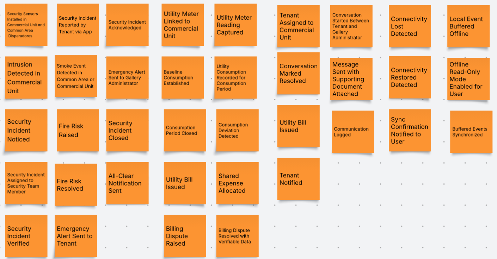

Como se muestra en la imagen, se construyeron los 39 Domain Events (naranja) a mayor nivel de profundidad de
los eventos ya validados en el Big Picture EventStorming.

**Paso 3: Agregar Commands**

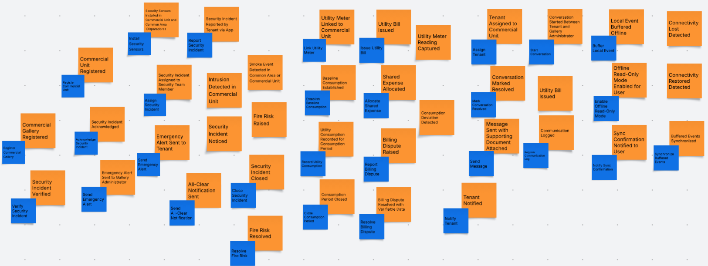

La imagen muestra los Commands (azul) agregados junto a cada Domain Event, representando la intención de acción,
en imperativo, que lo origina. Los eventos que provienen de un External System (sensores IoT en este caso) o que se derivan
automáticamente de una Policy no llevan Command propio, ya que no nacen de la decisión de un actor.

**Paso 4: Agregar Actors y Policies**

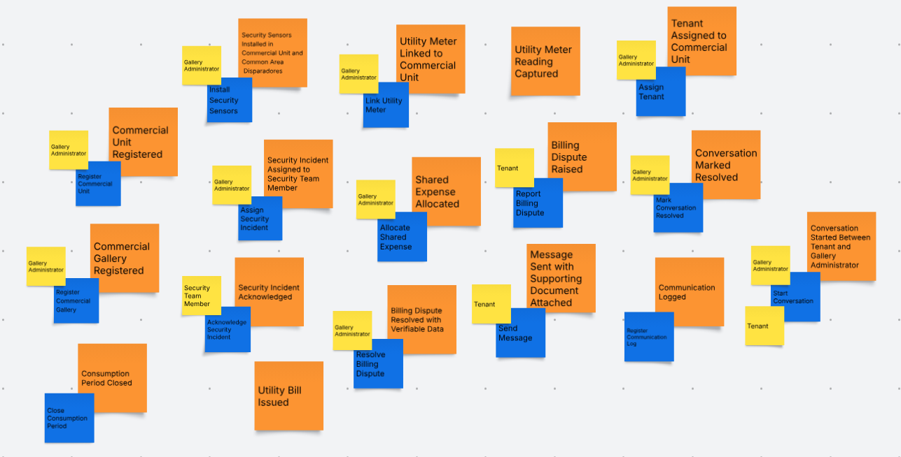

La imagen agrupa los eventos que nacen directamente de la decisión de un Actor (Gallery Administrator, Tenant o Security
Team Member) mediante su Command respectivo, por lo que no requieren una Policy: el propio actor decide y ejecuta la acción.

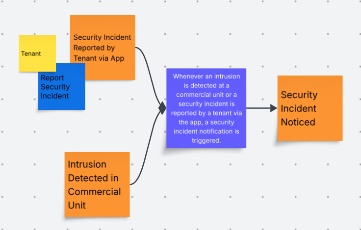

Policy que consolida las dos vías de detección de un incidente de seguridad (intrusión detectada por VanguardTech o
reporte directo del Tenant vía app) en el evento pivote Security Incident Noticed.

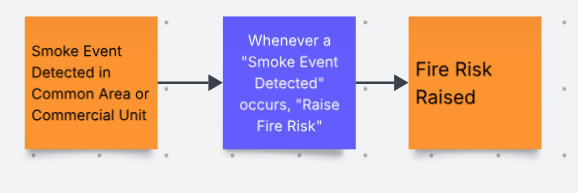

Policy que, ante la detección de humo, dispara automáticamente la evaluación del riesgo de incendio.

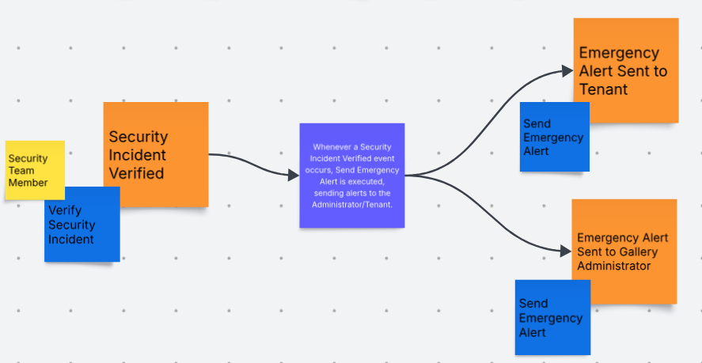

Una vez verificado el incidente por el Security Team Member, la Policy notifica en paralelo al Gallery Administrator y
al Tenant mediante la emisión de la alerta de emergencia.

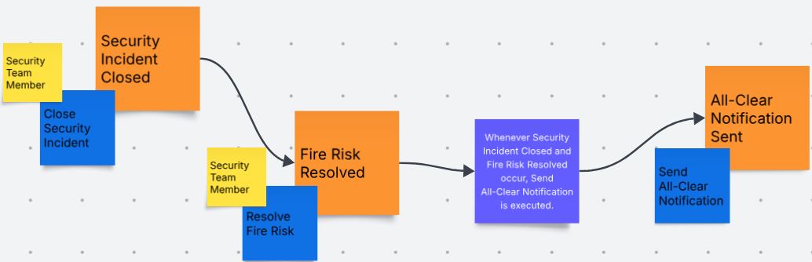

Policy de cierre: cuando el incidente de seguridad y el riesgo de incendio quedan resueltos, se envía de forma
automática la notificación de "todo despejado" (All-Clear).

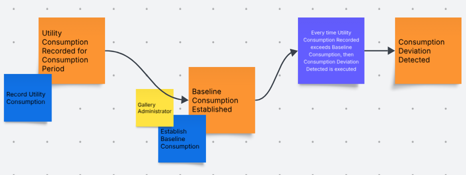

Policy que compara el consumo registrado contra la Baseline Consumption establecida y, si la excede, marca
automáticamente una desviación de consumo.

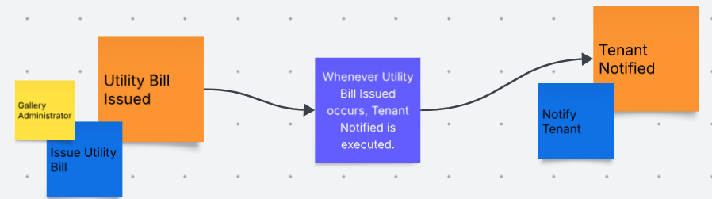

Policy que, al emitirse la factura (evento pivote Utility Bill Issued), notifica automáticamente al Tenant sin
intervención adicional del Gallery Administrator.

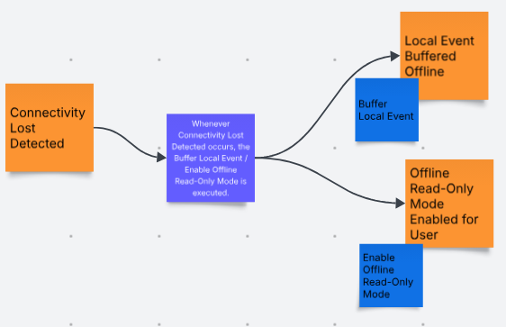

Ante la pérdida de conectividad (evento pivote), la Policy activa en paralelo el almacenamiento en búfer de eventos
locales y el modo de solo lectura sin conexión para el usuario.

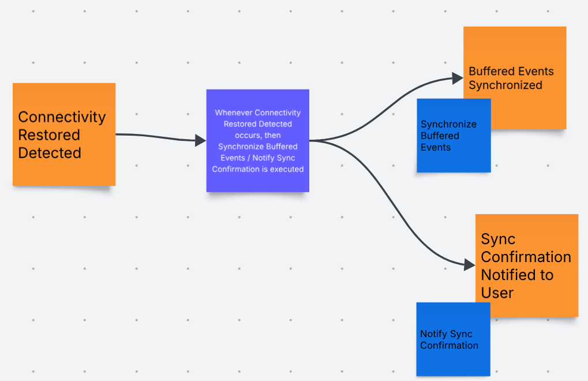

Al restablecerse la conectividad, la Policy sincroniza los eventos acumulados en el búfer y confirma al usuario que la
sincronización se completó.

**Paso 5: Read-models**

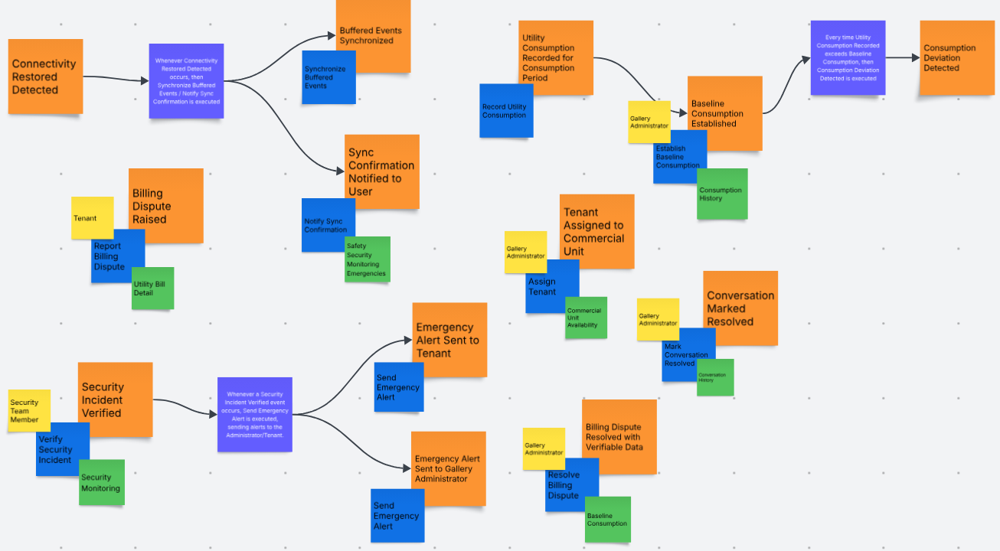

La imagen incorpora los Read Models (verde) en cada punto donde un actor necesita consultar información antes de ejecutar
su Command: Security Monitoring para el Security Team Member, Consumption History y Baseline Consumption para las
decisiones de facturación, y Commercial Unit Availability / Conversation History para Management-Tenant Communication.
Business Continuity no requiere ninguno, ya que todos sus eventos son automáticos.

**Paso 6: Read-models detallados**

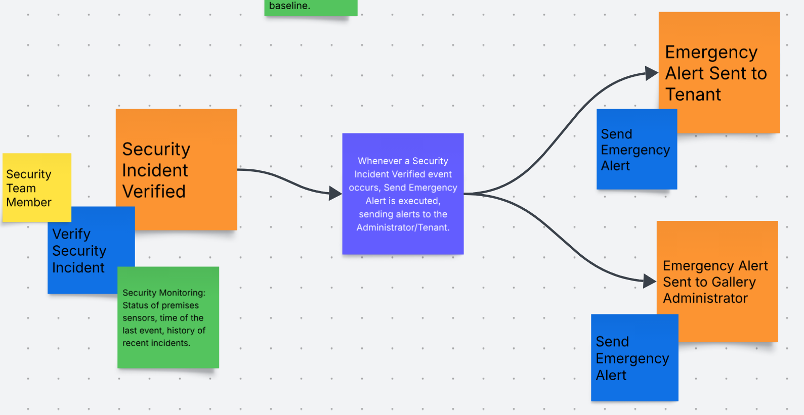

El Read Model Security Monitoring detalla el estado de los sensores del local, la hora del último evento y el historial
de incidentes recientes, información que el Security Team Member consulta antes de verificar un incidente.

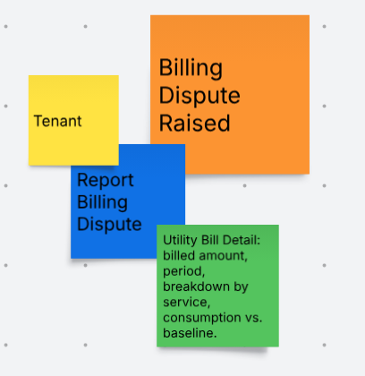

El Read Model Utility Bill Detail muestra el monto facturado, el período, el desglose por servicio y el consumo frente
a la Baseline, datos que el Tenant revisa antes de reportar una disputa de facturación.

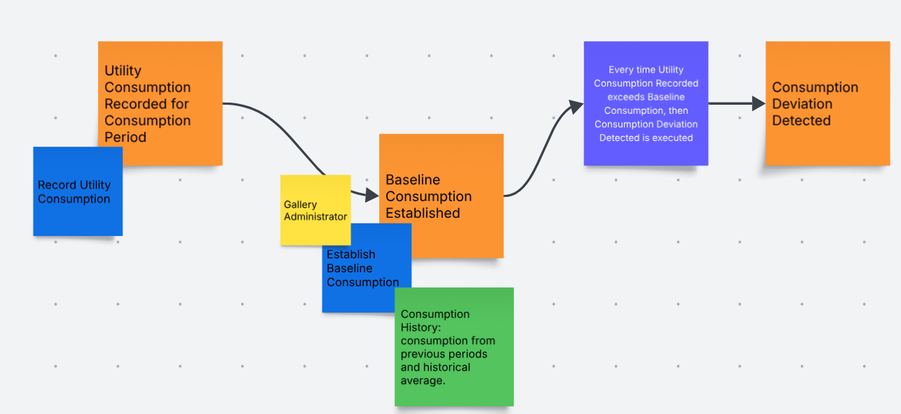

El Read Model Consumption History resume el consumo de periodos anteriores y el promedio histórico, insumo que el
Gallery Administrator utiliza para establecer la Baseline Consumption.

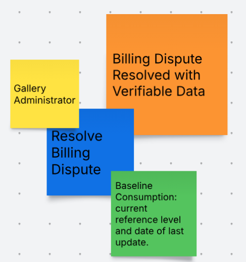

El Read Model Baseline Consumption expone el nivel de referencia vigente y la fecha de su última actualización,
dato verificable que el Gallery Administrator usa para resolver una disputa de facturación.

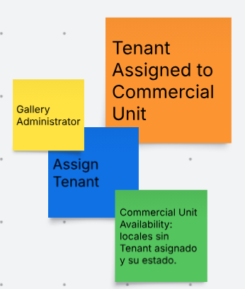

El Read Model Commercial Unit Availability lista los locales sin Tenant asignado y su estado,
información que el Gallery Administrator consulta antes de asignar un Tenant a una unidad.

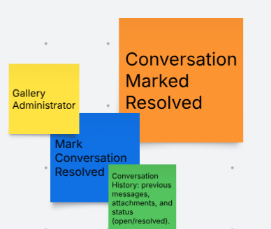

El Read Model Conversation History reúne los mensajes previos, adjuntos y el estado de la conversación, que el Gallery
Administrator revisa antes de marcarla como resuelta.

**Paso 7: Agregar External Systems**

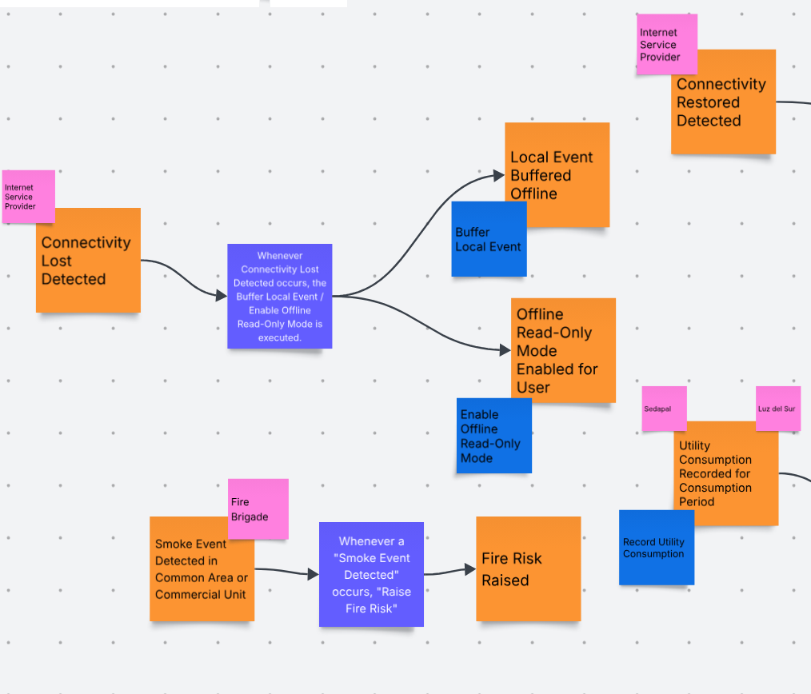

La imagen conecta cada evento originado fuera del control del equipo con su External System (rosado): Internet Service
Provider en la pérdida y restauración de conectividad, Fire Brigade en la detección de humo, y Sedapal / Luz del Sur en
el registro del consumo de servicios.

**Paso 8: Business Rules en Blanco**

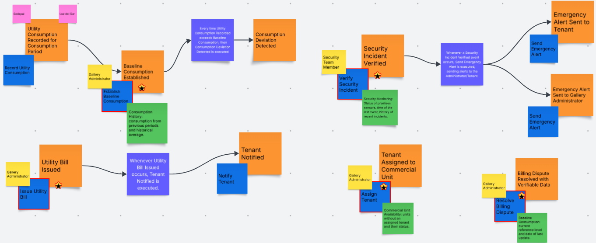

La imagen marca con una estrella los Commands que requieren una Business Rule explícita antes de ejecutarse: Establish Baseline Consumption,
Verify Security Incident, Issue Utility Bill y Assign Tenant. La redacción de cada regla se completa en el paso 9.

**Paso 9: Escribir los Business Rules**

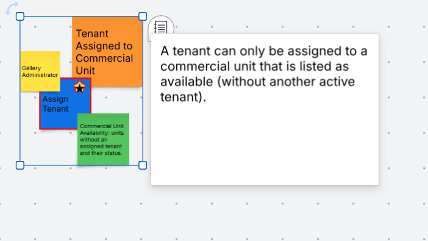

Business Rule de Assign Tenant: un Tenant solo puede asignarse a una Commercial Unit que figure como disponible
(sin otro Tenant activo asignado).

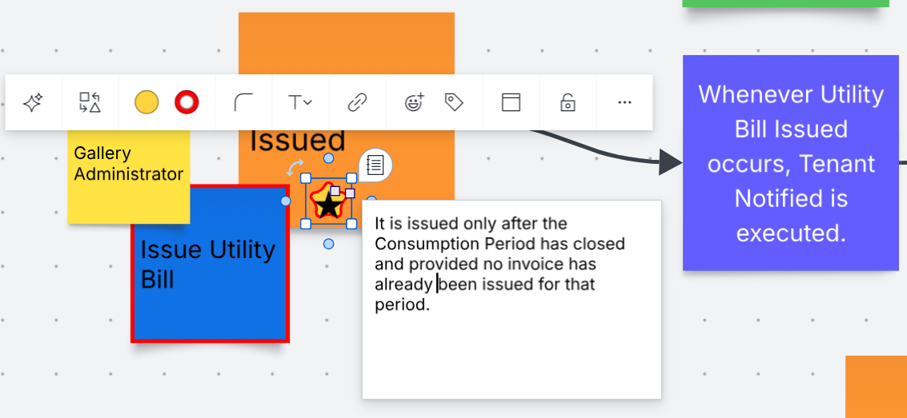

Business Rule de Issue Utility Bill: la factura solo se emite una vez cerrado el Consumption Period y siempre que no
exista ya una factura emitida para ese mismo período.

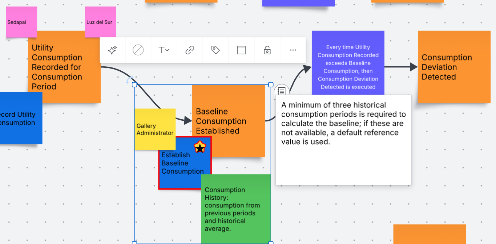

Business Rule de Establish Baseline Consumption: se requiere un mínimo de tres periodos históricos de consumo para
calcular la Baseline; si no están disponibles, se usa un valor de referencia por defecto.

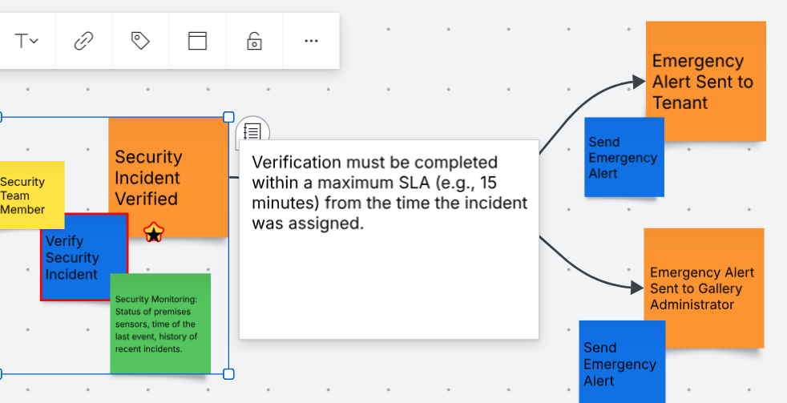

Business Rule de Verify Security Incident: la verificación debe completarse dentro de un SLA máximo (ej. 15 minutos)
desde que el incidente fue asignado al Security Team Member.

**Paso 10: Agrupación de los Business Rules**

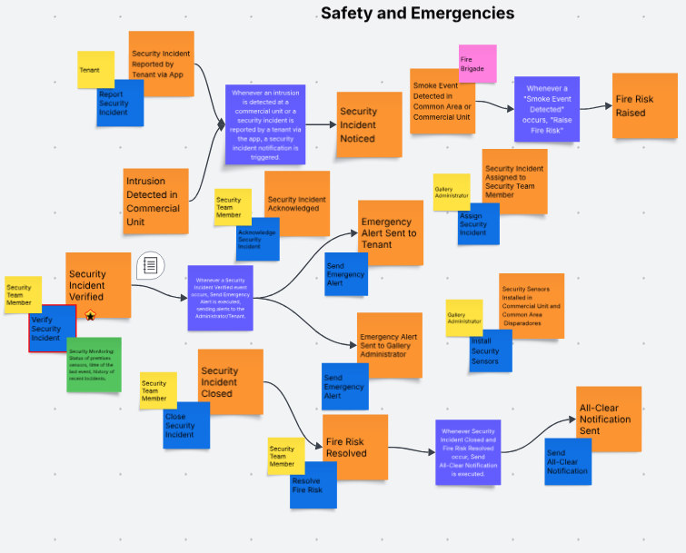

Agrupación completa del Bounded Context Safety and Emergencies: las dos vías de detección (intrusión y humo), la
verificación del incidente con su Business Rule de SLA, y el cierre con la notificación All-Clear.

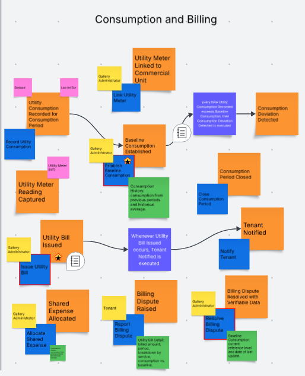

Agrupación completa del Bounded Context Consumption and Billing: desde el registro del consumo y el establecimiento de
la Baseline (con su Business Rule) hasta la emisión de la factura y la disputa de facturación.

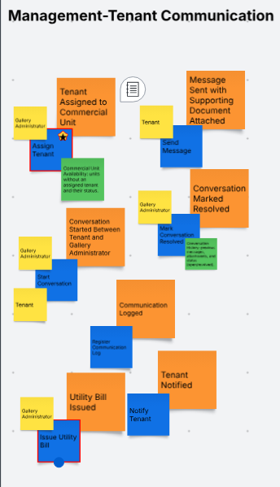

Agrupación completa del Bounded Context Management-Tenant Communication: la asignación del Tenant a su unidad, el
intercambio de mensajes y el registro de la comunicación derivada de la factura emitida.

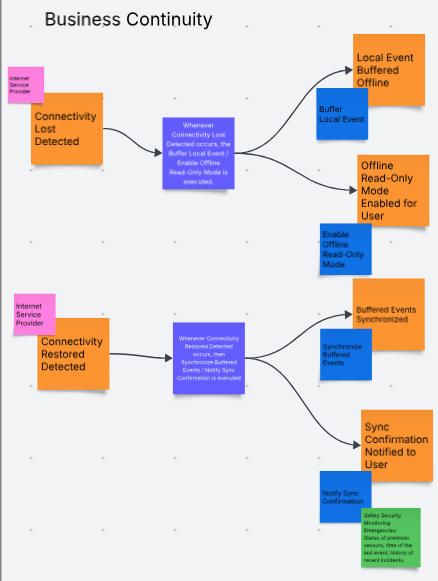

Agrupación completa del Bounded Context Business Continuity: la pérdida de conectividad con su respuesta de buffering y
modo offline, y la restauración con la sincronización de los eventos acumulados.

**Paso 11: Aggregates**

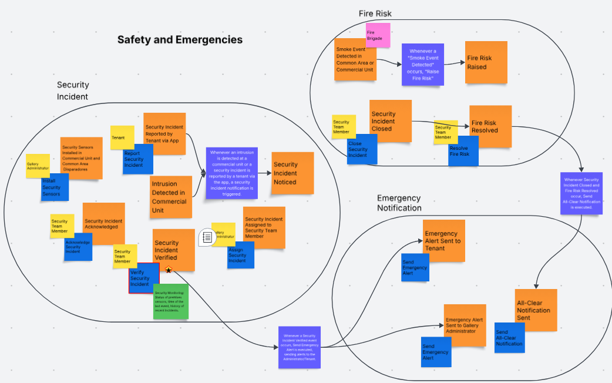

La imagen consolida el Bounded Context Safety and Emergencies en 3 Aggregates: Security Incident (desde la instalación de
sensores hasta la verificación del incidente), Fire Risk (la detección de humo y su resolución) y Emergency Notification
(el envío de alertas y la notificación All-Clear). Las dos Policies que cruzan de un Aggregate a otro permanecen en la
frontera entre los óvalos, ya que representan la comunicación entre Aggregates y no pertenecen a uno solo.

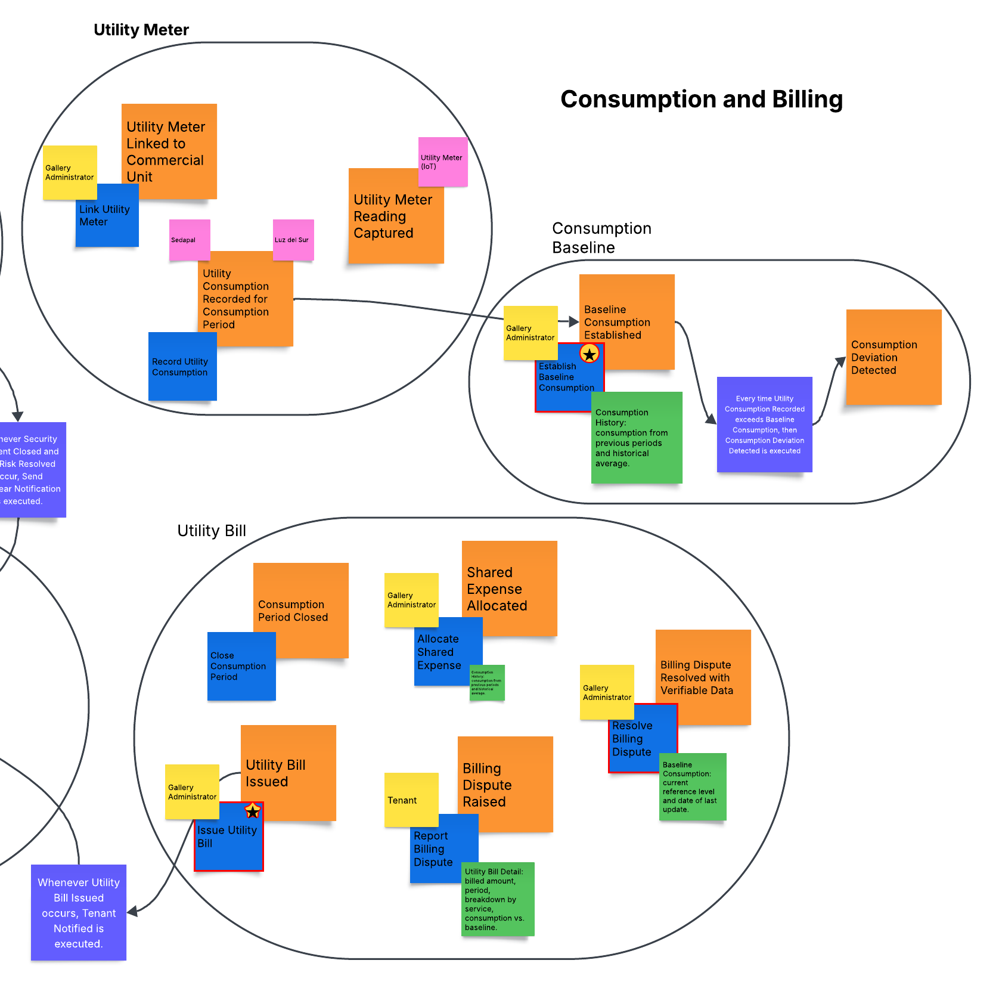

La imagen agrupa Consumption and Billing en 3 Aggregates: Utility Meter (la vinculación y captura del consumo del
medidor), Consumption Baseline (el establecimiento de la referencia y la detección de desviaciones) y Utility Bill
(desde el cierre del periodo hasta la emisión de la factura y la resolución de disputas). La única Policy que cruza de
un Aggregate a otro, de Utility Meter hacia Consumption Baseline, queda en el límite entre ambos óvalos.

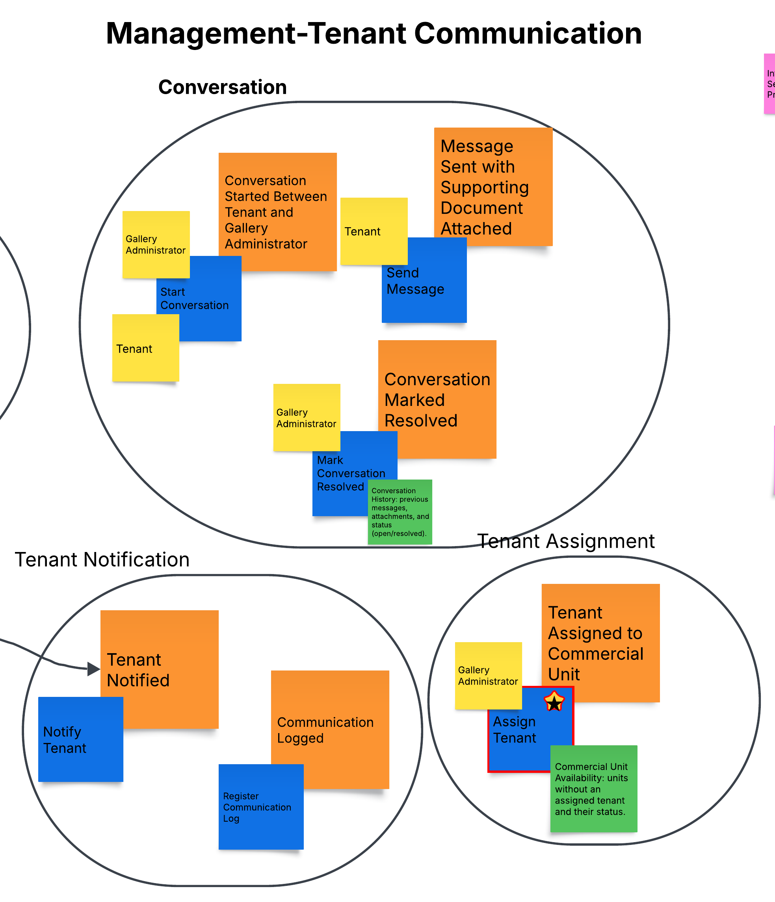

La imagen agrupa Management-Tenant Communication en 3 Aggregates: Tenant Assignment (la asignación del Tenant a su
unidad), Conversation (el intercambio de mensajes hasta su resolución) y Tenant Notification, que converge dos orígenes
distintos —la resolución de una conversación y la Policy cruzada desde Utility Bill Issued en Consumption and
Billing— en un único registro de comunicación.

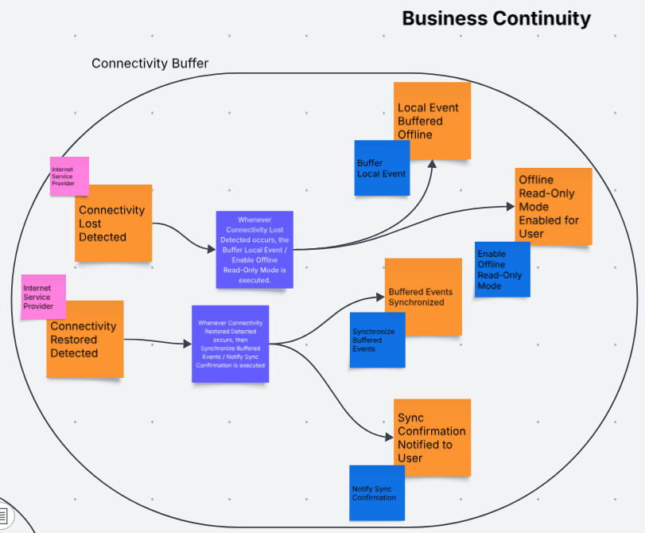

La imagen muestra Business Continuity como un único Aggregate, Connectivity Buffer, ya que la pérdida y la restauración
de conectividad son dos fases del mismo ciclo de vida y no requieren una frontera transaccional separada. Ambas
Policies quedan completamente dentro del óvalo, pues no cruzan hacia ningún otro Aggregate.

La imagen final consolida los 4 Bounded Contexts con los 10 Aggregates resultantes. Los eventos Commercial Unit
Registered y Commercial Gallery Registered permanecen fuera de los cuatro recuadros, ya que son precondiciones
compartidas —el alta de la unidad y de la galería comercial— que no pertenecen a ningún Bounded Context en particular,
siguiendo el mismo patrón con el que ya se habían presentado en el Big Picture EventStorming.

Con este paso concluye el **Design-Level EventStorming**. Partiendo de los 39 Domain Events identificados en el
Paso 2, se incorporaron sucesivamente los Commands, Actors, Policies, Read Models, External Systems y Business Rules
que dan soporte a los 4 Bounded Contexts candidatos —Safety and Emergencies, Consumption and Billing,
Management-Tenant Communication y Business Continuity— y se consolidaron en 10 Aggregates que constituyen la unidad
de consistencia transaccional del diseño. Este resultado sirve de base para el Candidate Context Discovery, el Domain
Message Flows Modeling y las Bounded Context Canvases desarrollados en las siguientes secciones.

#### 4.1.1.1. Candidate Context Discovery

Con el Design-Level EventStorming completo, el equipo realizó una sesión de **Candidate Context Discovery** de no más
de 2 horas, con el objetivo de transformar los Aggregates ya agrupados en Bounded Contexts candidatos formales. De las
tres técnicas propuestas por la guía de referencia, se aplicaron **look-for-pivotal-events** y **start-with-value**: la
primera porque los eventos pivote del dominio ya habían sido validados desde el Big Picture EventStorming, y la segunda
para identificar qué partes del dominio concentran el mayor valor de negocio y cuáles son capacidades propias de
cualquier plataforma SaaS que todavía no aparecían en el tablero. La primera parte de la sesión se trabajó sobre el
board de Lucid del Design-Level EventStorming y la segunda sobre un tablero de Miro, donde también se elaboraron los
Domain Message Flows y los Bounded Context Canvases de las secciones siguientes.

**Tablero de Miro:** [StorePulse - Strategic DDD (4.1.1)](https://miro.com/app/board/uXjVHkrMUxU=/)

**Paso 1: Look for Pivotal Events**

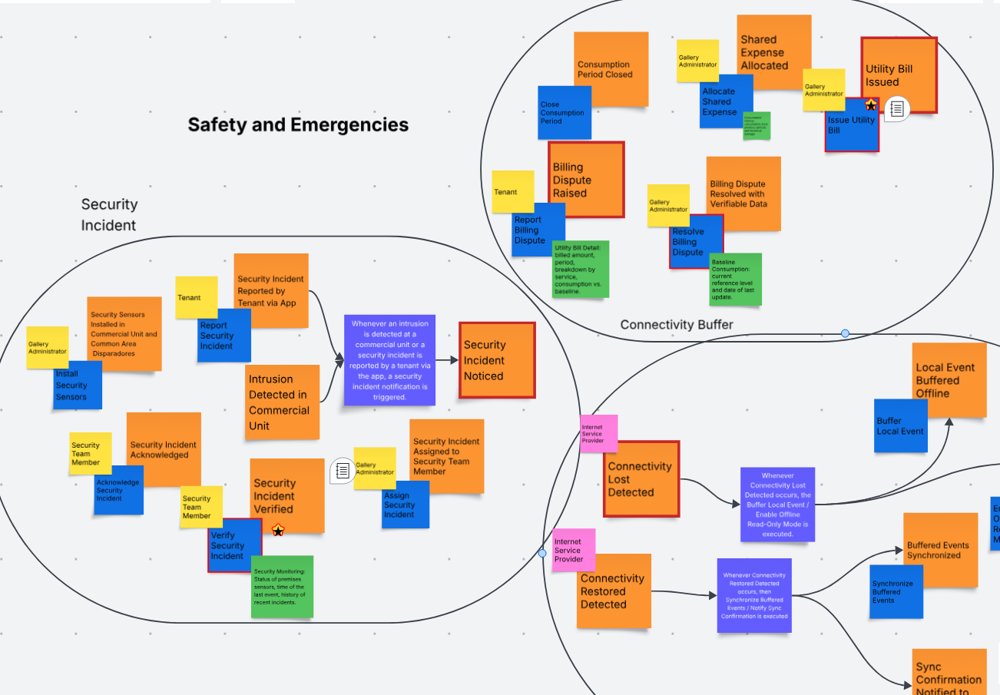

Sobre el board de detalle se volvieron a marcar los 4 eventos pivote ya identificados en el Big Picture
EventStorming (Security Incident Noticed, Billing Dispute Raised, Utility Bill Issued y Connectivity Lost Detected),
confirmando que cada uno sigue señalando, a este nivel de detalle, el mismo cambio de responsabilidad o de fase que
justificó su elección: de una detección externa a una responsabilidad interna (Security Incident Noticed), de la
iniciativa del Tenant a la de la administración (Billing Dispute Raised), del sistema externo a la interacción directa
con el Tenant (Utility Bill Issued), y de la conectividad normal a la operación en modo offline
(Connectivity Lost Detected).

**Paso 2: Delimitación de los primeros Bounded Contexts candidatos**

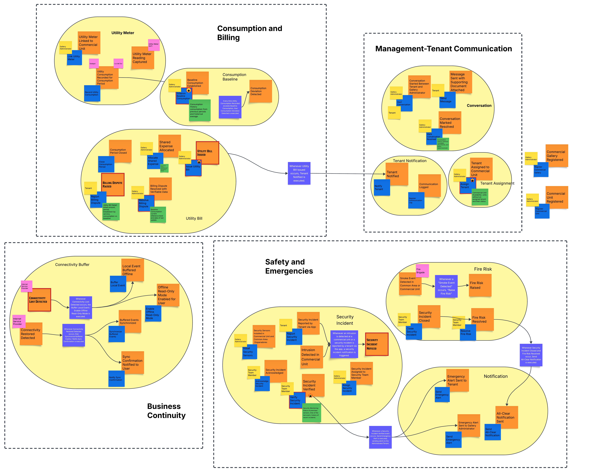

Usando los 4 eventos pivote como frontera, se trazó un contorno punteado alrededor de cada cluster de Aggregates,
obteniendo los primeros 4 Bounded Contexts candidatos: Safety and Emergencies, Consumption and Billing,
Management-Tenant Communication y Business Continuity. Las Policies que cruzan de un contexto a otro, como la que va de
Utility Bill Issued hacia Tenant Notification entre Consumption and Billing y Management-Tenant Communication, quedan
visiblemente en la frontera entre los contornos, evidenciando la comunicación entre Bounded Contexts.

**Paso 3: Revisión del punto de partida (eventos huérfanos y hotspots)**

Al revisar el resultado, el equipo encontró dos señales de que la descomposición estaba incompleta. La primera son los
eventos Commercial Gallery Registered y Commercial Unit Registered, que habían quedado fuera de los cuatro contornos
como "precondiciones compartidas": un evento de dominio sin contexto dueño es, en la práctica, un contexto que aún no
se ha descubierto. La segunda son cinco hotspots que ninguno de los cuatro contextos puede responder: quién registra y
autentica a Gallery Administrators y Tenants, cómo paga una galería por StorePulse (Stripe ya aparece en los diagramas
C4 pero no en ningún evento), quién es dueño de galerías, locales, sensores y medidores, dónde viven los perfiles y las
preferencias de notificación, y quién consolida los indicadores que verá el administrador en su dashboard.

**Paso 4: Start with Value y contraste con los sub-dominios comunes de una plataforma SaaS**

Para resolver los hotspots se aplicó **start-with-value**. Primero se confirmó qué partes del dominio tienen el mayor
valor para el negocio y luego se contrastó el tablero contra los sub-dominios que suelen aparecer en una plataforma
SaaS orientada a servicios. El resultado fue el siguiente:

| Sub-dominio SaaS | Bounded Context candidato en StorePulse | Resultado |
|---|---|---|
| Service Execution and Monitoring | Safety and Emergencies; Consumption and Billing; Business Continuity | Ya identificado |
| Loyalty and Engagement | Management-Tenant Communication | Ya identificado |
| Identity and Access Management | Identity and Access Management | Nuevo candidato |
| Profiles and Preferences Management | Profiles and Preferences | Nuevo candidato |
| Subscriptions and Payment Management | Subscriptions and Payments | Nuevo candidato |
| Resource and Asset Management | Asset and Device Management | Nuevo candidato |
| Dashboard and Analytics | Dashboard and Analytics | Nuevo candidato |
| Service Design and Planning | Consumption and Billing; Asset and Device Management | Absorbido |

Service Design and Planning no se modeló como contexto propio: las únicas decisiones de planificación del dominio son
el establecimiento de la Baseline Consumption, que ya pertenece a Consumption and Billing, y la configuración de los
dispositivos, que pertenece a Asset and Device Management.

**Paso 5: Modelado de los nuevos contextos candidatos sobre el EventStorm**

Cada hotspot se resolvió agregando al EventStorm los Actors, Commands, Domain Events, Policies, External Systems y
Aggregates que faltaban, con la misma notación del Design-Level EventStorming:

- **Identity and Access Management:** Sign Up, Sign In, Assign Role, Invite Tenant y Activate Account, sobre los
  Aggregates User e Invitation. El Tenant no se registra por su cuenta: una Policy lo invita cuando es asignado a un
  local.
- **Profiles and Preferences:** Create Profile (disparado por una Policy al registrarse el usuario), Update Profile y
  Update Notification Preferences, sobre los Aggregates Profile y Notification Preference.
- **Subscriptions and Payments:** Select Plan, Process Payment, Activate Subscription, Renew Subscription y Cancel
  Subscription, con Stripe como External System, sobre los Aggregates Subscription y Payment.
- **Asset and Device Management:** adopta los dos eventos huérfanos (Commercial Gallery Registered y Commercial Unit
  Registered) y suma Register IoT Device y Link Device to Commercial Unit. Además recibe el Aggregate Tenant
  Assignment, que en el Design-Level EventStorming había quedado dentro de Management-Tenant Communication: asignar un
  inquilino a un local es una decisión sobre el inmueble y no un acto de comunicación, y su regla de negocio (un local
  solo admite un Tenant activo) depende del registro de locales.
- **Dashboard and Analytics:** Record Incident Metric y Record Consumption Metric, disparados por Policies que escuchan
  eventos de otros contextos, y Generate Dashboard Report, sobre los Aggregates Gallery Metric y Dashboard Report.

**Paso 6: Bounded Contexts candidatos finales y sus conexiones**

La sesión cerró con 9 Bounded Contexts candidatos y las conexiones entre ellos. Las flechas del diagrama representan
los mensajes que cruzan una frontera de contexto: eventos de dominio (naranja), commands (azul) y queries (verde).
Identity and Access Management autentica además todas las solicitudes hacia los demás contextos; esas flechas no se
dibujaron para mantener legible el mapa.

| Bounded Context | Clasificación | Justificación |
|---|---|---|
| Safety and Emergencies | Core Domain | La detección y respuesta automática ante intrusiones e incendios es el diferencial del producto y la principal razón de compra del administrador. |
| Consumption and Billing | Core Domain | La facturación sustentada en consumo medido responde al dolor que el 100% de los inquilinos entrevistados reportó (falta de transparencia en el prorrateo) y no se resuelve con software genérico. |
| Management-Tenant Communication | Supporting Subdomain | Necesario para entregar alertas, facturas y conversaciones documentadas, pero sin lógica diferenciadora. |
| Asset and Device Management | Supporting Subdomain | Registro de galerías, locales, inquilinos asignados y dispositivos IoT; habilita a los dos contextos core. |
| Subscriptions and Payments | Supporting Subdomain | Monetización de la plataforma; la lógica de cobro se delega a Stripe. |
| Dashboard and Analytics | Supporting Subdomain | Indicadores para el administrador, derivados de eventos de otros contextos. |
| Identity and Access Management | Generic Subdomain | Problema resuelto en la industria; reemplazable por un proveedor de identidad. |
| Profiles and Preferences | Generic Subdomain | Datos personales y preferencias de notificación, sin reglas propias del negocio. |
| Business Continuity | Generic Subdomain | Resiliencia ante pérdida de conectividad mediante un patrón estándar de store-and-forward en el Edge. |

Respecto a la primera delimitación, la sesión produjo tres cambios: se agregaron cinco contextos, el Aggregate Tenant
Assignment pasó de Management-Tenant Communication a Asset and Device Management, y Consumption and Billing se
reclasificó de Supporting a Core al aplicar start-with-value con la evidencia de las entrevistas. Estos 9 Bounded
Contexts son la base del Domain Message Flows Modeling y de los Bounded Context Canvases.

#### 4.1.1.2. Domain Message Flows Modeling

En esta sección se visualiza cómo colaboran los Bounded Contexts para resolver los casos que se presentan a los
usuarios de StorePulse. Para ello se aplicó la técnica de **Domain Storytelling**: cada escenario se narra como una
historia con actores, en la que cada paso lleva un número que indica el orden en que ocurre. Sobre esa narración se usó
la notación de Domain Message Flow, en la que cada flecha es un mensaje entre un actor, un Bounded Context o un sistema
externo: **command** (azul), **domain event** (naranja) o **query** (verde). Los actores se muestran en amarillo, los
sistemas externos en rosado y los Bounded Contexts con el color de su clasificación (core en naranja, supporting en
celeste, generic en gris).

Se modelaron 7 escenarios, elegidos para cubrir los dos contextos core, el ciclo de vida de la cuenta y el caso de
pérdida de conectividad.

**Scenario 1: Sign up and subscribe to a plan**

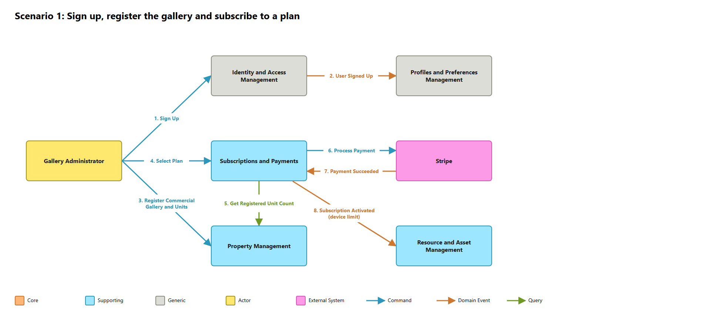

El Gallery Administrator se registra en Identity and Access Management (1), que publica User Signed Up para que
Profiles and Preferences cree su perfil (2). Luego selecciona un plan en Subscriptions and Payments (3), que envía el
command Process Payment a Stripe (4). Cuando Stripe responde Payment Succeeded (5), el contexto activa la suscripción y
publica Subscription Activated (6), con lo que Identity and Access Management habilita las funciones de administrador.

**Scenario 2: Onboard the gallery, its devices and a tenant**

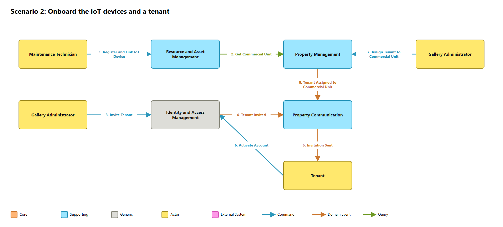

El Gallery Administrator registra la galería y sus locales en Asset and Device Management (1) y el Maintenance
Technician registra y vincula los dispositivos IoT (2). Al asignar un inquilino a un local (3), el contexto publica
Tenant Assigned to Commercial Unit (4). Identity and Access Management reacciona creando una invitación y publicando
Tenant Invited (5), que Management-Tenant Communication entrega al Tenant como mensaje (6). El Tenant activa su cuenta
(7) y el evento Tenant Account Activated dispara la creación de su perfil (8).

**Scenario 3: Intrusion detected and emergency alert**

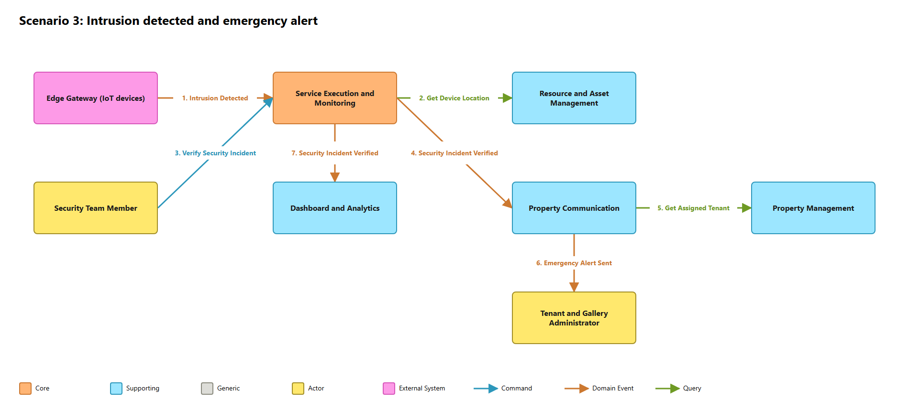

El Edge Gateway reporta Intrusion Detected a Safety and Emergencies (1), que consulta a Asset and Device Management a
qué local e inquilino pertenece el dispositivo (2). El Security Team Member verifica el incidente (3) y el contexto
publica Emergency Alert Issued (4). Management-Tenant Communication consulta las preferencias de notificación en
Profiles and Preferences (5) y envía la notificación push al Tenant afectado y al Gallery Administrator (6).

**Scenario 4: Smoke event, fire risk and all-clear**

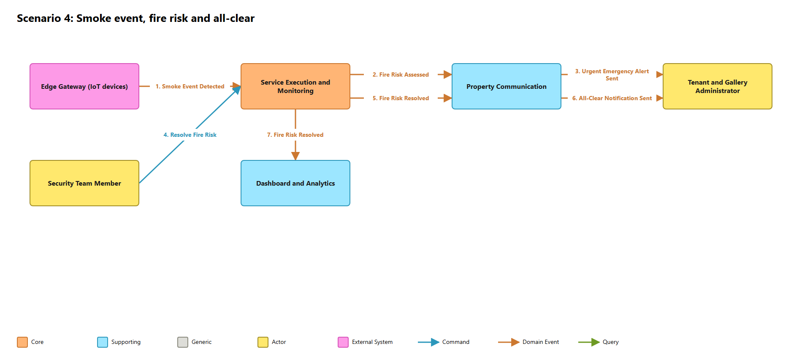

Ante un Smoke Event Detected (1), Safety and Emergencies evalúa el riesgo de incendio de forma automática y emite la
alerta sin esperar verificación humana (2), que Management-Tenant Communication entrega como notificación urgente (3).
Cuando el Security Team Member resuelve el riesgo (4), el contexto publica All-Clear Notified (5). La entrega de la
notificación se publica como Emergency Notification Delivered (6), que Dashboard and Analytics usa para calcular el
tiempo de respuesta.

**Scenario 5: Consumption recorded and utility bill issued**

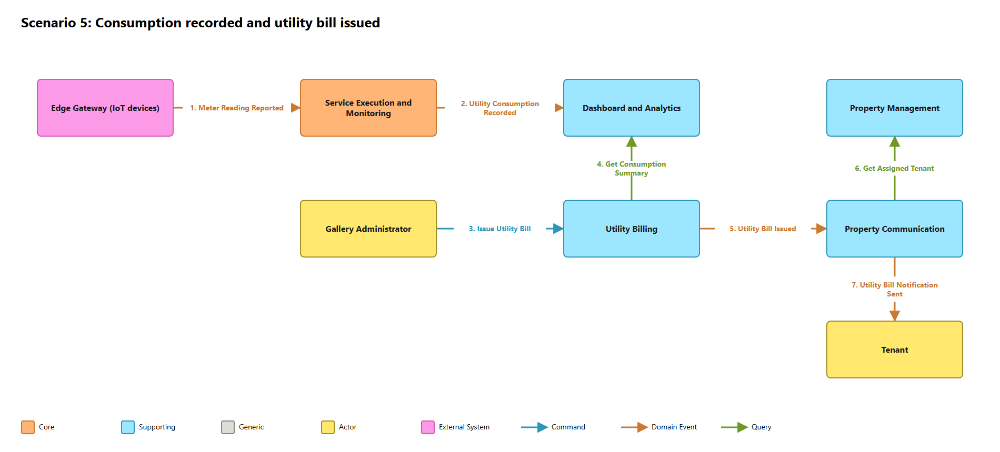

El Edge Gateway envía las lecturas de los medidores (1) y Consumption and Billing publica Utility Consumption Recorded,
que alimenta las tendencias de Dashboard and Analytics (2). Cerrado el periodo, el Gallery Administrator emite la
factura (3) y el contexto publica el evento pivote Utility Bill Issued (4). Management-Tenant Communication consulta las
preferencias del Tenant (5) y le notifica la factura sin intervención adicional del administrador (6).

**Scenario 6: Billing dispute raised and resolved**

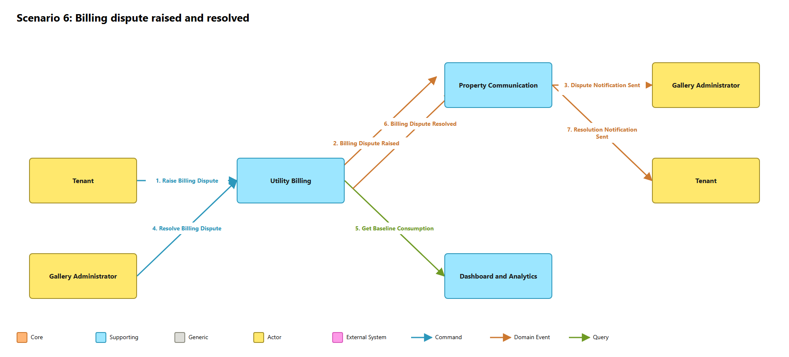

El Tenant levanta una disputa desde la aplicación móvil (1). Consumption and Billing publica el evento pivote Billing
Dispute Raised (2) y Management-Tenant Communication notifica al Gallery Administrator (3). A partir de ese punto la
responsabilidad pasa a la administración, que resuelve la disputa usando como evidencia la Baseline Consumption y las
lecturas del medidor (4). El evento Billing Dispute Resolved cierra la conversación y notifica al Tenant (5).

**Scenario 7: Connectivity lost and buffered events synchronized**

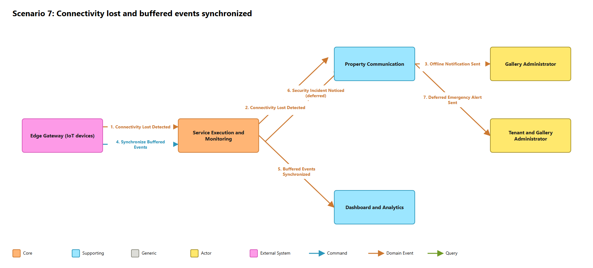

Cuando se detecta la pérdida de conectividad (1), Business Continuity sigue recibiendo las lecturas del Edge Gateway y
las almacena en el buffer local (2). Al restablecerse la conexión (3), sincroniza los eventos acumulados hacia Safety
and Emergencies (4) y Consumption and Billing (5), conservando su fecha y hora originales. Si entre los eventos
sincronizados hay un incidente, Safety and Emergencies emite la alerta correspondiente de forma diferida (6).

#### 4.1.1.3. Bounded Context Canvases

Con los flujos de mensajes definidos, el equipo diseñó cada Bounded Context candidato mediante un **Bounded Context
Canvas**, tomándolos por orden de importancia: primero los dos contextos core, luego los supporting y finalmente los
generic. Cada canvas se elaboró de forma iterativa siguiendo estos pasos:

1. **Context Overview Definition:** nombre, propósito y clasificación estratégica (dominio, modelo de negocio y
   evolución) y roles de dominio.
2. **Business Rules Distillation & Ubiquitous Language Capture:** se trasladaron las Business Rules del Design-Level
   EventStorming y los términos del Ubiquitous Language (sección 2.5) que pertenecen a cada contexto.
3. **Capability Analysis:** los Commands y Queries que el contexto atiende y los eventos que publica, tomados de los
   Domain Message Flows.
4. **Capability Layering:** no fue necesario aplicarlo; ningún contexto reunió capacidades suficientes como para
   separarlas en capas.
5. **Dependencies Capture:** cada mensaje entrante y saliente se anotó con el actor, contexto o sistema externo del que
   proviene o al que se dirige. En los canvases, (C) indica command, (E) domain event y (Q) query.
6. **Design Critique:** revisión cruzada entre los integrantes; las dudas que no se resolvieron quedaron registradas
   como Open Questions en cada canvas.

##### Safety and Emergencies

Es el **Core Domain** principal de StorePulse. Actúa como Execution Context del ciclo de vida del incidente, como
Analysis Context al evaluar el riesgo de incendio y como Enforcer del SLA de verificación de 15 minutos. Depende de
Asset and Device Management para saber a qué local e inquilino corresponde cada dispositivo y entrega sus alertas a
través de Management-Tenant Communication. En la crítica de diseño se discutió si las notificaciones debían vivir aquí;
se decidió que el contexto solo decide cuándo se emite una alerta, mientras que la entrega es responsabilidad de
Management-Tenant Communication.

##### Consumption and Billing

Segundo **Core Domain**. Registra el consumo medido, mantiene la Baseline Consumption y emite facturas sustentadas en
lecturas reales. Cumple además un rol de Audit Context, ya que conserva la evidencia con la que se resuelven las
disputas. El cobro del dinero de la factura quedó explícitamente fuera de alcance, tal como se había delimitado en el
Big Picture EventStorming.

##### Management-Tenant Communication

**Supporting Subdomain** con rol de Funnel Context: recibe eventos de Safety and Emergencies, Consumption and Billing e
Identity and Access Management y los convierte en notificaciones y conversaciones documentadas. Es también Gateway
Context hacia el proveedor de notificaciones push. Tras la sesión de discovery dejó de contener el Aggregate Tenant
Assignment.

##### Asset and Device Management

**Supporting Subdomain** que describe lo que StorePulse monitorea: galerías, locales, áreas comunes, el Tenant asignado
a cada local y los dispositivos IoT vinculados. Es el contexto más consultado por los dos contextos core, por lo que su
modelo debe mantenerse estable. Asignar un inquilino siempre origina una invitación en Identity and Access Management.

##### Identity and Access Management

**Generic Subdomain** con rol de Enforcer Context: todos los demás contextos obedecen sus reglas de acceso. Sus dos
decisiones más relevantes para el negocio son que el Tenant solo ingresa mediante invitación y que las funciones de
administrador dependen de que la suscripción de la galería esté activa. Su diseño táctico se desarrolla en la
sección 4.2.1.

##### Subscriptions and Payments

**Supporting Subdomain** orientado a ingresos y Gateway Context hacia Stripe: aísla el modelo del proveedor para que el
resto de la plataforma solo conozca los eventos Subscription Activated y Subscription Cancelled. Queda como pregunta
abierta si una empresa peruana puede operar Stripe directamente o si se requiere una pasarela local.

##### Dashboard and Analytics

**Supporting Subdomain** con rol de Analysis Context. No recibe Commands de negocio, salvo la solicitud de un reporte:
sus métricas se derivan únicamente de eventos publicados por otros contextos, lo que evita cargar a los contextos
operativos con consultas de reportería.

##### Profiles and Preferences

**Generic Subdomain**. Mantiene los datos personales y las preferencias de notificación. Su regla más importante
protege al contexto core: las alertas de emergencia no pueden desactivarse desde las preferencias.

##### Business Continuity

**Generic Subdomain** y Gateway Context entre el Edge y la nube. Todos sus eventos son automáticos, por lo que no
recibe Commands de ningún actor. Garantiza que los eventos capturados sin conexión lleguen a Safety and Emergencies y a
Consumption and Billing con su fecha y hora originales, en orden cronológico y sin duplicados.
