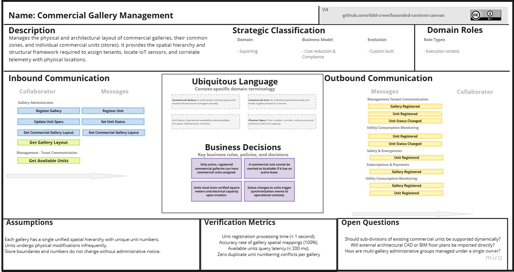
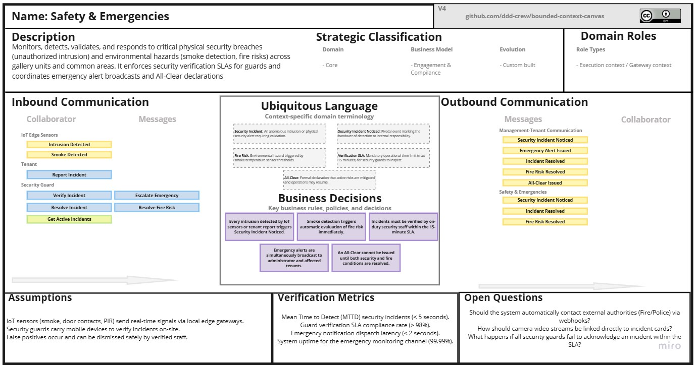
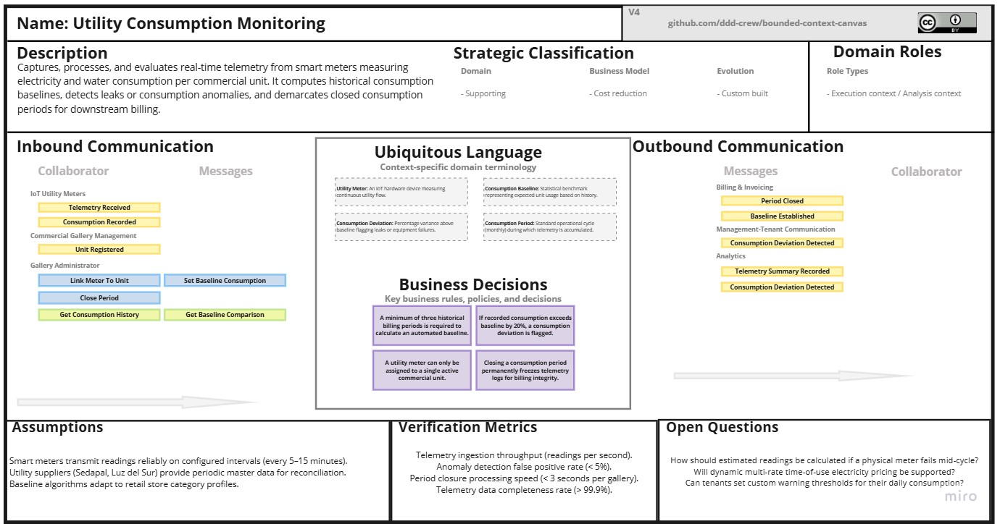
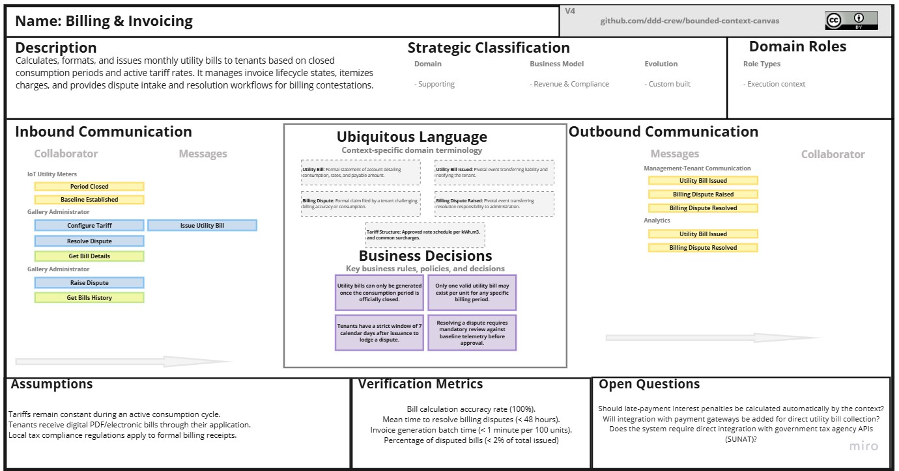
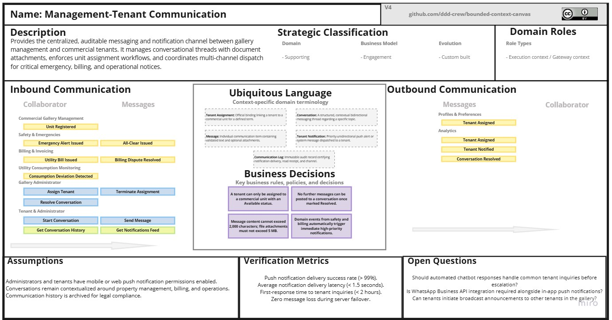
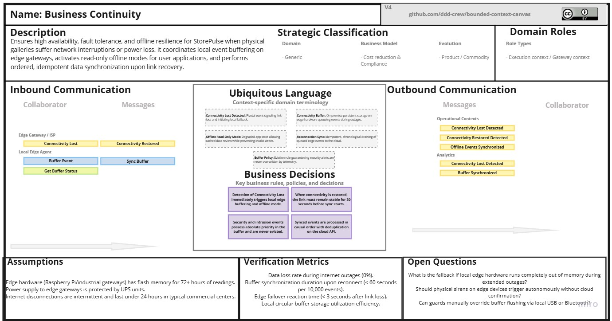
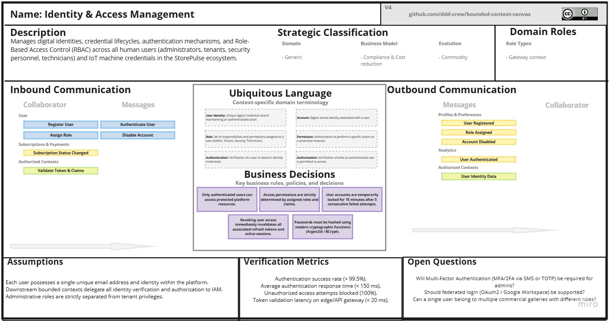
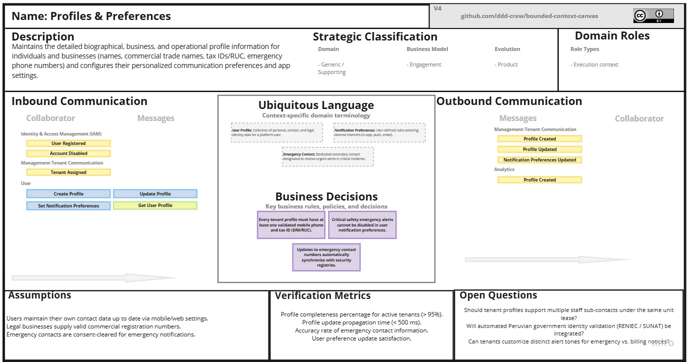
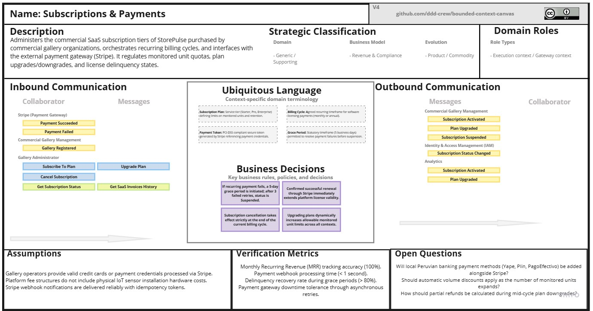
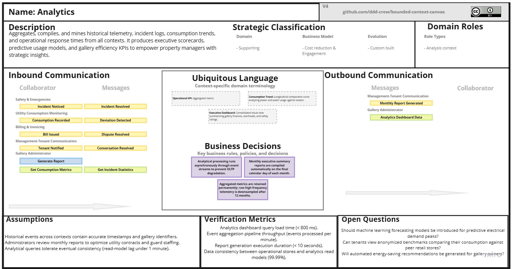

# Capítulo IV: Solution Software Design

## 4.1. Strategic-Level Domain-Driven Design

En esta sección se describirá y explicará el proceso realizado para la toma de decisiones
a nivel estratégico para StorePulse, con la aplicación de Domain Driven Design 
sobre el dominio de los anteriores capítulos. El principal objetivo de esta sección 
es el descomponer el sistema en subconjuntos limitados o *Bounded Contexts*, en el que se 
evidenciará el proceso del *Event Storming* y el *Bounded Context Canvas* con el fin de 
definir las relaciones estructurales que hay entre los diferentes contextos y la arquitectura 
de software que lo soportará. 

### 4.1.1. Design-Level EventStorming

En esta sección el equipo explica y pone en evidencia el proceso de **Design-Level EventStorming**, con
el fin de plantear una primera aproximación revisada y mejorada al modelado de nivel general para el
dominio de StorePulse, buscando a partir de ahí identificar el mayor nivel de detalle posible sobre los
eventos de dominio significativos ya capturados en el *Big Picture EventStorming* y el
*Ubiquitous Language*.

Para la construcción del Design-Level EventStorming, el equipo siguió la guía de facilitación de referencia
[Guía de Design-Level Event Storming](https://www.eventstormingjournal.com/software%20design/design-level-event-storming-in-3-minutes/),
trabajando enteramente con notas adhesivas sobre el tablero
colaborativo de Lucid, sin recurrir a herramientas de diseño visual. El proceso inició generando los Domain Events
(naranja) que detallan, a nivel de diseño, los eventos ya validados en el Big Picture EventStorming; a partir de ahí
se incorporaron los Commands (azul) que los originan y los Actores y Policies (amarillo/morado) responsables de
ejecutarlos. Luego se agregaron los Read Models (verde), simples bocetos de la información que un actor necesita
antes de decidir y no un diseño de interfaz, junto con los External Systems (rosado) ajenos al control del equipo. Finalmente,
se redactaron las Business Rules asociadas a cada Policy y se agruparon los Commands y Events relacionados bajo
Aggregates con nombre propio, completando así el nivel de detalle exigido por la sesión.

**Paso 1: Presentar el diseño objetivo**

Antes de abordar el dominio de negocio, se presenta el patrón visual y
la gramática de notación que se utilizará durante toda la sesión, de forma que todos los miembros compartan
el mismo lenguaje visual desde el inicio, siguiendo la guía de facilitación de referencia.

> **Actor → Command → Aggregate/Event → Policy → Command → Event**

| Elemento | Color / forma en Lucid | Descripción |
|---|---|---|
| Domain Event | Nota naranja | Hecho relevante del dominio, redactado en pasado (ej. *Security Incident Noticed*). |
| Actor / Rol | Nota amarilla pequeña | Persona o rol que ejecuta un Command (ej. *Gallery Administrator*, *Tenant*). |
| Command | Nota azul | Intención de acción de un actor o sistema, redactada en imperativo. |
| Policy | Nota morada/violeta | Reacción automática del negocio ante un evento, con la forma "Cada vez que X, entonces Y". |
| Read Model | Nota verde | Información que un actor necesita consultar antes de emitir un Command. |
| External System | Nota rosada (grande) | Sistema externo fuera del control del equipo. |
| Aggregate | Nota amarilla grande | Agrupación de Commands y Events que comparten ciclo de vida y consistencia transaccional. |
| Bounded Context | Contorno punteado | Límite candidato que agrupa Aggregates, Commands, Events y Policies con lenguaje y responsabilidad cohesivos. |

**Paso 2: Generar Domain Events**

Como se muestra en la imagen, se construyeron los 39 Domain Events (naranja) a mayor nivel de profundidad de
los eventos ya validados en el Big Picture EventStorming.

**Paso 3: Agregar Commands**

La imagen muestra los Commands (azul) agregados junto a cada Domain Event, representando la intención de acción,
en imperativo, que lo origina. Los eventos que provienen de un External System (sensores IoT en este caso) o que se derivan
automáticamente de una Policy no llevan Command propio, ya que no nacen de la decisión de un actor.

**Paso 4: Agregar Actors y Policies**

La imagen agrupa los eventos que nacen directamente de la decisión de un Actor (Gallery Administrator, Tenant o Security
Team Member) mediante su Command respectivo, por lo que no requieren una Policy: el propio actor decide y ejecuta la acción.

Policy que consolida las dos vías de detección de un incidente de seguridad (intrusión detectada por VanguardTech o
reporte directo del Tenant vía app) en el evento pivote Security Incident Noticed.

Policy que, ante la detección de humo, dispara automáticamente la evaluación del riesgo de incendio.

Una vez verificado el incidente por el Security Team Member, la Policy notifica en paralelo al Gallery Administrator y
al Tenant mediante la emisión de la alerta de emergencia.

Policy de cierre: cuando el incidente de seguridad y el riesgo de incendio quedan resueltos, se envía de forma
automática la notificación de "todo despejado" (All-Clear).

Policy que compara el consumo registrado contra la Baseline Consumption establecida y, si la excede, marca
automáticamente una desviación de consumo.

Policy que, al emitirse la factura (evento pivote Utility Bill Issued), notifica automáticamente al Tenant sin
intervención adicional del Gallery Administrator.

Ante la pérdida de conectividad (evento pivote), la Policy activa en paralelo el almacenamiento en búfer de eventos
locales y el modo de solo lectura sin conexión para el usuario.

Al restablecerse la conectividad, la Policy sincroniza los eventos acumulados en el búfer y confirma al usuario que la
sincronización se completó.

**Paso 5: Read-models**

La imagen incorpora los Read Models (verde) en cada punto donde un actor necesita consultar información antes de ejecutar
su Command: Security Monitoring para el Security Team Member, Consumption History y Baseline Consumption para las
decisiones de facturación, y Commercial Unit Availability / Conversation History para Management-Tenant Communication.
Business Continuity no requiere ninguno, ya que todos sus eventos son automáticos.

**Paso 6: Read-models detallados**

El Read Model Security Monitoring detalla el estado de los sensores del local, la hora del último evento y el historial
de incidentes recientes, información que el Security Team Member consulta antes de verificar un incidente.

El Read Model Utility Bill Detail muestra el monto facturado, el período, el desglose por servicio y el consumo frente
a la Baseline, datos que el Tenant revisa antes de reportar una disputa de facturación.

El Read Model Consumption History resume el consumo de periodos anteriores y el promedio histórico, insumo que el
Gallery Administrator utiliza para establecer la Baseline Consumption.

El Read Model Baseline Consumption expone el nivel de referencia vigente y la fecha de su última actualización,
dato verificable que el Gallery Administrator usa para resolver una disputa de facturación.

El Read Model Commercial Unit Availability lista los locales sin Tenant asignado y su estado,
información que el Gallery Administrator consulta antes de asignar un Tenant a una unidad.

El Read Model Conversation History reúne los mensajes previos, adjuntos y el estado de la conversación, que el Gallery
Administrator revisa antes de marcarla como resuelta.

**Paso 7: Agregar External Systems**

La imagen conecta cada evento originado fuera del control del equipo con su External System (rosado): Internet Service
Provider en la pérdida y restauración de conectividad, Fire Brigade en la detección de humo, y Sedapal / Luz del Sur en
el registro del consumo de servicios.

**Paso 8: Business Rules en Blanco**

La imagen marca con una estrella los Commands que requieren una Business Rule explícita antes de ejecutarse: Establish Baseline Consumption,
Verify Security Incident, Issue Utility Bill y Assign Tenant. La redacción de cada regla se completa en el paso 9.

**Paso 9: Escribir los Business Rules**

Business Rule de Assign Tenant: un Tenant solo puede asignarse a una Commercial Unit que figure como disponible
(sin otro Tenant activo asignado).

Business Rule de Issue Utility Bill: la factura solo se emite una vez cerrado el Consumption Period y siempre que no
exista ya una factura emitida para ese mismo período.

Business Rule de Establish Baseline Consumption: se requiere un mínimo de tres periodos históricos de consumo para
calcular la Baseline; si no están disponibles, se usa un valor de referencia por defecto.

Business Rule de Verify Security Incident: la verificación debe completarse dentro de un SLA máximo (ej. 15 minutos)
desde que el incidente fue asignado al Security Team Member.

**Paso 10: Agrupación de los Business Rules**

Agrupación completa del Bounded Context Safety and Emergencies: las dos vías de detección (intrusión y humo), la
verificación del incidente con su Business Rule de SLA, y el cierre con la notificación All-Clear.

Agrupación completa del Bounded Context Consumption and Billing: desde el registro del consumo y el establecimiento de
la Baseline (con su Business Rule) hasta la emisión de la factura y la disputa de facturación.

Agrupación completa del Bounded Context Management-Tenant Communication: la asignación del Tenant a su unidad, el
intercambio de mensajes y el registro de la comunicación derivada de la factura emitida.

Agrupación completa del Bounded Context Business Continuity: la pérdida de conectividad con su respuesta de buffering y
modo offline, y la restauración con la sincronización de los eventos acumulados.

**Paso 11: Aggregates**

La imagen consolida el Bounded Context Safety and Emergencies en 3 Aggregates: Security Incident (desde la instalación de
sensores hasta la verificación del incidente), Fire Risk (la detección de humo y su resolución) y Emergency Notification
(el envío de alertas y la notificación All-Clear). Las dos Policies que cruzan de un Aggregate a otro permanecen en la
frontera entre los óvalos, ya que representan la comunicación entre Aggregates y no pertenecen a uno solo.

La imagen agrupa Consumption and Billing en 3 Aggregates: Utility Meter (la vinculación y captura del consumo del
medidor), Consumption Baseline (el establecimiento de la referencia y la detección de desviaciones) y Utility Bill
(desde el cierre del periodo hasta la emisión de la factura y la resolución de disputas). La única Policy que cruza de
un Aggregate a otro, de Utility Meter hacia Consumption Baseline, queda en el límite entre ambos óvalos.

La imagen agrupa Management-Tenant Communication en 3 Aggregates: Tenant Assignment (la asignación del Tenant a su
unidad), Conversation (el intercambio de mensajes hasta su resolución) y Tenant Notification, que converge dos orígenes
distintos —la resolución de una conversación y la Policy cruzada desde Utility Bill Issued en Consumption and
Billing— en un único registro de comunicación.

La imagen muestra Business Continuity como un único Aggregate, Connectivity Buffer, ya que la pérdida y la restauración
de conectividad son dos fases del mismo ciclo de vida y no requieren una frontera transaccional separada. Ambas
Policies quedan completamente dentro del óvalo, pues no cruzan hacia ningún otro Aggregate.

La imagen final consolida los 4 Bounded Contexts con los 10 Aggregates resultantes. Los eventos Commercial Unit
Registered y Commercial Gallery Registered permanecen fuera de los cuatro recuadros, ya que son precondiciones
compartidas —el alta de la unidad y de la galería comercial— que no pertenecen a ningún Bounded Context en particular,
siguiendo el mismo patrón con el que ya se habían presentado en el Big Picture EventStorming.

Con este paso concluye el **Design-Level EventStorming**. Partiendo de los 39 Domain Events identificados en el
Paso 2, se incorporaron sucesivamente los Commands, Actors, Policies, Read Models, External Systems y Business Rules
que dan soporte a los 4 Bounded Contexts candidatos —Safety and Emergencies, Consumption and Billing,
Management-Tenant Communication y Business Continuity— y se consolidaron en 10 Aggregates que constituyen la unidad
de consistencia transaccional del diseño. Este resultado sirve de base para el Candidate Context Discovery, el Domain
Message Flows Modeling y las Bounded Context Canvases desarrollados en las siguientes secciones.

#### 4.1.1.1. Candidate Context Discovery

Con el Design-Level EventStorming completo, el equipo realizó una sesión de **Candidate Context Discovery** de no más
de 2 horas, con el objetivo de transformar los Aggregates ya agrupados en Bounded Contexts candidatos formales. De las
tres técnicas propuestas por la guía de referencia, se aplicaron **look-for-pivotal-events** y **start-with-value**: la
primera porque los eventos pivote del dominio ya habían sido validados desde el Big Picture EventStorming, y la segunda
para argumentar cuál Bounded Context concentra el mayor valor de negocio para StorePulse.

**Look for Pivotal Events**

Sobre el board de detalle se volvieron a marcar los 4 eventos pivote ya identificados en el Big Picture
EventStorming —Security Incident Noticed, Billing Dispute Raised, Utility Bill Issued y Connectivity Lost Detected—,
confirmando que cada uno sigue señalando, a este nivel de detalle, el mismo cambio de responsabilidad o de fase que
justificó su elección: de una detección externa a una responsabilidad interna (Security Incident Noticed), de la
iniciativa del Tenant a la de la administración (Billing Dispute Raised), del sistema externo a la interacción directa
con el Tenant (Utility Bill Issued), y de la conectividad normal a la operación en modo offline
(Connectivity Lost Detected).

**Delimitación de los Bounded Contexts candidatos**

Usando los 4 eventos pivote como frontera, se trazó un contorno punteado alrededor de cada cluster de Aggregates,
confirmando los 4 Bounded Contexts candidatos: Safety and Emergencies, Consumption and Billing, Management-Tenant
Communication y Business Continuity. Los eventos Commercial Unit Registered y Commercial Gallery Registered permanecen
fuera de los cuatro contornos, ya que son precondiciones compartidas que no pertenecen a ningún contexto en particular.
Las Policies que cruzan de un contexto a otro de Utility Meter hacia Consumption Baseline dentro de Consumption and
Billing, y de Utility Bill Issued hacia Tenant Notification entre Consumption and Billing y Management Tenant
Communication quedan visiblemente en la frontera entre los contornos, evidenciando la comunicación entre Bounded
Contexts.

**Start with Value**

Como técnica complementaria, el equipo clasificó los 4 Bounded Contexts candidatos según su valor de negocio para
StorePulse. Safety and Emergencies se identificó como **Core Domain**, ya que la detección y respuesta automática ante
incidentes de seguridad e incendio es el diferencial real de un sistema de gallería comercial inteligente; sin este
contexto, StorePulse sería solo un sistema de facturación con sensores. Consumption and Billing y Management-Tenant
Communication se clasificaron como **Supporting Subdomains**: son necesarios para operar el negocio (monetización y
comunicación con el Tenant), pero no constituyen el diferencial competitivo del producto. Business Continuity se
clasificó como **Generic Subdomain**, pues la resiliencia ante pérdida de conectividad es un problema técnico de
sincronización resoluble con soluciones genéricas de mensajería o colas, sin lógica de negocio distintiva.

Con la aplicación de ambas técnicas quedan confirmados los 4 Bounded Contexts candidatos —Safety and Emergencies (Core),
Consumption and Billing (Supporting), Management Tenant Communication (Supporting) y Business Continuity (Generic),
que sirven de base para el Domain Message Flows Modeling y las Bounded Context Canvases desarrollados a continuación.

#### 4.1.1.2. Domain Message Flows Modeling

En esta sección se visualiza cómo colaboran los Bounded Contexts para resolver los casos que se presentan a los
usuarios de StorePulse. Para ello se aplicó la técnica de **Domain Storytelling**: cada escenario se narra como una
historia con actores, en la que cada paso lleva un número que indica el orden en que ocurre. Sobre esa narración se usó
la notación de Domain Message Flow, en la que cada flecha es un mensaje entre un actor, un Bounded Context o un sistema
externo: **command** (azul), **domain event** (naranja) o **query** (verde). Los actores se muestran en amarillo, los
sistemas externos en rosado y los Bounded Contexts con el color de su clasificación (core en naranja, supporting en
celeste, generic en gris). Cuando un actor participa en dos momentos distintos de la historia se dibuja dos veces para
que las flechas no se crucen.

Se modelaron 7 escenarios, elegidos para cubrir el contexto core, el ciclo de vida de la cuenta, la facturación y la
pérdida de conectividad.

**Scenario 1: Sign up, register the gallery and subscribe to a plan**

El Gallery Administrator se registra en Identity and Access Management (1), que publica User Signed Up para que
Profiles and Preferences Management cree su perfil (2). Luego registra la galería y sus locales en Property Management
(3) y selecciona un plan en Subscriptions and Payments (4), que consulta a Property Management cuántos locales hay
registrados para determinar el nivel del plan (5). El contexto envía el command Process Payment a Stripe (6) y, cuando
Stripe responde Payment Succeeded (7), publica Subscription Activated (8), con lo que Resource and Asset Management
conoce el límite de dispositivos de la galería.

**Scenario 2: Onboard the IoT devices and a tenant**

El Maintenance Technician registra y vincula cada dispositivo en Resource and Asset Management (1), que consulta a
Property Management el local al que pertenece (2). Para incorporar a un inquilino, el Gallery Administrator lo invita
desde Identity and Access Management (3); el evento Tenant Invited (4) llega a Property Communication, que envía la
invitación (5). El Tenant activa su cuenta (6) y el administrador lo asigna a su local en Property Management (7), que
publica Tenant Assigned to Commercial Unit (8) para que Property Communication sepa a quién dirigir los mensajes de ese
local.

**Scenario 3: Intrusion detected and emergency alert**

El Edge Gateway reporta Intrusion Detected a Service Execution and Monitoring (1), que consulta a Resource and Asset
Management dónde está instalado el dispositivo (2). El Security Team Member verifica el incidente (3) y el contexto
publica Security Incident Verified (4). Property Communication consulta a Property Management qué Tenant ocupa el local
(5) y envía la alerta de emergencia al Tenant afectado y al Gallery Administrator (6). El mismo evento llega a
Dashboard and Analytics (7), que registra la métrica del incidente.

**Scenario 4: Smoke event, fire risk and all-clear**

Ante un Smoke Event Detected (1), Service Execution and Monitoring evalúa el riesgo de incendio de forma automática y
publica Fire Risk Assessed sin esperar verificación humana (2), que Property Communication entrega como alerta urgente
(3). Cuando el Security Team Member resuelve el riesgo (4), el contexto publica Fire Risk Resolved (5) y Property
Communication envía la notificación All-Clear (6). Dashboard and Analytics usa el mismo evento para calcular el tiempo
de respuesta (7).

**Scenario 5: Consumption recorded and utility bill issued**

El Edge Gateway envía las lecturas de los medidores (1) y Service Execution and Monitoring publica Utility Consumption
Recorded, con el que Dashboard and Analytics actualiza el consumo y lo compara contra la Baseline Consumption (2).
Cerrado el periodo, el Gallery Administrator emite la factura en Utility Billing (3), que consulta el resumen de
consumo a Dashboard and Analytics (4) y publica el evento pivote Utility Bill Issued (5). Property Communication
consulta qué Tenant ocupa el local (6) y le notifica la factura sin intervención adicional del administrador (7).

**Scenario 6: Billing dispute raised and resolved**

El Tenant levanta una disputa desde la aplicación móvil (1). Utility Billing publica el evento pivote Billing Dispute
Raised (2) y Property Communication notifica al Gallery Administrator (3). A partir de ese punto la responsabilidad
pasa a la administración, que resuelve la disputa (4) usando como evidencia la Baseline Consumption que Utility Billing
consulta a Dashboard and Analytics (5). El evento Billing Dispute Resolved (6) cierra la conversación y notifica al
Tenant (7).

**Scenario 7: Connectivity lost and buffered events synchronized**

Cuando se detecta la pérdida de conectividad (1), Service Execution and Monitoring publica Connectivity Lost Detected
(2) y Property Communication avisa al Gallery Administrator (3), mientras el Edge Gateway sigue almacenando las
lecturas en su buffer local. Al restablecerse la conexión, el Edge Gateway sincroniza los eventos acumulados (4),
que conservan su fecha y hora originales. Las lecturas sincronizadas llegan a Dashboard and Analytics (5) y, si entre
ellas hay un incidente, el contexto lo publica de forma diferida (6) para que Property Communication emita la alerta
correspondiente (7).
### 4.1.1.3. Bounded Context Canvases

En esta sección se presentan los **Bounded Context Canvases** desarrollados para la solución **StorePulse**, siguiendo la plantilla estándar de diseño estratégico **Bounded Context Canvas V4 (DDD-Crew)**. Cada lienzo delimita formalmente el propósito de negocio, su clasificación estratégica, el lenguaje ubicuo context-specific, las decisiones y reglas de negocio, las dependencias de comunicación entrante/saliente con otros contextos o actores, y las métricas de verificación y supuestos operacionales.

---

#### Commercial Gallery Management Context - Canvas

Gestiona la infraestructura física y arquitectónica de la galería comercial: el registro del inmueble comercial, la delimitación y catalogación de unidades comerciales (locales), sus especificaciones técnicas (metraje cuadrado, ubicación física por piso y pasillo, capacidad de carga eléctrica) y su estado operativo (disponible, ocupado, en mantenimiento). Resuelve la formalización de las entidades que en el diseño preliminar del EventStorming permanecían como precondiciones compartidas sin contexto asignado (*Commercial Gallery Registered* y *Commercial Unit Registered*). No gestiona contratos de arrendamiento ni comunicación directa con inquilinos, responsabilidades delegadas a Management-Tenant Communication.

El Bounded Context de Commercial Gallery Management se clasifica como un **Supporting Subdomain**: aunque no constituye la propuesta de valor diferencial de StorePulse, es el cimiento físico y administrativo indispensable que provee la topología espacial de locales sobre la cual operan los sensores IoT, los medidores y las asignaciones de usuarios. Actúa primordialmente como **Execution Context**, sirviendo como fuente primaria de verdad espacial consumida por Safety & Emergencies, Utility Consumption Monitoring, Management-Tenant Communication y Analytics.

---

#### Safety & Emergencies Context - Canvas

Gestiona la supervisión en tiempo real de la seguridad física y la mitigación de riesgos ambientales en la galería: captura eventos de intrusión no autorizada en locales comerciales y concentración anómala de humo o temperatura provenientes de la capa de sensores IoT Edge, así como reportes manuales emitidos por inquilinos vía aplicación móvil. Administra el ciclo de vida del incidente, la validación presencial obligatoria por parte del personal de seguridad dentro de un SLA estipulado (máximo 15 minutos), el escalamiento a brigadas de auxilio y la emisión coordinada de alertas de emergencia masivas y la notificación final de All-Clear. No gestiona la persistencia ni configuración física de los dispositivos sensores, ni administra perfiles de guardias.

Safety & Emergencies constituye el **Core Domain** primordial de StorePulse: representa el principal factor diferenciador y la razón de ser competitiva de la plataforma frente a soluciones tradicionales de facturación de centros comerciales, mitigando pérdidas humanas y materiales. Actúa como **Execution Context** y **Gateway Context** ante eventos físicos del entorno, gobernando el evento pivote `Security Incident Noticed` e interactuando como upstream directo de Management-Tenant Communication y Analytics.

---

#### Utility Consumption Monitoring Context - Canvas

Se especializa en la captura continua, validación y evaluación de telemetría proveniente de medidores inteligentes IoT de energía eléctrica y agua potable instalados por cada local comercial. Administra la vinculación de medidores a unidades físicas, calcula la línea base histórica de consumo (*Baseline Consumption*) a partir de un mínimo de tres periodos y detecta en tiempo real desviaciones y anomalías (fugas, sobreconsumos) disparando eventos de alerta. Respecto al diseño preliminar conjunto de *Consumption and Billing*, se independizó de la emisión monetaria de recibos, centrándose exclusivamente en la ingestión y análisis métrico del consumo.

Se clasifica como un **Supporting Subdomain**: es esencial para la eficiencia energética y la recopilación de datos operacionales de la galería, reduciendo costos por desperdicio de suministros y facilitando la transparencia de consumo. Opera como **Execution Context** y **Analysis Context**, sirviendo como proveedor directo (*Upstream*) de periodos de consumo cerrados hacia Billing & Invoicing, y notificando anomalías instantáneas a Management-Tenant Communication y Analytics.

---

#### Billing & Invoicing Context - Canvas

Administra el ciclo de vida financiero y de facturación de servicios básicos por local comercial: procesa los cierres mensuales de consumo provenientes de Utility Consumption Monitoring, aplica las tablas tarifarias vigentes autorizadas por la administración (tarifas por kWh y m³), emite las liquidaciones formales de cobro (*Utility Bills*) e implementa el flujo de registro, revisión y resolución de disputas de facturación iniciadas por inquilinos. Nació de la separación estratégica del antiguo bloque *Consumption and Billing*, desacoplando la lógica de negocio financiero de la recolección física de telemetría IoT. No procesa pagos con tarjetas ni suscripciones del software StorePulse (gestionados por Subscriptions & Payments).

Billing & Invoicing se clasifica como un **Supporting Subdomain** enfocado en el modelo de *Revenue & Compliance*: asegura la sostenibilidad económica de la administración de la galería y la resolución auditada de cobros internos. Gobierna dos eventos pivote determinantes: `Utility Bill Issued` y `Billing Dispute Raised`. Actúa como **Execution Context**, publicando eventos consumidos directamente por Management-Tenant Communication para la entrega de recibos a inquilinos y por Analytics para análisis de recaudación.

---

#### Management-Tenant Communication Context - Canvas

Centraliza los canales oficiales de interacción bidireccional y comunicación auditada entre el Gallery Administrator y los inquilinos (Tenants): gestiona la vinculación operativa de inquilinos a unidades disponibles (*Tenant Assignment*), hilos conversacionales estructurados con soporte de adjuntos probatorios (fotos, actas, comprobantes) y el registro inmutable de auditoría (*Communication Log*). Asimismo, actúa como el concentrador de notificaciones automáticas prioritarias originadas por incidentes de seguridad, recibos emitidos y resoluciones de reclamos. No administra credenciales de inicio de sesión ni resuelve técnicamente los reclamos.

Es un **Supporting Subdomain** clave para el *Engagement* y la convivencia operativa del ecosistema de la galería: reduce drásticamente las fricciones y tiempos muertos en la atención de requerimientos cotidianos entre propietarios y arrendatarios. Actúa simultáneamente como **Execution Context** y **Gateway Context** de notificaciones salientes, consumiendo eventos provenientes de Safety & Emergencies, Billing & Invoicing y Commercial Gallery Management, y alimentando los tableros de satisfacción en Analytics.

---

#### Business Continuity Context - Canvas

Garantiza la alta disponibilidad, la continuidad operativa y la tolerancia a fallos del sistema StorePulse ante cortes imprevistos en la infraestructura de telecomunicaciones o energía eléctrica en la galería comercial. Gobierna la transición automática a modo de operación degradado (lectura en caché sin conexión en aplicaciones clientes), el encolamiento y almacenamiento en búfer persistente de eventos IoT en el hardware Edge bajo políticas de prioridad (preservación incondicional de alertas de seguridad frente a lecturas rutinarias), y la sincronización ordenada e idempotente de datos acumulados hacia la nube una vez estabilizado el enlace de red.

Se clasifica como un **Generic Subdomain**: responde a un problema de ingeniería de resiliencia y sincronización distribuida común a sistemas IoT de misión crítica, resoluble mediante patrones estándares de colas, almacenamiento local y reconexión diferida. Gobierna el evento pivote `Connectivity Lost Detected`. Actúa funcionalmente como **Gateway Context** y **Execution Context**, salvaguardando la integridad de datos de Safety & Emergencies y Utility Consumption Monitoring durante incidentes de conectividad.

---

#### Identity & Access Management (IAM) Context - Canvas

Gestiona de forma centralizada las identidades digitales, la autenticación de credenciales, la emisión y renovación de tokens criptográficos JWT y el control de autorización basado en roles (Role-Based Access Control - RBAC) tanto para los usuarios humanos del sistema (administradores, inquilinos, personal de seguridad física y técnicos de mantenimiento) como para las credenciales de dispositivos IoT y gateways de borde. No almacena datos biográficos ni información de perfiles de negocio, delegando toda esa información al contexto de Profiles & Preferences.

IAM es un **Generic Subdomain** fundamental orientado al *Compliance* y a la seguridad informática: implementa estándares universales de autenticación de industria (OAuth2, hashing de contraseñas con Argon2id/BCrypt, mitigación de fuerza bruta) que no representan lógica de negocio específica del dominio de galerías comerciales pero son mandatorios. Actúa como **Gateway Context** y **Enforcer**, protegiendo las fronteras de todos los endpoints de la API y garantizando que las decisiones de acceso sean consistentes en toda la arquitectura.

---

#### Profiles & Preferences Context - Canvas

Administra la información detallada de perfil de personas naturales y razones sociales de los usuarios de la plataforma (nombres, números de documento DNI/RUC, teléfonos de contacto móvil, números telefónicos de emergencia) y sus preferencias operativas personalizadas (canales preferidos para notificaciones push, correo o mensajería, y horarios de atención). Se desacopló de IAM para mantener una estricta separación de responsabilidades entre la autenticación técnica de cuentas y la gestión de datos demográficos y preferencias de contacto.

Se clasifica como un **Generic / Supporting Subdomain** enfocado en el *Engagement* del usuario: permite adaptar la experiencia de comunicación a las necesidades de cada actor del ecosistema comercial. Opera como **Execution Context**, reaccionando a la creación de credenciales en IAM y proveyendo datos de contacto y configuraciones de alerta prioritarias a Management-Tenant Communication.

---

#### Subscriptions & Payments Context - Canvas

Administra el modelo de negocio SaaS de StorePulse a través de la gestión de planes comerciales de suscripción contratados por las galerías comerciales (planes diferenciados por número de locales monitoreados y retención de historial), el control de ciclos de facturación de la licencia y la integración segura con la pasarela de pagos externa Stripe. Controla upgrades/downgrades de planes, periodos de gracia ante fallos de cobro y estados de suspensión del servicio por morosidad. No participa en la facturación interna de servicios públicos entre administración e inquilinos (responsabilidad de Billing & Invoicing).

Subscriptions & Payments se clasifica como un **Generic / Supporting Subdomain** enmarcado en el modelo de *Revenue & Compliance*: externaliza el procesamiento de transacciones financieras en un estándar de industria (Stripe) cumpliendo normativas PCI-DSS, al tiempo que habilita la monetización de la plataforma. Actúa como **Execution Context** y **Gateway Context**, coordinando la habilitación de cuotas de locales con Commercial Gallery Management y gobernando el estado operativo de la cuenta de la galería ante IAM.

---

#### Analytics Context - Canvas

Recopila, estructura y procesa asíncronamente el histórico de eventos de telemetría de consumo, incidentes de seguridad atendidos, tiempos de respuesta a alertas y registros de comunicación generados en todos los contextos operacionales. Genera modelos estadísticos, curvas de tendencia comparativa de consumo energético e hídrico entre locales y zonas, y reportes ejecutivos consolidados mensuales que evalúan la eficiencia y el cumplimiento operativo en la galería comercial. No realiza transacciones operativas en tiempo real ni altera el estado de locales o facturas.

Analytics se clasifica como un **Supporting Subdomain** de alto valor enfocado en la reducción de costos (*Cost Reduction*) y la toma de decisiones informada para los propietarios y administradores: transforma los datos crudos capturados por los sensores IoT en inteligencia de negocio aplicable. Actúa estrictamente como **Analysis Context**, consumiendo eventos en modo suscriptor (*Downstream*) de todos los contextos de la plataforma para alimentar los tableros ejecutivos y disparar reportes consolidados mensuales.