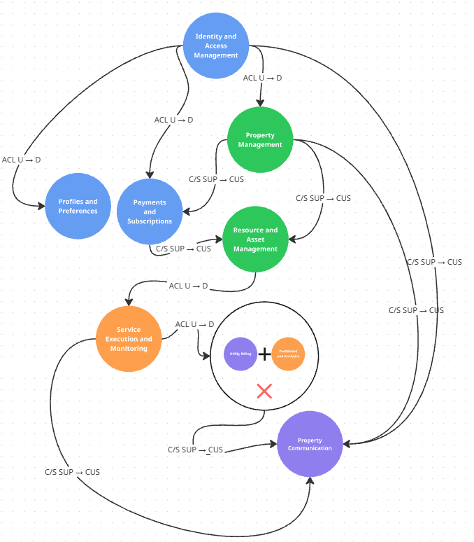
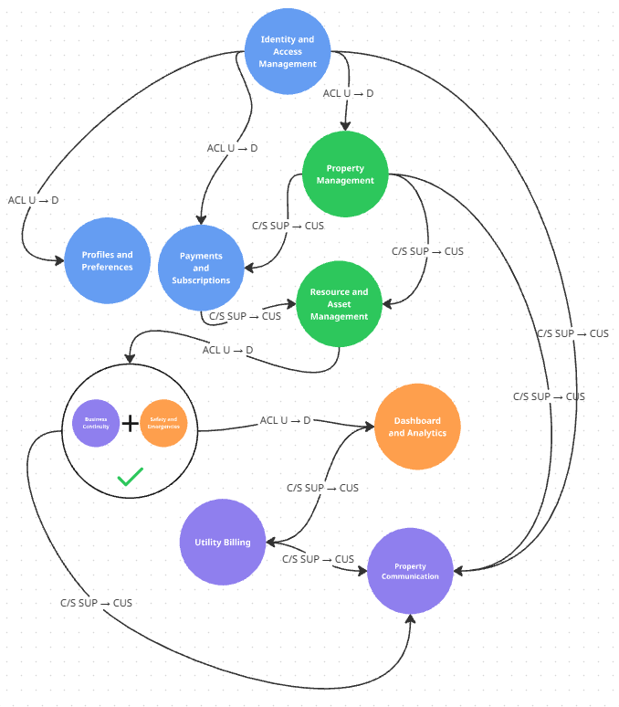
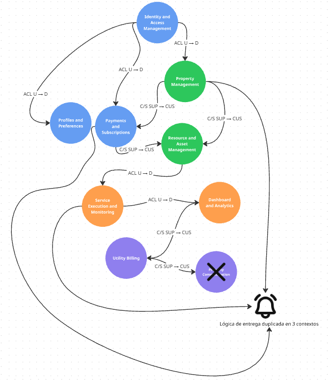
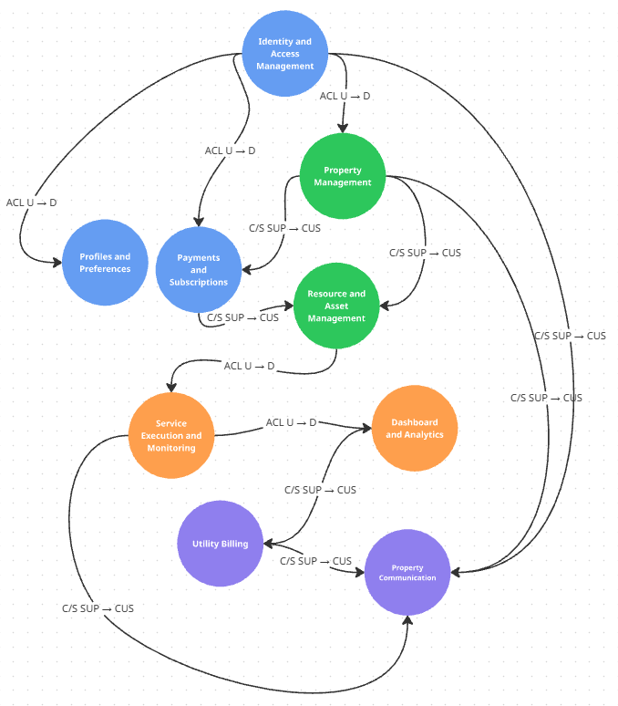

### 4.1.2. Context Mapping

A partir de los Bounded Contexts identificados y documentados en la sección **Bounded Context Canvases**, se desarrolló el proceso de **Context Mapping de StorePulse**, cuyo propósito es representar las relaciones estructurales existentes entre los diferentes contextos del dominio.

El análisis permite establecer las direcciones de dependencia **Upstream/Downstream** y los patrones de relación de **Domain-Driven Design (DDD)** empleados para facilitar la colaboración entre contextos sin comprometer la autonomía de sus respectivos modelos.

Los Bounded Contexts considerados durante este proceso fueron:

- Identity and Access Management
- Property Management
- Resource and Asset Management
- Service Execution and Monitoring
- Dashboard and Analytics
- Utility Billing
- Property Communication
- Profiles and Preferences Management
- Subscriptions and Payments

#### Context Mapping Design Alternatives

##### Candidate Context Map 1 — Integration of Dashboard and Analytics with Utility Billing

**Design Question:** ¿Qué ocurriría si la generación de facturas y la gestión de disputas fueran incorporadas dentro de Dashboard and Analytics?

Esta alternativa surge debido a que ambos contextos dependen del mismo dato base: el consumo medido de agua y energía por local.

La principal ventaja sería evitar la comunicación explícita entre ambos contextos, ya que el cálculo de consumo y la generación de la factura ocurrirían dentro del mismo límite.

Sin embargo, esta organización mezclaría dos responsabilidades conceptualmente distintas. Dashboard and Analytics representa un modelo de **solo consulta** (`ConsumptionSummary`, `BaselineDeviation`), mientras que Utility Billing administra el ciclo de vida de una entidad transaccional con reglas de negocio propias (`UtilityBill`, `BillingDispute`, estado "Data-Verified"). Combinar ambas responsabilidades reduciría la cohesión del modelo de Analytics y obligaría a que un contexto de lectura asumiera comandos y validaciones que no le corresponden.

Por esta razón, la alternativa fue **rechazada** y se decidió mantener Dashboard and Analytics y Utility Billing como Bounded Contexts independientes.

##### Candidate Context Map 2 — Integration of Safety and Emergencies with Business Continuity

**Design Question:** ¿Qué ocurriría si las capabilities de detección de incidentes de seguridad y las de continuidad operativa ante pérdida de conectividad se unificaran en un único contexto?

Esta alternativa surge del Big Picture EventStorming (Capítulo II), donde ambos ejes comparten el mismo origen técnico: los datos provienen de los mismos dispositivos IoT y ambos dependen del procesamiento en el borde (Edge API).

Por esta razón, la alternativa fue **aceptada**, consolidando ambas responsabilidades en un único Bounded Context: **Service Execution and Monitoring**.

##### Candidate Context Map 3 — Distribution of Notification Capabilities

**Design Question:** ¿Qué ocurriría si cada Bounded Context gestionara directamente el envío de sus propias notificaciones, en lugar de centralizarlas en Gallery Communication?

Esta alternativa plantea que Service Execution and Monitoring notifique directamente sus alertas de seguridad, que Utility Billing notifique directamente la emisión de facturas, y que Subscriptions and Payments notifique directamente los estados de pago.

La ventaja sería reducir la dependencia hacia un contexto especializado en comunicación. Sin embargo, esta organización produciría duplicación de lógica de entrega (push, in-app, historial de mensajes) en al menos tres contextos distintos, y dificultaría construir un centro de notificaciones consolidado (US-40) que requiere información proveniente de múltiples dominios.

Por esta razón, la alternativa fue **rechazada** y Property Communication se mantuvo como un Bounded Context independiente y centralizado para la entrega de comunicaciones.

#### Comparison of Context Mapping Alternatives

| Alternative | Main Advantage | Main Disadvantage | Decision |
|---|---|---|---|
| Dashboard and Analytics + Utility Billing | Evita comunicación explícita entre consumo y facturación. | Mezcla un modelo de solo consulta con uno transaccional de reglas de negocio. | Rejected |
| Safety and Emergencies + Business Continuity | Ambas comparten el mismo motor operativo de procesamiento de telemetría en tiempo real. | Ninguna relevante — comparten aggregate root técnico y ciclo de vida. | **Accepted** |
| Distributed Notifications | Reduce la dependencia hacia un contexto especializado en comunicación. | Duplica la lógica de entrega y dificulta un centro de notificaciones consolidado. | Rejected |

A partir de esta comparación se determinó una organización de **nueve Bounded Contexts**, resultado de fusionar Safety and Emergencies con Business Continuity en Service Execution and Monitoring, y de mantener el resto de contextos independientes con relaciones explícitas entre ellos.

#### Selected Context Map

El Context Map seleccionado está conformado por:

- Identity and Access Management
- Property Management
- Resource and Asset Management
- Service Execution and Monitoring
- Dashboard and Analytics
- Utility Billing
- Property Communication
- Profiles and Preferences Management
- Subscriptions and Payments

**Legend:**

- **U:** Upstream
- **D:** Downstream
- **SUP:** Supplier
- **CUS:** Customer
- **C/S:** Customer/Supplier
- **ACL:** Anti-Corruption Layer

---

#### Analysis of Bounded Context Relationships

##### Identity and Access Management → Property Management

- **Relationship:** Upstream (IAM) / Downstream (Property Management)
- **Integration Pattern:** Anti-Corruption Layer (ACL)
- **Description:** Property Management necesita saber qué usuario autenticado registra una galería, pero no requiere el modelo interno de IAM. La identidad se adapta a una referencia propia (`OwnerId`), manteniendo ambos modelos separados.

##### Identity and Access Management → Profiles and Preferences

- **Relationship:** Upstream (IAM) / Downstream (Profiles and Preferences)
- **Integration Pattern:** Anti-Corruption Layer (ACL)
- **Description:** Profiles and Preferences utiliza la identidad proporcionada por IAM únicamente como referencia (`UserId`) para asociar un perfil, sin depender de las entidades internas de autenticación.

##### Identity and Access Management → Subscriptions and Payments

- **Relationship:** Upstream (IAM) / Downstream (Subscriptions and Payments)
- **Integration Pattern:** Anti-Corruption Layer (ACL)
- **Description:** Subscriptions and Payments requiere identificar al administrador responsable del pago, adaptando la identidad de IAM a su propio concepto de `Subscriber`.

##### Identity and Access Management → Property Communication

- **Relationship:** Upstream (IAM) / Downstream (Property Communication)
- **Integration Pattern:** Customer/Supplier
- **Description:** IAM actúa como Supplier de la identidad y el rol del destinatario. Property Communication actúa como Customer de dicha información para dirigir correctamente cada mensaje o alerta.

##### Property Management → Resource and Asset Management

- **Relationship:** Upstream (Property Management) / Downstream (Resource and Asset Management)
- **Integration Pattern:** Customer/Supplier
- **Description:** Property Management mantiene la autoridad sobre `Gallery` y `Unit`. Resource and Asset Management consume estas referencias para registrar cada dispositivo (detector de humo en área común, medidor y detector de movimiento por local individual) asociado a su ubicación correspondiente.

##### Property Management → Subscriptions and Payments

- **Relationship:** Upstream (Property Management) / Downstream (Subscriptions and Payments)
- **Integration Pattern:** Customer/Supplier
- **Description:** Property Management proporciona la cantidad de locales registrados. Subscriptions and Payments utiliza esta información para determinar el plan de suscripción escalonado correspondiente a la galería.

##### Property Management → Property Communication

- **Relationship:** Upstream (Property Management) / Downstream (Property Communication)
- **Integration Pattern:** Customer/Supplier
- **Description:** Property Management mantiene la asignación `Tenant-Unit`. Property Communication utiliza esta información para determinar qué inquilino debe recibir una comunicación relacionada con un local específico.

##### Resource and Asset Management → Service Execution and Monitoring

- **Relationship:** Upstream (Resource and Asset Management) / Downstream (Service Execution and Monitoring)
- **Integration Pattern:** Anti-Corruption Layer (ACL)
- **Description:** Resource and Asset Management mantiene la identidad y el estado operativo del dispositivo físico. Service Execution and Monitoring consume únicamente las referencias requeridas (`DeviceId`, ubicación) y las adapta a su propio modelo de telemetría y eventos.

##### Service Execution and Monitoring → Dashboard and Analytics

- **Relationship:** Upstream (Service Execution and Monitoring) / Downstream (Dashboard and Analytics)
- **Integration Pattern:** Anti-Corruption Layer (ACL)
- **Description:** Service Execution and Monitoring identifica lecturas y eventos crudos de telemetría. Dashboard and Analytics transforma esta información hacia sus propios conceptos (`ConsumptionSummary`, `BaselineDeviation`), evitando que su modelo dependa directamente del modelo de eventos IoT.

##### Service Execution and Monitoring → Property Communication

- **Relationship:** Upstream (Service Execution and Monitoring) / Downstream (Property Communication)
- **Integration Pattern:** Customer/Supplier
- **Description:** Service Execution and Monitoring proporciona los eventos de intrusión, humo o desconexión. Property Communication utiliza esta información para generar y escalar las alertas correspondientes a administrador e inquilino.

##### Dashboard and Analytics → Utility Billing

- **Relationship:** Upstream (Dashboard and Analytics) / Downstream (Utility Billing)
- **Integration Pattern:** Customer/Supplier
- **Description:** Dashboard and Analytics mantiene la autoridad sobre el consumo calculado y la línea base por local. Utility Billing utiliza esta información como insumo para generar el desglose de facturación verificado, sin convertirse en una segunda fuente de verdad del consumo medido.

##### Utility Billing → Property Communication

- **Relationship:** Upstream (Utility Billing) / Downstream (Property Communication)
- **Integration Pattern:** Customer/Supplier
- **Description:** Utility Billing genera el evento `UtilityBillIssued` —identificado como evento pivote en el Big Picture EventStorming del Capítulo II— al emitir una factura. Property Communication consume este evento para notificar al inquilino, marcando la transición del proceso interno de cálculo hacia la interacción directa con el usuario.

##### Subscriptions and Payments → Resource and Asset Management

- **Relationship:** Upstream (Subscriptions and Payments) / Downstream (Resource and Asset Management)
- **Integration Pattern:** Customer/Supplier
- **Description:** Subscriptions and Payments mantiene el estado y el límite de dispositivos permitidos según el plan contratado. Resource and Asset Management utiliza esta información para validar si un nuevo dispositivo puede registrarse dentro del límite vigente.

#### Summary of Applied Context Mapping Patterns

| Pattern | Relationships |
|---|---|
| **Anti-Corruption Layer (ACL)** | IAM → Property Management; IAM → Profiles and Preferences; IAM → Subscriptions and Payments; Resource and Asset Management → Service Execution and Monitoring; Service Execution and Monitoring → Dashboard and Analytics |
| **Customer/Supplier** | IAM → Property Communication; Property Management → Resource and Asset Management; Property Management → Subscriptions and Payments; Property Management → Property Communication; Service Execution and Monitoring → Property Communication; Dashboard and Analytics → Utility Billing; Utility Billing → Property Communication; Subscriptions and Payments → Resource and Asset Management |

**Customer/Supplier** se utiliza cuando un contexto Upstream actúa como Supplier de información o capacidades requeridas explícitamente por un contexto Downstream que actúa como Customer, manteniendo el Supplier la autoridad sobre dicha información.

**Anti-Corruption Layer (ACL)** se utiliza cuando un contexto Downstream necesita consumir información de otro Bounded Context pero requiere transformarla hacia conceptos pertenecientes a su propio modelo, evitando que conceptos internos del Upstream (como el modelo de autenticación de IAM o el modelo de hardware de Resource and Asset Management) se propaguen directamente.

#### Considered Context Mapping Patterns

Durante el proceso de diseño también se consideraron los patrones **Conformist** y **Shared Kernel**.

El patrón **Conformist** no fue seleccionado debido a que implicaría que determinados contextos Downstream adoptaran directamente el modelo definido por su contexto Upstream. Dado que los Bounded Contexts de StorePulse mantienen responsabilidades y modelos de dominio independientes, se consideró preferible utilizar Anti-Corruption Layer en aquellas relaciones donde resulta necesaria una transformación entre modelos.

El patrón **Shared Kernel** tampoco fue seleccionado como patrón principal de relación entre los Bounded Contexts de negocio. El módulo compartido contiene únicamente abstracciones y value objects transversales de alcance reducido (por ejemplo, identificadores comunes), cuya utilización no implica compartir los modelos principales de los contextos.

Por lo tanto, los patrones que mejor representan las relaciones identificadas en el Context Map seleccionado son **Customer/Supplier** y **Anti-Corruption Layer (ACL)**.

#### Final Context Mapping Decision

Después de evaluar las distintas alternativas de Context Mapping, se determinó que mantener nueve Bounded Contexts como unidades independientes —fusionando previamente Safety and Emergencies con Business Continuity en Service Execution and Monitoring— representa la aproximación seleccionada para StorePulse.

La integración de Dashboard and Analytics con Utility Billing fue descartada debido a que mezclaría un modelo de solo consulta con uno transaccional de reglas de negocio. La integración de Property Management con Profiles and Preferences fue descartada porque combinaría dos aggregate roots sin relación conceptual entre sí. La distribución de las capabilities de notificación entre los demás contextos fue descartada debido a que produciría duplicación de lógica de entrega y dificultaría un centro de notificaciones consolidado.

La alternativa seleccionada mantiene separados **Identity and Access Management, Property Management, Resource and Asset Management, Service Execution and Monitoring, Dashboard and Analytics, Utility Billing, Property Communication, Profiles and Preferences y Subscriptions and Payments**, con colaboraciones establecidas mediante los patrones **Customer/Supplier** y **Anti-Corruption Layer**.

De esta manera, cada Bounded Context conserva la autoridad sobre su propio modelo de dominio, comparte únicamente la información necesaria mediante contratos claramente definidos, y puede evolucionar sin introducir dependencias innecesarias sobre los modelos internos de los demás contextos.