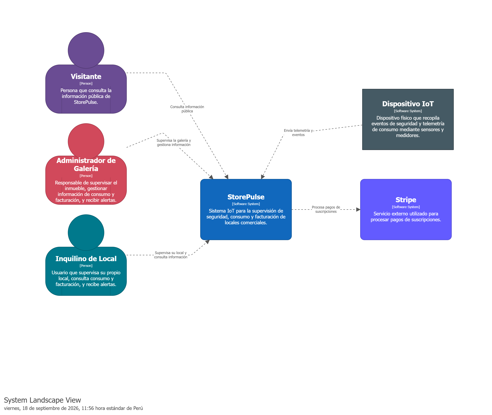
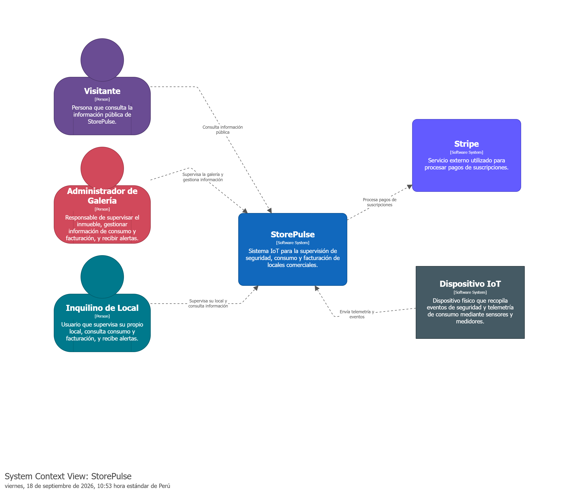
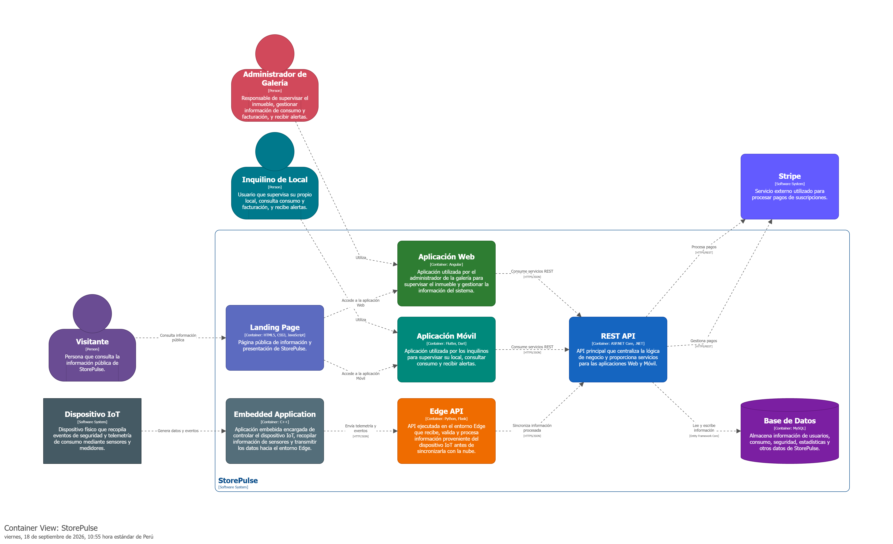
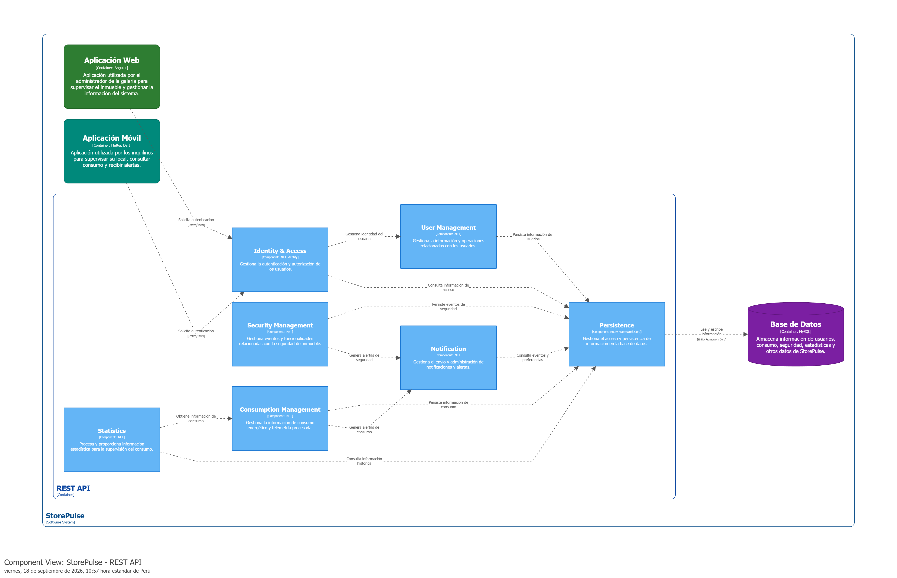
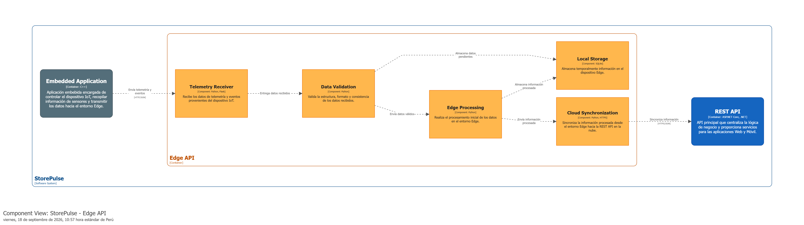
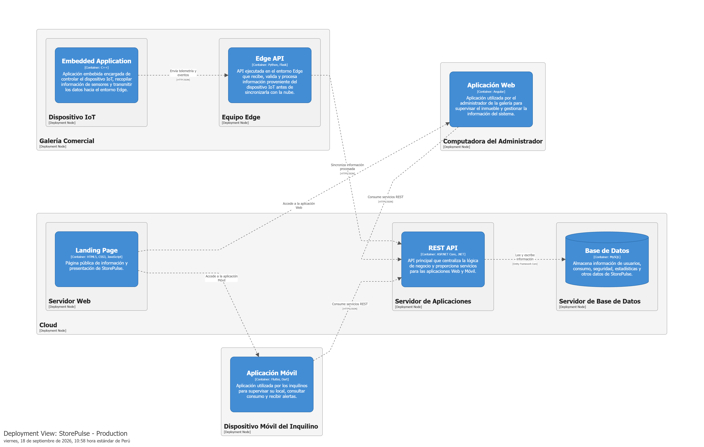

### 4.1.3. Software Architecture

En esta sección se presenta la arquitectura de software de StorePulse, una solución IoT distribuida para la supervisión de seguridad perimetral y la gestión transparente del consumo de servicios básicos en galerías comerciales. La arquitectura se modela mediante C4 Model, utilizando cuatro perspectivas: System Landscape, System Context, Container, Component y Deployment.

La propuesta mantiene un RESTful API monolítico como núcleo de negocio en la nube, complementado por un Edge API local y una Embedded Application ejecutada en el dispositivo IoT. Esta distribución responde al flujo definido en el proyecto: los sensores y medidores generan eventos y mediciones, el Edge procesa y conserva temporalmente la información cuando es necesario, y el backend centraliza la información para su consulta, cálculo y visualización en las aplicaciones Web y Mobile.

#### 4.1.3.1. Software Architecture System Landscape Diagram

El System Landscape Diagram presenta una visión general del ecosistema de StorePulse, identificando a los actores que utilizan la solución y los sistemas externos con los que esta intercambia información. En esta vista no se muestran los componentes internos ni la distribución física de los contenedores.

Los elementos principales son:

- Visitor: persona que consulta la propuesta de valor, funcionamiento y planes de StorePulse desde la Landing Page antes de utilizar la plataforma.

- Administrador de Galería: responsable de supervisar el inmueble, gestionar los locales, consultar seguridad, consumo y facturación, y atender situaciones asociadas a la operación de la galería.

- Inquilino de Local: usuario que supervisa su local, recibe alertas y consulta su consumo y facturación.

- StorePulse: sistema central que integra las aplicaciones digitales, el procesamiento Edge, la aplicación embebida y los servicios de backend necesarios para operar la solución.

- Dispositivo IoT: conjunto de dispositivos físicos, sensores y medidores utilizados en la galería comercial para recopilar eventos de seguridad y mediciones de los servicios básicos monitoreados, como agua, humedad y electricidad.

- Stripe: servicio externo utilizado para procesar los pagos asociados a las suscripciones de StorePulse.

#### 4.1.3.2. Software Architecture Context Level Diagram

El diagrama de contexto muestra los principales usuarios y sistemas externos con los que intercambia información. No se detallan componentes internos, contenedores, bases de datos ni APIs, ya que estos elementos corresponden a niveles posteriores del modelo C4.

Los principales elementos que interactúan con StorePulse son:

- Visitor: consulta información pública relacionada con StorePulse a través de la Landing Page.

- Administrador de Galería: utiliza StorePulse para supervisar el inmueble, recibir alertas y gestionar información relacionada con los locales, consumo, seguridad y facturación.

- Inquilino de Local: utiliza StorePulse para supervisar su propio local, recibir alertas y consultar información correspondiente a su consumo y facturación.

- Dispositivo IoT: representa el conjunto de dispositivos físicos, sensores y medidores desplegados en la galería. Estos recopilan eventos de seguridad y telemetría de consumo, enviando la información hacia StorePulse para su procesamiento y gestión.

- Stripe: servicio externo utilizado por StorePulse para gestionar los pagos asociados a las suscripciones.

#### 4.1.3.3. Software Architecture Container Level Diagram

El diagrama de contenedores representa la estructura interna de alto nivel de StorePulse, mostrando los principales contenedores de software que conforman el sistema y las relaciones entre ellos. En este nivel se detallan las aplicaciones, APIs, bases de datos y otros elementos tecnológicos que permiten implementar las funcionalidades identificadas en el diagrama de contexto.

El diagrama permite visualizar cómo interactúan la Landing Page, la Aplicación Web, la Aplicación Móvil, la REST API, la Edge API, la Base de Datos y la Embedded Application, así como sus relaciones con el dispositivo IoT y los servicios externos. También se especifican las principales tecnologías empleadas en cada contenedor, facilitando la comprensión de la arquitectura lógica de StorePulse.

Este nivel no profundiza todavía en las clases, módulos o componentes internos de las APIs, ya que dicho detalle corresponde al nivel de componentes del modelo C4.

#### 4.1.3.4. Software Architecture Component Level Diagrams

El diagrama de componentes representa la estructura interna de los principales contenedores de software de StorePulse, detallando los componentes que implementan sus responsabilidades y las relaciones existentes entre ellos.

##### REST API - Component Diagram

El diagrama presenta los componentes internos de la REST API, responsables de gestionar la autenticación, usuarios, seguridad, consumo, estadísticas, notificaciones y persistencia de información.

##### Edge API - Component Diagram

El diagrama presenta los componentes internos de la Edge API, encargados de recibir y validar la telemetría, realizar el procesamiento en el entorno Edge, almacenar información localmente y sincronizar los datos con la nube.

#### 4.1.3.5. Software Architecture Deployment Diagram

El diagrama de despliegue representa la distribución física de los elementos de software de StorePulse sobre la infraestructura donde serán ejecutados. Se muestran los nodos correspondientes al entorno físico de la galería comercial, el entorno Edge, la infraestructura Cloud y los dispositivos utilizados por los usuarios.

