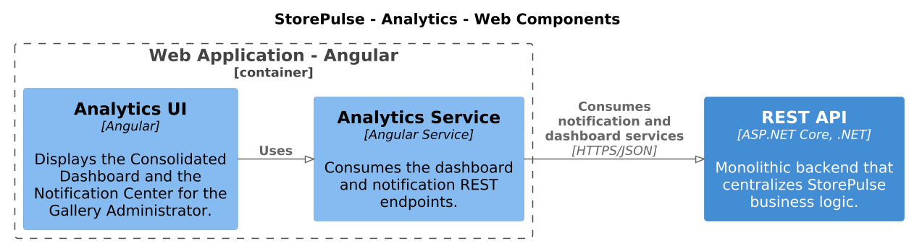
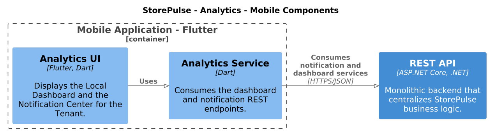
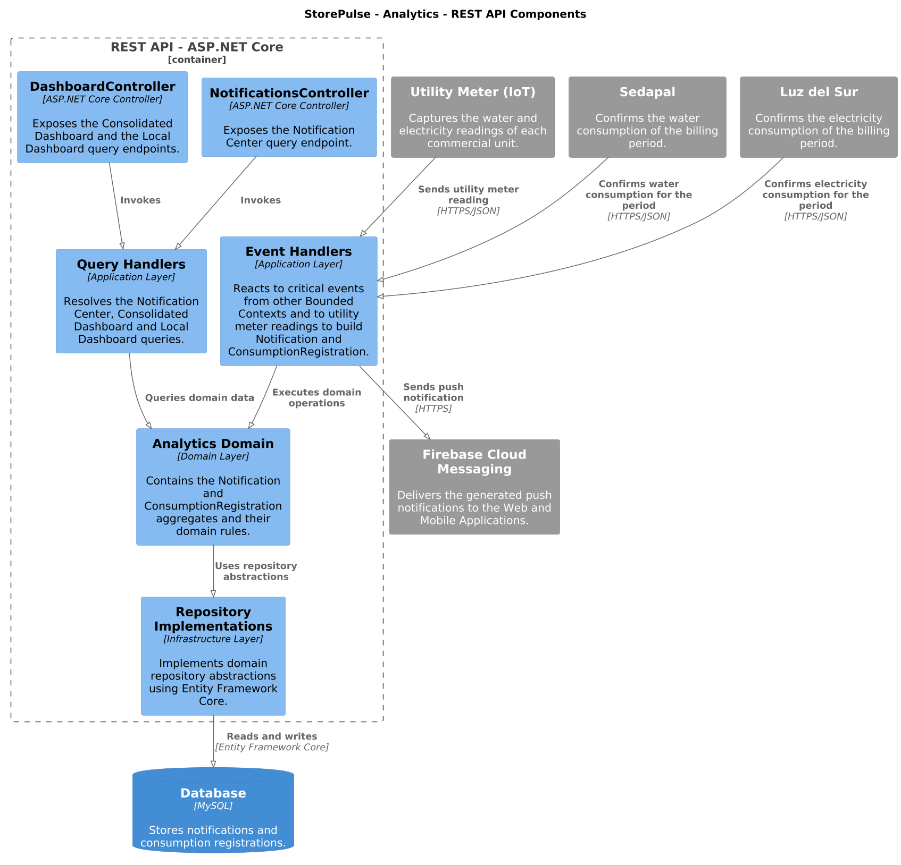

# 4.2.5. Bounded Context: Analytics
El **Bounded Context de Analytics** concentra la generación de notificaciones a partir de eventos críticos de otros Bounded Contexts y el registro de las lecturas de consumo de agua y electricidad capturadas por los medidores IoT. Con esta información alimenta el Notification Center, el Consolidated Dashboard (Gallery Administrator) y el Local Dashboard (Tenant).

Este contexto no origina Commands desde un actor: reacciona a eventos externos (alertas de seguridad, pérdida de conectividad, desviaciones de consumo) y a la llegada de lecturas de los medidores. La gestión de los medidores como activo físico pertenece a **Resource and Assets Management**; el cálculo de la Baseline de consumo y la facturación pertenecen a **Consumption and Billing**, que consume el evento de consumo registrado por este contexto.

## 4.2.5.1. Domain Layer

La **Domain Layer** contiene el núcleo de las reglas de negocio del contexto. Se identifican dos agregados raíz, sus objetos de valor, enumeraciones, interfaces de repositorio y eventos de dominio.

### Aggregates, Entities and Value Objects

| Nombre | Categoría | Propósito y reglas de negocio |
|---|---|---|
| `Notification` | Aggregate Root | Representa una notificación generada automáticamente a partir de un evento crítico de otro Bounded Context. Permite agrupar notificaciones repetidas del mismo tipo dentro de una ventana corta de tiempo. |
| `ConsumptionRegistration` | Aggregate Root | Representa el registro de una lectura de consumo de agua o electricidad capturada por un medidor IoT y su confirmación por parte del proveedor (Sedapal o Luz del Sur) para el periodo correspondiente. |
| `NotificationId` | Value Object | Encapsula el identificador de una notificación. |
| `ConsumptionRegistrationId` | Value Object | Encapsula el identificador de un registro de consumo. |
| `ConsumptionValue` | Value Object | Encapsula el valor numérico de una lectura o consumo junto con su unidad. |

### Enumeraciones del dominio

| Enumeración | Valores representados | Propósito |
|---|---|---|
| `NotificationType` | `SAFETY_ALERT`, `CONNECTIVITY_ALERT`, `CONSUMPTION_DEVIATION` | Identifica el origen del evento crítico que generó la notificación. |
| `UtilityType` | `WATER`, `ELECTRICITY` | Identifica el tipo de servicio al que corresponde la lectura o el consumo registrado. |

### Reglas y operaciones principales

| Elemento | Operaciones principales |
|---|---|
| `Notification` | Generarse automáticamente a partir de un evento crítico externo; agruparse con otras notificaciones del mismo tipo dentro de una ventana corta de tiempo. |
| `ConsumptionRegistration` | Registrar automáticamente la lectura capturada por el medidor IoT; registrar el consumo confirmado por el proveedor para el periodo correspondiente; publicar el evento que Consumption and Billing consume para su Baseline. |

### Repository Abstractions

| Interfaz | Responsabilidad |
|---|---|
| `INotificationRepository` | Guardar una notificación y recuperar las notificaciones recientes por tipo. |
| `IConsumptionRegistrationRepository` | Guardar un registro de consumo y buscarlo por medidor y periodo. |

### Domain Events

| Evento | Origen | Propósito |
|---|---|---|
| `NotificationGeneratedEvent` | `Notification` | Representa la generación de una notificación a partir de un evento crítico externo. |
| `NotificationsGroupedEvent` | `Notification` | Representa la agrupación de notificaciones repetidas del mismo tipo. |
| `UtilityMeterReadingCapturedEvent` | `ConsumptionRegistration` | Representa la captura automática de una lectura del medidor IoT. |
| `UtilityConsumptionRecordedEvent` | `ConsumptionRegistration` | Representa el consumo confirmado por el proveedor para el periodo; Consumption and Billing lo consume para su Baseline. |

## 4.2.5.2. Interface Layer

La **Interface Layer** expone las capacidades de consulta de Analytics hacia la Web Application y la Mobile Application. La comunicación se realiza mediante la **REST API**, utilizando HTTPS y JSON. Este contexto no expone endpoints de escritura para un actor: los Commands llegan únicamente vía eventos e integraciones externas.

| Componente | Tecnología | Responsabilidad |
|---|---|---|
| `NotificationsController` | ASP.NET Core | Expone la consulta del Notification Center. |
| `DashboardController` | ASP.NET Core | Expone la consulta del Consolidated Dashboard y del Local Dashboard. |
| Analytics UI | Angular | Permite al Gallery Administrator revisar el Consolidated Dashboard y el Notification Center. |
| Analytics UI | Flutter / Dart | Permite al Tenant revisar el Local Dashboard y el Notification Center desde la aplicación móvil. |

## 4.2.5.3. Application Layer

La **Application Layer** coordina las consultas y reacciona a los eventos externos e integraciones que alimentan a Analytics.

| Componente | Responsabilidad |
|---|---|
| `Query Handlers` | Resolver las consultas del Notification Center, el Consolidated Dashboard y el Local Dashboard. |
| `Event Handlers` | Reaccionar a los eventos críticos externos (Emergency Alert Sent, Connectivity Lost Detected, Consumption Deviation Detected) para crear `Notification`, y a la llegada de la lectura del medidor y a la confirmación del proveedor para crear `ConsumptionRegistration`. |
| `Analytics Domain` | Ejecutar las reglas y operaciones definidas en el dominio. |
| `Repository Implementations` | Persistir los cambios mediante las abstracciones de repositorio. |

El flujo general es:

```text
Eventos externos / Medidor IoT / Sedapal / Luz del Sur
              ↓
         Event Handlers
              ↓
        Analytics Domain
              ↓
  Repository Implementations
              ↓
        MySQL Database
              ↓
        Query Handlers
              ↓
      REST API Controllers
              ↓
Aplicación Web / Aplicación Móvil
```

## 4.2.5.4. Infrastructure Layer

La **Infrastructure Layer** proporciona las implementaciones técnicas necesarias para persistir la información y comunicarse con los sistemas externos que alimentan a Analytics.

| Componente | Tecnología | Responsabilidad |
|---|---|---|
| `Repository Implementations` | ASP.NET Core / Entity Framework Core | Implementan las interfaces de repositorio del dominio. |
| `StorePulseDbContext` | Entity Framework Core | Gestiona el acceso de la aplicación a la base de datos. |
| MySQL | MySQL | Persiste notificaciones y registros de consumo. |
| Integración con Utility Meter (IoT) | HTTPS/JSON | Recibe la lectura capturada por el medidor. |
| Integración con Sedapal y Luz del Sur | HTTPS/JSON | Recibe la confirmación de consumo del periodo. |
| `Firebase Cloud Messaging` | Firebase | Envía las notificaciones push generadas hacia la Web Application y la Mobile Application. |
| Evento saliente hacia Consumption and Billing | Integration Event | Publica `UtilityConsumptionRecordedEvent` para alimentar la Baseline de consumo en Consumption and Billing. |

## 4.2.5.5. Bounded Context Software Architecture Component Level Diagrams

Los diagramas de componentes de este Bounded Context se elaboran con **Structurizr DSL** (`assets/architecture/analytics/analytics.dsl`), siguiendo la misma herramienta utilizada en Management-Tenant Communication. El archivo `.dsl` es el código fuente; las imágenes siguientes son la exportación de cada vista.

> **Pendiente:** las imágenes deben generarse abriendo `analytics.dsl` en Structurizr Lite (o en el workspace en línea de structurizr.com) y exportando cada vista como PNG a `assets/architecture/analytics/`, con los nombres referenciados abajo.

### Web Application

La aplicación web, desarrollada con Angular, contiene la interfaz de Analytics y el servicio encargado de consumir los servicios REST correspondientes.



### Mobile Application

La aplicación móvil, desarrollada con Flutter y Dart, contiene la interfaz de Analytics y el servicio encargado de consumir la API REST.



### REST API

La REST API, desarrollada con ASP.NET Core, concentra los controladores, manejadores de consultas y de eventos, dominio y repositorios del contexto.



## 4.2.5.6. Bounded Context Software Architecture Code Level Diagrams

Los diagramas de nivel de código se elaboran con **PlantUML**.

### 4.2.5.6.1. Bounded Context Domain Layer Class Diagrams

El diagrama de clases presenta los agregados raíz `Notification` y `ConsumptionRegistration`, sus objetos de valor, las enumeraciones `NotificationType` y `UtilityType`, los repositorios y los eventos de dominio. Ambos agregados son independientes entre sí.


### 4.2.5.6.2. Bounded Context Database Design Diagram

El modelo de datos representa la persistencia de los principales elementos del contexto.

| Tabla | Propósito | Relación principal |
|---|---|---|
| `notifications` | Almacenar las notificaciones generadas a partir de eventos críticos externos. | Independiente; no se relaciona con `consumption_registrations`. |
| `consumption_registrations` | Almacenar las lecturas y consumos de agua y electricidad registrados por medidor y periodo. | `meter_id` es una referencia externa a Resource and Assets Management, sin FK física entre contextos. |


