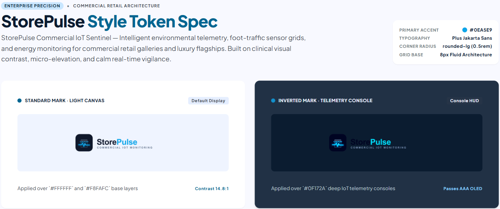
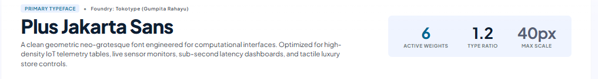
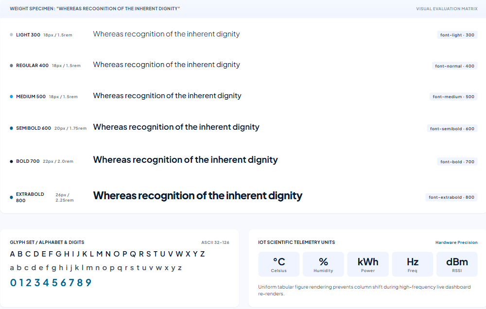
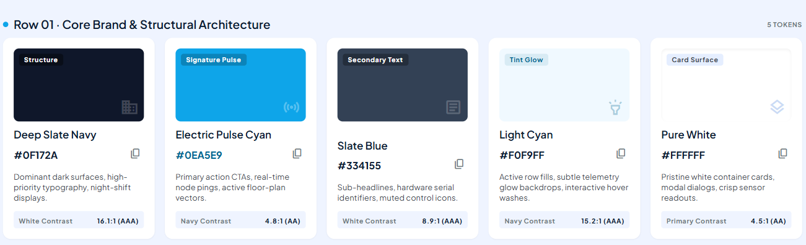
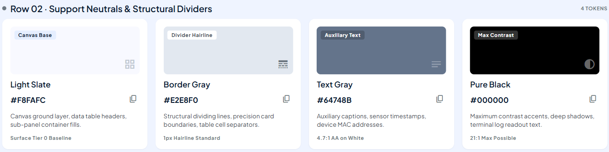
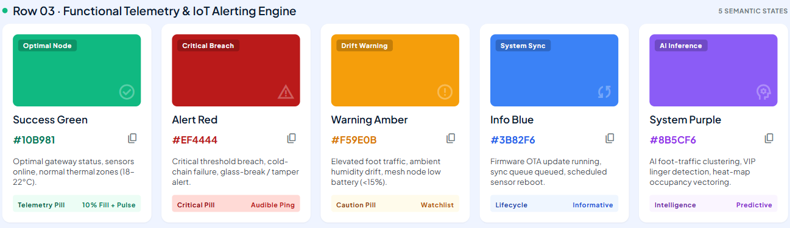

# 5.1. Style Guidelines

En esta sección se establecen los lineamientos de diseño visual, identidad de marca, componentes de interfaz y directrices de interacción para el ecosistema tecnológico **StorePulse**, desarrollado por **VanguardTech**. El propósito de esta guía es garantizar una experiencia de usuario (UX) consistente, accesible y de alta usabilidad a lo largo de todos los puntos de contacto de la solución: la plataforma web de administración, la aplicación móvil para inquilinos y personal de seguridad, y las interfaces físicas de los dispositivos IoT desplegados en las galerías comerciales.

---

### 5.1.1. General Style Guidelines

El diseño visual de **StorePulse** responde a una estética industrial-tecnológica moderna, funcional y sobria. Dado que la plataforma opera como un sistema crítico de supervisión perimetral, gestión de emergencias y transparencia en la medición de servicios básicos, la interfaz prioriza la claridad de la información cuantitativa, la legibilidad inmediata de alertas y la reducción de la sobrecarga cognitiva en momentos de alta tensión operativa.

Los lineamientos generales combinan principios de diseño centrado en el usuario (*Lean UX*), pautas de accesibilidad universal (*WCAG 2.1 nivel AA*) y consistencia semántica entre el software y el hardware IoT.

#### Branding

El nombre comercial de la solución es **StorePulse**, una denominación que sintetiza el concepto de monitorización continua del "pulso" vital, operativo y seguro de los locales comerciales dentro de una galería. La identidad de marca proyecta robustez tecnológica, transparencia analítica y confiabilidad institucional, valores esenciales para propietarios, administradores e inquilinos que buscan erradicar la incertidumbre en sus negocios.

El imagotipo integra una silueta estilizada de un local comercial conectada a una onda de pulso digital, simbolizando la supervisión IoT en tiempo real. 

* **Versión Principal:** Isotipo acompañado del logotipo tipográfico en orientación horizontal para barras de navegación web y documentos oficiales.
* **Versión Reducida / Isotipo:** Símbolo de pulso comercial sintetizado, optimizado para iconos de aplicaciones móviles, favicons y placas de dispositivos IoT.
* **Aplicación sobre fondos:** Variante a color sobre fondo claro (`#FFFFFF` o `#F8FAFC`) y variante monocromática invertida sobre fondo oscuro (`#0F172A`).

  

#### Typography

La tipografía institucional y de interfaz seleccionada para StorePulse es **Plus Jakarta Sans**, complementada con **Inter** para bloques densos de datos y **JetBrains Mono** para identificadores técnicos, tokens y telemetría de medidores.

La elección de **Plus Jakarta Sans** se fundamenta en su geometría moderna, amplia apertura de caracteres y excelente rendimiento de renderizado en pantallas de diversa resolución y densidad de píxeles (dispositivos móviles, tablets y monitores de escritorio). Su disponibilidad a través de *Google Fonts* asegura una carga optimizada y sincronizada en las aplicaciones web y móviles.

La jerarquía tipográfica se estructura mediante una escala modular proporcional:

* **Títulos Principales (H1 / Page Heading):** `2.5rem` (aprox. 40px) en escritorio con peso **Bold (700)**; `1.75rem` (aprox. 28px) en dispositivos móviles.
* **Subtítulos de Sección (H2 / Section Title):** `1.75rem` (aprox. 28px) en escritorio con peso **SemiBold (600)**; `1.375rem` (aprox. 22px) en móvil.
* **Títulos de Módulo y Cards (H3 / Card Header):** `1.25rem` (aprox. 20px) con peso **SemiBold (600)** a **Medium (500)**.
* **Subtítulos de Componente y Métricas (H4):** `1.125rem` (aprox. 18px) con peso **Medium (500)**.
* **Cuerpo de Texto Principal (Body / p):** `1rem` (16px) con peso **Regular (400)** e interlineado (*line-height*) de `1.5` para garantizar lectura prolongada sin fatiga.
* **Texto Secundario y Metadatos (Caption / Small):** `0.875rem` (14px) o `0.75rem` (12px) con peso **Regular (400)**.
* **Botones y Badges (Button / Tag):** `0.875rem` (14px) con peso **SemiBold (600)**, tracking de `+0.02em` y altura de línea de `1.25`.

  

  

Todos los pares de tipografía y color de fondo se someten a pruebas de contraste que garantizan un ratio mínimo de **4.5:1** para texto normal y **3.0:1** para encabezados de gran tamaño, cumpliendo holgadamente el criterio *WCAG 2.1 AA*.

#### Colors

La paleta de colores de StorePulse ha sido configurada para transmitir precisión industrial, estabilidad y seguridad perimetral. Se organiza en tres niveles jerárquicos:

**1. Paleta Principal (Brand & Surface):**
* **Primario (Deep Slate Navy - `#0F172A`):** Color de máxima jerarquía institucional; evoca solidez, utilizado en barras de navegación principales, encabezados y fondos oscuros.
* **Acento Tecnológico (Electric Pulse Cyan - `#0EA5E9`):** Representa el flujo dinámico de datos IoT y la interactividad; utilizado en botones primarios, enlaces activos, selectores y estados de foco.
* **Secundario (Slate Gray - `#334155`):** Destinado a texto secundario, bordes estructurales y contenedores neutros.
* **Fondo de Interfaz (Clean Slate - `#F8FAFC`):** Fondo base para vistas de dashboard y pantallas móviles, minimizando el cansancio ocular.
* **Superficie de Tarjeta (Pure White - `#FFFFFF`):** Base de tarjetas, tablas y ventanas modales, destacada mediante elevación sutil.

**2. Paleta de Soporte (Neutral Tokens):**
* **Borde Sutil (`#E2E8F0`):** Para divisiones de tabla, contornos de inputs y separación de cards.
* **Gris Neutro Desactivado (`#94A3B8`):** Para placeholders, estados inactivos e iconos informativos secundarios.

**3. Colores Semánticos y Funcionales (Alineación con Hardware IoT):**
* **Crítico / Emergencia (Vibrant Red - `#EF4444`):** Reservado exclusivamente para intrusiones no autorizadas, concentraciones de humo y fallas de seguridad críticas. Coincide con el parpadeo rojo del LED en el nodo físico.
* **Advertencia / Desviación (Alert Amber - `#F59E0B`):** Notifica desviaciones anómalas de consumo frente a la línea base, demoras en el pago de recibos o pérdida de conexión a internet (modo offline). Coincide con el ámbar del hardware.
* **Normal / Éxito (Emerald Green - `#10B981`):** Señaliza operación normal sin incidentes, lecturas de consumo estables, facturas saldadas y notificación *All-Clear*. Coincide con el verde continuo del LED.
* **Informativo / Respaldo (Cobalt Blue - `#3B82F6`):** Indica procesos de sincronización en progreso y activación de respaldo por batería durante cortes eléctricos.
* **Falla de Sistema / Diagnóstico (Deep Violet - `#8B5CF6`):** Señaliza fallas internas en sensores o componentes de medición que requieren mantenimiento técnico. Coincide con el morado fijo del hardware.

  

  

  

#### Spacing

StorePulse implementa un sistema de espaciado modular basado en un incremento lineal de **8px (0.5rem)**, con submúltiplo de **4px (0.25rem)** para elementos compactos de interfaz:

* **Unidad Mínima (4px / 0.25rem):** Micro-espaciados entre iconos y texto en etiquetas o badges.
* **Espaciado Compacto (8px / 0.5rem):** Separación interna en inputs, gap entre chips de estado y márgenes de botones secundarios.
* **Espaciado Estándar (16px / 1rem):** Padding interno base en celdas de tabla, separación entre campos de formularios y margen horizontal en móviles.
* **Espaciado Medio (24px / 1.5rem):** Padding interior de cards de telemetría y gutters en sistemas de grid.
* **Espaciado Generoso (32px / 2rem a 48px / 3rem):** Separación vertical entre bloques temáticos de dashboards y secciones principales.
* **Interlineado (Line-Height):** Ajustado a **1.5** para cuerpo de texto y **1.25** para titulares, evitando aglomeración en párrafos explicativos.

#### Tono de Comunicación

La voz de StorePulse se proyecta como un copiloto operativo experto, imparcial y tranquilizador para el entorno de las galerías comerciales.

* **Tono Objetivo y Basado en Evidencia:** Se presentan métricas cuantitativas verificables (kWh medidos, litros consumidos, hora exacta con timestamp de detección). No se emiten juicios subjetivos.
* **Urgencia Jerárquica en Alertas:** En situaciones de riesgo físico (humo o intrusión), el lenguaje es imperativo, directo y exento de tecnicismos ("Intrusión detectada en Local 104 - Verificación requerida inmediatamente").
* **Empatía y Claridad Administrativa:** En la emisión de recibos y resolución de disputas de facturación, la comunicación es transparente y explicativa, detallando fórmulas de cobro y lecturas de referencia para prevenir desacuerdos entre inquilinos y administración.

---

### 5.1.2. Web, Mobile and IoT Style Guidelines

---

### Web Style Guidelines

La plataforma web de StorePulse (diseñada para el **Gallery Administrator** en entorno de escritorio) está orientada a la supervisión simultánea de múltiples locales, el análisis de tendencias de consumo y la gestión administrativa global de la galería comercial.

#### 1) Layout & Grid System
* **Sistema de Rejilla:** Cuadrícula fluida de 12 columnas con canales (*gutters*) de 24px y un ancho máximo de contenedor de 1440px.
* **Estructura de Ventana:**
  * **Sidebar Lateral Colapsable (260px expandido / 72px colapsado):** Navegación persistente por módulos (Visión General, Locales, Seguridad, Medidores, Recibos, Comunicación y Configuración).
  * **Topbar Superior Fija (64px de altura):** Muestra el nombre de la galería activa, el estado global del sistema (Normal / Alerta / Offline), el selector de período y el centro de notificaciones.
  * **Área de Trabajo Central:** Scroll vertical independiente organizado en tarjetas modulares de contenido (*Dashboard Widgets*).
* **Componente Card:** Contenedores blancos (`#FFFFFF`) con esquinas redondeadas de **12px (`border-radius: 0.75rem`)**, borde exterior tenue de 1px (`#E2E8F0`) y sombra de elevación sutil (`box-shadow: 0 1px 3px rgba(15, 23, 42, 0.08)`).

#### 2) Responsive Design
* **Desktop Grande (≥ 1280px):** Disposición a tres o cuatro columnas para métricas KPI de locales, gráficas comparativas de energía y tabla de eventos en tiempo real.
* **Desktop Estándar / Laptop (1024px – 1279px):** Reorganización a dos columnas con preservación completa del sidebar y tablas con scroll horizontal integrado.
* **Tablet (768px – 1023px):** El sidebar se transforma en menú deslizable (*drawer*); los KPIs se agrupan en cuadrícula de 2 columnas.
* **Mobile Web (< 768px):** Ajuste en columna única vertical priorizando la tarjeta de alertas activas en la parte superior.

#### 3) Interaction Design
* **Botones:** 
  * *Primario:* Fondo `#0EA5E9`, texto blanco, micro-animación de elevación en hover (`transform: translateY(-1px)`).
  * *Secundario / Outline:* Fondo transparente, borde de 1.5px en `#0F172A`, texto `#0F172A`.
  * *Acción Crítica / Destructiva:* Fondo `#EF4444`, utilizado para escalamiento de alarmas o corte forzado de servicio.
* **Formularios y Filtros:** Entradas de texto y selectores de fecha con etiquetas superiores claras, estado de foco resaltado mediante anillo perimetral Cyan de 2px (`outline: 2px solid #0EA5E9`), y mensajes de validación en tiempo real.
* **Tablas de Datos:** Filas con efecto hover (`#F1F5F9`), ordenamiento por columnas con flechas indicadoras y paginación fija en el pie de tabla.

#### 4) Images & Icons
* **Iconografía:** Conjunto lineal minimalista basado en *Material Symbols Rounded* o *Lucide Icons* con trazo constante de 1.75px y caja delimitadora de 24 × 24px.
* **Gráficos y Visualización:** Gráficos de telemetría de área y barras utilizando paletas de alto contraste cromático con líneas guía punteadas y tooltips enriquecidos con timestamps.

---

### Mobile Style Guidelines

La aplicación móvil de StorePulse (diseñada para el **Tenant / Inquilino** y el **Personal de Seguridad**) está optimizada para la interacción ágil, la notificación en tiempo real de contingencias y la consulta simplificada del estado del local comercial.

#### 1) Layout & Grid Mobile
* **Orientación:** Optimizada primariamente para modo vertical (*portrait*).
* **Columna Única:** Flujo vertical estructurado con padding lateral fijo de **16 dp**, alineado con los estándares de *Material Design 3*.
* **Área Táctil Mínima:** Todos los controles accionables (botones, tarjetas clickeables, selectores e iconos) respetan una zona de contacto táctil mínima de **48 × 48 dp**, garantizando accesibilidad para inquilinos en mostrador o personal de seguridad en movimiento.
* **Tarjetas con Borde Semántico:** Cards de local con altura mínima de 88 dp y un borde lateral izquierdo reforzado de **4 dp de ancho**, codificado en el color del estado actual (verde, ámbar, rojo o azul) para transmitir la condición operativa sin requerir lectura numérica inmediata.

#### 2) Navegación — Bottom Navigation Bar

La barra inferior ofrece navegación directa con 4 destinos adaptados según el rol del usuario autenticado:

| Destino | Icono Material | Propósito para Inquilino (Tenant) | Propósito para Personal de Seguridad |
|---|---|---|---|
| **Mi Local / Alertas** | `storefront` / `security` | Resumen de seguridad y estado de su local asignado. | Lista de alertas activas y mapa de locales con incidentes. |
| **Consumos / Locales** | `speed` / `grid_view` | Telemetría de agua y luz vs. línea base mensual. | Directorio de locales y estado de sensores de área común. |
| **Comunicaciones** | `forum` | Chat directo con administración y reportes de dudas. | Canal de reporte y escalamiento con administración. |
| **Perfil / Ajustes** | `person` | Datos de contacto, preferencias de alerta y pagos. | Estado de turno y verificación de credenciales de guardia. |

#### 3) Tipografía Mobile

| Elemento | Tamaño | Peso | Uso Principal en App Móvil |
|---|---|---|---|
| **H1 — Título de Pantalla** | `22 sp` | Bold (700) | Cabecera de vista principal (ej. "Mi Local Comercial"). |
| **H2 — Métrica / Título Card** | `18 sp` | SemiBold (600) | Consumo actual de kWh, número de local, estado de alerta. |
| **H3 — Subtítulo de Sección** | `15 sp` | Medium (500) | Títulos de gráficas, nombres de servicios (Agua / Luz). |
| **Body — Texto de Contenido** | `14 sp` | Regular (400) | Mensajes de chat, detalles de recibos, explicaciones. |
| **Caption — Metadatos** | `12 sp` | Regular (400) | Hora de última lectura del sensor, fecha de emisión. |
| **Button Label** | `14 sp` | SemiBold (600) | Etiquetas de botones de acción rápida ("Ver Recibo", "Reportar"). |

#### 4) Componentes Principales Mobile
* **Emergency Alert Banner:** Banner persistente a ancho completo en rojo fuego (`#EF4444`) con tipografía blanca e icono de advertencia parpadeante. Se despliega en la parte superior ante eventos de intrusión o humo y solo desaparece tras la verificación presencial o la emisión del *All-Clear*.
* **Live Utility Metric Card:** Tarjeta de lectura de consumo en tiempo real que exhibe el valor numérico destacado (ej. "42.8 kWh"), el porcentaje respecto a la línea base y una micro-barra de progreso con umbral de sobreconsumo.
* **Conversation Bubble:** Burbujas de mensajería asimétricas (mensajes propios alineados a la derecha en fondo Cyan `#0EA5E9` y mensajes de administración a la izquierda en fondo gris `#F1F5F9`) con soporte para vista previa de recibos PDF adjuntos.
* **Empty States:** Ilustraciones vectoriales sobrias de 96 dp con texto explicativo en H3 y botón de acción cuando no existen notificaciones o disputas activas.

#### 5) Interaction Design & Feedback
* **Pull-to-Refresh:** Permite forzar la recarga de telemetría de medidores y feed de notificaciones, con indicador circular en color primario.
* **Retroalimentación Háptica:** 
  * Vibración corta (50 ms): confirmación de envío de mensaje o marcado de lectura.
  * Vibración continua y pulsante (patrón de 250 ms activo / 100 ms pausa): activación inmediata ante recepción de notificación de emergencia crítica.
* **Deep Linking desde Push Notifications:** El toque sobre una notificación push abre directamente la vista detallada del incidente o el desglose de la factura emitida, evitando pasos de navegación intermedios.

---

### IoT Style Guidelines

Los dispositivos físicos IoT de StorePulse (Nodo de Local, Nodo de Área Común y Edge Device) representan la infraestructura tangible desplegada en las galerías comerciales. En conformidad con los principios definidos en la sección 5.6 (*IoT Device Design*), los dispositivos operan bajo el principio de **interfaz física mínima y no invasiva**: no incorporan pantallas táctiles ni altavoces intrusivos en los locales, comunicando su estado mediante un **indicador visual LED RGB de alta visibilidad**.

#### 1) Principios de Diseño para Dispositivos Físicos IoT
* **Invisibilidad Funcional:** En condiciones normales de operación, el dispositivo no requiere manipulación ni atención por parte del inquilino; monitorea continuamente en segundo plano.
* **Legibilidad Inmediata (< 2 segundos):** Un comerciante o guardia de seguridad debe ser capaz de reconocer el estado operativo de su local con una mirada rápida al frente de la caja del nodo desde el mostrador.
* **Consistencia Semántica Cross-Platform:** La codificación cromática del LED físico es idéntica al color del borde de las tarjetas en la app móvil y en el panel web. Si el nodo emite luz roja, la aplicación móvil exhibe estado rojo.
* **Resiliencia ante Desconectividad:** El hardware expresa claramente si opera conectado o en almacenamiento local en búfer (*modo offline*), brindando certeza al usuario durante cortes de red.
* **Diseño Inclusivo y Accesible:** Para evitar ambigüedades en usuarios con daltonismo, cada estado no solo se distingue por el color cromático, sino por un **patrón rítmico de parpadeo diferenciado**.

#### 2) Especificación Física del Indicador LED RGB
* **Componente:** LED RGB de cátodo común difuso de 5 mm de diámetro (o montaje superficial de alta luminosidad en cara frontal de la caja plástica del nodo), controlado mediante canales PWM independientes desde el microcontrolador ESP32 (GPIOs 25, 33 y 32 con resistencias limitadoras de 220 Ω).
* **Ubicación Física:** En la cara frontal visible de la caja del nodo de local, instalada en la pared interior a la vista del puesto de atención del inquilino (sección 5.6).

#### 3) Matriz de Estados Lumínicos del LED RGB

En concordancia con los flujos de interacción del dispositivo definidos en la sección 5.6, la interfaz lumínica implementa un árbol de prioridades estricto: ante la concurrencia de múltiples eventos, el LED siempre muestra el estado de mayor prioridad.

| Prioridad | Estado del Sistema | Color del LED | Código HEX | Patrón Lumínico | Frecuencia | Significado Operativo |
|:---:|---|---|:---:|---|:---:|---|
| **1** | **Evento Detectado (Intrusión o Humo)** | **Rojo** | `#EF4444` | Intermitente rápido | 2.0 Hz (250 ms encendido / 250 ms apagado) | Alarma crítica activa: sensor MQ-2 superó umbral o PIR/magnético detectó intrusión fuera de horario. |
| **2** | **Error de Hardware / Sensor** | **Morado** | `#8B5CF6` | Continuo fijo | Luz constante | Falla en verificación inicial: sensor no responde por I2C/digital o lectura fuera de rango operativo. |
| **3** | **Sin Conexión (Modo Offline / Búfer)** | **Ámbar** | `#F59E0B` | Intermitente lento | 1.0 Hz (500 ms encendido / 500 ms apagado) | Pérdida de enlace WiFi con Edge Gateway: el nodo continúa midiendo y almacena eventos en memoria flash local. |
| **4** | **Respaldo por Batería (Corte Eléctrico)** | **Azul** | `#3B82F6` | Continuo fijo | Luz constante | Interrupción de red eléctrica comercial (220 V): opera con batería 18650 manteniendo seguridad y humo activos. |
| **5** | **Operación Normal** | **Verde** | `#10B981` | Continuo fijo | Luz constante | Suministro eléctrico normal, enlace de red estable con Edge API y sensores sin anomalías registradas. |

#### 4) Matriz de Consistencia Cross-Platform (IoT $\leftrightarrow$ Mobile $\leftrightarrow$ Web)

La siguiente matriz certifica la sincronización visual unificada entre los tres componentes del sistema StorePulse:

| Condición del Sistema | LED en Dispositivo Físico | Interfaz Aplicación Móvil (Tenant) | Panel Web de Administración (Gallery Admin) |
|---|---|---|---|
| **Seguridad Normal / Consumo Estable** | Verde fijo | Card de Local con borde izquierdo verde y badge *"Operativo"* | Fila de local con indicador verde en matriz general |
| **Intrusión o Humo Detectado** | Rojo intermitente (2 Hz) | *Emergency Alert Banner* rojo + vibración pulsante continua | Alerta flotante modal con sonido prioritario y local en rojo |
| **Corte de Energía en Local** | Azul fijo | Badge azul *"Respaldo de Batería Activo"* + consumo en pausa | Indicador de corte con tiempo estimado de autonomía restante |
| **Pérdida de Conectividad WiFi** | Ámbar intermitente (1 Hz) | Badge ámbar *"Modo Sin Conexión"* + datos cacheados | Estado *"Offline - Buffering"* con conteo de eventos retenidos |
| **Sensor Dañado / Falla de Lectura** | Morado fijo | Alerta informativa *"Dispositivo requiere mantenimiento"* | Ticket técnico automático en módulo de soporte de dispositivos |
