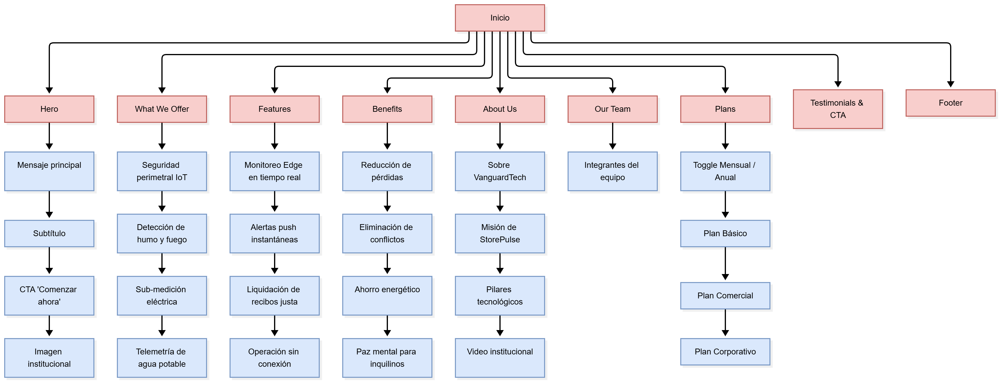
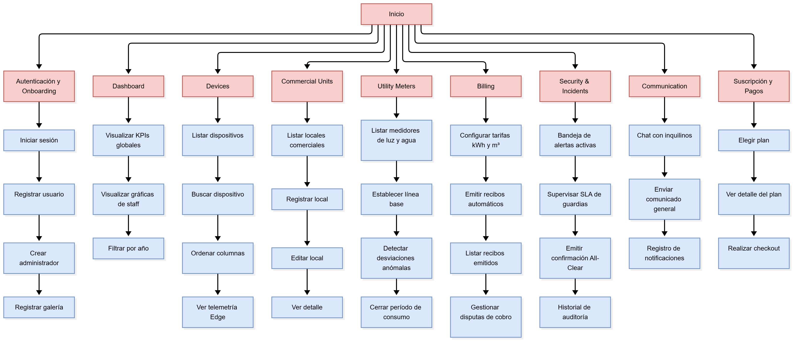
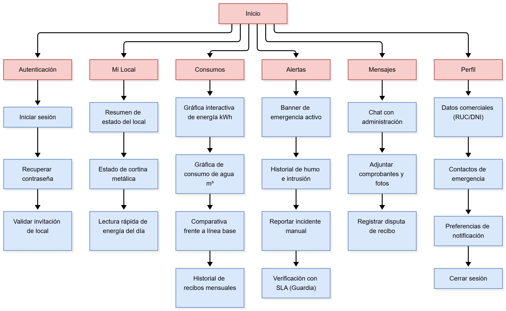

# 5.2. Information Architecture

### 5.2.1. Organization Systems

La organización jerárquica del Landing Page de "StorePulse" ha sido diseñada con el propósito de guiar al usuario de manera lógica y efectiva desde su primer contacto con la solución hasta su conversión en cliente. Esta estructura responde a principios de arquitectura de la información que priorizan la claridad, la relevancia y la progresión natural del contenido, permitiendo que los usuarios comprendan de inmediato el valor del producto, cómo funciona, sus beneficios, y los pasos para adquirirlo.

**Inicio**

- **Propósito**: Captar la atención del visitante con un mensaje claro y directo.
- **Contenido**: Nombre del producto, propuesta de valor destacada "El Pulso Inteligente y Seguro de tu Galería Comercial" y llamado a la acción (CTA) "Comenzar ahora →".

**Información explicativa**

- **What We Offer:** Cuatro tarjetas que presentan los servicios principales — Seguridad Perimetral IoT, Detección de Humo y Fuego, Sub-medición Eléctrica y Telemetría de Agua Potable.
- **Features:** Acordeón interactivo con las funcionalidades clave del sistema (Monitoreo Edge en Tiempo Real, Alertas Push Instantáneas, Liquidación Justa de Recibos y Operación Offline) acompañado de un video institucional embebido.
- **Benefits:** Cuatro tarjetas con imagen que detallan los beneficios diferenciadores para administraciones y comerciantes (Reducción de Pérdidas por Siniestros, Eliminación de Conflictos de Cobro, Ahorro Energético Comprobable y Paz Mental).
- **About Us:** Información sobre VanguardTech y la misión de StorePulse, complementada con un video institucional.
- **Our Team:** Grilla con los integrantes del equipo de desarrollo, cada uno con foto, rol y descripción profesional.

**Conversión**

- **Plans:** Detalle de los distintos planes de suscripción disponibles — Plan Básico, Plan Comercial y Plan Corporativo — con toggle Monthly/Annually.
- **Testimonials & CTA:** Reseñas de clientes que usaron la aplicación y CTA final "Suscribirme" para iniciar la suscripción.

  

Además la arquitectura jerárquica en la interfaz de la aplicación web de "StorePulse" ha sido diseñada para facilitar el acceso y gestión eficiente de las múltiples funcionalidades del sistema. Esta estructura permite una distribución lógica del contenido, reduciendo la carga cognitiva del usuario y mejorando su capacidad para encontrar rápidamente las herramientas que necesita.

  

**Pantalla de inicio**

Una vista de bienvenida pre-login con el mensaje principal de StorePulse y los accesos a Iniciar Sesión, Registrar Usuario y Registrar Galería. Tras autenticarse, el usuario aterriza en un Dashboard tipo analítico con KPIs operativos, consumos acumulados y gráficas filtrables por año.

**Navegación principal**

Sistema jerárquico accesible desde un menú lateral con iconografía clara. Incluye las siguientes pestañas:

- Dashboard
- Devices
- Commercial Units
- Utility Meters
- Billing
- Security & Incidents
- Subscription

**Filtrado y organización avanzada**

**a. Para el Administrador de la galería comercial**

- **Filtros por:** Código de local, nombre del inquilino, piso/sector de la galería y nombre del dispositivo IoT.
- **Funcionalidades destacadas:** Gestión de locales comerciales, inquilinos y personal de seguridad; asignación de dispositivos IoT; configuración inicial de tarifas de luz y agua; administración del plan de suscripción SaaS.

**b. Para el Técnico de Mantenimiento**

- **Filtros por:** Estado operativo del nodo IoT (Normal, Offline, Falla de Sensor, Batería Baja) y tipo de suministro (electricidad o agua).
- **Funcionalidades destacadas:** Consulta de telemetría de medidores en tiempo real, revisión del historial de conectividad y calibración de parámetros de consumo para que el sistema detecte anomalías fuera del horario comercial.

**Segmentación por audiencia**

**a. Administrador de la galería comercial**

- Enfoque en la gestión operativa: registro de locales, alta de inquilinos, emisión de recibos mensuales y supervisión del cumplimiento de seguridad de los guardias.
- Visualización del dashboard analítico con KPIs (Locales Activos, Recaudación Mensual, Consumo Total de Energía, Incidentes del Mes) y administración del flujo de suscripción y facturación.

**b. Técnico de Mantenimiento**

- Acceso al monitoreo técnico de la red IoT y consulta del estado de hardware para garantizar la continuidad operativa de los sensores y medidores.
- Definición de los parámetros de consumo (líneas base de energía y agua por local) para que el sistema genere alertas automáticas ante sobrecargas o fugas nocturnas.

Por último, la arquitectura jerárquica de la aplicación móvil de "StorePulse" prioriza la consulta rápida y la respuesta inmediata, organizándose alrededor del rol del usuario. Esta estructura permite que el comerciante inquilino acceda con un solo gesto al estado de su local comercial y que el personal de seguridad reciba notificaciones críticas y registre inspecciones directamente desde el campo.

  

**Pantalla de inicio**

Para el inquilino, una vista simplificada del estado actual del local comercial vinculado (cortina metálica cerrada, ausencia de humo y consumo de energía al día) con un mensaje claro y tranquilizador. Para el personal de seguridad, una lista de las alertas críticas pendientes por verificar con accesos directos al cronómetro de respuesta.

**Navegación principal**

Sistema jerárquico accesible desde una bottom navigation bar con iconografía clara. Incluye las siguientes pestañas:

- Mi Local
- Consumos
- Alertas
- Mensajes
- Perfil

**Filtrado y organización avanzada**

**a. Para el Personal de Seguridad (Guardia)**

- **Filtros por:** Alertas asignadas al turno actual y tipo de evento (intrusión, humo, pánico).
- **Funcionalidades destacadas:** Monitoreo de alertas críticas en tiempo real de los locales de la galería, registro de inspecciones físicas durante la ronda y atención inmediata de conatos de emergencia con confirmación de All-Clear.

**b. Para el Administrador de la galería comercial**

- **Filtros por:** Alertas críticas activas, locales con recibos vencidos y mensajes pendientes de inquilinos.
- **Funcionalidades destacadas:** Supervisión rápida del estado de la galería desde el campo, recepción de notificaciones críticas y consulta del cumplimiento de rondas de seguridad.

**c. Para el Inquilino (Tenant)**

- **Filtros por:** Rango de fechas en el historial de consumos de energía eléctrica y agua potable.
- **Funcionalidades destacadas:** Consulta del estado actual de su local, recepción de notificaciones push ante aperturas no autorizadas fuera de horario y revisión detallada de sus recibos de suministros.

**Segmentación por audiencia**

**a. Personal de Seguridad (Guardia)**

- Consulta de las alertas de seguridad en tiempo real de los locales asignados a su sector de vigilancia.
- Registro de verificaciones presenciales en la bitácora para garantizar la trazabilidad del resguardo de la galería comercial.
- Bandeja de emergencias con cronómetro regresivo de SLA (15 minutos) para intervención inmediata.

**b. Administrador de la galería comercial**

- Supervisión remota del estado operativo y patrimonial de la galería desde el dispositivo móvil.
- Recepción de notificaciones críticas y consulta rápida de incidentes pendientes para coordinar la respuesta de los guardias.

**c. Inquilino (Tenant)**

- Acceso al estado de seguridad de su propio local y visualización del consumo energético del día.
- Consulta del historial de consumo eléctrico y agua con desglose gráfico por semana y mes.
- Recepción de notificaciones push inmediatas ante detección de intrusión o humo en su negocio.

---

### 5.2.2. Labeling Systems

El sistema de etiquetado de "StorePulse" ha sido diseñado para ser claro, directo y fácil de entender, usando palabras clave con un número mínimo de términos sin perder precisión comercial y técnica. Las etiquetas evitan tecnicismos innecesarios y buscan reducir la carga cognitiva del usuario, adaptando el lenguaje al rol que las consume.

**Principios:**

- **Consistencia**: Se usan las mismas etiquetas en botones, menús y mensajes relacionados (por ejemplo: "Registrar Local", "Asignar Inquilino", "Ver Detalle", "Iniciar Sesión", "Cerrar Sesión").
- **Simplicidad**: Se evita el uso de jergas técnicas o frases largas. Ejemplos: "Consumo de Hoy", "Alerta Crítica", "Historial de Recibos", "Plan Comercial".
- **Bilingüismo**: La plataforma soporta inglés y español mediante `ngx-translate` en la aplicación web y atributos `data-i18n` en el Landing Page, permitiendo al usuario alternar de idioma sin perder el contexto.

**Etiquetado en la Aplicación Móvil:**

- **Mi Local**: Pantalla principal donde el inquilino accede al estado de seguridad de su local vinculado o el personal de seguridad visualiza las alertas pendientes del turno.
- **Consumos**: Sección donde se consultan los valores acumulados de energía eléctrica (kWh) y agua potable (m³) en tiempo real.
- **Alertas**: Centro unificado de alertas críticas de intrusión y humo, con indicador de verificación y botón de confirmación de calma.
- **Mensajes**: Canal de comunicación directa entre el comerciante y la administración de la galería, incluyendo gestión de disputas de cobro.
- **Perfil**: Acceso a la información comercial del inquilino (RUC/DNI), configuración de preferencias de notificación y opción para cerrar sesión.

**Etiquetado en la Aplicación Web:**

- **Dashboard**: Panel principal donde se visualizan los KPIs operativos (Locales Activos, Consumo Global, Alertas del Mes, Recaudación) y las gráficas filtrables por año.
- **Devices**: Sección de gestión de los dispositivos IoT de la galería, con listado tabular, búsqueda por nombre y ordenamiento por columnas (Device ID, Assigned By, Assigned At, Status).
- **Commercial Units**: Sección donde se registran, consultan y editan los locales comerciales de la galería, junto con sus subrecursos (inquilino asignado, metraje y medidores vinculados).
- **Utility Meters**: Sección de monitoreo de medidores de energía eléctrica y agua, incluyendo calibración de líneas base y detección de anomalías.
- **Billing**: Sección donde se generan, consultan y concilian los recibos mensuales individuales de luz y agua, con control de cobranza y disputas.
- **Security & Incidents**: Centro de auditoría y gestión de eventos de seguridad, tiempos de respuesta de los guardias y bitácora de emergencias.
- **Suscripción y Pagos**: Flujo dedicado para elegir el plan SaaS (Básico, Comercial o Corporativo), revisar sus detalles y procesar el checkout vía Stripe.
- **Autenticación**: Acceso a Iniciar Sesión, Registrar Usuario y Registrar Administrador desde el toolbar superior, junto con la opción de Cerrar Sesión cuando la sesión está activa.

**Etiquetado en el Landing Page:**

- **Home**: Primera sección que el visitante ve al entrar. Resume qué es StorePulse con el mensaje "El Pulso Inteligente y Seguro de tu Galería Comercial" y capta la atención con el CTA "Comenzar ahora →".
- **What We Offer**: Presenta los servicios principales que ofrece StorePulse — Seguridad Perimetral IoT, Detección de Humo y Fuego, Sub-medición Eléctrica y Telemetría de Agua Potable.
- **Features**: Acordeón interactivo con las funcionalidades clave de la plataforma (Monitoreo Edge en Tiempo Real, Alertas Push Instantáneas, Liquidación Justa de Recibos, Operación Offline) acompañado de un video institucional.
- **Benefits**: Resalta los beneficios diferenciadores de StorePulse para galerías y comerciantes (Reducción de Pérdidas por Siniestros, Eliminación de Conflictos de Cobro, Ahorro Energético Comprobable, Paz Mental).
- **About Us**: Información sobre VanguardTech y la misión de StorePulse, complementada con un video institucional que refuerza la propuesta de valor.
- **Our Team**: Presenta a los integrantes del equipo de desarrollo con foto, rol y descripción profesional, generando confianza en el visitante.
- **Plans**: Presenta los planes de suscripción disponibles (Plan Básico, Plan Comercial y Plan Corporativo) con toggle Monthly/Annually, precio, descripción y CTAs específicos.
- **Testimonials & CTA**: Incluye reseñas reales de administradores de galerías y un CTA final "Suscribirme" para iniciar el proceso de suscripción.

---

### 5.2.3. SEO Tags and Meta Tags

Con el objetivo de mejorar la visibilidad de "StorePulse" en los motores de búsqueda y facilitar su descubrimiento por administradores de galerías comerciales, miembros de juntas directivas, técnicos y comerciantes que buscan soluciones digitales para la seguridad y gestión de suministros en locales comerciales, se ha establecido una estrategia SEO que incluye el uso adecuado de etiquetas HTML y elementos ASO para los principales elementos informativos de la aplicación móvil, la aplicación web y el Landing Page.

**ASO (App Store Optimization) Elements**

Para la aplicación móvil de StorePulse, distribuida a través de Google Play Store y Apple App Store, se definen los ASO (App Store Optimization) elements como App Title, App Subtitle, App Keywords, Short Description y Long Description.

**Google Play Store / App Store**

- **App Title:**  
    `StorePulse – Seguridad y Consumo`

Título directo de 30 caracteres que incluye la marca y la propuesta de valor principal de la app.

- **App Subtitle:**  
    `Monitoreo de locales comerciales`

Subtítulo complementario de 31 caracteres que especifica el público objetivo y el foco funcional de la aplicación.

- **App Keywords:** (Apple App Store)  
    `galeria,comercial,local,tienda,seguridad,intrusion,humo,energia,agua,medidor,facturacion,iot,storepulse`

Palabras clave separadas por comas, optimizadas para búsquedas relevantes en la App Store de iOS, cubriendo público objetivo, funcionalidades y dominio de seguridad y suministros.

- **Short Description:** (Google Play Store – 80 caracteres)  
    `Supervisa la seguridad y el consumo de agua y luz de tu local comercial con IoT`

Descripción breve que destaca el beneficio principal dentro del límite de caracteres.

> Transforma la seguridad y el control de tu negocio con StorePulse, la aplicación móvil que te permite:  
> ✓ Monitorear el estado de tu local comercial en tiempo real  
> ✓ Recibir alertas críticas de intrusión o humo con notificaciones push inmediatas  
> ✓ Consultar el historial de consumo de luz y agua con filtro por período  
> ✓ Mantener contacto continuo con la administración de la galería  
> ✓ Acceder al estado de tu stand o negocio desde cualquier lugar  
> 
> CARACTERÍSTICAS PRINCIPALES:  
> • Dashboard simplificado para inquilinos con el estado actual del local  
> • Monitoreo continuo de apertura de cortinas metálicas, sensores de humo y energía  
> • Alertas configurables con deep link al detalle del evento  
> • Historial cronológico de consumos de electricidad (kWh) y agua potable (m³)  
> • Interfaz adaptada por rol (inquilino, personal de seguridad y administrador)  
> • Sincronización con dispositivos IoT de la galería comercial  
> 
> Ideal para propietarios e inquilinos de locales comerciales, personal de seguridad privada y administradores que buscan una solución integral para el monitoreo y resguardo de la galería comercial.  
> 
> Descarga StorePulse y mantén siempre protegido y controlado tu negocio, sin importar la distancia.

---

**Aplicación Web**

Para la aplicación web desarrollada en Angular, se definieron etiquetas SEO específicas para el panel principal de administración, con el fin de reforzar su posicionamiento y mejorar la experiencia de búsqueda dentro del ecosistema digital de StorePulse.

- **Title:**  
    `<title>Panel de Administración – StorePulse | Gestiona locales, inquilinos y dispositivos IoT</title>`

Este título complementa el nombre de la aplicación con una invitación clara a la acción, enfocada en las principales tareas que el administrador puede realizar desde el panel de control.

- **Meta Description:**  
    `<meta name="description" content="Plataforma web de StorePulse para administradores de galerías comerciales. Gestiona locales, inquilinos, medidores y dispositivos IoT. Monitorea consumos de luz y agua en tiempo real, supervisa alertas de seguridad perimetral y automatiza la facturación desde un solo panel.">`

La descripción presenta de manera clara las funciones principales del panel y resalta su utilidad como centro operativo de la plataforma para personal administrativo.

- **Meta Keywords:**  
    `<meta name="keywords" content="gestión de galería comercial, monitoreo IoT, sub-medición de energía, lectura de agua, locales comerciales, seguridad perimetral, detección de humo, dashboard administrativo, plataforma StorePulse">`

Estas palabras clave están orientadas al contexto de uso de la aplicación web y reflejan acciones concretas relacionadas con la gestión operativa y de seguridad de la galería comercial.

- **Meta Author:**  
    `<meta name="author" content="Equipo VanguardTech – Desarrollo Web 2026">`

Este atributo incorpora la referencia al equipo responsable y al año de desarrollo, reforzando la actualidad y vigencia del sistema.

---

**Landing Page**

- **Title:**  
    `<title>StorePulse – El Pulso Inteligente y Seguro de tu Galería Comercial</title>`

Una frase concisa que refleja la propuesta de valor de la plataforma y contiene palabras clave como "seguro" e "inteligente", términos asociados a la protección comercial y la innovación tecnológica.

- **Meta Description:**  
    `<meta name="description" content="StorePulse es una plataforma digital de monitoreo inteligente para galerías comerciales y centros de compras. Supervisa seguridad perimetral en tiempo real con dispositivos IoT, accede a la medición transparente de agua y luz de tu local y optimiza la convivencia comercial sin importar la distancia.">`

Esta descripción amplía la explicación del producto, destacando sus beneficios clave y diferenciadores, a la vez que integra términos como "plataforma digital", "monitoreo en tiempo real", "dispositivos IoT" y "medición transparente de agua y luz".

- **Meta Keywords:**  
    `<meta name="keywords" content="galería comercial, monitoreo IoT, locales comerciales, seguridad perimetral, alarma de humo, sub-medición de luz, medidor de agua, cobro justo, plataforma digital comercial, StorePulse, VanguardTech">`

Un conjunto seleccionado de palabras y frases clave que abarca tanto el público objetivo (galerías comerciales, propietarios, comerciantes) como las funcionalidades (monitoreo IoT, alarmas de seguridad, telemetría de suministros).

- **Meta Author:**  
    `<meta name="author" content="Equipo VanguardTech – Diseño UX/UI y Desarrollo Web 2026">`

Incluye una referencia al equipo responsable del diseño y desarrollo del producto, lo cual apoya en términos de confianza y atribución de contenido.