# 5.3. Landing Page UI Design

En esta sección se presenta el diseño de la interfaz de usuario para la Landing Page de StorePulse. La propuesta busca comunicar de manera clara la solución, sus beneficios y funcionamiento, así como facilitar el acceso de los usuarios a las aplicaciones de la plataforma.

El diseño de la Landing Page considera la organización y jerarquización de la información definida para StorePulse, incorporando los principales elementos de navegación, llamados a la acción y contenidos necesarios para orientar al visitante hacia los puntos de acceso correspondientes.

## 5.3.1. Landing Page Wireframe

Se presentan los wireframes de baja fidelidad que definen la estructura base de la Landing Page de StorePulse. Estos wireframes permiten establecer la disposición de los bloques de contenido, la jerarquía de la información y la ubicación de los principales llamados a la acción (CTA), antes de incorporar los elementos visuales definitivos.

La propuesta considera las versiones para Desktop Web Browser y Mobile Web Browser, manteniendo la organización de la información y adaptando la distribución de los elementos a las características de cada tamaño de pantalla.

### 5.3.1.1. Desktop Web Browser

Los wireframes de la versión Desktop Web Browser se presentan mediante las principales estructuras que conforman la Landing Page de StorePulse. Cada propuesta permite identificar la distribución de los elementos, la jerarquía de información y la ubicación de los componentes antes de aplicar el diseño visual definitivo.

**Propuesta de Valor**

Estructura de dos columnas que organiza el título, descripción y llamados a la acción junto con un espacio destinado al recurso visual principal de StorePulse.

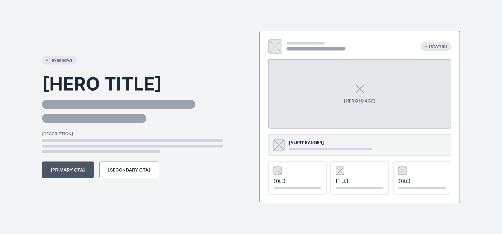

**Beneficios**

Estructura centrada con un título principal y una distribución de tres tarjetas informativas para presentar los principales beneficios de StorePulse.

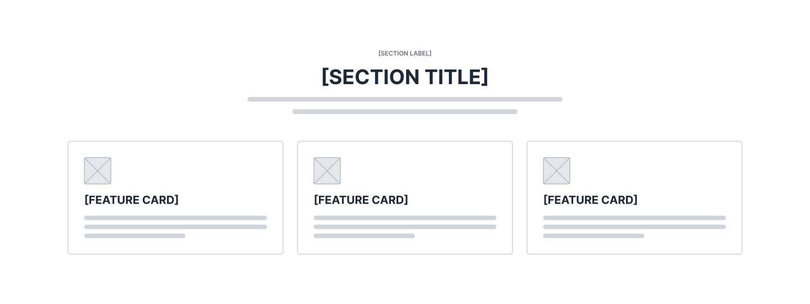

**Aplicaciones por Segmento**

Estructura de dos paneles diferenciados que organiza las principales funcionalidades de StorePulse para administradores de galerías e inquilinos.

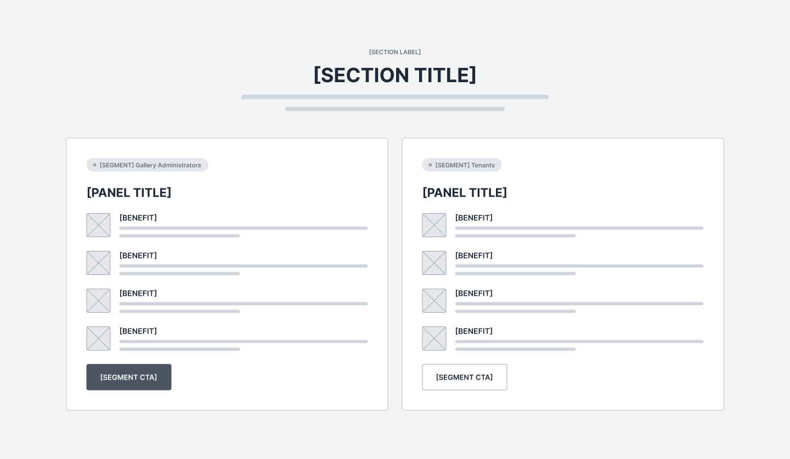

**Funcionamiento de StorePulse**

Composición basada en un contenedor multimedia principal y una distribución inferior de tres pasos para representar el funcionamiento general de StorePulse.

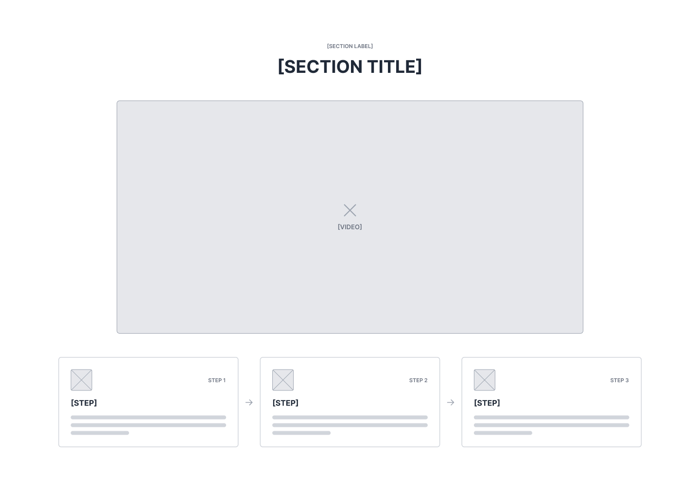

**Planes de Suscripción**

Estructura horizontal que organiza información resumida de los planes de suscripción y un llamado a la acción para acceder a ellos.

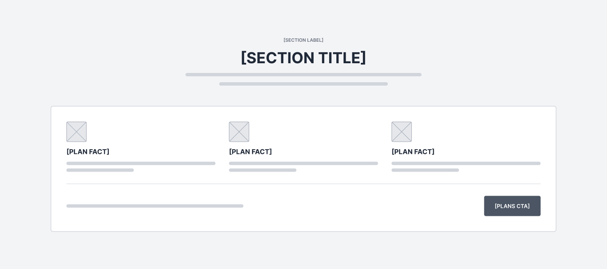

**Preguntas Frecuentes**

Estructura organizada para presentar preguntas y respuestas frecuentes relacionadas con StorePulse, facilitando la consulta de información relevante.

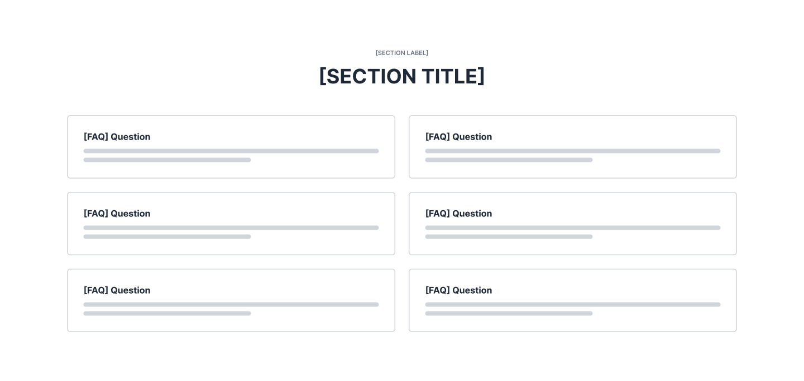

**Equipo**

Estructura visual destinada a presentar a los integrantes del equipo mediante elementos gráficos y datos identificativos organizados de manera uniforme.

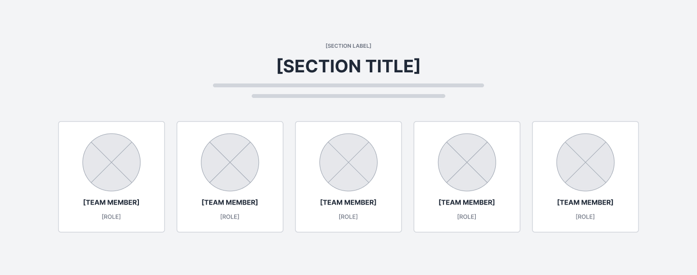

**Llamado a la Acción**

Estructura centrada que presenta un mensaje final y un llamado a la acción para orientar al visitante hacia el acceso correspondiente a StorePulse.

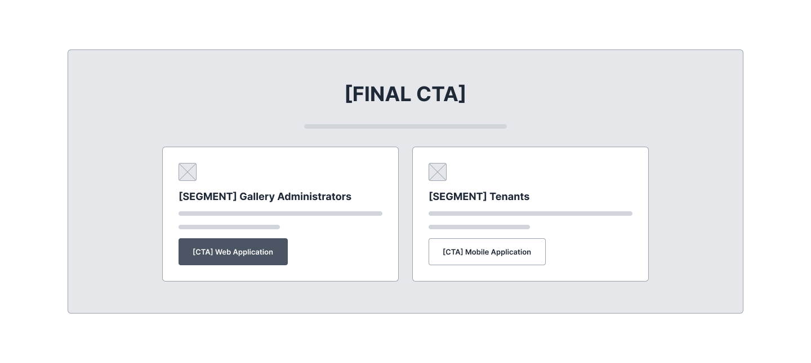

**Pie de Página**

Estructura inferior que organiza los elementos finales de navegación e información de la Landing Page de StorePulse.

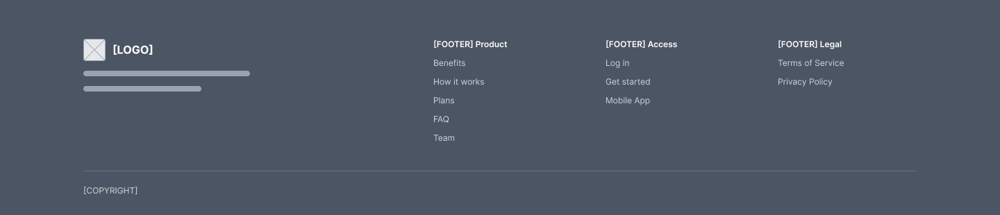

### 5.3.1.2. Mobile Web Browser

Los wireframes de la versión Mobile Web Browser adaptan la estructura de la Landing Page de StorePulse a una distribución vertical, manteniendo la jerarquía de información y los principales elementos definidos para la versión Desktop.

**Propuesta de Valor**

Estructura vertical que organiza el título, descripción, llamados a la acción y recurso visual principal para facilitar su visualización en dispositivos móviles.

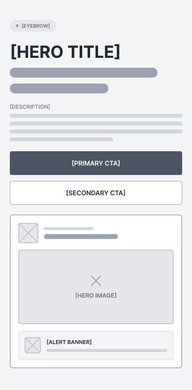

**Beneficios**

Distribución vertical de las tarjetas informativas para presentar los principales beneficios de StorePulse en una pantalla móvil.

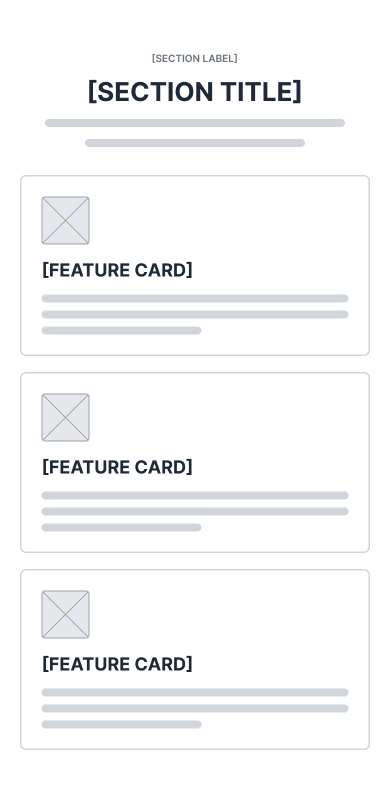

**Aplicaciones por Segmento**

Organización vertical de los contenidos dirigidos a administradores de galerías e inquilinos, adaptando los paneles a las dimensiones de la pantalla móvil.

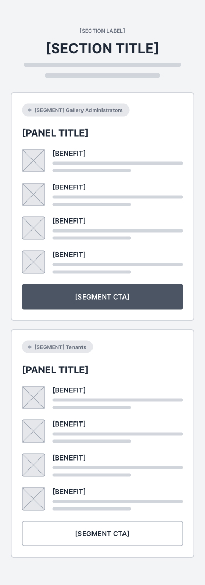

**Funcionamiento de StorePulse**

Distribución vertical del contenido multimedia y los pasos principales que representan el funcionamiento de StorePulse.

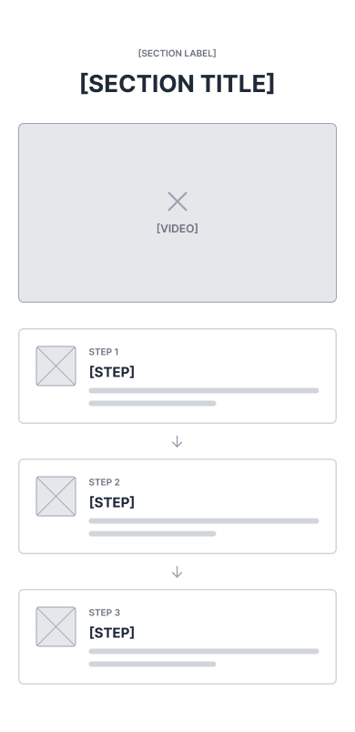

**Planes de Suscripción**

Organización vertical de la información de los planes de suscripción y su correspondiente llamado a la acción para facilitar su consulta desde dispositivos móviles.

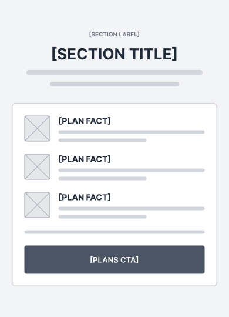

**Preguntas Frecuentes**

Estructura vertical para organizar las preguntas y respuestas frecuentes de StorePulse, facilitando su consulta desde dispositivos móviles.

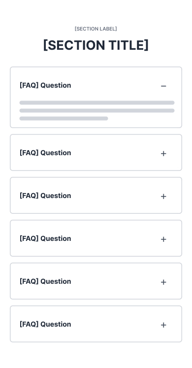

**Equipo**

Distribución vertical de los integrantes del equipo, manteniendo una presentación uniforme de sus elementos identificativos.

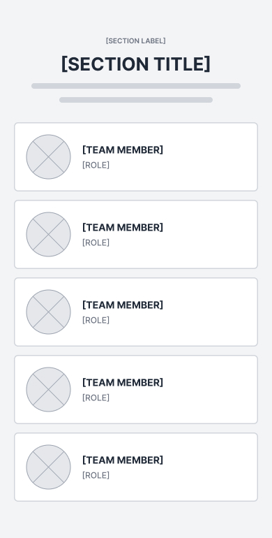

**Llamado a la Acción**

Estructura vertical que presenta el mensaje final y el llamado a la acción para orientar al visitante hacia el acceso correspondiente a StorePulse.

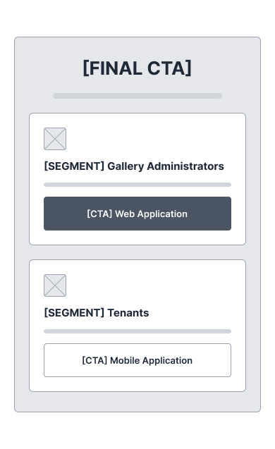

**Pie de Página**

Estructura vertical que organiza los elementos finales de navegación e información de la Landing Page para dispositivos móviles.

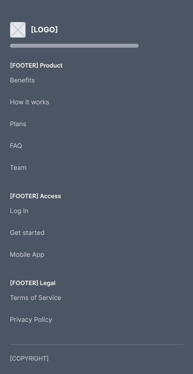

## 5.3.2. Landing Page Mock-up

La propuesta de mock-up incorpora los elementos visuales definidos para StorePulse sobre la estructura establecida en los wireframes, permitiendo representar la apariencia final de la Landing Page y la aplicación del diseño visual.

### 5.3.2.1. Desktop Web Browser

La versión Desktop Web Browser presenta la propuesta visual de la Landing Page de StorePulse adaptada a una pantalla de escritorio, incorporando la identidad visual, tipografía, colores, componentes y recursos gráficos definidos para la interfaz.

**Propuesta de Valor**

Diseño visual de la propuesta de valor de StorePulse mediante una composición de dos columnas que integra el mensaje principal, llamados a la acción y un recurso visual relacionado con la plataforma.

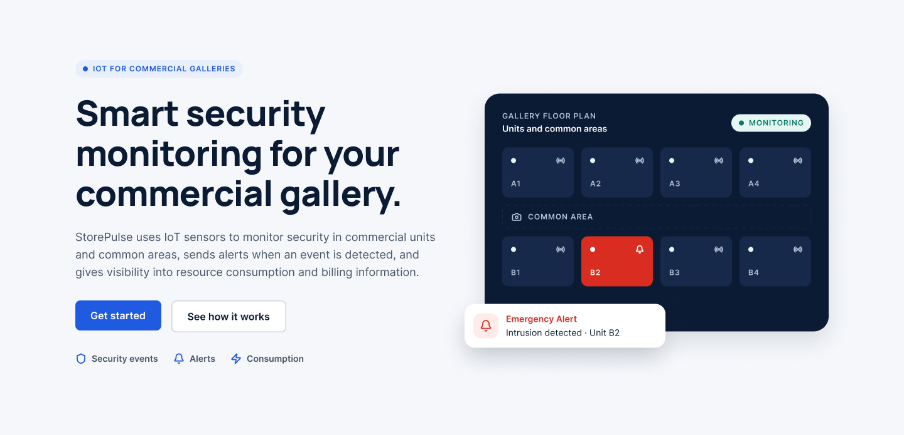

**Beneficios**

Diseño visual de los principales beneficios de StorePulse mediante un título central y tres tarjetas organizadas de forma horizontal.

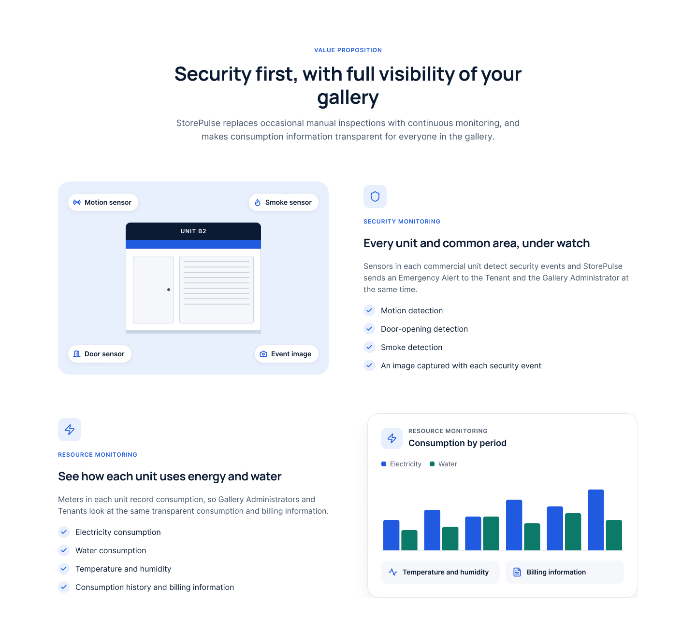

**Aplicaciones por Segmento**

Diseño visual de las funcionalidades dirigidas a administradores de galerías e inquilinos mediante dos paneles diferenciados.

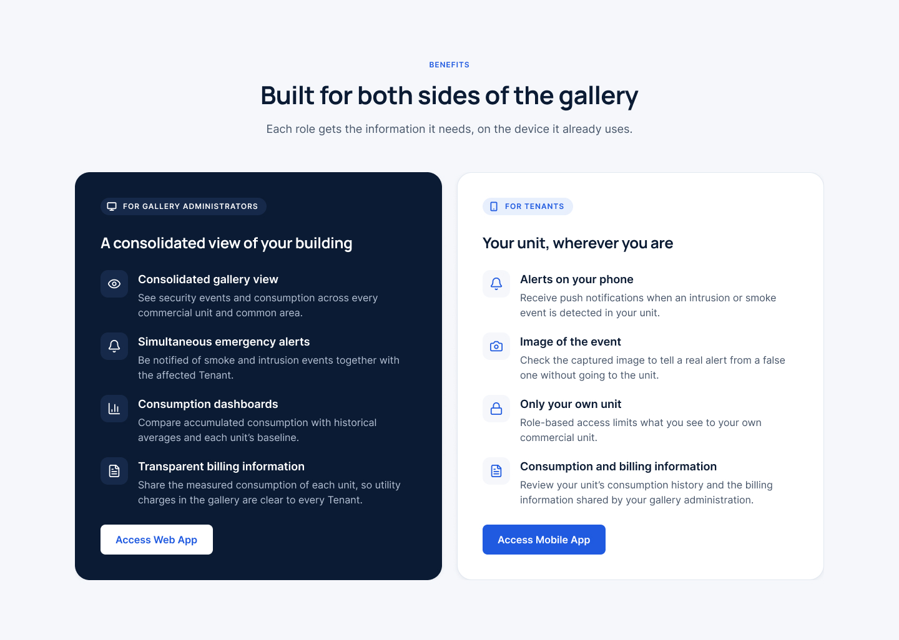

**Funcionamiento de StorePulse**

Diseño visual del funcionamiento de StorePulse mediante un recurso multimedia principal y tres pasos que representan el flujo general de la solución.

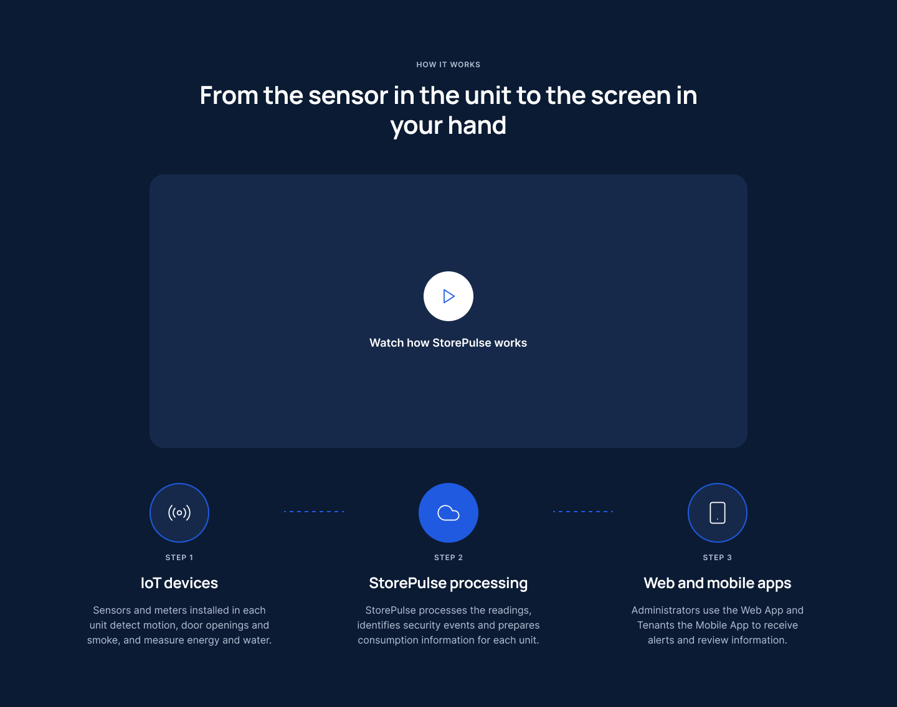

**Planes de Suscripción**

Diseño visual de los planes de suscripción mediante información resumida y un llamado a la acción integrado en la composición.

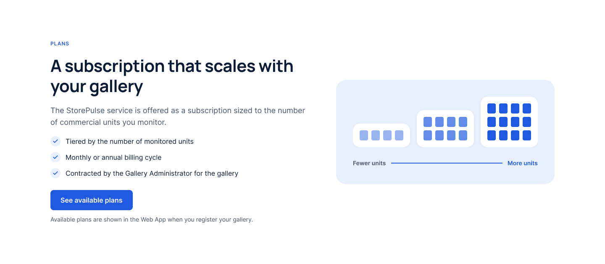

**Preguntas Frecuentes**

Diseño visual de las preguntas frecuentes mediante una estructura organizada que facilita la consulta de información sobre StorePulse.

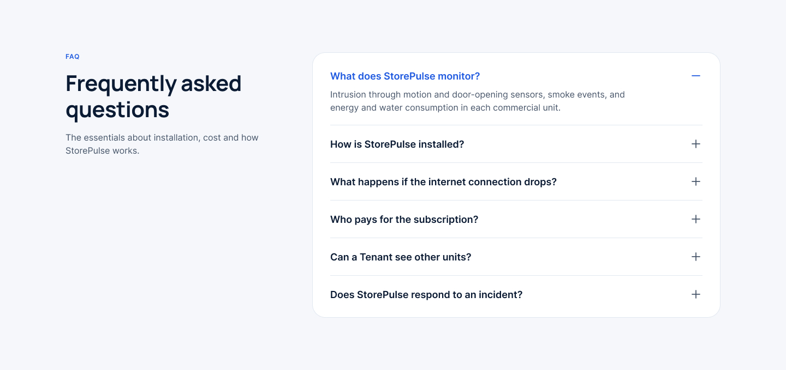

**Equipo**

Diseño visual destinado a presentar a los integrantes del equipo mediante fotografías, nombres y una distribución uniforme de los elementos.

**Llamado a la Acción**

Diseño visual del llamado a la acción final mediante un mensaje destacado y un botón orientado al acceso correspondiente a StorePulse.

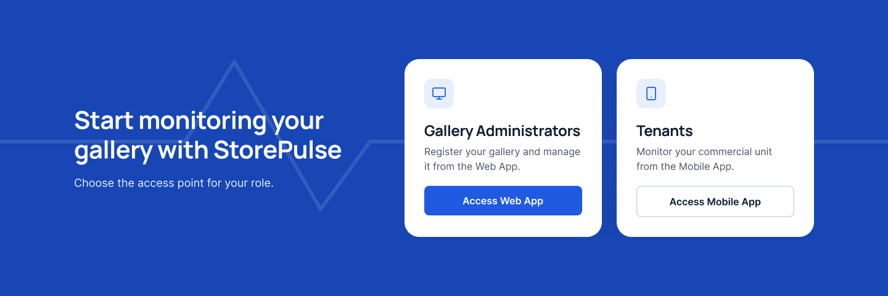

**Pie de Página**

Diseño visual del pie de página que reúne los elementos finales de navegación e información de la Landing Page.

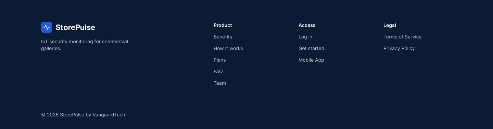

### 5.3.2.2. Mobile Web Browser

La versión Mobile Web Browser adapta la propuesta visual de la Landing Page a dispositivos móviles, reorganizando los contenidos y componentes de manera vertical para mantener una experiencia de navegación consistente.

**Propuesta de Valor**

Adaptación visual de la propuesta de valor de StorePulse a una estructura vertical, manteniendo el mensaje principal, los llamados a la acción y el recurso visual.

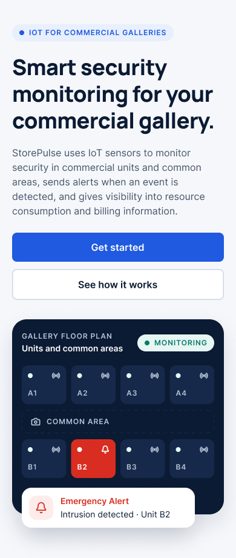

**Beneficios**

Adaptación visual de las tarjetas de beneficios a una distribución vertical que facilita su lectura e interacción en dispositivos móviles.

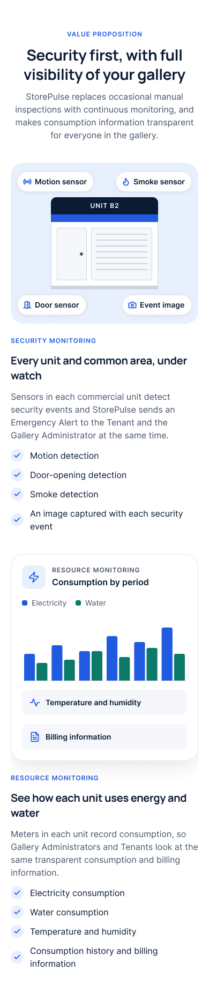

**Aplicaciones por Segmento**

Adaptación visual de los contenidos para administradores de galerías e inquilinos mediante una disposición vertical de los paneles.

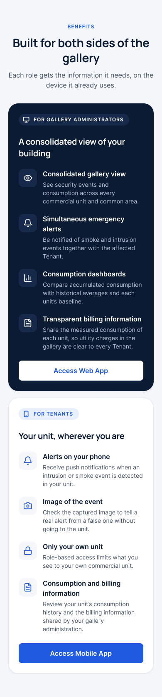

**Funcionamiento de StorePulse**

Adaptación visual del contenido multimedia y del flujo de funcionamiento a una disposición vertical para dispositivos móviles.

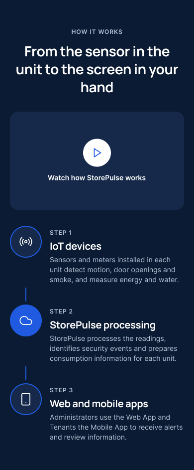

**Planes de Suscripción**

Adaptación visual de los planes de suscripción a una estructura vertical que facilita su consulta y el acceso al llamado a la acción.

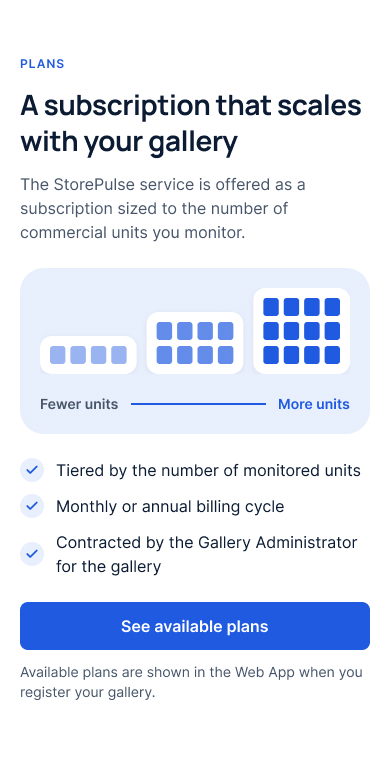

**Preguntas Frecuentes**

Adaptación visual de las preguntas frecuentes a una estructura vertical que facilita la consulta desde dispositivos móviles.

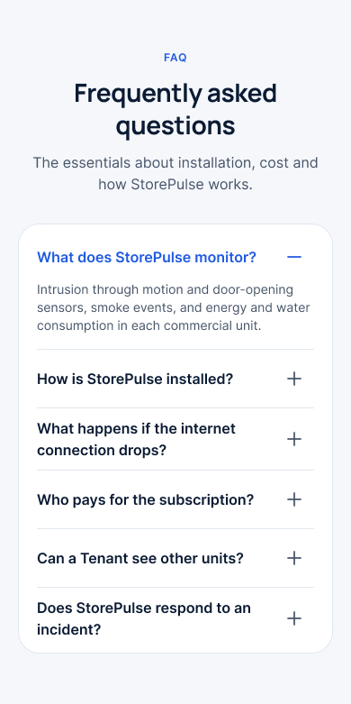

**Equipo**

Adaptación visual de la presentación del equipo a una distribución vertical, manteniendo una identificación clara de sus integrantes.

**Llamado a la Acción**

Adaptación visual del llamado a la acción final a una composición vertical que facilita el acceso desde dispositivos móviles.

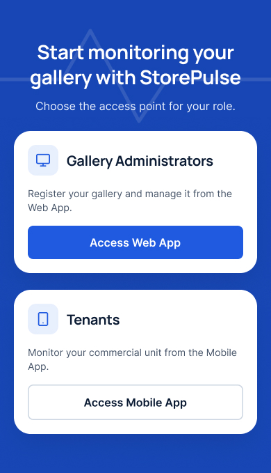

**Pie de Página**

Adaptación visual del pie de página a una estructura vertical que organiza los elementos finales de navegación e información.

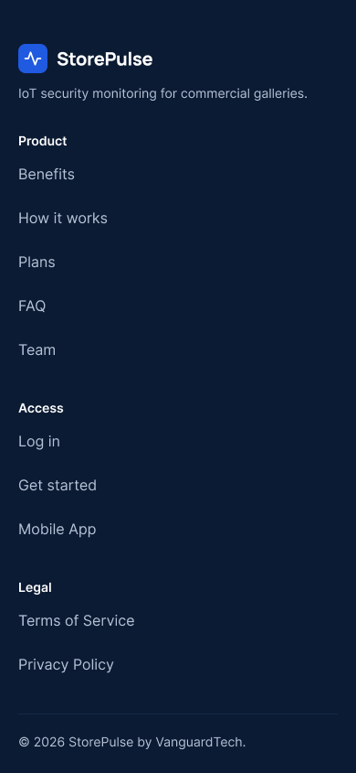