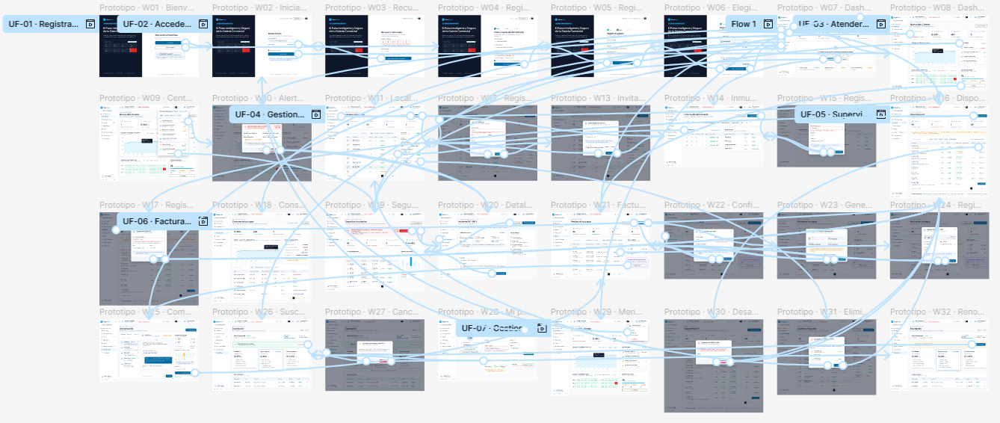
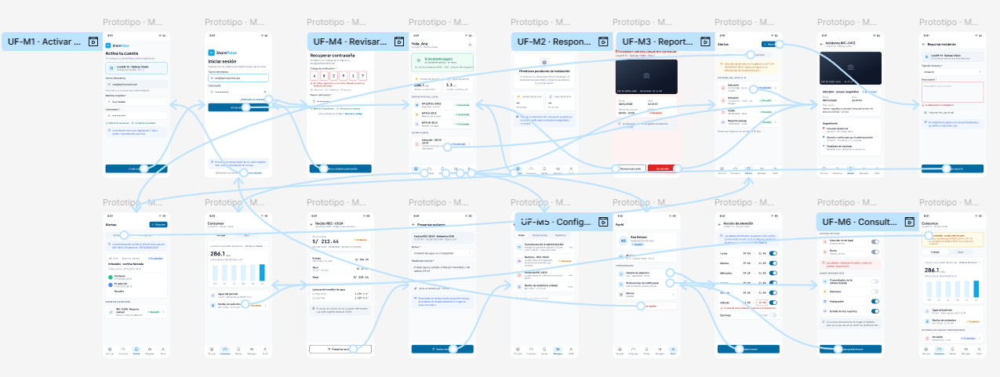

# 5.5. Applications Prototyping

En esta sección se presentan los prototipos interactivos de las aplicaciones de StorePulse, elaborados en Figma a partir de los Mock-ups (5.4.3) y siguiendo los recorridos definidos en los User Flow Diagrams (5.4.4). Los prototipos permiten simular la navegación real de la solución, validar que cada pantalla cumpla un propósito dentro del recorrido del usuario y detectar puntos de mejora antes de la implementación. Para cada plataforma se adjunta una vista general del prototipo y el enlace al video de demostración.

## 5.5.1. Web Browser Prototype

El prototipo Web Browser de StorePulse corresponde a la aplicación web dirigida al administrador de la galería comercial, diseñada para usarse desde una computadora o pantalla de mayor tamaño. Esta versión aprovecha el espacio disponible para mostrar la información de forma amplia y ordenada mediante un menú lateral con los módulos principales (Dashboard, Commercial Units, Devices, Utility Meters, Billing, Security & Incidents, Communication y Subscription), tarjetas de indicadores, tablas y gráficos, de modo que el administrador identifique con facilidad el estado de la galería, de sus locales y de sus dispositivos.

El prototipo está conformado por 32 pantallas (W01 a W32) conectadas según los siete User Flows de la aplicación web: registrar la galería y activar la suscripción (UF-01), acceder a la plataforma y recuperar la contraseña (UF-02), atender una alerta de intrusión (UF-03), gestionar locales e invitar inquilinos (UF-04), supervisar los dispositivos IoT (UF-05), facturar el consumo y registrar pagos (UF-06) y gestionar la suscripción y el perfil (UF-07). A través del prototipo se simulan interacciones como el registro e inicio de sesión, la navegación entre módulos desde el dashboard, el uso de formularios, la revisión de detalles, los mensajes de confirmación y los estados de error, manteniendo una experiencia clara y consistente con las Style Guidelines definidas en la sección 5.1.

Vista general del prototipo en Figma:

  

Enlace del video de demostración:

[LINK VIDEO WEB](https://upcedupe-my.sharepoint.com/:v:/g/personal/u20191b935_upc_edu_pe/IQBdvknhLzD6R50YbbDb9vkGAXUI14X8-CgJlL-1RcEUbHM?nav=eyJyZWZlcnJhbEluZm8iOnsicmVmZXJyYWxBcHAiOiJTdHJlYW1XZWJBcHAiLCJyZWZlcnJhbFZpZXciOiJTaGFyZURpYWxvZy1MaW5rIiwicmVmZXJyYWxBcHBQbGF0Zm9ybSI6IldlYiIsInJlZmVycmFsTW9kZSI6InZpZXcifX0%3D&e=Jq44hw)

## 5.5.2. Mobile Application Prototype

El prototipo Mobile Application de StorePulse corresponde a la aplicación móvil dirigida al inquilino del local comercial, pensada para consultarse de forma rápida desde el celular. Esta versión organiza el contenido en una sola columna, con una barra de navegación inferior que da acceso directo a las secciones principales (Mi Local, Consumos, Alertas, Mensajes y Perfil), tarjetas de resumen y botones de acción visibles, priorizando la lectura inmediata de alertas y del consumo del local.

Las pantallas del prototipo están conectadas según los seis User Flows de la aplicación móvil: activar la cuenta e ingresar a la app (UF-M1), responder a una alerta de intrusión (UF-M2), reportar un incidente y seguir su estado (UF-M3), revisar el consumo, el recibo y presentar un reclamo (UF-M4), configurar el horario y las notificaciones (UF-M5) y consultar el historial sin conexión (UF-M6). A través del prototipo se simulan interacciones como la activación de la cuenta, la recepción y atención de alertas, el registro de incidentes y reclamos mediante formularios, la consulta de consumos y recibos, y la configuración de preferencias, de modo que el inquilino pueda resolver sus tareas en pocos pasos.

Vista general del prototipo en Figma:

  

Enlace del video de demostración:

[LINK VIDEO MOBILE](https://upcedupe-my.sharepoint.com/:v:/g/personal/u20191b935_upc_edu_pe/IQCtdfrs19ADQoqC2RuKHudBAd__UlvsJJ33qt6qqf6GRhs?nav=eyJyZWZlcnJhbEluZm8iOnsicmVmZXJyYWxBcHAiOiJTdHJlYW1XZWJBcHAiLCJyZWZlcnJhbFZpZXciOiJTaGFyZURpYWxvZy1MaW5rIiwicmVmZXJyYWxBcHBQbGF0Zm9ybSI6IldlYiIsInJlZmVycmFsTW9kZSI6InZpZXcifX0%3D&e=LjXY3I)

