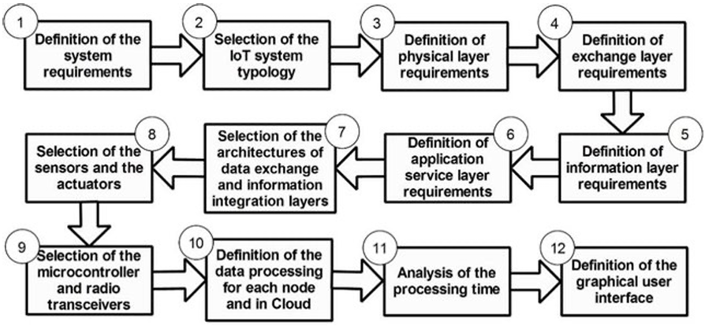

# 5.6. IoT Device Design

Esta sección presenta el diseño de los dispositivos IoT de StorePulse: el nodo de local, el nodo de área común y el Edge Device de la galería. El diseño se sustenta en la metodología de doce pasos para sistemas IoT propuesta por Balestrieri et al. (2018) y se modela en Cirkit Designer.

Las decisiones de diseño responden a cuatro criterios:

- **Continuidad:** la detección y el registro de eventos funcionan sin internet y durante un corte de energía (EP-09).
- **Trazabilidad con los requisitos:** cada función del dispositivo responde a una historia de la sección 3.1 (MS-01 a MS-09).
- **Bajo costo por local:** un mismo nodo reúne seguridad, humo y consumo, con componentes disponibles en el mercado local.
- **Instalación no invasiva:** el nodo se comunica por WiFi y se alimenta de un tomacorriente, sin cableado nuevo entre locales.
- **Interfaz física mínima:** el inquilino no configura nada en el dispositivo. Solo percibe su estado mediante un LED, definido en la guía de estilos de la sección 5.1.2.

La organización del dispositivo sigue la arquitectura de información de la sección 5.2: cada nodo pertenece a un local o a un área común, y el estado que muestra el LED es el mismo que las aplicaciones presentan para ese local.

#### Metodología de diseño IoT en 12 pasos

Los pasos recorren las cuatro capas de la arquitectura de referencia: Physical Layer, Data Exchange Layer, Information Integration Layer y Application Service Layer.



##### Paso 1. Definition of the system requirements

**Suministro de energía**

| ID | Requisito |
|---|---|
| PS-01 | Los nodos se alimentan de la red eléctrica (220 V AC / 60 Hz) mediante una fuente de 5 V / 2 A. |
| PS-02 | Cada nodo tiene respaldo con batería Li-ion 18650 (3,7 V / 2600 mAh, 9,6 Wh), porque el corte de energía coincide con los escenarios de intrusión e incendio. |
| PS-03 | Durante el respaldo se mantienen la detección de intrusión y la de humo. Solo se suspende la medición de consumo, porque sin energía en el local no hay consumo que medir. |
| PS-04 | Autonomía mínima de 3 horas en respaldo (9,6 Wh × 0,8 ÷ 2,1 W ≈ 3,7 h). |
| PS-05 | El Edge Device cuenta con un UPS de al menos 30 minutos. |

**Presupuesto de potencia del nodo de local** (valores de referencia de hojas de datos)

| Carga | Potencia |
|---|---:|
| ESP32 con WiFi activo | 0,80 W |
| Sensor de humo MQ-2 (calefactor permanente) | 0,75 W |
| Medidor eléctrico, caudalímetro, DHT22, PIR, RTC y LED (estimado) | 0,50 W |
| **Total nominal** | **≈ 2,1 W** |
| ESP32-CAM durante la captura | + 1,20 W |
| **Total pico** | **≈ 3,3 W** |

**Restricciones de time-delay**

| ID | Restricción | Límite |
|---|---|---|
| TD-01 | Detección de humo → evento generado | ≤ 1,5 s |
| TD-02 | Detección de humo → notificación push | ≤ 5 s |
| TD-03 | Detección de intrusión → evento generado | ≤ 1 s |
| TD-04 | Detección de intrusión → notificación push | ≤ 5 s |
| TD-05 | Imagen adjunta al evento de intrusión | ≤ 10 s |
| TD-06 | Envío de la lectura de consumo eléctrico y de agua | cada 60 s |
| TD-07 | Sincronización del Edge Device con la nube | ≤ 30 s |

**Restricción de continuidad.** Las restricciones TD-01 y TD-03 se resuelven en el nodo y en el Edge Device, sin depender de la nube. Ante una caída de internet, el evento se genera y se registra localmente (EP-09).

##### Paso 2. Selection of the IoT system typology

Se adopta una tipología de tres niveles. El Edge Device de la galería cumple la función de gateway concentrador del método:

```
Nodos sensores/actuadores  →  Edge Device  →  Cloud  →  Aplicaciones de usuario
  (por local y área común)       (1 por galería)       (REST API)     (Web / Mobile)
```

| Alternativa | Decisión |
|---|---|
| Nodo conectado a la nube por red celular | Descartada. Exige una SIM y un plan de datos por local. |
| Nodo conectado a la nube por el WiFi de cada local | Descartada. Depende del router de cada inquilino y deja de operar sin internet. |
| Nodos → Edge Device → nube | **Aceptada.** Una sola salida a internet por galería y operación local durante cortes de red. |

##### Paso 3. Definition of physical layer requirements

**Perfiles de nodo**

| Perfil | Cantidad | Función |
|---|---|---|
| Nodo de local | 1 por local | Intrusión, humo, consumo eléctrico y consumo de agua |
| Nodo de área común | 1 por pasillo o acceso | Intrusión con imagen en zonas compartidas |

**Sensores y actuadores**

| # | Función | Tipo | Nodo de local | Nodo de área común |
|---|---|---|:-:|:-:|
| N1 | Movimiento | Sensor | ● | ● |
| N2 | Apertura de puerta o cortina | Sensor | ● | |
| N3 | Humo | Sensor | ● | |
| N4 | Imagen del evento | Sensor | ● | ● |
| N5 | Energía eléctrica | Sensor | ● | |
| N6 | Caudal de agua | Sensor | ● (si tiene punto de agua) | |
| N7 | Temperatura y humedad | Sensor | ● | |
| N8 | Indicador de estado | Actuador | ● | ● |

**Target uncertainty de los sensores**

| Nodo | Magnitud | Target uncertainty | Razón |
|---|---|---|---|
| N1 | Presencia | Binaria; falsos positivos < 5 % en 24 h | La falsa alarma reduce la confianza del inquilino |
| N2 | Apertura | Conmutación a 15 ± 5 mm | Solo distingue abierto de cerrado |
| N3 | Humo | ± 10 % del valor leído tras calibración | El umbral se fija contra la línea base de cada local |
| N5 | Energía activa | ± 0,5 % | Sustenta un cobro; debe ser menor que el margen de disputa |
| N6 | Caudal | ± 10 % | Suficiente para detectar consumo anómalo; no para facturación legal |
| N7 | Temperatura / humedad | ± 0,5 °C / ± 3 % HR | Contexto para descartar falsos positivos de humo |

**Target accuracy de los actuadores**

| Nodo | Requisito |
|---|---|
| N8 LED RGB | Cinco estados distinguibles: normal, sin red, evento detectado, respaldo por batería y error. Cambio de estado en ≤ 50 ms |

**Interfaces digitales**

| Nodo | Interfaz |
|---|---|
| N1 PIR, N2 reed | GPIO digital |
| N3 MQ-2 | ADC de 12 bits (ADC1) |
| N4 ESP32-CAM | GPIO de disparo desde el ESP32 principal; envío de la imagen por WiFi |
| N5 PZEM-004T | UART / Modbus-RTU a 9600 bps |
| N6 YF-S201 | GPIO con interrupción (conteo de pulsos) |
| N7 DHT22 | Bus único |
| N8 LED RGB | PWM de 3 canales |
| Reloj DS3231 | I2C |

**Esfuerzo computacional y time-delay en el nodo.** El esfuerzo es bajo: filtrado, comparación contra umbral, conteo de pulsos y armado del mensaje. Las cargas mayores son la compresión JPEG, que resuelve el ESP32-CAM, y el envío de datos por WiFi. La decisión local (comparación contra el umbral) se resuelve en ≤ 50 ms.

**Requisitos adicionales.** Cada nodo tiene reloj propio (RTC) y almacenamiento no volátil, para sellar y conservar los eventos cuando no hay conexión.

##### Paso 4. Definition of exchange layer requirements

| Requisito | Definición |
|---|---|
| Máximo time-delay por paquete | Nodo → Edge Device: ≤ 200 ms. Edge Device → nube: ≤ 2 s. |
| Tipología de comunicaciones | Inalámbrica entre nodos y Edge Device (WiFi 2,4 GHz). Alámbrica (Ethernet) entre el Edge Device y el router de la galería. |
| Topología de red | Estrella. Los nodos no se comunican entre sí. |
| Distancia máxima | Nodo ↔ punto de acceso: 25 m con muros y cortinas metálicas (un punto de acceso por piso). Punto de acceso ↔ Edge Device: 80 m por Ethernet. |
| Consumo máximo en comunicación | ≤ 0,6 W por nodo en transmisión. |
| Criptografía | WPA2 en el enlace WiFi entre los nodos y el Edge Device, dentro de la red local de la galería. HTTPS entre el Edge Device y la nube. El dispositivo se autentica con API Key (MS-02, SP-06). |

**Protocolo nodo → Edge Device (SP-04)**

| Criterio | HTTP/JSON | MQTT |
|---|---|---|
| Modelo | Petición/respuesta contra el Edge API | Publicación/suscripción con conexión persistente |
| Componentes adicionales | Ninguno: el Edge API ya expone endpoints REST | Requiere instalar y mantener un broker |
| Overhead por mensaje | ~200 bytes de cabeceras | 2 bytes de cabecera fija |
| Entrega garantizada | Con reintentos en el nodo (MS-08) | QoS 0, 1 y 2 |
| Decisión | **Seleccionado.** Coherente con la arquitectura de la sección 4.1.3 y suficiente para el volumen de una galería | Se documenta como evolución si crece el número de nodos |

##### Paso 5. Definition of information layer requirements

**Usuarios finales:** Gallery Administrator (opera desde computadora) y Tenant (opera desde el móvil). Ninguno tiene formación técnica.

**Servicios e información integrada**

| ID | Servicio | Admin | Tenant | Información que integra |
|---|---|:-:|:-:|---|
| SV-01 | Alerta de intrusión con imagen | ● | ● | Movimiento confirmado, estado de apertura, imagen, horario de atención y local |
| SV-02 | Alerta de humo | ● | ● | Concentración de humo, temperatura y local afectado |
| SV-03 | Consumo del periodo | ● | ● | Energía y agua acumuladas en el periodo de facturación |
| SV-04 | Histórico y línea base | ● | ● | Serie histórica, línea base y desviación del periodo actual |
| SV-05 | Tablero de la galería | ● | | Incidentes activos, consumo y estado de conexión de todos los locales |
| SV-06 | Tablero del local | | ● | Estado de seguridad y consumo del propio local |
| SV-07 | Centro de notificaciones | ● | ● | Alertas en orden cronológico, agrupadas por tipo y local |
| SV-08 | Reporte de incidentes | ● | ● | Incidente, evidencia, estado y responsable |

**Arquitectura de la capa de integración**

| Algoritmo | Dónde se ejecuta | Complejidad | Tiempo objetivo |
|---|---|---|---|
| Confirmación de movimiento y de humo, generación del evento | Nodo | O(1) | ≤ 1 s |
| Evaluación de reglas y agrupación de alertas | Edge Device | O(r), r = reglas activas | ≤ 50 ms |
| Consumo del periodo | Nube | O(m), m = mediciones | ≤ 2 s |
| Línea base y desviación | Nube | O(p), p = periodos | ≤ 3 s |
| Tablero consolidado de la galería | Nube | O(L), L = locales | ≤ 5 s |

##### Paso 6. Definition of application service layer requirements

| Requisito | Definición |
|---|---|
| Interfaz por servicio | SV-01 y SV-02: notificación push con acción directa. SV-03 a SV-06: tableros. SV-07: listado cronológico. SV-08: formulario con seguimiento de estado. |
| Complejidad en el dispositivo final | Mínima. La aplicación solo presenta información ya calculada por la nube. |
| Plataformas | Web responsiva en Angular para el administrador, aplicación móvil multiplataforma en Flutter para el inquilino y Landing Page para el visitante. |
| Transversal | La vista se restringe según el rol: el inquilino solo ve su local. |

##### Paso 7. Selection of the architectures of data exchange and information integration layers

```
Embedded Application (ESP32) ──HTTP/JSON──► Edge API (Flask + SQLite) ──HTTPS/JSON──► REST API (ASP.NET Core + MySQL)
        Nodo IoT                              Edge Device                              Cloud
```

| Decisión | Sustento |
|---|---|
| Edge API en el Edge Device de la galería | Los nodos siguen enviando eventos y las reglas siguen evaluándose sin internet (EP-09). El Edge API almacena en su base de datos local y reenvía en cola (MS-07, MS-08, TS-25). |
| HTTP/JSON entre el nodo y el Edge API | Coherente con el diagrama de despliegue de la sección 4.1.3; no requiere componentes adicionales. |
| REST API monolítica con MySQL | Coherente con la arquitectura de la sección 4.1.3: un despliegue y un modelo transaccional únicos. |

