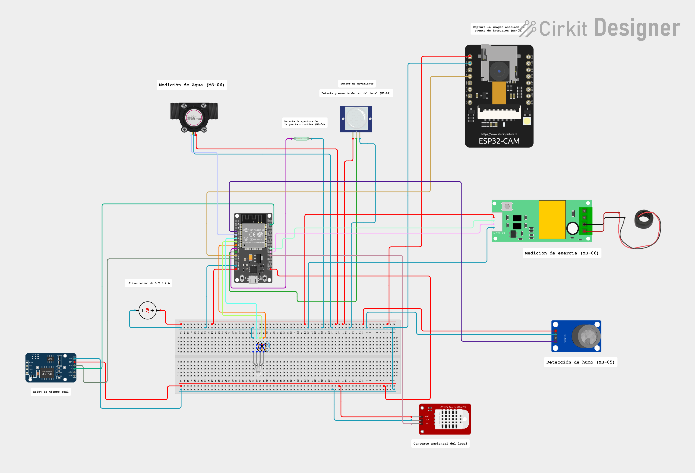
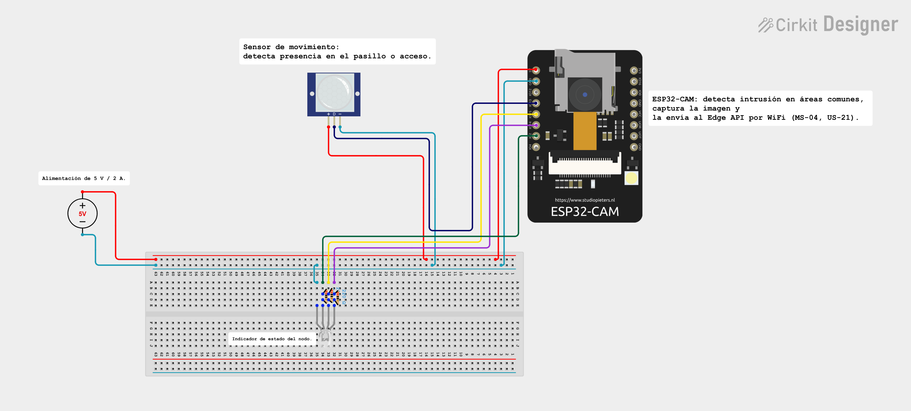

# 5.6. IoT Device Design

Esta sección presenta el diseño de los dispositivos IoT de StorePulse: el nodo de local, el nodo de área común y el Edge Device de la galería. El diseño se sustenta en la metodología de doce pasos para sistemas IoT propuesta por Balestrieri et al. (2018) y se modela en Cirkit Designer.

Las decisiones de diseño responden a cuatro criterios:

- **Continuidad:** la detección y el registro de eventos funcionan sin internet y durante un corte de energía (EP-09).
- **Trazabilidad con los requisitos:** cada función del dispositivo responde a una historia de la sección 3.1 (MS-01 a MS-09).
- **Bajo costo por local:** un mismo nodo reúne seguridad, humo y consumo, con componentes disponibles en el mercado local.
- **Instalación no invasiva:** el nodo se comunica por WiFi y se alimenta de un tomacorriente, sin cableado nuevo entre locales.
- **Interfaz física mínima:** el inquilino no configura nada en el dispositivo. Solo percibe su estado mediante un LED, definido en la guía de estilos de la sección 5.1.2.

La organización del dispositivo sigue la arquitectura de información de la sección 5.2: cada nodo pertenece a un local o a un área común, y el estado que muestra el LED es el mismo que las aplicaciones presentan para ese local.

#### Metodología de diseño IoT en 12 pasos

Los pasos recorren las cuatro capas de la arquitectura de referencia: Physical Layer, Data Exchange Layer, Information Integration Layer y Application Service Layer.


##### Paso 1. Definition of the system requirements

**Suministro de energía**

| ID | Requisito |
|---|---|
| PS-01 | Los nodos se alimentan de la red eléctrica (220 V AC / 60 Hz) mediante una fuente de 5 V / 2 A. |
| PS-02 | Cada nodo tiene respaldo con batería Li-ion 18650 (3,7 V / 2600 mAh, 9,6 Wh), porque el corte de energía coincide con los escenarios de intrusión e incendio. |
| PS-03 | Durante el respaldo se mantienen la detección de intrusión y la de humo. Solo se suspende la medición de consumo, porque sin energía en el local no hay consumo que medir. |
| PS-04 | Autonomía mínima de 3 horas en respaldo (9,6 Wh × 0,8 ÷ 2,1 W ≈ 3,7 h). |
| PS-05 | El Edge Device cuenta con un UPS de al menos 30 minutos. |

**Presupuesto de potencia del nodo de local** (valores de referencia de hojas de datos)

| Carga | Potencia |
|---|---:|
| ESP32 con WiFi activo | 0,80 W |
| Sensor de humo MQ-2 (calefactor permanente) | 0,75 W |
| Medidor eléctrico, caudalímetro, DHT22, PIR, RTC y LED (estimado) | 0,50 W |
| **Total nominal** | **≈ 2,1 W** |
| ESP32-CAM durante la captura | + 1,20 W |
| **Total pico** | **≈ 3,3 W** |

**Restricciones de time-delay**

| ID | Restricción | Límite |
|---|---|---|
| TD-01 | Detección de humo → evento generado | ≤ 1,5 s |
| TD-02 | Detección de humo → notificación push | ≤ 5 s |
| TD-03 | Detección de intrusión → evento generado | ≤ 1 s |
| TD-04 | Detección de intrusión → notificación push | ≤ 5 s |
| TD-05 | Imagen adjunta al evento de intrusión | ≤ 10 s |
| TD-06 | Envío de la lectura de consumo eléctrico y de agua | cada 60 s |
| TD-07 | Sincronización del Edge Device con la nube | ≤ 30 s |

**Restricción de continuidad.** Las restricciones TD-01 y TD-03 se resuelven en el nodo y en el Edge Device, sin depender de la nube. Ante una caída de internet, el evento se genera y se registra localmente (EP-09).

##### Paso 2. Selection of the IoT system typology

Se adopta una tipología de tres niveles. El Edge Device de la galería cumple la función de gateway concentrador del método:

```
Nodos sensores/actuadores  →  Edge Device  →  Cloud  →  Aplicaciones de usuario
  (por local y área común)       (1 por galería)       (REST API)     (Web / Mobile)
```

| Alternativa | Decisión |
|---|---|
| Nodo conectado a la nube por red celular | Descartada. Exige una SIM y un plan de datos por local. |
| Nodo conectado a la nube por el WiFi de cada local | Descartada. Depende del router de cada inquilino y deja de operar sin internet. |
| Nodos → Edge Device → nube | **Aceptada.** Una sola salida a internet por galería y operación local durante cortes de red. |

##### Paso 3. Definition of physical layer requirements

**Perfiles de nodo**

| Perfil | Cantidad | Función |
|---|---|---|
| Nodo de local | 1 por local | Intrusión, humo, consumo eléctrico y consumo de agua |
| Nodo de área común | 1 por pasillo o acceso | Intrusión con imagen en zonas compartidas |

**Sensores y actuadores**

| # | Función | Tipo | Nodo de local | Nodo de área común |
|---|---|---|:-:|:-:|
| N1 | Movimiento | Sensor | ● | ● |
| N2 | Apertura de puerta o cortina | Sensor | ● | |
| N3 | Humo | Sensor | ● | |
| N4 | Imagen del evento | Sensor | ● | ● |
| N5 | Energía eléctrica | Sensor | ● | |
| N6 | Caudal de agua | Sensor | ● (si tiene punto de agua) | |
| N7 | Temperatura y humedad | Sensor | ● | |
| N8 | Indicador de estado | Actuador | ● | ● |

**Target uncertainty de los sensores**

| Nodo | Magnitud | Target uncertainty | Razón |
|---|---|---|---|
| N1 | Presencia | Binaria; falsos positivos < 5 % en 24 h | La falsa alarma reduce la confianza del inquilino |
| N2 | Apertura | Conmutación a 15 ± 5 mm | Solo distingue abierto de cerrado |
| N3 | Humo | ± 10 % del valor leído tras calibración | El umbral se fija contra la línea base de cada local |
| N5 | Energía activa | ± 0,5 % | Sustenta un cobro; debe ser menor que el margen de disputa |
| N6 | Caudal | ± 10 % | Suficiente para detectar consumo anómalo; no para facturación legal |
| N7 | Temperatura / humedad | ± 0,5 °C / ± 3 % HR | Contexto para descartar falsos positivos de humo |

**Target accuracy de los actuadores**

| Nodo | Requisito |
|---|---|
| N8 LED RGB | Cinco estados distinguibles: normal, sin red, evento detectado, respaldo por batería y error. Cambio de estado en ≤ 50 ms |

**Interfaces digitales**

| Nodo | Interfaz |
|---|---|
| N1 PIR, N2 reed | GPIO digital |
| N3 MQ-2 | ADC de 12 bits (ADC1) |
| N4 ESP32-CAM | GPIO de disparo desde el ESP32 principal; envío de la imagen por WiFi |
| N5 PZEM-004T | UART / Modbus-RTU a 9600 bps |
| N6 YF-S201 | GPIO con interrupción (conteo de pulsos) |
| N7 DHT22 | Bus único |
| N8 LED RGB | PWM de 3 canales |
| Reloj DS3231 | I2C |

**Esfuerzo computacional y time-delay en el nodo.** El esfuerzo es bajo: filtrado, comparación contra umbral, conteo de pulsos y armado del mensaje. Las cargas mayores son la compresión JPEG, que resuelve el ESP32-CAM, y el envío de datos por WiFi. La decisión local (comparación contra el umbral) se resuelve en ≤ 50 ms.

**Requisitos adicionales.** Cada nodo tiene reloj propio (RTC) y almacenamiento no volátil, para sellar y conservar los eventos cuando no hay conexión.

##### Paso 4. Definition of exchange layer requirements

| Requisito | Definición |
|---|---|
| Máximo time-delay por paquete | Nodo → Edge Device: ≤ 200 ms. Edge Device → nube: ≤ 2 s. |
| Tipología de comunicaciones | Inalámbrica entre nodos y Edge Device (WiFi 2,4 GHz). Alámbrica (Ethernet) entre el Edge Device y el router de la galería. |
| Topología de red | Estrella. Los nodos no se comunican entre sí. |
| Distancia máxima | Nodo ↔ punto de acceso: 25 m con muros y cortinas metálicas (un punto de acceso por piso). Punto de acceso ↔ Edge Device: 80 m por Ethernet. |
| Consumo máximo en comunicación | ≤ 0,6 W por nodo en transmisión. |
| Criptografía | WPA2 en el enlace WiFi entre los nodos y el Edge Device, dentro de la red local de la galería. HTTPS entre el Edge Device y la nube. El dispositivo se autentica con API Key (MS-02, SP-06). |

**Protocolo nodo → Edge Device (SP-04)**

| Criterio | HTTP/JSON | MQTT |
|---|---|---|
| Modelo | Petición/respuesta contra el Edge API | Publicación/suscripción con conexión persistente |
| Componentes adicionales | Ninguno: el Edge API ya expone endpoints REST | Requiere instalar y mantener un broker |
| Overhead por mensaje | ~200 bytes de cabeceras | 2 bytes de cabecera fija |
| Entrega garantizada | Con reintentos en el nodo (MS-08) | QoS 0, 1 y 2 |
| Decisión | **Seleccionado.** Coherente con la arquitectura de la sección 4.1.3 y suficiente para el volumen de una galería | Se documenta como evolución si crece el número de nodos |

##### Paso 5. Definition of information layer requirements

**Usuarios finales:** Gallery Administrator (opera desde computadora) y Tenant (opera desde el móvil). Ninguno tiene formación técnica.

**Servicios e información integrada**

| ID | Servicio | Admin | Tenant | Información que integra |
|---|---|:-:|:-:|---|
| SV-01 | Alerta de intrusión con imagen | ● | ● | Movimiento confirmado, estado de apertura, imagen, horario de atención y local |
| SV-02 | Alerta de humo | ● | ● | Concentración de humo, temperatura y local afectado |
| SV-03 | Consumo del periodo | ● | ● | Energía y agua acumuladas en el periodo de facturación |
| SV-04 | Histórico y línea base | ● | ● | Serie histórica, línea base y desviación del periodo actual |
| SV-05 | Tablero de la galería | ● | | Incidentes activos, consumo y estado de conexión de todos los locales |
| SV-06 | Tablero del local | | ● | Estado de seguridad y consumo del propio local |
| SV-07 | Centro de notificaciones | ● | ● | Alertas en orden cronológico, agrupadas por tipo y local |
| SV-08 | Reporte de incidentes | ● | ● | Incidente, evidencia, estado y responsable |

**Arquitectura de la capa de integración**

| Algoritmo | Dónde se ejecuta | Complejidad | Tiempo objetivo |
|---|---|---|---|
| Confirmación de movimiento y de humo, generación del evento | Nodo | O(1) | ≤ 1 s |
| Evaluación de reglas y agrupación de alertas | Edge Device | O(r), r = reglas activas | ≤ 50 ms |
| Consumo del periodo | Nube | O(m), m = mediciones | ≤ 2 s |
| Línea base y desviación | Nube | O(p), p = periodos | ≤ 3 s |
| Tablero consolidado de la galería | Nube | O(L), L = locales | ≤ 5 s |

##### Paso 6. Definition of application service layer requirements

| Requisito | Definición |
|---|---|
| Interfaz por servicio | SV-01 y SV-02: notificación push con acción directa. SV-03 a SV-06: tableros. SV-07: listado cronológico. SV-08: formulario con seguimiento de estado. |
| Complejidad en el dispositivo final | Mínima. La aplicación solo presenta información ya calculada por la nube. |
| Plataformas | Web responsiva en Angular para el administrador, aplicación móvil multiplataforma en Flutter para el inquilino y Landing Page para el visitante. |
| Transversal | La vista se restringe según el rol: el inquilino solo ve su local. |

##### Paso 7. Selection of the architectures of data exchange and information integration layers

```
Embedded Application (ESP32) ──HTTP/JSON──► Edge API (Flask + SQLite) ──HTTPS/JSON──► REST API (ASP.NET Core + MySQL)
        Nodo IoT                              Edge Device                              Cloud
```

| Decisión | Sustento |
|---|---|
| Edge API en el Edge Device de la galería | Los nodos siguen enviando eventos y las reglas siguen evaluándose sin internet (EP-09). El Edge API almacena en su base de datos local y reenvía en cola (MS-07, MS-08, TS-25). |
| HTTP/JSON entre el nodo y el Edge API | Coherente con el diagrama de despliegue de la sección 4.1.3; no requiere componentes adicionales. |
| REST API monolítica con MySQL | Coherente con la arquitectura de la sección 4.1.3: un despliegue y un modelo transaccional únicos. |

##### Paso 8. Selection of the sensors and the actuators

| Función | Componente | Características metrológicas | Alimentación | Precio ref. | Alternativa descartada |
|---|---|---|---|---:|---|
| Movimiento | PIR HC-SR501 | 3–7 m, 110° | 5 V | S/ 8 | Ultrasónico HC-SR04: falsos positivos con cortinas y mercadería (SP-01) |
| Apertura | Reed magnético MC-38 | Conmuta a 15 ± 5 mm | Contacto seco | S/ 6 * | — |
| Humo | MQ-2 | 300–10 000 ppm | 5 V | S/ 10 | MQ-135: orientado a calidad del aire (SP-02) |
| Imagen | ESP32-CAM (OV2640) | 2 MP, JPEG | 5 V | S/ 55 | — |
| Energía | PZEM-004T v3 (100 A) | 80–260 V, 0–100 A, ± 0,5 % | 5 V | S/ 70 * | Pinza SCT-013 100 A/1 V (S/ 34): solo mide corriente (SP-03). Queda como segunda opción |
| Agua | YF-S201 | 1–30 L/min, ± 10 % | 5 V | S/ 20 | — |
| Temperatura y humedad | DHT22 | ± 0,5 °C, ± 3 % HR | 3,3 V | S/ 34 | — |
| Estado | LED RGB | 5 estados | 3,3 V | S/ 5 * | — |

Los precios son referenciales del mercado peruano, consultados en octubre de 2026. Los marcados con * son estimados.

**Limitaciones declaradas.** El MQ-2 no es un detector certificado; el producto comercial deberá usar un detector fotoeléctrico homologado. El PZEM-004T se conecta al lado de 220 V y debe instalarlo personal con conocimiento eléctrico. Si el PZEM-004T no está disponible, el prototipo usa la pinza SCT-013 como segunda opción: mide solo corriente, por lo que el consumo se estima con 220 V nominales y sirve para mostrar tendencias, no para sustentar el cobro.

##### Paso 9. Selection of the microcontroller and radio transceivers

| Rol | Componente | Justificación | Precio ref. |
|---|---|---|---:|
| Nodo de local | ESP32 DevKit V1 | WiFi integrado, ADC, UART, I2C, PWM y acelerador de cifrado por hardware. | S/ 35 |
| Cámara y nodo de área común | ESP32-CAM | Integra microcontrolador, cámara y compresión JPEG. En el nodo de local va separada para que la captura no interrumpa la detección. | S/ 55 |
| Reloj | RTC DS3231 | Mantiene la hora sin conexión, necesaria para el filtro de horario y el sellado de eventos. | S/ 16 |
| Almacenamiento del nodo | Memoria flash del ESP32 | Conserva los eventos pendientes tras un reinicio (MS-07). | — |
| Edge Device | Computador dedicado, instalado en la galería | Ejecuta el Edge API y su base de datos local. Debe correr Python y permanecer encendido; en el prototipo se usa una laptop del equipo. | — |
| Transceptor | WiFi 2,4 GHz integrado en el ESP32 | Las distancias del paso 4 no justifican un transceptor externo. | — |

**Costo referencial del prototipo** (1 nodo de local; el Edge API se ejecuta en una laptop del equipo)

| Cant. | Componente | Precio |
|---:|---|---:|
| 1 | ESP32 DevKit V1 | S/ 35 |
| 1 | Sensor PIR HC-SR501 | S/ 8 |
| 1 | Sensor de humo MQ-2 | S/ 10 |
| 1 | Reed magnético MC-38 | S/ 6 * |
| 1 | RTC DS3231 | S/ 16 |
| 1 | LED RGB y resistencias | S/ 5 * |
| 1 | Protoboard, jumpers y caja plástica | S/ 25 * |
| | **Subtotal: seguridad y humo** | **≈ S/ 105** |
| 1 | Caudalímetro YF-S201 | S/ 20 |
| 1 | PZEM-004T v3 (segunda opción: pinza SCT-013, S/ 34) | S/ 70 * |
| 1 | DHT22 | S/ 34 |
| 1 | ESP32-CAM | S/ 55 |
| 1 | Adaptador USB-serial para programar la ESP32-CAM | S/ 12 * |
| 1 | Fuente 5 V / 2 A | S/ 18 * |
| 1 | TP4056, batería 18650 y elevador MT3608 | S/ 33 * |
| | **Total: nodo de local completo** | **≈ S/ 347** |

##### Paso 10. Definition of the data processing for each node and in Cloud

**Nodo**

| # | Algoritmo | Descripción |
|---|---|---|
| 1 | Identidad | Genera un identificador único a partir de la MAC del ESP32 (MS-01). |
| 2 | Confirmación de movimiento | Tres lecturas activas consecutivas del PIR a 10 Hz. |
| 3 | Filtro de horario | Fuera del horario de atención genera el evento; dentro del horario no (MS-04). |
| 4 | Confirmación de humo | Dos lecturas consecutivas sobre el umbral, a 2 Hz; genera el evento de inmediato (MS-05). |
| 5 | Evento primero, imagen después | Envía el evento de inmediato; el ESP32-CAM captura y envía la imagen, que se adjunta al evento. |
| 6 | Medición de consumo | Cuenta pulsos del caudalímetro y consulta el medidor eléctrico cada 60 s (MS-06). |
| 7 | Persistencia y reintento | Guarda cada registro con su hora antes de enviarlo y reintenta ante fallos (MS-07, MS-08). |

**Edge Device**

| # | Algoritmo | Descripción |
|---|---|---|
| 1 | Validación de API Key | Rechaza telemetría de dispositivos no registrados (MS-02). |
| 2 | Evaluación de reglas | Compara cada medición contra su umbral y genera la alerta sin conexión externa. |
| 3 | Agrupación de alertas | Consolida alertas del mismo tipo y local en una ventana de 5 minutos. |
| 4 | Cola de sincronización | Acumula sin internet y reenvía en orden, conservando la hora original. |

**Nube**

| # | Algoritmo | Descripción |
|---|---|---|
| 1 | Ingesta | Valida y almacena la telemetría. |
| 2 | Consumo del periodo | Diferencia entre la lectura de cierre y la de apertura. |
| 3 | Línea base y desviación | Promedia los periodos anteriores y alerta si el actual supera el margen. |
| 4 | Agregación de la galería | Precalcula los indicadores del tablero consolidado. |
| 5 | Notificaciones | Resuelve el destinatario según el local y envía la notificación push. |

##### Paso 11. Analysis of the processing time

| Etapa | Operación | Tiempo estimado |
|---|---|---|
| Nodo | Confirmación de movimiento (3 lecturas a 10 Hz) | 200 ms |
| Nodo | Confirmación de humo (2 lecturas a 2 Hz) | 1 000 ms |
| Nodo | Captura y compresión JPEG | 400 ms |
| Nodo | Consulta Modbus al medidor | 40 ms |
| Nodo → Edge Device | Envío HTTP en la red local | 50 ms |
| Edge Device | Validación, reglas y escritura en cola | 30 ms |
| Edge Device → nube | Petición HTTPS | 500 ms |
| Nube | Persistencia y enrutamiento | 300 ms |
| Nube → teléfono | Entrega de la notificación push | 2 000 ms |

**Cadenas de extremo a extremo**

| Cadena | Cálculo | Total | Límite |
|---|---|---|---|
| Humo, evento | 1 000 | 1,0 s | TD-01: 1,5 s ✔ |
| Humo, notificación | 1 000 + 50 + 30 + 500 + 300 + 2 000 | ≈ 3,9 s | TD-02: 5 s ✔ |
| Intrusión, evento | 200 | 0,2 s | TD-03: 1 s ✔ |
| Intrusión, notificación | 200 + 50 + 30 + 500 + 300 + 2 000 | ≈ 3,1 s | TD-04: 5 s ✔ |
| Consumo | 40 + 50 + 30 + 500 + 300 | ≈ 0,9 s | TD-07: 30 s ✔ |

**Conclusión.** La etapa dominante es la entrega de la notificación push (2 s), que no controla el equipo. Por eso el evento se genera y se registra en el nodo en 1 s o menos, sin esperar confirmación remota, y la imagen se adjunta después del evento para no retrasar la alerta.

##### Paso 12. Definition of the graphical user interface

| Plataforma | Usuario | Contenido |
|---|---|---|
| Web Application (Angular) | Gallery Administrator | Tablero de la galería, alertas con evidencia, consumo por local frente a la línea base, incidentes y gestión de locales. |
| Mobile Application (Flutter) | Tenant | Estado del local, centro de notificaciones, detalle del incidente con imagen y consumo propio. |
| Landing Page | Visitante | Propósito, beneficios por segmento, planes y registro. |
| Dispositivo IoT | Tenant (en el local) | LED RGB con cinco estados, según la guía de la sección 5.1.2. |

**Criterios transversales**

- Se muestra el estado antes que el dato crudo, con color según la severidad.
- El consumo se presenta comparado contra la línea base.
- El inquilino solo ve la información de su local.
- Las alertas críticas llegan como notificación push, sin que el usuario deba buscarlas.

#### Diagrama del circuito

**Nodo de local**



**Diagrama en Cirkit Designer:** [Link del proyecto](https://app.cirkitdesigner.com/project/34d4ffbe-3294-44f1-8500-297d1d525873)

**Nodo de área común**



**Diagrama en Cirkit Designer:** [Link del proyecto](https://app.cirkitdesigner.com/project/3838e553-00e1-4f53-9355-31c742b3d46e)

#### Asignación de pines

**Nodo de local (ESP32 DevKit V1)**

| Componente | Pin del componente | Pin del ESP32 | Señal | Observación |
|---|---|---|---|---|
| PIR HC-SR501 | OUT | GPIO 27 | Entrada digital | — |
| Reed MC-38 | Contacto | GPIO 26 | Entrada digital | Pull-up interno; el otro terminal va a GND |
| MQ-2 | AO | GPIO 34 | Entrada analógica (ADC1) | Salida de 5 V (ver nota) |
| DHT22 | DATA | GPIO 4 | Bus único | Resistencia pull-up de 10 kΩ |
| YF-S201 | Señal | GPIO 35 | Entrada con interrupción | Salida de 5 V (ver nota) |
| PZEM-004T | TX / RX | GPIO 16 (RX2) / GPIO 17 (TX2) | UART | Salida de 5 V (ver nota) |
| SCT-013 (segunda opción) | Salida | GPIO 36 | Entrada analógica (ADC1) | Reemplaza al PZEM-004T; requiere circuito de offset a 1,65 V |
| RTC DS3231 | SDA / SCL | GPIO 21 / GPIO 22 | I2C | Alimentado a 3,3 V |
| LED RGB | R / G / B | GPIO 25 / GPIO 33 / GPIO 32 | PWM | Resistencia de 220 Ω por canal |
| ESP32-CAM | Disparo | GPIO 14 | Salida digital | GND común entre ambas placas |
| Alimentación | 5 V / GND | VIN / GND | — | Fuente de 5 V / 2 A con respaldo por batería |

**Notas** 
- El MQ-2, el YF-S201 y el PZEM-004T entregan señales de 5 V y los pines del ESP32 operan a 3,3 V. Para mantener legible el diagrama, las conexiones se muestran directas; en la implementación física, cada una de esas tres señales pasa por un divisor resistivo (10 kΩ y 20 kΩ) que la adapta a 3,3 V.

- La tabla identifica cada pin por su número de GPIO. Según la placa o la herramienta de modelado, el mismo pin puede aparecer rotulado como `GPIO 27`, `D27`, `G27` o `IO27`; todas las etiquetas se refieren al mismo pin. En el ESP32 DevKit V1, el GPIO 16 y el GPIO 17 aparecen además como `RX2` y `TX2`.

**Nodo de área común (ESP32-CAM)**

| Componente | Pin del componente | Pin del ESP32-CAM | Señal | Observación |
|---|---|---|---|---|
| PIR HC-SR501 | OUT | GPIO 13 | Entrada digital | — |
| LED RGB | R / G / B | GPIO 14 / GPIO 15 / GPIO 2 | PWM | Resistencia de 220 Ω por canal |
| Alimentación | 5 V / GND | 5V / GND | — | Fuente de 5 V / 2 A con respaldo por batería |


