# 6.2. Landing Page, Services & Applications Implementation 

En esta sección se explica y evidencia el proceso de implementación, pruebas, documentación y despliegue del Landing 
Page, Web Services, Web Applications, Mobile Applications y Embedded Applications que conforman la solución StorePulse.
Para esta primera etapa de desarrollo, el esfuerzo del equipo se 
concentra en la ejecución y documentación del Sprint 1 que tiene como objetivo principal la construcción y 
el despliegue de la Landing Page como primer entregable del proyecto, utilizando HTML5, CSS3 y JavaScript. De esta manera, 
se establece el canal digital inicial para presentar el modelo de negocio a los administradores de galerías comerciales
y a los inquilinos, cumpliendo con la meta técnica de implementar y desplegar exitosamente las primeras versiones del 
sitio web estático y de las Frontend Web Applications.

## 6.2.1. Sprint 1

En esta sección se registra y explica el avance de la solución StorePulse en términos de producto y trabajo 
colaborativo correspondiente al Sprint 1. Para esta primera iteración, alineada con los objetivos de evaluación. 
El esfuerzo del equipo se enfoca en establecer los cimientos digitales e informativos de 
la plataforma. De acuerdo con la priorización definida en el Product Backlog, el alcance principal de este sprint 
abarca la implementación y el despliegue de la primera versión de la Landing Page como primer entregable del
proyecto, así como el despliegue inicial de las Frontend Web Applications. A lo largo de este apartado se detallarán
las actividades realizadas por VanguardTech, abarcando la planificación de la iteración, la asignación de tareas 
en el Sprint Backlog, y las evidencias concretas de desarrollo, pruebas, ejecución, documentación de servicios 
y configuración de despliegue.

### 6.2.1.1. Sprint Planning 1

En esta sección se detallan los aspectos principales y los acuerdos definidos durante el Sprint Planning Meeting 
correspondiente al Sprint 1 del proyecto StorePulse. El objetivo de esta reunión fue establecer las bases para el 
primer ciclo de desarrollo, definiendo la capacidad del equipo (Velocity) y seleccionando las historias de usuario 
prioritarias del Product Backlog. Para este primer sprint, el equipo determinó que el mayor valor de negocio reside en 
la construcción y despliegue de la Landing Page informativo, así como en la configuración inicial del entorno para las 
Frontend Web Applications. A continuación, se presenta el cuadro resumen de la planificación, el cual incluye los datos
de la reunión, el Sprint Goal formulado bajo el enfoque recomendado enfocado en el negocio y los usuarios, y el 
esfuerzo total estimado en Story Points.

| **Sprint #** | **Sprint 1**                                                                                                                                                                                                                                                                                                                                                                                                                                                                                                                                                                                                                                                                              |
| :--- |:------------------------------------------------------------------------------------------------------------------------------------------------------------------------------------------------------------------------------------------------------------------------------------------------------------------------------------------------------------------------------------------------------------------------------------------------------------------------------------------------------------------------------------------------------------------------------------------------------------------------------------------------------------------------------------------|
| **Sprint Planning Background** |                                                                                                                                                                                                                                                                                                                                                                                                                                                                                                                                                                                                                                                                                           |
| Date | 29 - 09 - 2026                                                                                                                                                                                                                                                                                                                                                                                                                                                                                                                                                                                                                                                                            |
| Time | 2:00 PM                                                                                                                                                                                                                                                                                                                                                                                                                                                                                                                                                                                                                                                                                   |
| Location | Aula - 8741                                                                                                                                                                                                                                                                                                                                                                                                                                                                                                                                                                                                                                                                               |
| Prepared By | Araujo Ingunza, Renzo José                                                                                                                                                                                                                                                                                                                                                                                                                                                                                                                                                                                                                                                                     |
| Attendees (to planning meeting) | Araujo Ingunza, Renzo José / Carranza Tesén, Joaquín Enrique / Cordova Valdivia, Sebastián / Curi Marcelo, Angelo Marcio / Diaz Gutierrez, Henry Kevin / Esquivel León, Miguel Juan Diego                                                                                                                                                                                                                                                                                                                                                                                                                                                                                                                                                                                    |
| Sprint n – 1 Review Summary | No aplica (al ser el primer Sprint del proyecto, no existen resultados ni feedback de un sprint previo).                                                                                                                                                                                                                                                                                                                                                                                                                                                                                                                                                                                  |
| Sprint n – 1 Retrospective Summary | No aplica (al ser el primer Sprint del proyecto, no existen retrospectivas previas).                                                                                                                                                                                                                                                                                                                                                                                                                                                                                                                                                                                                      |
| **Sprint Goal & User Stories** |                                                                                                                                                                                                                                                                                                                                                                                                                                                                                                                                                                                                                                                                                           |
| Sprint n Goal | **Our focus is on** providing gallery administrators and tenants with a deployed Landing Page that clearly explains the value proposition, and establishing the initial deployment of the Frontend Web Applications.<br><br>**We believe it delivers** a reliable digital channel to attract early adopters, communicate our services (features, subscription plans, and team), and test our value proposition, while setting a solid technical foundation for the development team.<br><br>**This will be confirmed when** visitors can successfully access the website to read about StorePulse's features and terms, and the frontend baseline is accessible in the cloud environment. |
| Sprint n Velocity | 12 Story Points                                                                                                                                                                                                                                                                                                                                                                                                                                                                                                                                                                                                                                                                           |
| Sum of Story Points | 12 Story Points, correspondientes a las Visitor Stories VS-01 a VS-09 del Landing Page (1+2+2+2+1+1+1+1+1), segun la estimacion registrada en el Product Backlog de la seccion 3.3.                                                                                                                                                                                                                                                                                                                                                                                                                                                                                                                                        |


### 6.2.1.2. Aspect Leaders and Collaborators

En esta sección se presenta el Leadership-and-Collaboration Matrix (LACX) correspondiente al Sprint 1, el cual detalla 
quién asume el rol de líder (L) y quiénes actúan como colaboradores (C) para cada aspecto dentro del alcance de la 
iteración. Esta matriz tiene como fin brindar mayor claridad y efectividad en la comunicación al interior del 
equipo durante el desarrollo de las tareas planificadas.

Para este primer Sprint, el alcance funcional y técnico se ha dividido en tres aspectos principales alineados al Sprint Goal:
1. **Landing Page Implementation:** Abarca el desarrollo con HTML5, CSS3 y JavaScript del sitio web estático informativo
de StorePulse. Cabe resaltar que, por lineamientos del proyecto, todos los participantes deben colaborar activamente en 
la implementación de este aspecto.
2. **Frontend Web Applications Configuration:** Involucra la configuración inicial del entorno de desarrollo para las 
aplicaciones web (Angular) y la estructuración base del proyecto.
3. **Software Deployment & Environment Setup:** Comprende la configuración de repositorios en GitHub, estrategias de 
ramificación (GitFlow) y el despliegue inicial en la nube de la Landing Page y el entorno Frontend.

A continuación, se presenta la matriz LACX con la distribución de responsabilidades del equipo de VanguardTech:

| Team Member (Last Name, First Name) | GitHub Username | Landing Page Implementation Leader (L) / Collaborator (C) | Frontend Web Applications Configuration Leader (L) / Collaborator (C) | Software Deployment & Environment Setup Leader (L) / Collaborator (C) |
|:------------------------------------|:----------------| :---: | :---: | :---: |
| Araujo Ingunza, Renzo José          | RnArauj0        | C | C | L |
| Carranza Tesén, Joaquín Enrique     | thepima         | C | C | C |
| Cordova Valdivia, Sebastián         | Sevas04         | L | C | C |
| Curi Marcelo, Angelo Marcio         | AngeloC12       | C | C | C |
| Diaz Gutierrez, Henry Kevin         | HenryDiaz12     | C | L | C |
| Esquivel León, Miguel Juan Diego    | juandyoff       | C | C | C |

Conforme a lo indicado en el enunciado del trabajo final, la organización de líderes y colaboradores guarda relación 
directa con la selección de tasks del Sprint Backlog presentada en la sección siguiente: cada aspecto cuenta con un 
líder responsable de su integración, y la totalidad del equipo participa como colaborador en la implementación del 
Landing Page.

### 6.2.1.3. Sprint Backlog 1

En esta sección se presenta el Sprint Backlog correspondiente al Sprint 1, el cual refleja la organización 
detallada de las tareas necesarias para cumplir con el Sprint Goal. El principal objetivo de esta 
iteración es proveer a los administradores de galerías e inquilinos, una Landing Page desplegado que 
comunique la propuesta de valor de StorePulse de forma diferenciada, además de establecer el entorno y 
despliegue inicial de las aplicaciones Frontend.

A continuación, se presenta una captura del tablero de control utilizado (Trello), junto con el enlace 
público para su revisión. Posteriormente, se detalla la tabla de control de estado del Sprint, 
especificando las User/Visitor Stories asignadas, las tareas (Work-Items) derivadas de su descomposición 
técnica, su estimación en horas, el responsable asignado según la matriz LACX y el estado de avance.


https://trello.com/b/ZAyHEpKs 

**Sprint # 1**

| Story Id | Story Title | Task Id | Task Title | Task Description | Estimation (Hours) | Assigned To | Status (To-do / In-Process / To-Review / Done) |
| :--- | :--- | :--- | :--- | :--- | :--- | :--- | :--- |
| VS-01 | Conocer el propósito de StorePulse| TSK-01 | Diseño de Header y Hero Section | Maquetar la sección principal (Hero) del Landing Page en HTML/CSS. | 3 | Cordova Valdivia, Sebastián | Done |
| VS-02 | Conocer los beneficios según segmento | TSK-02 | Maquetación de Sección de Beneficios | Construir la sección de beneficios diferenciando la propuesta de valor para cada segmento. | 4 | Cordova Valdivia, Sebastián | Done |
| VS-03 | Conocer el funcionamiento de la solución | TSK-03 | Implementación de Sección "Cómo Funciona" | Diseñar la sección que explica el flujo de la plataforma con iconos y descripciones, incluyendo el contenido alternativo en texto e imágenes. | 3 | Curi Marcelo, Angelo Marcio | Done |
| VS-04 | Conocer los planes de suscripción | TSK-04 | Diseño de Pricing Table | Crear la tabla de precios estática mostrando los planes de suscripción. | 4 | Curi Marcelo, Angelo Marcio | Done |
| VS-05 | Resolver dudas frecuentes| TSK-05 | Desarrollo de Acordeón FAQ | Implementar una sección interactiva de preguntas frecuentes con JavaScript, cubriendo instalación, costo y funcionamiento. | 3 | Carranza Tesén, Joaquín Enrique | Done |
| VS-06 | Acceder o registrarse en la plataforma | TSK-06 | Integración de botones de redirección | Configurar botones de Sign In y Sign Up hacia las rutas iniciales de la plataforma. | 2 | Diaz Gutierrez, Henry Kevin | Done |
| VS-07 | Conocer al equipo de StorePulse | TSK-07 | Creación de Sección "About Us" | Maquetar la sección del equipo incluyendo las fotografías, nombres y roles. | 2 | Carranza Tesén, Joaquín Enrique | Done |
| VS-08 | Consultar los términos de servicio | TSK-08 | Maquetación de Terms of Service | Crear el archivo HTML para los Términos de Servicio y enlazarlo en el footer. | 2 | Esquivel León, Miguel Juan Diego | Done |
| VS-09 | Consultar la política de privacidad | TSK-09 | Maquetación de Privacy Policy | Crear el archivo HTML para la Política de Privacidad y enlazarlo en el footer. | 2 | Esquivel León, Miguel Juan Diego | Done |
| - | Constraint Técnico | TSK-10 | Configuración de Repositorios en GitHub | Crear repositorios para el proyecto aplicando GitFlow y convenciones iniciales. | 2 | Araujo Ingunza, Renzo José | Done |
| - | Constraint Técnico | TSK-11 | Configuración base de Angular | Inicializar el proyecto Angular, configurando el ruteo base y dependencias de arquitectura. | 4 | Diaz Gutierrez, Henry Kevin | Done |
| - | Constraint Técnico | TSK-12 | Despliegue en la Nube | Desplegar el Landing Page y el entorno base de la Web App en el hosting de nube elegido. | 3 | Araujo Ingunza, Renzo José | Done |

El esfuerzo total estimado asciende a **34 horas**, distribuidas entre los seis integrantes del equipo: Cordova Valdivia 
(7 h), Curi Marcelo (7 h), Diaz Gutierrez (6 h), Araujo Ingunza (5 h), Carranza Tesén (5 h) y Esquivel León (4 h).

### 6.2.1.4. Development Evidence for Sprint Review

En esta sección se explica y presenta los avances en implementación con relación a los productos de la solución según
el alcance del Sprint. Durante el Sprint 1, el equipo construyó la primera versión completa del **Landing Page** de
StorePulse con HTML5, CSS3 y JavaScript, abarcando las secciones que dan respuesta a las Visitor Stories comprometidas,
y la primera versión de la **Web Application** del Gallery Administrator en Angular, organizada por Bounded Contexts:
cada integrante implementó al menos un contexto sobre una estructura común definida al inicio del Sprint.

El trabajo se organizó aplicando **GitFlow** como estrategia de ramificación —una rama `feature/` por funcionalidad o
Bounded Context, integrada a `develop`— y **Conventional Commits** como convención de mensajes, de modo que el
historial permite identificar el aporte individual de cada integrante y el tipo de cambio introducido.

Los repositorios que conforman la solución en este Sprint son los siguientes:

| Repository | Propósito | Alcance en el Sprint 1 |
| :--- | :--- | :--- |
| `VanguardTechIot/storepulse-report` | Informe académico del proyecto en formato Markdown | Documentación de los capítulos I a VI |
| `VanguardTechIot/storepulse-landing-page` | Sitio web estático informativo (HTML5, CSS3, JavaScript) | Versión 1.0.0 publicada en GitHub Pages |
| `VanguardTechIot/storepulse-web-application` | Aplicación web del Gallery Administrator (Angular) | Versión 0.1.1 con nueve Bounded Contexts, publicada en Firebase Hosting |

A continuación se detallan los commits más representativos del desarrollo del Landing Page y de la Web Application.
Cuando el commit no tiene cuerpo, la columna *Commit Message Body* resume el cambio que introduce.

| Repository | Branch | Commit Id | Commit Message | Commit Message Body | Commited on (Date) |
| :--- | :--- | :--- | :--- | :--- | :--- |
| VanguardTechIot/storepulse-landing-page | feature/landing-page-setup | `8fe9a06` | chore: initial commit | Creación del repositorio del Landing Page | 2026-10-08 |
| VanguardTechIot/storepulse-landing-page | feature/landing-page-setup | `b8fdac4` | feat(setup): add base layout, header, hero section and iot solutions | Header, Hero Section con la propuesta de valor y sección de soluciones IoT (VS-01, VS-03) | 2026-10-08 |
| VanguardTechIot/storepulse-landing-page | feature/landing-page-setup | `04c2619` | feat(setup): add base landing page structure, styles and interactive components | Estructura completa, estilos y componentes interactivos: beneficios, planes y preguntas frecuentes (VS-02, VS-04, VS-05) | 2026-10-08 |
| VanguardTechIot/storepulse-landing-page | feature/landing-page-setup | `7b66352` | feat(setup): add base landing page layout, styles and interactive components | Ajustes de maquetación y del comportamiento de los componentes interactivos | 2026-10-08 |
| VanguardTechIot/storepulse-landing-page | feature/landing-page-setup | `df1cb03` | feat(setup): add base landing page with resolved assets and pre-launch navigation | Recursos gráficos resueltos y navegación hacia el registro y el inicio de sesión (VS-06) | 2026-10-08 |
| VanguardTechIot/storepulse-landing-page | feature/landing-page-setup | `4a16abd` | feat(assets): add team photographs for about us section | Fotografías del equipo para la sección About Us (VS-07) | 2026-10-08 |
| VanguardTechIot/storepulse-landing-page | develop | `3c483fc` | Merge branch 'feature/landing-page-setup' into develop | Integración del Landing Page en develop | 2026-10-08 |
| VanguardTechIot/storepulse-landing-page | main | `14ddb02` | Merge branch 'release/1.0.0' into main | Publicación de la versión 1.0.0 del Landing Page (tag 1.0.0) | 2026-10-09 |
| VanguardTechIot/storepulse-web-application | feature/frontend-directory-structure | `150f23f` | feature: add .gitkeep files to maintain empty directories | Estructura inicial de directorios por Bounded Context | 2026-10-06 |
| VanguardTechIot/storepulse-web-application | feature/web-application-structure | `94fa1ec` | feature: restructure directories following the DDD statement and add localization files for English and Spanish | Estructura por capas según DDD y archivos de traducción en inglés y español | 2026-10-08 |
| VanguardTechIot/storepulse-web-application | feature/web-billing | `064ab82` | feat: add utility billing functionality | Bounded Context Utility Billing: facturas, desglose de consumo y reclamos | 2026-10-08 |
| VanguardTechIot/storepulse-web-application | feature/monitoring | `28283c6` | feat(monitoring): add monitoring domain model, infrastructure and store | Modelo de dominio, infraestructura y store de Service Execution and Monitoring | 2026-10-08 |
| VanguardTechIot/storepulse-web-application | feature/monitoring | `ffd832e` | feat(monitoring): implement monitoring views | Vistas de telemetría, alertas, consumo y reglas de monitoreo | 2026-10-08 |
| VanguardTechIot/storepulse-web-application | feature/bounded-context-iam | `43ee2e3` | feature(iam): Add entities, value-objects, commands and enums in the domain layer. | Capa de dominio de Identity and Access Management | 2026-10-08 |
| VanguardTechIot/storepulse-web-application | feature/bounded-context-iam | `1cab5cb` | feature(iam): Add guards, navigation, routes, and validators for authentication flow | Guards, rutas y validadores del inicio de sesión, registro y recuperación de contraseña | 2026-10-08 |
| VanguardTechIot/storepulse-web-application | feature/resource-asset-management | `172842b` | feat(resource-asset-management): add IoT device list view | Listado de dispositivos IoT con su estado y conectividad | 2026-10-08 |
| VanguardTechIot/storepulse-web-application | feature/resource-asset-management | `5585efe` | feat(resource-asset-management): add device deactivation and reactivation | Desactivación y reactivación de dispositivos | 2026-10-08 |
| VanguardTechIot/storepulse-web-application | feature/bounded-context-profile | `a9c867d` | feat(profile): implement ProfilesStore service for managing user profiles and subscriptions | Servicio de aplicación de Profiles and Preferences | 2026-10-08 |
| VanguardTechIot/storepulse-web-application | feature/bounded-context-profile | `08ac19a` | feat(profile): implement profile settings page with user details and subscription summary | Vista Mi perfil con los datos del usuario y el resumen de la suscripción | 2026-10-08 |
| VanguardTechIot/storepulse-web-application | feature/property-communication | `5a9c504` | feat(property-management): implement galleries, commercial units, floor layout and tenant invitations | Bounded Context Property Management | 2026-10-08 |
| VanguardTechIot/storepulse-web-application | feature/property-communication | `21eda9b` | feat(property-communication): implement conversations, tenant notifications, communication logs and tenant assignments | Bounded Context Property Communication | 2026-10-08 |
| VanguardTechIot/storepulse-web-application | feature/subscriptions-payments | `4d60482` | feat(subscriptions): add subscription status, plan catalog and payment history views | Estado de la suscripción, catálogo de planes e historial de pagos | 2026-10-09 |
| VanguardTechIot/storepulse-web-application | feature/subscriptions-payments | `522c502` | feat(subscriptions): add checkout with simulated payment gateway | Checkout con pasarela de pago simulada | 2026-10-09 |
| VanguardTechIot/storepulse-web-application | feature/dashboard-analytics | `9e6696c` | feat(analytics): add kpi card, consumption chart and notification item components | Componentes del dashboard consolidado y del centro de notificaciones | 2026-10-09 |
| VanguardTechIot/storepulse-web-application | release/v0.1.0 | `a2c49c6` | chore(release): bump version to 0.1.0 | Preparación de la versión 0.1.0 | 2026-10-09 |
| VanguardTechIot/storepulse-web-application | main | `bca724e` | Merge branch 'release/v0.1.0' into main | Publicación de la versión 0.1.0 de la Web Application (tag v0.1.0) | 2026-10-09 |
| VanguardTechIot/storepulse-web-application | hotfix/v0.1.1 | `9e23e4a` | chore(deploy): configure firebase hosting and hosted api | Configuración de Firebase Hosting y de la URL de la API en producción | 2026-10-09 |
| VanguardTechIot/storepulse-web-application | main | `9522780` | Merge branch 'hotfix/v0.1.1' | Publicación del hotfix 0.1.1 desplegado en Firebase (tag v0.1.1) | 2026-10-09 |

El historial completo puede consultarse en cada repositorio con `git log --format="%h | %s | %ad" --date=short`.

### 6.2.1.5. Testing Suite Evidence for Sprint Review

En esta sección se explica y presenta el conjunto de tests automatizados elaborados durante el Sprint 1, relacionados 
con las historias especificadas en el Sprint.

Dado que el alcance de esta primera iteración comprende únicamente el **Landing Page** —un sitio web estático sin 
Web Services asociados—, la suite de pruebas se concentra en **Acceptance Tests bajo el enfoque BDD**, elaborados con 
archivos `.feature` en lenguaje **Gherkin** y sus correspondientes archivos de *Steps* en JavaScript, ejecutados con 
**Cucumber.js y Playwright**. Los *Unit Tests* e *Integration Tests* de Web Services se incorporarán a partir del 
Sprint 2, cuando se implementen los primeros endpoints de la REST API.

Los escenarios Gherkin se derivan directamente de los Criterios de Aceptación redactados para cada Visitor Story en la 
sección 3.1 del presente informe, lo que garantiza la trazabilidad entre la especificación de requisitos y la 
verificación automatizada.

#### a) Relación de tests diseñados

| Test Id | Tipo | Archivo | Related Story | Escenario de aceptación | Status |
| :--- | :--- | :--- | :--- | :--- | :---: |
| AT-01 | Acceptance (BDD) | `value-proposition.feature` | VS-01 | Propósito de StorePulse | Pass |
| AT-02 | Acceptance (BDD) | `value-proposition.feature` | VS-01 | Adaptación a dispositivos móviles | Pass |
| AT-03 | Acceptance (BDD) | `segmented-benefits.feature` | VS-02 | Beneficios según perfil | Pass |
| AT-04 | Acceptance (BDD) | `segmented-benefits.feature` | VS-02 | Beneficios generales | Pass |
| AT-05 | Acceptance (BDD) | `how-it-works.feature` | VS-03 | Visualización del funcionamiento | Pass |
| AT-06 | Acceptance (BDD) | `how-it-works.feature` | VS-03 | Contenido alternativo | Pass |
| AT-07 | Acceptance (BDD) | `subscription-plans.feature` | VS-04 | Consulta de planes | Pass |
| AT-08 | Acceptance (BDD) | `faq.feature` | VS-05 | Consulta de preguntas frecuentes | Pass |
| AT-09 | Acceptance (BDD) | `platform-access.feature` | VS-06 | Acceso al registro | Pass |
| AT-10 | Acceptance (BDD) | `platform-access.feature` | VS-06 | Acceso al inicio de sesión | Pass |
| AT-11 | Acceptance (BDD) | `about-team.feature` | VS-07 | Información del equipo | Pass |
| AT-12 | Acceptance (BDD) | `legal-documents.feature` | VS-08 | Consulta de los términos | Pass |
| AT-13 | Acceptance (BDD) | `legal-documents.feature` | VS-09 | Consulta de la política de privacidad | Pass |

**Cobertura:** 13 de los 13 escenarios de aceptación definidos para las Visitor Stories VS-01 a VS-09, equivalente al 
**100 % del alcance funcional comprometido** en el Sprint.

#### b) Archivos .feature (Gherkin)

```gherkin
# features/value-proposition.feature
# Relacionado con VS-01 - Conocer el propósito de StorePulse
Característica: Comunicación de la propuesta de valor
  Como visitante
  Quiero conocer el propósito de StorePulse
  Para entender qué problema de mi galería puede solucionar

  Escenario: Propósito de StorePulse
    Dado que el visitante accede al sitio web estático
    Cuando llega a la sección principal
    Entonces visualiza una descripción clara del propósito de la plataforma

  Escenario: Adaptación a dispositivos móviles
    Dado que el visitante navega por primera vez
    Cuando accede desde un dispositivo móvil
    Entonces la sección principal se adapta correctamente al tamaño de pantalla
```

```gherkin
# features/segmented-benefits.feature
# Relacionado con VS-02 - Conocer los beneficios según segmento
Característica: Beneficios diferenciados por segmento
  Como visitante
  Quiero conocer los beneficios diferenciados por segmento
  Para evaluar el valor que aporta según mi rol

  Esquema del escenario: Beneficios según perfil
    Dado que el visitante accede a la sección de beneficios
    Cuando selecciona su tipo de perfil "<perfil>"
    Entonces visualiza los beneficios correspondientes a ese rol
    Ejemplos:
      | perfil        |
      | administrador |
      | inquilino     |

  Escenario: Beneficios generales
    Dado que el visitante no selecciona ningún perfil
    Cuando navega la sección
    Entonces visualiza los beneficios generales aplicables a ambos segmentos
```

```gherkin
# features/how-it-works.feature
# Relacionado con VS-03 - Conocer el funcionamiento de la solución
Característica: Explicación del funcionamiento de la solución
  Como visitante
  Quiero conocer cómo funciona StorePulse
  Para comprender cómo se relacionan el monitoreo, las alertas y el consumo

  Escenario: Visualización del funcionamiento
    Dado que el visitante accede a la sección "Cómo funciona"
    Cuando revisa el contenido
    Entonces visualiza un video explicativo con el flujo del producto

  Escenario: Contenido alternativo
    Dado que el visitante no puede reproducir el video
    Cuando la conexión es lenta
    Entonces se muestra una versión alternativa en texto e imágenes
```

```gherkin
# features/subscription-plans.feature
# Relacionado con VS-04 - Conocer los planes de suscripción
Característica: Consulta de planes de suscripción
  Como visitante administrador
  Quiero conocer los planes de suscripción disponibles
  Para evaluar el costo de implementar StorePulse en mi galería

  Escenario: Consulta de planes
    Dado que el visitante accede a la sección de planes
    Cuando revisa las opciones
    Entonces visualiza el precio, la cantidad de locales cubiertos y los beneficios de cada plan
```

```gherkin
# features/faq.feature
# Relacionado con VS-05 - Resolver dudas frecuentes
Característica: Resolución de dudas frecuentes
  Como visitante
  Quiero acceder a una sección de preguntas frecuentes
  Para resolver dudas antes de decidir registrarme

  Esquema del escenario: Consulta de preguntas frecuentes
    Dado que el visitante tiene una duda sobre "<tema>"
    Cuando accede a la sección de FAQ
    Entonces encuentra la respuesta correspondiente a ese tema
    Ejemplos:
      | tema           |
      | instalación    |
      | costo          |
      | funcionamiento |
```

```gherkin
# features/platform-access.feature
# Relacionado con VS-06 - Acceder o registrarse en la plataforma
Característica: Acceso y registro en la plataforma
  Como visitante
  Quiero acceder al registro o inicio de sesión desde el sitio web
  Para comenzar a usar StorePulse

  Escenario: Acceso al registro
    Dado que el visitante decide convertirse en usuario
    Cuando presiona el botón de registro
    Entonces es redirigido al formulario de registro de la plataforma

  Escenario: Acceso al inicio de sesión
    Dado que el visitante ya tiene cuenta
    Cuando presiona "Iniciar sesión"
    Entonces es redirigido al formulario de login
```

```gherkin
# features/about-team.feature
# Relacionado con VS-07 - Conocer al equipo de StorePulse
Característica: Presentación del equipo
  Como visitante
  Quiero conocer al equipo detrás de StorePulse
  Para conocer quiénes desarrollan y respaldan la solución

  Escenario: Información del equipo
    Dado que el visitante accede a la sección "Nuestro equipo"
    Cuando consulta la información disponible
    Entonces se muestran los integrantes del equipo y sus respectivos roles
```

```gherkin
# features/legal-documents.feature
# Relacionado con VS-08 y VS-09 - Documentos legales
Característica: Consulta de documentos legales
  Como visitante
  Quiero consultar los términos de servicio y la política de privacidad
  Para conocer las condiciones de uso y el tratamiento de mis datos

  Escenario: Consulta de los términos de servicio
    Dado que el visitante se encuentra en el sitio web
    Cuando accede a la sección "Términos de Servicio"
    Entonces puede visualizar las condiciones y reglas aplicables al uso de StorePulse

  Escenario: Consulta de la política de privacidad
    Dado que el visitante se encuentra en el sitio web
    Cuando accede a la sección "Política de Privacidad"
    Entonces puede visualizar la información relacionada con el tratamiento y protección de sus datos personales
```
#### 6.2.1.6. Execution Evidence for Sprint Review 

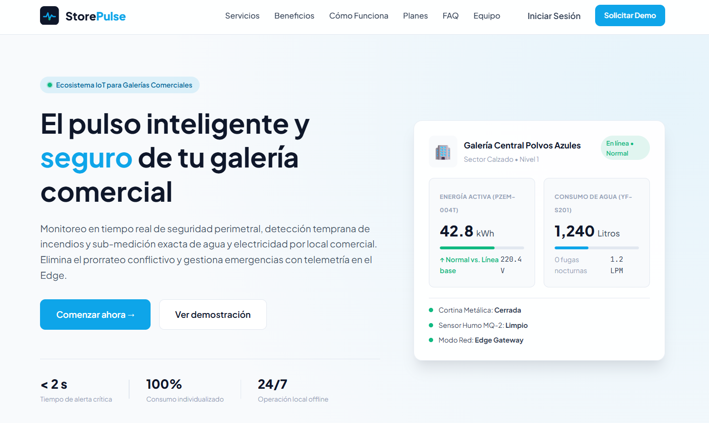

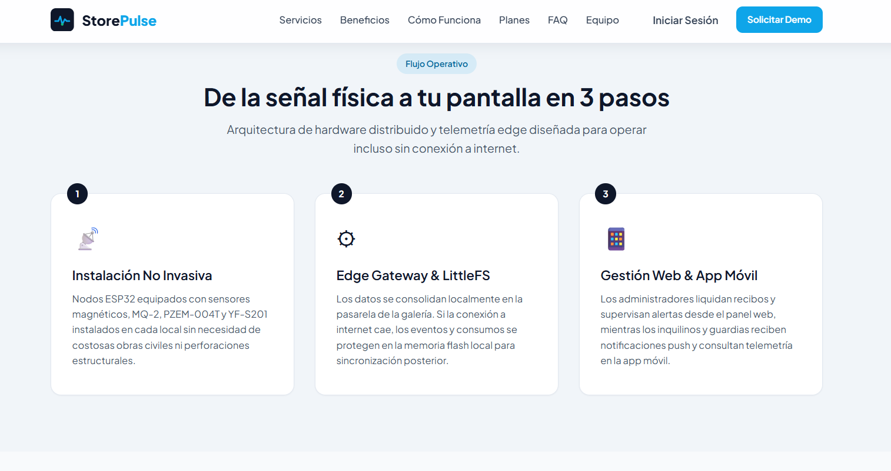

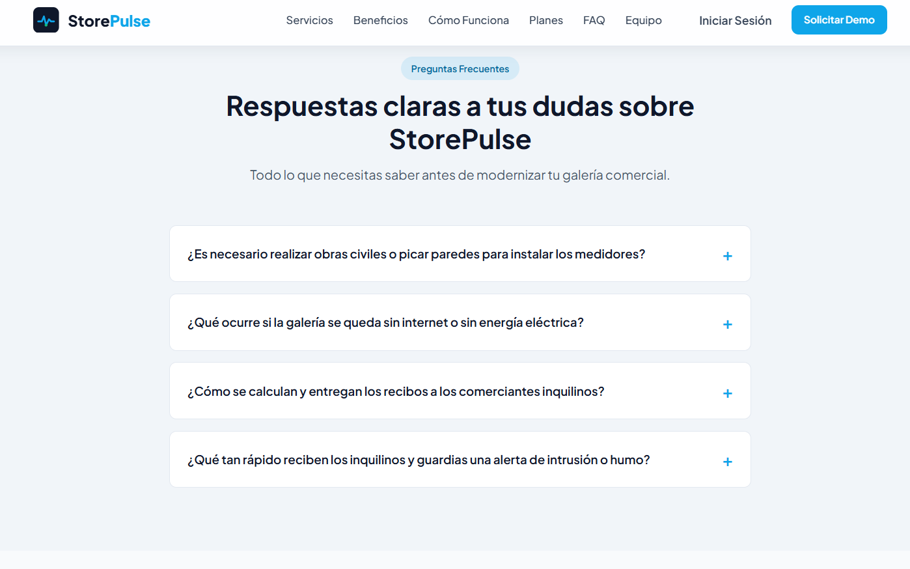

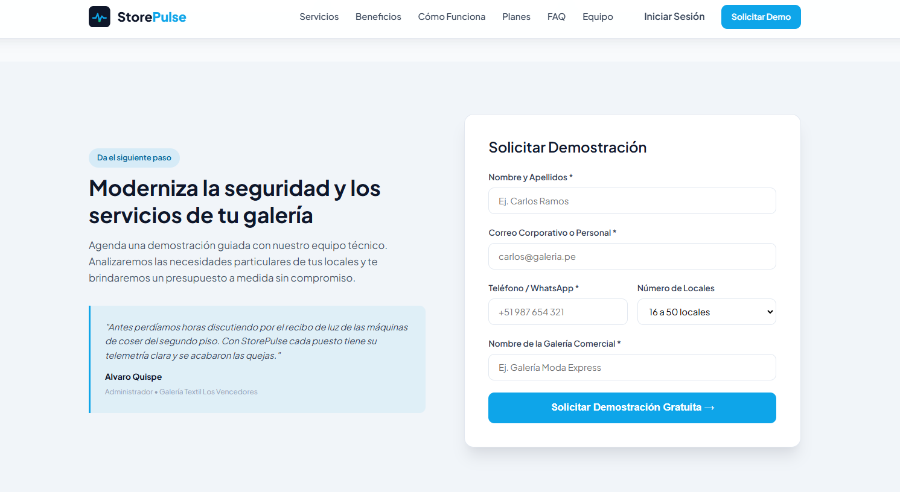

#### 6.2.1.7. Services Documentation Evidence for Sprint Review

Este sprint 1 solo trata la implementación del landing page, por lo
que no hay un servicio adicinal.

#### 6.2.1.8. Software Deployment Evidence for Sprint Review. 

El despliegue del Landing Page se realizó a través de GitHub pages. El
link de nuestra Landing Page es el siguiente:

Link:
[<u>https://vanguardtechiot.github.io/storepulse-landing-page/</u>](https://vanguardtechiot.github.io/storepulse-landing-page/)

##### Despliegue del frontend web

Para publicar la aplicación, se configuró Firebase Hosting en el proyecto de Firebase `storepulse-web-app` y se utilizó Firebase CLI desde la carpeta del proyecto frontend. La aplicación se compiló para producción y los archivos generados se publicaron en Firebase Hosting.

El proceso realizado fue el siguiente:

1. Se instaló y utilizó Firebase CLI para administrar el despliegue desde la terminal.
2. Se inició sesión en Firebase CLI con una cuenta autorizada.
3. Se inicializó Firebase Hosting en el proyecto local y se guardó su configuración.
4. Se generó la compilación de producción de la aplicación Angular.
5. Se ejecutó `firebase deploy --only hosting` para publicar los archivos compilados.
6. Se verificó la finalización del despliegue y se abrió la URL pública para comprobar el acceso al frontend.

link:
[<u>https://storepulse-web-app.web.app</u>](https://storepulse-web-app.web.app)

##### Evidencias del proceso de despliegue

La Figura 1 muestra la pantalla de configuración de Firebase Hosting, donde se indican los pasos para instalar Firebase CLI e inicializar el proyecto.

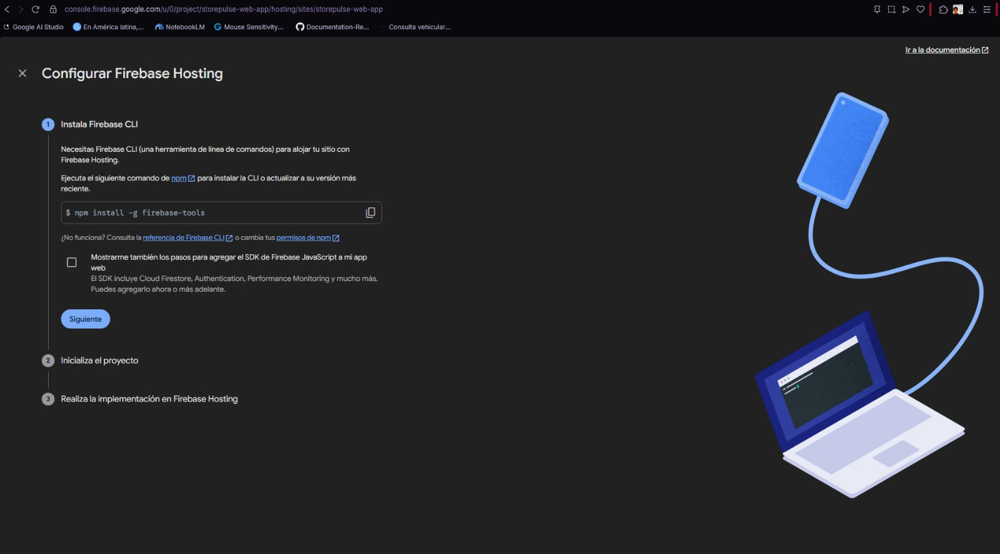

La Figura 2 presenta la terminal del entorno de desarrollo durante la autenticación y la inicialización de Firebase en el proyecto local.

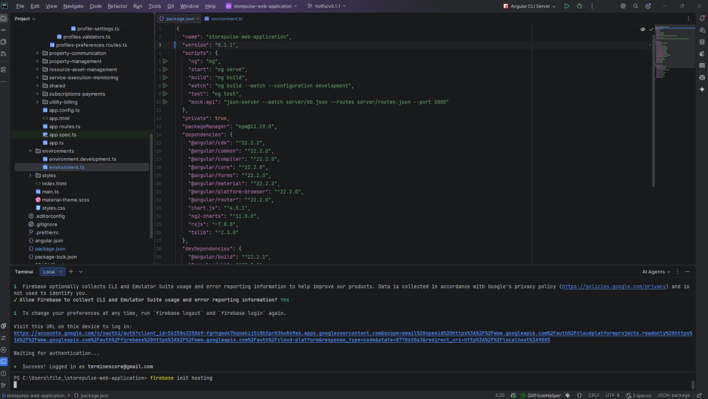

La Figura 3 muestra la ejecución del comando de despliegue y el resultado exitoso reportado por Firebase CLI. La salida identifica el sitio `storepulse-web-app` y la URL pública de Hosting.

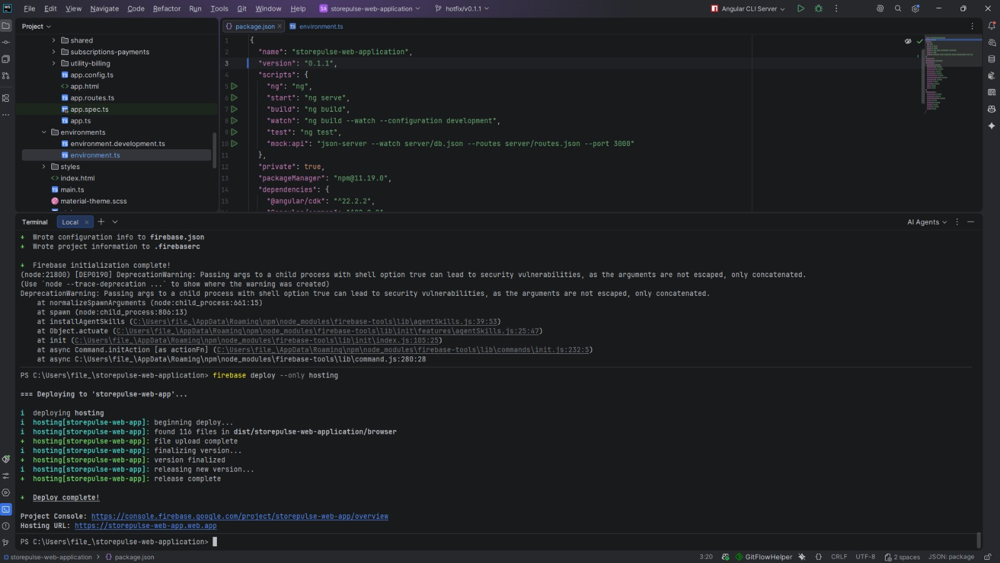

La Figura 4 presenta el panel de Firebase Hosting con la versión publicada y los dominios asociados al sitio.


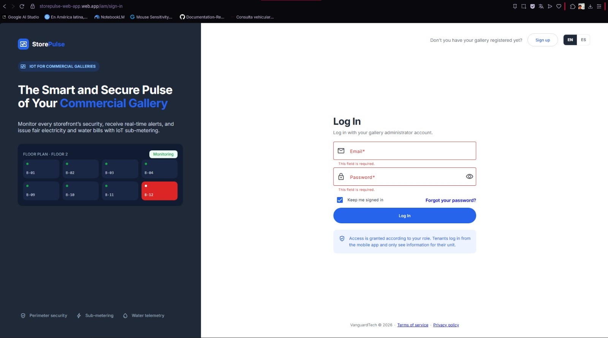

##### Verificación del frontend publicado

Después de completar el despliegue, se accedió a la aplicación mediante la URL pública `https://storepulse-web-app.web.app`. La Figura 5 muestra la pantalla de inicio de sesión cargada en el navegador, lo que permite comprobar que la ruta de acceso al frontend está disponible.

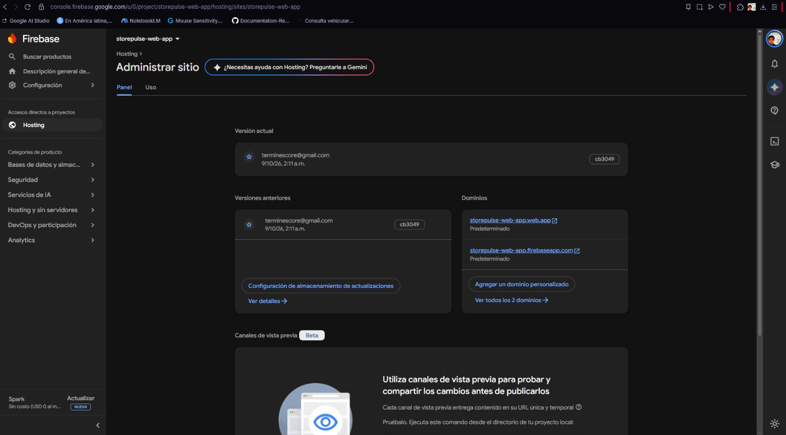

La Figura 6 corresponde al apartado de uso de Firebase Hosting. En la captura no se muestran datos de consumo en el periodo consultado; por ello, se incluye como referencia del panel de administración y no como evidencia de tráfico o uso efectivo por parte de usuarios.

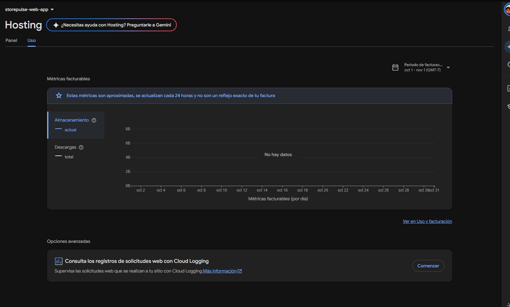

Finalmente, la Figura 7 muestra el dashboard de StorePulse cargado en el navegador. Esta captura evidencia la disponibilidad visual de la interfaz principal publicada, con sus módulos de navegación, indicadores y panel de consumo.

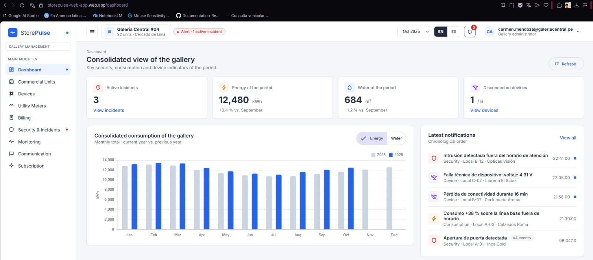


#### 6.2.1.9. Team Collaboration Insights during Sprint.

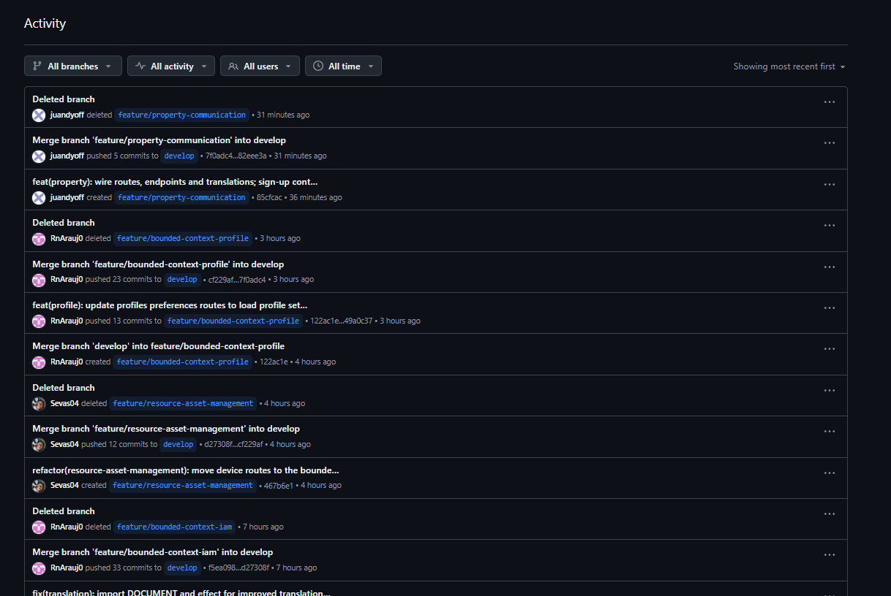

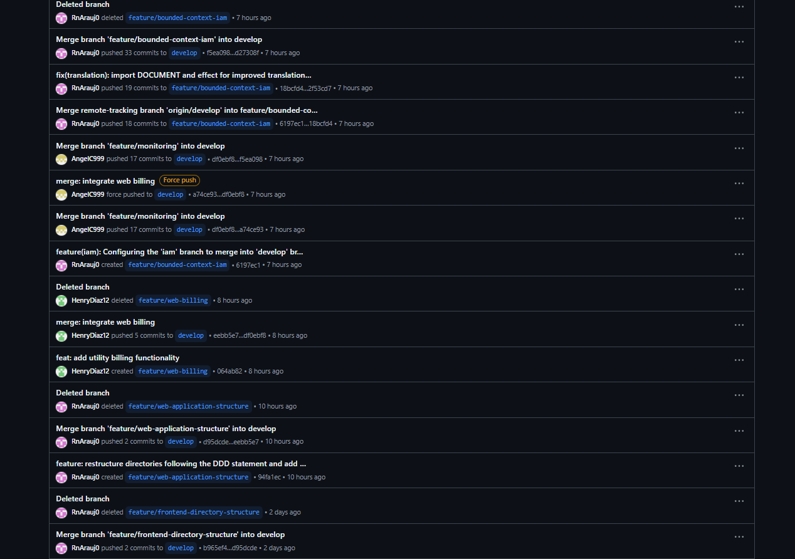

