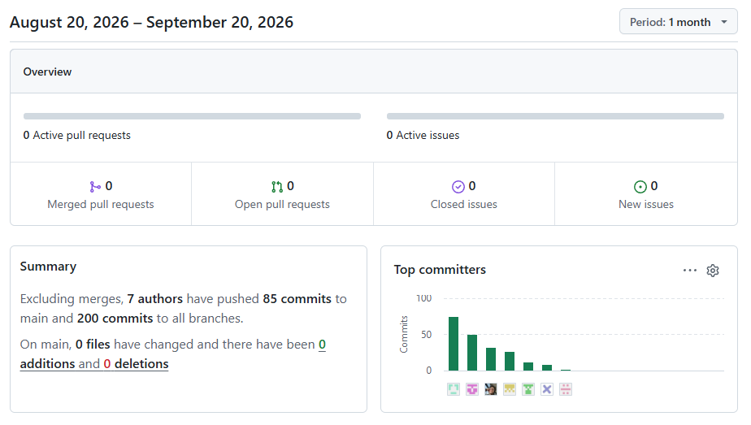
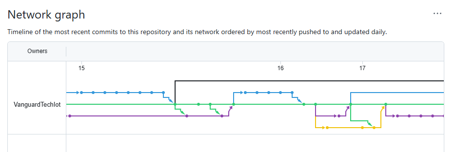

## Project Report Collaboration Insights

**Link de los repositorios de la organización:** https://github.com/VanguardTechIot

**Link del repositorio del Informe:** https://github.com/VanguardTechIot/storepulse-report

### Descripción del Trabajo Colaborativo

**Reporte de colaboración de la entrega del AV1**

**Renzo Araujo Ingunza**

Renzo condujo una de las entrevistas de Needfinding y desarrolló la parte inicial del punto 4.1, estableciendo la base del Strategic-Level DDD para el trabajo posterior del equipo. Asimismo, asumió el desarrollo de los Bounded Contexts Identity and Access Management y Analytics, llevándolos desde el EventStorming hasta su diseño táctico y elaborando los respectivos diagramas C4. Para mantener la integración del trabajo, alineó sus diagramas con las convenciones existentes del repositorio, organizó su desarrollo mediante ramas de feature independientes y documentó las dependencias con otros integrantes.

**Sebastián Córdova Valdivia**

Sebastián desarrolló el Capítulo I y la sección de Impact Mapping del Capítulo III, además de coordinar la comunicación de los cambios realizados en la distribución de los Bounded Contexts y la numeración de las secciones y archivos del Capítulo IV. También asumió los Bounded Contexts Profiles and Preferences y Subscriptions and Payments, desarrollando su EventStorming y diseño táctico mediante diagramas de clases y de base de datos en PlantUML. Aplicó GitFlow y Conventional Commits para organizar sus contribuciones e integrar los cambios del equipo de manera ordenada.

**Diaz Gutierrez, Henry Kevin**

Henry participó en la elicitación de requisitos mediante el diseño y conducción de entrevistas dirigidas al segmento Gallery Administrator, analizando los hallazgos para orientar la definición de requisitos del sistema. Asimismo, asumió el desarrollo del Bounded Context Management-Tenant Communication, organizando su diseño táctico por capas y elaborando los diagramas de componentes, clases del dominio y diseño de base de datos. Coordinó con el equipo para mantener la consistencia de las entrevistas y cumplió con los entregables asignados dentro de los plazos establecidos.

**Angelo Curi Marcelo** 

Angelo desarrolló el Ubiquitous Language y el análisis competitivo del proyecto, incluyendo el Competitive Analysis Landscape, la matriz FODA y las estrategias frente a los competidores. También elaboró los diagramas C4 de System Landscape, System Context y Container, y asumió el desarrollo de los Bounded Contexts Resource and Asset Management y Service Execution and Monitoring. Organizó su trabajo mediante ramas de feature para evitar interferencias con el desarrollo del equipo y realizó correcciones y mejoras en el informe para mantener la consistencia entre la documentación y los diagramas.

**Adrian Quiroz Cáceres**

Adrian desarrolló y refactorizó los User Stories del proyecto, alineándolos con los requisitos identificados durante la elicitación. También analizó los resultados de las entrevistas y elaboró los User Personas, Empathy Maps y User Task Matrix para representar las necesidades, perspectivas y actividades de los segmentos objetivo. Asimismo, desarrolló el Context Mapping y asumió el diseño del Bounded Context Property Management, contribuyendo a la estructuración del modelo de dominio y al desarrollo del Capítulo IV.

### Evidencias de Analíticos y Commits en GitHub

**Reporte de colaboración de la entrega del AV1**

A continuación se presentan los gráficos de colaboración que representan la cantidad de commits realizados por cada miembro del equipo en el repositorio del informe.

  

**Ramificación del proyecto usando GitFlow:**

El siguiente gráfico muestra la ramificación del repositorio y las visitas registradas durante la fase AV1, evidenciando el flujo de trabajo colaborativo del equipo.

  

